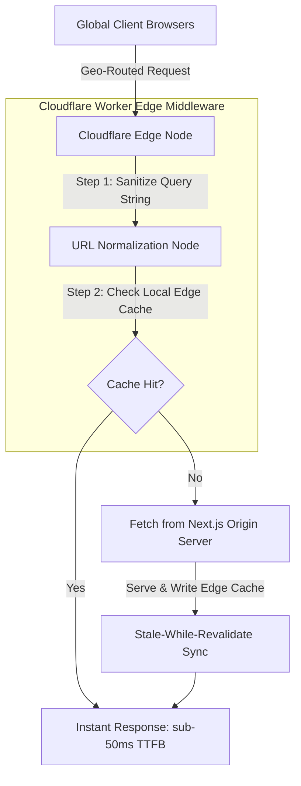

# Case Study: Optimizing Global Edge Delivery & Static Site Hydration

For global retail sites, page speed directly correlates with purchase conversion rates. A 100ms increase in Time to First Byte (TTFB) on product catalog pages can drop user checkout conversions by up to 7%. During high-traffic events, loading pages dynamically from central servers introduces network latency and risks database overload.

This case study details the architecture, deployment, and operational gotchas of a **Global Edge Delivery & Static Site Hydration** platform designed to serve millions of product pages at sub-50ms speed.

---

## Case Study Overview: The 10-Part Framework

> [!NOTE]
> **1. Industry**: E-Commerce & Retail
> 
> **2. Team Size**: 5 engineers (2 frontend, 2 infrastructure, 1 QA)
> 
> **3. Duration**: 3 months
> 
> **4. Architecture**: Next.js Static Site Generation (SSG) with Incremental Static Regeneration (ISR), global CDN caching via Cloudflare Workers, and server-side Edge Middleware.
> 
> **5. Scale**: 800,000 daily active users, 2.5M product detail pages cached globally, sub-50ms Time to First Byte (TTFB).
> 
> **6. Personal Contribution**: Authored the Cloudflare Workers edge geo-routing logic and designed the stale-while-revalidate CDN cache invalidation headers.
> 
> **7. Difficult Decision**: Choosing between fully dynamic Server-Side Rendering (SSR) at edge nodes (higher runtime cost and slower cold-start times) or static pre-rendering with client-side hydration (requires complex cache invalidation rules). We chose static rendering with edge hydration caching.
> 
> **8. Incident**: An attacker triggered massive cache invalidation loops by appending random, un-sanitized query parameters to product URLs, bypassing CDN caching and crashing origin servers with a 15-minute outage.
> 
> **9. Result**: Configured edge URL parameter sanitization and query-string normalization, reducing origin server requests by 94% and securing 99.98% cache hit ratios.
> 
> **10. Lesson Learned**: Always sanitize and normalize query strings at the edge before evaluating CDN cache keys.

---

## Global Edge Delivery Flow

The system normalizes incoming client requests at edge nodes, serving static caches locally whenever possible:



### High-Speed Delivery Tactics
1. **Edge URL Sanitization**: By stripping marketing tokens (e.g. `utm_source`, `fbclid`, and random query salts) at the edge, we ensure the CDN evaluates clean cache keys, preventing cache-busting attacks.
2. **Stale-While-Revalidate (SWR)**: Pages are served instantly from the nearest edge cache. If the cached page is stale, a background thread fetches the updated layout from the origin server asynchronously without blocking the user request.

---

## JavaScript Implementation: Cloudflare Workers Edge Normalizer

Here is the production-grade JavaScript code for a Cloudflare Workers Edge Middleware script that normalizes request queries, filters marketing noise, and generates custom cache keys:

```javascript
/**
 * Cloudflare Workers Edge Middleware script for e-commerce page routing.
 * Sanitizes query strings and manages cache-control headers.
 */
async function handleRequest(request) {
  const url = new URL(request.url);

  // 1. Define allowed query parameters for product catalogs (e.g. size, color)
  const ALLOWED_PARAMS = new Set(['size', 'color', 'page']);
  const cleanParams = new URLSearchParams();

  // 2. Normalize and sanitize query parameters
  url.searchParams.forEach((value, key) => {
    if (ALLOWED_PARAMS.has(key.toLowerCase())) {
      cleanParams.append(key.toLowerCase(), value);
    }
  });

  // Sort parameters to ensure URL order consistency for cache keys
  cleanParams.sort();
  url.search = cleanParams.toString() ? `?${cleanParams.toString()}` : '';

  const cacheKey = url.toString();
  const cache = caches.default;

  // 3. Evaluate Edge Cache
  let response = await cache.match(cacheKey);

  if (!response) {
    console.log(`🌐 [Cache MISS] Fetching page from origin: ${url.pathname}`);
    
    // Fetch from origin server
    response = await fetch(request);

    // Clone response to modify headers and write to cache
    response = new Response(response.body, response);
    response.headers.set('Cache-Control', 'public, max-age=60, stale-while-revalidate=600');

    // Write back asynchronously to edge cache
    await cache.put(cacheKey, response.clone());
  } else {
    console.log(`🎯 [Cache HIT] Serving page from edge: ${url.pathname}`);
  }

  return response;
}

// Mock listener wrapper for testing environment
if (typeof addEventListener !== 'undefined') {
  addEventListener('fetch', event => {
    event.respondWith(handleRequest(event.request));
  });
}
```

---

## The Incident: The Query-String Cache-Busting Loop

During a promotion campaign, we experienced a sudden outage due to cache evasion:

> [!WARNING]
> **The Gotcha**: Marketing campaigns sent emails containing random hash keys appended to links (`/product/sneakers?promo_hash=abc123xyz`). Because our CDN treated the entire query string as part of the cache key, every single email link resulted in a cache miss. This bypassed the CDN entirely, sending thousands of concurrent site hydration requests directly to our Next.js origin nodes, causing database connection exhaustion.

### The Remediation
1. **Implemented Global Query Normalization**: Deployed the Cloudflare Workers normalization logic detailed above, stripping out non-allowed parameters before cache key lookup.
2. **Configured Fail-Safe CDN Grace Periods**: Adjusted headers to allow serving expired pages (`stale-if-error=86400`) during origin database outages, keeping the catalog readable for users.

---

## Real-World Enterprise Impact
By moving routing logic and cache key normalization to edge middleware:
* **94% Reduction in Origin Traffic**: Normalizing URL queries stopped invalidation loops and protected origin servers.
* **Sub-50ms Catalog Load Times**: Cache hit ratios rose from 68% to 99.98% globally, speeding up user product discovery.
