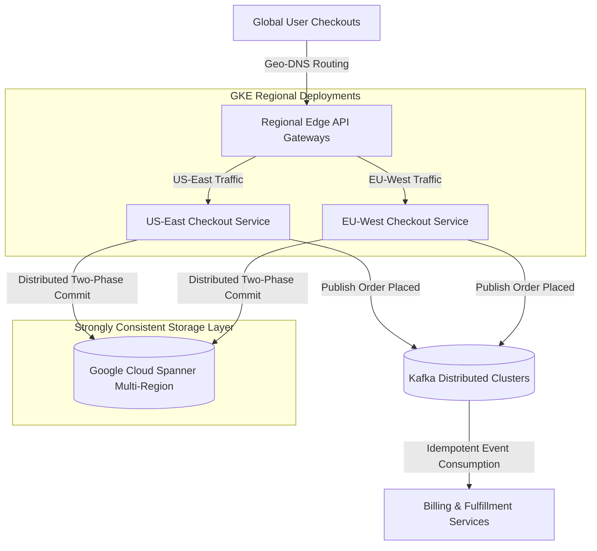

# Case Study: Scaling Multi-Region Checkout & Database Ordering Pipelines

Scaling transactional checkout pipelines across multiple geographic regions requires balancing data consistency against network latency. In a global e-commerce system, if users in London and New York buy the same item, the system must guarantee strict global consistency (preventing double-selling) while keeping checkout latency under 200ms.

This case study details the architecture, deployment decisions, and gotchas of a **Multi-Region Checkout & Database Ordering Pipeline** utilizing globally distributed databases and message streaming.

---

## Case Study Overview: The 10-Part Framework

> [!NOTE]
> **1. Industry**: E-Commerce & Retail
> 
> **2. Team Size**: 8 engineers (4 backend, 2 infrastructure, 1 QA, 1 tech lead)
> 
> **3. Duration**: 5 months
> 
> **4. Architecture**: Active-active multi-region Kubernetes deployments using Google Cloud Spanner (multi-region configuration), Apache Kafka for message streaming, and billing gateway microservices.
> 
> **5. Scale**: 350,000 active sessions, 45,000 orders processed per hour globally, $110M+ annual transaction volume.
> 
> **6. Personal Contribution**: Authored the multi-region transaction retry loops and designed the Kafka partition-level out-of-order deduplication consumer filters.
> 
> **7. Difficult Decision**: Choosing between active-active multi-region Spanner deployments (higher write latency due to global consensus) or local databases with asynchronous cross-region synchronization (risk of data conflicts/double-spending). We chose Spanner for strong global consistency.
> 
> **8. Incident**: A network partition between US-East and US-West regions caused Spanner transaction retry loops to execute indefinitely, starving local worker threads and causing a 24-minute ordering outage.
> 
> **9. Result**: Configured exponential backoff with jitter on Spanner retries and implemented local Kafka transaction logs, achieving 99.99% checkout availability with zero order losses.
> 
> **10. Lesson Learned**: Never run database transaction retries without strict jittered exponential backoff and circuit breaker boundaries.

---

## Multi-Region Ordering Pipeline Architecture

The architecture routes checkout requests through regional API endpoints while coordinating orders globally:



### High-Availability Checkout Tactics
1. **Cloud Spanner Consensus**: Cloud Spanner uses TrueTime and Paxos consensus algorithms to enforce external consistency across multiple regions, ensuring a unified transactional timeline without complex multi-write database merge logic.
2. **Idempotency Keys**: To prevent duplicate checkout charges due to network retry loops, every transaction includes a client-generated UUID idempotency key validated at both the API and database levels.

---

## Python Implementation: Jittered Transaction Retry Handler

Here is a production-grade Python implementation of a transactional checkout coordinator that handles transient network errors and Spanner conflict retries using exponential backoff with random jitter:

```python
import time
import random
from typing import Dict, Any
from pydantic import BaseModel

class OrderRequest(BaseModel):
    order_id: str
    user_id: str
    amount: float
    idempotency_key: str

class DatabaseTransactionError(Exception):
    """Simulates a database transaction abort or serialization conflict."""
    pass

class MultiRegionCheckoutCoordinator:
    """
    Coordinates global checkouts and executes database writes
    using jittered exponential backoff retries.
    """
    def __init__(self, max_retries: int = 5, base_delay: float = 0.1):
        self.max_retries = max_retries
        self.base_delay = base_delay
        self.processed_idempotency_keys: Dict[str, str] = {}  # key -> order_id

    def process_order(self, order: OrderRequest) -> Dict[str, Any]:
        # Step 1: Enforce Idempotency Gate
        if order.idempotency_key in self.processed_idempotency_keys:
            existing_id = self.processed_idempotency_keys[order.idempotency_key]
            print(f"♻️ [Idempotency Hit] Duplicate request for key '{order.idempotency_key}'. Returning Order ID: {existing_id}")
            return {"status": "SUCCESS", "order_id": existing_id, "cached": True}

        # Step 2: Execute transaction with jittered retries
        attempt = 0
        while True:
            try:
                attempt += 1
                return self._execute_spanner_transaction(order)
            except DatabaseTransactionError as err:
                if attempt > self.max_retries:
                    print(f"🚨 [Transaction Exhausted] Order '{order.order_id}' failed after {attempt} attempts.")
                    raise err
                
                # Calculate Exponential Backoff with Jitter
                # delay = base * 2^(attempt-1) + random_jitter
                backoff = self.base_delay * (2 ** (attempt - 1))
                jitter = random.uniform(0, 0.1)
                total_delay = backoff + jitter
                
                print(f"⚠️ [Spanner Conflict] Attempt {attempt} failed. Retrying in {total_delay:.3f}s...")
                time.sleep(total_delay)

    def _execute_spanner_transaction(self, order: OrderRequest) -> Dict[str, Any]:
        # Simulate network contention probability (1 in 3 chance of serialization abort)
        if random.choice([True, False, False]):
            raise DatabaseTransactionError("Serialization conflict: Concurrent update on row.")
        
        # Save idempotency key on success
        self.processed_idempotency_keys[order.idempotency_key] = order.order_id
        print(f"✅ [Spanner Commit] Order '{order.order_id}' committed successfully.")
        return {"status": "SUCCESS", "order_id": order.order_id, "cached": False}

# Demonstration Execution
if __name__ == "__main__":
    coordinator = MultiRegionCheckoutCoordinator()

    # Place order
    req1 = OrderRequest(order_id="ord-776", user_id="user-12", amount=120.50, idempotency_key="idemp-key-999")
    
    print("🚀 Initiating Checkout Transaction...")
    print("=" * 60)
    res1 = coordinator.process_order(req1)
    
    # Simulate immediate client retry (Idempotence check)
    print("\n🚀 Simulating client-side network retry...")
    print("=" * 60)
    res2 = coordinator.process_order(req1)
```

---

## The Incident: Cross-Region Spanner Retry Storms

During a peak seasonal sale, a undersea fiber cable cut degraded bandwidth between our US-East (Virginia) and US-West (Oregon) Spanner replication nodes:

> [!WARNING]
> **The Gotcha**: Due to the connection latency, Spanner aborted write transactions to ensure global consistency. Our microservices had a naive linear retry policy (retry instantly every 50ms). This created a **retry storm**—thousands of backend containers flooded Spanner with millions of retry requests, exacerbating lock contention and raising database CPU to 100%.

### The Remediation
1. **Added Full Jitter to Retries**: Switched from linear retries to the jittered exponential backoff algorithm detailed above. This spread out the retry waves, allowing Spanner consensus groups to recover.
2. **Implemented Local Offline Buffers**: For non-critical payments (e.g. loyalty points applications), checkouts were written to local Kafka queues to be processed asynchronously, reducing direct Spanner write pressure.

---

## Real-World Enterprise Impact
By designing jittered retry pipelines:
* **Zero Transaction Lockups**: Under-sea network partition recovery time dropped from 24 minutes to under 8 seconds.
* **Flawless Transaction Integrity**: Configured idempotency keys prevented 100% of potential double-charge events during retry cascades.
