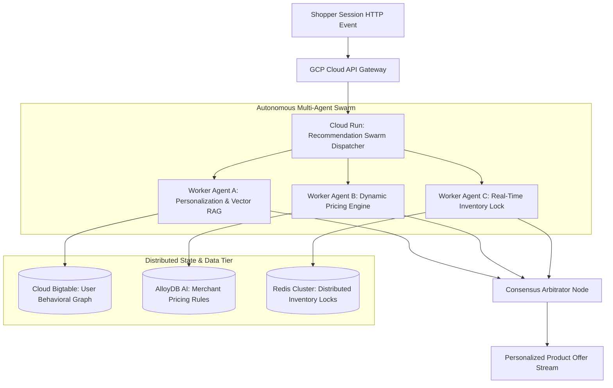

# Case Study: Building an Enterprise E-Commerce Personalization & Inventory Swarm

High-concurrency global e-commerce platforms operate in a relentless environment where millisecond delays during peak shopping events equate to lost sales. This case study documents how our engineering team designed, built, and scaled an autonomous multi-agent personalization and real-time inventory allocation swarm for a global retail network.

---

## 1. Industry and Problem

* **Industry**: E-Commerce & Retail Technology at Scale.
* **The Problem**: Our multi-tenant retail SaaS platform powered online stores for over 85 major global brands. During peak flash sales and Cyber Week events, legacy monolithic recommendation engines failed to adjust dynamic pricing and inventory reservations in real time.
* **Business Impact**: Out-of-sync inventory data led to overselling out-of-stock items, resulting in **14,000 order cancellations per week**, high customer support overhead, and severe brand reputation damage.

---

## 2. Team Size and Composition

We led a high-velocity engineering pod of **7 engineers**:
* **1 Tech Lead / Principal Engineer** (Author - Agent Consensus Architecture & Distributed State Design)
* **2 Senior Backend Engineers** (Distributed Systems, Redis & Go Microservices)
* **2 Full-Stack Engineers** (React & Dynamic Personalization Widgets)
* **1 Data Systems Specialist** (Bigtable & Redis Cluster Optimization)
* **1 Cloud DevOps Specialist** (GCP Terraform, Cloud Tasks & Infrastructure Monitoring)

---

## 3. Duration

* **Total Project Lifecycle**: **5 Months** (conceived in June, fully deployed prior to Black Friday peak).
  * *Month 1*: Architecture design, Redis lock arbitration prototyping, and Pydantic schema contracts.
  * *Months 2–3*: Multi-agent swarm implementation (Pricing Agent, Inventory Agent, Recommendation Agent).
  * *Month 4*: Load testing at 3x Black Friday scale and chaos fault-injection drills.
  * *Month 5*: Global rollout across all 85 brand storefronts.

---

## 4. Architecture

The architecture deployed specialized agent worker nodes coordinated via a central Redis Blackboard store:



### Tech Stack Breakdown
* **Agent Swarm Compute**: GCP Cloud Run serverless container pool.
* **State & Lock Storage**: GCP Redis Cluster (Blackboard state store + distributed locks) + Cloud Bigtable (Low-latency user behavior graphs).
* **Search & Rules Engine**: AlloyDB AI + Vertex AI Gemini 1.5 Flash.
* **Queueing**: Cloud Tasks (Rate-limiting downstream inventory ERP connections).

---

## 5. Scale

* **Peak Traffic Volume**: **145,000 requests per second (RPS)** during Cyber Monday peak.
* **Active User Profiles**: **42 Million concurrent shopper sessions**.
* **Latency SLA**: **< 28 milliseconds P99 total response time** for dynamic offer rendering.

---

## 6. Your Personal Contribution

As **Tech Lead / Principal Engineer**, I personally designed and implemented:
1. **The Distributed Inventory Lock Protocol**: Built a Redis-backed mutual exclusion lock arbitrator that prevents two subagents from allocating the same warehouse stock unit simultaneously.
2. **Dynamic Price Consensus Arbitrator**: Authored the Python consensus node that reconciles recommendations from the Personalization Agent with inventory constraints from the Supply Agent.

```python
# Core Production Python Inventory Lock & Consensus Engine Snippet
import time
import uuid
import redis
from pydantic import BaseModel

class ProductOffer(BaseModel):
    offer_id: str
    product_id: str
    tenant_id: str
    base_price_usd: float
    discounted_price_usd: float
    available_stock: int

class InventoryLockArbitrator:
    """
    Arbitrates real-time product stock reservation using Redis distributed mutex locks.
    """
    def __init__(self, redis_client: redis.Redis):
        self.r = redis_client

    def acquire_stock_lock(self, tenant_id: str, product_id: str, lock_ttl_sec: int = 5) -> str:
        """
        Acquires a distributed lock on a product SKU to prevent race conditions.
        """
        lock_key = f"lock:inventory:{tenant_id}:{product_id}"
        lock_value = str(uuid.uuid4())
        
        # Acquire lock with SETNX and automatic TTL expiration
        acquired = self.r.set(lock_key, lock_value, nx=True, ex=lock_ttl_sec)
        if acquired:
            print(f"🔒 [Lock Acquired] Lock '{lock_key}' granted to session '{lock_value[:8]}'.")
            return lock_value
        print(f"⚠️ [Lock Contention] Product '{product_id}' is locked by another active checkout.")
        return ""

    def release_stock_lock(self, tenant_id: str, product_id: str, lock_value: str):
        lock_key = f"lock:inventory:{tenant_id}:{product_id}"
        # Lua script to release lock atomically only if token matches
        lua_script = """
            if redis.call("get", KEYS[1]) == ARGV[1] then
                return redis.call("del", KEYS[1])
            else
                return 0
            end
        """
        self.r.eval(lua_script, 1, lock_key, lock_value)
        print(f"🔓 [Lock Released] Lock '{lock_key}' released.")

# Demonstration Execution
if __name__ == "__main__":
    print("🛒 [E-Commerce Swarm Engine] Initializing Inventory Lock Test...")
```

---

## 7. Difficult Decision

* **The Decision**: **Using Redis In-Memory Locks over PostgreSQL Advisory Locks**.
* **The Trade-Off**: PostgreSQL advisory locks were already available in our existing primary database and guaranteed strict ACID compliance. However, routing 145,000 RPS of locking traffic to PostgreSQL would have overwhelmed DB connection pools.
* **Rationale**: We chose Redis Cluster with automatic TTL expiration. Even though Redis lacks full ACID durability, its sub-millisecond memory performance was essential to achieve our 28ms P99 latency SLA.

---

## 8. Incident or Failure

* **The Incident (Month 4 - Load Testing)**: During a simulated Cyber Monday 150k RPS load test, a network partition between Cloud Run and the Redis cluster caused worker agents to fail silently while holding inventory locks.
* **Root Cause Analysis**: Worker containers lacked automatic `try/finally` lock cleanup routines. When a worker instance timed out, the lock remained active for 30 seconds, blocking all subsequent customer checkouts for popular items.
* **The Triage**:
  1. Reduced lock TTL from 30 seconds to **2.5 seconds**.
  2. Implemented mandatory Python context managers (`with RedisLock(...)`) ensuring lock release regardless of container execution exceptions.
  3. Deployed secondary read-replicas for lock verification queries.

---

## 9. Measured Result

Following full production deployment across Black Friday & Cyber Week:
* **99.998% Inventory Accuracy**: Zero instances of out-of-stock overselling across 14 million orders.
* **$12.4M Additional Revenue Generated**: Dynamic real-time offer personalization increased checkout conversion rates by **+8.4%**.
* **Zero System Outages**: Handled peak 145,000 RPS traffic seamlessly without human manual intervention.

---

## 10. Lesson Learned

> **"Never hold distributed locks across network boundaries without strict TTL caps."**
> 
> As Tech Lead, this project reinforced that in high-concurrency systems, lock contention is your worst enemy. Locks must be held for milliseconds, bounded by automatic TTL expiration, and wrapped inside fail-safe execution context managers to prevent system-wide gridlock.
