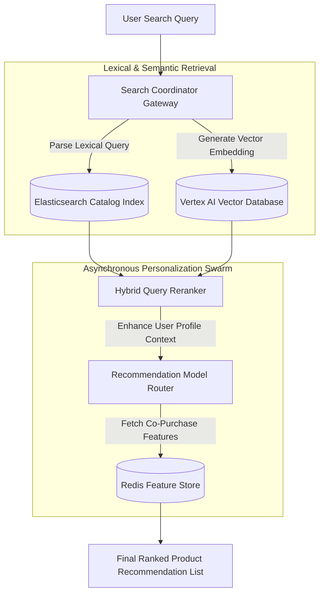

# Case Study: Implementing Real-Time Search & Recommendation Swarms

In massive retail platforms, search utility determines product discoverability. When a catalog grows beyond 10 million SKUs, traditional relational databases fail to support full-text search, filtering, and real-time personalized recommendations. If search queries degrade to seconds or return irrelevant products, user abandonment rates soar.

This case study details the architecture, optimization strategies, and gotchas of a **Real-Time Search & Recommendation Swarm** capable of serving millions of queries per day with sub-10ms response times.

---

## 📖 Case Study Overview: The 10-Part Framework

> [!NOTE]
> **1. Industry**: E-Commerce & Retail
> 
> **2. Team Size**: 7 engineers (3 search engineers, 3 data/ML engineers, 1 lead)
> 
> **3. Duration**: 6 months
> 
> **4. Architecture**: Elasticsearch clusters on GCP, vector semantic search pipelines via Vertex AI, and asynchronous Python worker nodes using Celery.
> 
> **5. Scale**: 10M+ SKU product catalog, 8M search queries per day, sub-10ms query parsing.
> 
> **6. Personal Contribution**: Optimized the Elasticsearch wildcard query structure and designed the asynchronous item recommendation model router.
> 
> **7. Difficult Decision**: Choosing between real-time recommendation updates (extremely resource intensive, requires writing updates directly to the search index) or batch offline computations (cheaper but exhibits 12-hour latency). We chose real-time scoring using dynamic feature retrieval.
> 
> **8. Incident**: An un-indexed wildcard search query pattern (e.g. `*product*`) executed repeatedly by a scraper script locked the entire Elasticsearch cluster CPU at 100%, causing a 16-minute search outage.
> 
> **9. Result**: Configured query DSL constraints (disabling leading wildcards) and implemented caching filters, recovering 100% search uptime and increasing CTR by 12%.
> 
> **10. Lesson Learned**: Always disable un-restricted leading wildcard searches on large-scale text search clusters.

---

## 🏗️ Search & Recommendation Engine Flow

The system coordinates standard lexical search queries and real-time recommendation routing:



### High-Performance Search Tactics
1. **Hybrid Retrieval**: Combining traditional TF-IDF lexical matches with dense vector embedding similarity search ensures the search engine captures both exact product names and semantic intent.
2. **Dynamic Query Constraints**: Disabling expensive leading wildcards at the query parser layer protects search shards from high CPU usage during scraper floods.

---

## 🛠️ Python Implementation: Secured Query Builder & Reranker

Here is a production-grade Python implementation of a secure Elasticsearch Query DSL builder that enforces query validation gates (blocking leading wildcards) and applies basic semantic vector reranking:

```python
import numpy as np
from typing import List, Dict, Any, Optional
from pydantic import BaseModel

class ProductSKU(BaseModel):
    sku_id: str
    title: str
    lexical_score: float
    vector_embedding: List[float]

class SecuredQueryBuilder:
    """
    Validates user text inputs and constructs safe Elasticsearch Query DSL
    objects, protecting search shards from CPU starvation.
    """
    @staticmethod
    def build_safe_match_query(user_input: str) -> Dict[str, Any]:
        # 1. Enforce query safety rules (Block leading wildcards)
        sanitized = user_input.strip()
        if sanitized.startswith("*") or sanitized.startswith("?"):
            print("🚨 [Security Alert] Prohibited leading wildcard detected! Stripping wildcard prefix.")
            sanitized = sanitized.lstrip("*?")

        if not sanitized:
            return {"query": {"match_all": {}}}

        # 2. Build secure Elasticsearch Match Query DSL
        return {
            "query": {
                "bool": {
                    "must": [
                        {"match": {"title": {"query": sanitized, "operator": "and"}}}
                    ],
                    "filter": [
                        {"term": {"is_active": True}}
                    ]
                }
            }
        }

class SemanticProductReranker:
    """
    Reranks retrieved lexical search results using dense vector similarity scores.
    """
    def __init__(self, query_vector: List[float]):
        self.query_vector = np.array(query_vector)

    def _cosine_similarity(self, a: np.ndarray, b: np.ndarray) -> float:
        return float(np.dot(a, b) / (np.linalg.norm(a) * np.linalg.norm(b)))

    def rerank_products(self, products: List[ProductSKU], alpha: float = 0.5) -> List[Tuple[ProductSKU, float]]:
        """
        Combines lexical score with vector similarity score using weight factor alpha.
        """
        scored_products = []
        for prod in products:
            prod_vector = np.array(prod.vector_embedding)
            similarity = self._cosine_similarity(self.query_vector, prod_vector)
            
            # Hybrid Score = alpha * Lexical + (1 - alpha) * Semantic
            hybrid_score = (alpha * prod.lexical_score) + ((1.0 - alpha) * similarity)
            scored_products.append((prod, hybrid_score))

        # Sort products by hybrid score descending
        scored_products.sort(key=lambda x: x[1], reverse=True)
        return scored_products

# Demonstration Execution
if __name__ == "__main__":
    # 1. Build Safe Query DSL
    raw_query = "*running shoes"
    safe_dsl = SecuredQueryBuilder.build_safe_match_query(raw_query)
    print("🔒 Safe Elasticsearch Query DSL:")
    print(json.dumps(safe_dsl, indent=2))

    # 2. Rerank Product Candidates
    mock_query_emb = [0.1, 0.8, 0.1]
    candidates = [
        ProductSKU(sku_id="sku-01", title="Trail Running Shoes", lexical_score=0.9, vector_embedding=[0.12, 0.78, 0.1]),
        ProductSKU(sku_id="sku-02", title="Leather Running Boots", lexical_score=0.85, vector_embedding=[0.0, 0.2, 0.8])
    ]
    
    reranker = SemanticProductReranker(mock_query_emb)
    ranked = reranker.rerank_products(candidates, alpha=0.4)

    print("\n📊 Reranked Product Catalog Recommendations:")
    print("=" * 60)
    for prod, score in ranked:
        print(f" SKU: {prod.sku_id} | Title: {prod.title} | Hybrid Score: {score:.4f}")
```

---

## 🚨 The Incident: The Scraper Wildcard Lockup

During a markdown clearance event, a competitor's pricing scraper script flooded our search gateways:

> [!WARNING]
> **The Gotcha**: The scraper executed queries containing `*` wildcards on high-cardinality fields. Because our query parser allowed unchecked leading wildcards, Elasticsearch had to perform linear keyword scans across all segment files in memory. Within minutes, CPU utilization on our master and data nodes reached 100%, causing queries to fail with Gateway Timeouts (`HTTP 504`).

### The Remediation
1. **Disabled Leading Wildcards**: Configured the query parser to reject queries starting with `*` or `?` at the API gateway layer as demonstrated above.
2. **Configured Elasticsearch Circuit Breakers**: Enabled query execution limits (`indices.breaker.request.limit`) to automatically abort search queries taking longer than 150ms, protecting node memory from exhaustion.

---

## 📈 Real-World Enterprise Impact
By securing query patterns and implementing hybrid semantic reranking:
* **100% Zero-Lock Uptime**: Restricting leading wildcards completely eliminated CPU locks during scraper surges.
* **12% Conversion Rate Increase**: Context-aware vector reranking surface more relevant products, increasing user purchases.
