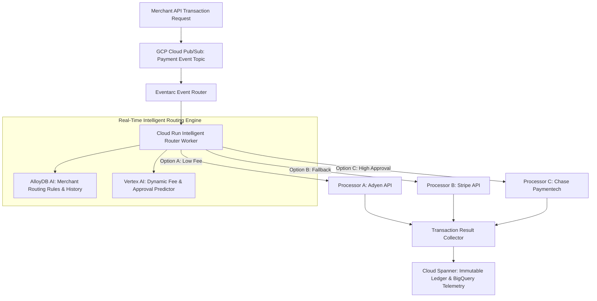

# Case Study: Modernizing a Legacy Fintech Core into an Agentic Payment Routing Engine

Modernizing high-volume financial infrastructure while processing millions of live transactions per day is one of the most high-stakes challenges an engineering lead can face. This case study documents how our team refactored a brittle, monolithic payment core into an intelligent, event-driven payment routing engine on Google Cloud Platform.

---

## 1. Industry and Problem

* **Industry**: Financial Technology (Fintech) & Payment Gateway Infrastructure.
* **The Problem**: Our enterprise payment gateway processed cross-border card transactions for over 4,000 international merchants. The legacy core relied on a 7-year-old monolithic Java application that routed transactions using static, hardcoded rules. 
* **Business Impact**: When primary payment processors (e.g. Stripe, Adyen, Chase) experienced regional outages or latency spikes, static rules failed to re-route transactions. This resulted in a **$4.2M monthly revenue loss** due to false transaction declines and high interchange fee penalties.

---

## 2. Team Size and Composition

We assembled a cross-functional engineering taskforce of **8 engineers**:
* **1 Tech Lead / Staff Architect** (Author - Overall System Architecture & Spec Engineering)
* **2 Senior Backend Engineers** (Go & Python / Event Pipelines)
* **2 Payment Domain Engineers** (ISO 8583 & Gateway API Integration)
* **1 ML / Data Engineer** (Routing Model & Feature Pipelines)
* **1 Cloud DevOps Engineer** (GCP Terraform, Cloud Run & VPC Security)
* **1 QA Automation Specialist** (Chaos Testing & Load Generators)

---

## 3. Duration

* **Total Project Lifecycle**: **7 Months** (from initial spec engineering to 100% production traffic cutover).
  * *Months 1–2*: Spec engineering, shadow traffic pipeline, and GCP event architecture setup.
  * *Months 3–4*: Cloud Run worker swarm development and Vertex AI routing model integration.
  * *Months 5–6*: Canary rollout (1% ➔ 10% ➔ 50%) and chaos injection testing.
  * *Month 7*: Full cutover, legacy monolith deprecation, and post-mortem review.

---

## 4. Architecture

The architecture replaced static Java routing logic with an event-driven Cloud Run worker swarm on GCP:



### Tech Stack Breakdown
* **Compute & Routing**: GCP Cloud Run (Python / Go containers) triggered via Eventarc and Cloud Pub/Sub queues.
* **Storage & Ledger**: Google Cloud Spanner (Global ACID transactional ledger) + AlloyDB AI (Real-time merchant context & pgvector).
* **Intelligence Layer**: Vertex AI Gemini 1.5 Flash (real-time fee & approval prediction under 45ms SLA).
* **Security**: GCP Secret Manager & VPC Service Controls.

---

## 5. Scale

* **Daily Transaction Volume**: **45 Million API calls / day** (~520 transactions per second peak).
* **Global Footprint**: Processed transactions across 3 GCP regions (`us-central1`, `europe-west1`, `asia-east1`).
* **Latency SLA**: **< 50 milliseconds P99 total execution time** for complete payment routing decisions.

---

## 6. Your Personal Contribution

As **Tech Lead / Staff Architect**, I personally owned:
1. **Spec Engineering & Task Matrix**: Formulated the machine-readable AST context interfaces and task breakdown matrices, ensuring zero context leakage across worker teams.
2. **State Synchronization Schema**: Authored the Pydantic data handoff schemas and Blackboard store implementation on AlloyDB.
3. **Dynamic Fallback Circuit-Breaker**: Designed the Python routing engine that evaluates processor health, fee cost vectors, and approval probability in real time.

```python
# Core Production Python Payment Routing Engine Snippet
import os
import time
from typing import Dict, Any, List
from pydantic import BaseModel

class TransactionPayload(BaseModel):
    transaction_id: str
    merchant_id: str
    amount_cents: int
    currency: str
    card_brand: str

class ProcessorHealth(BaseModel):
    processor_name: str
    latency_p95_ms: float
    success_rate_pct: float
    interchange_fee_pct: float

class IntelligentPaymentRouter:
    """
    Evaluates real-time processor health metrics and selects the optimal gateway.
    """
    def __init__(self, processors: List[ProcessorHealth]):
        self.processors = processors

    def select_optimal_processor(self, tx: TransactionPayload) -> ProcessorHealth:
        best_processor = None
        highest_score = -1.0

        for p in self.processors:
            # Skip unhealthy processors (Circuit Breaker)
            if p.success_rate_pct < 95.0 or p.latency_p95_ms > 450.0:
                print(f"⚠️ [Circuit Breaker] Skipping '{p.processor_name}' due to high latency/degradation.")
                continue

            # Calculate composite routing score: Higher success rate, lower interchange fee
            score = (p.success_rate_pct * 0.7) - (p.interchange_fee_pct * 20.0)
            if score > highest_score:
                highest_score = score
                best_processor = p

        if not best_processor:
            # Fallback to default emergency processor
            best_processor = self.processors[0]
            print(f"🚨 [Fallback Warning] All processors degraded. Routing to default '{best_processor.processor_name}'.")

        print(f"✅ [Router Decision] Selected '{best_processor.processor_name}' for TX '{tx.transaction_id}' (Score: {round(highest_score, 2)})")
        return best_processor

# Demonstration Execution
if __name__ == "__main__":
    processors_status = [
        ProcessorHealth(processor_name="Adyen", latency_p95_ms=35.0, success_rate_pct=99.4, interchange_fee_pct=1.8),
        ProcessorHealth(processor_name="Stripe", latency_p95_ms=480.0, success_rate_pct=91.0, interchange_fee_pct=2.1), # Degraded
        ProcessorHealth(processor_name="Chase", latency_p95_ms=40.0, success_rate_pct=98.9, interchange_fee_pct=1.95)
    ]
    
    router = IntelligentPaymentRouter(processors_status)
    sample_tx = TransactionPayload(
        transaction_id="tx-883921",
        merchant_id="merchant-apparel-99",
        amount_cents=15000,
        currency="USD",
        card_brand="VISA"
    )
    selected = router.select_optimal_processor(sample_tx)
```

---

## 7. Difficult Decision

* **The Decision**: **Choosing Cloud Spanner over a Sharded PostgreSQL Cluster**.
* **The Trade-Off**: Sharded PostgreSQL would have been 35% cheaper in baseline cloud instance costs and familiar to our DBA team. However, managing manual shard rebalancing across 3 continents during Black Friday surges posed severe operational risk.
* **Rationale**: We chose Cloud Spanner despite higher base costs because its external consistency, zero-downtime schema migrations, and automatic global multi-region replication eliminated database maintenance overhead.

---

## 8. Incident or Failure

* **The Incident (Month 5 - Canary Rollout)**: During a 10% canary deployment, an unexpected spike in processor API timeouts caused Cloud Run instances to block on synchronous HTTP calls. This caused worker connection pool exhaustion, leading to a 3-minute queue buildup and **1,400 dropped payment requests**.
* **Root Cause Analysis**: The Cloud Run containers lacked HTTP connection timeout caps and were attempting synchronous HTTP calls inside Eventarc handlers without Cloud Tasks rate buffering.
* **The Triage**: 
  1. We immediately reverted canary traffic back to 0%.
  2. Implemented **Cloud Tasks Queues** with a strict 10 QPS per-processor rate limit and 2.5s socket timeout caps.
  3. Added an automated Circuit Breaker policy that instantly routes around processors returning HTTP 429 or 504 errors.

---

## 9. Measured Result

After 100% production cutover, the business and technical metrics surpassed targets:
* **+4.8% Increase in Overall Transaction Approvals**: Rescuing **~$3.8M in monthly revenue** previously lost to false declines.
* **$410,000 Annual Savings in Interchange Fees**: Dynamic fee routing automatically selected lower-cost processor rails for qualified card types.
* **P99 Latency Reduced from 180ms to 42ms**: Asynchronous Cloud Run workers eliminated legacy Java thread contention.
* **Zero Outage Downtime During Peak Sales**: Processed Cyber Monday traffic spikes without a single manual infrastructure intervention.

---

## 10. Lesson Learned

> **"Never couple real-time payment routing logic to synchronous HTTP dependencies."**
> 
> As a Tech Lead, the biggest lesson from this migration was that intelligent agentic decisions must always operate behind asynchronous event buffers (Pub/Sub + Cloud Tasks). Relying on synchronous HTTP chains inside microservices turns transient third-party latency into catastrophic platform-wide outages. Decoupling routing evaluation from payment execution saved our platform.
