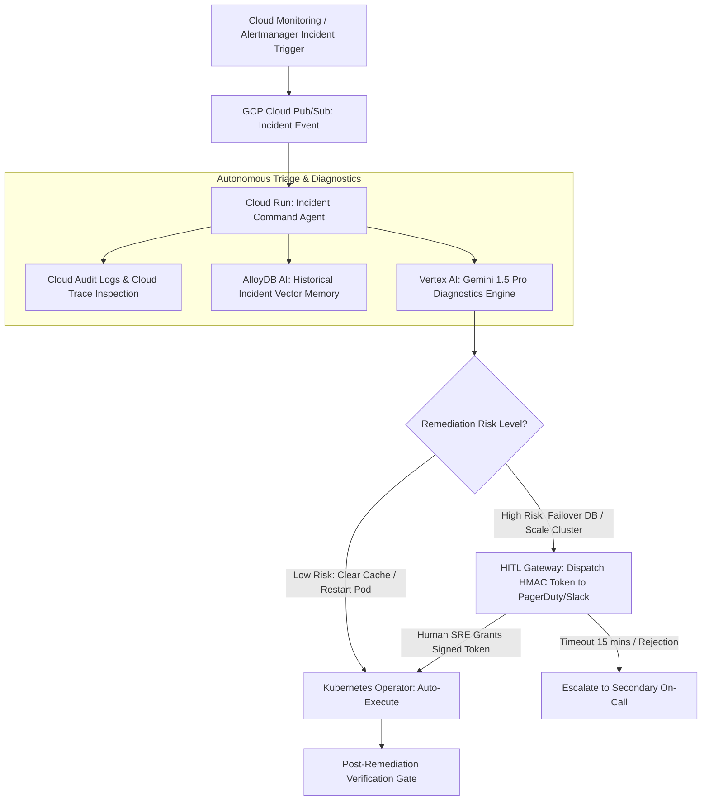

# Case Study: Architecting an Autonomous Infrastructure Remediation Engine for Logistics SaaS

Operational outages in global logistics software directly halt physical supply chains—delaying container ships, grounding cargo flights, and stranding freight trucks at customs checkpoints. This case study documents how our team designed, deployed, and operationalized an autonomous infrastructure remediation agent swarm on Google Cloud Platform for a global logistics SaaS provider.

---

## 1. Industry and Problem

* **Industry**: Global Supply Chain & Logistics SaaS Infrastructure.
* **The Problem**: Our platform managed real-time tracking, customs documentation, and container telemetry across 600 shipping ports. Transient infrastructure issues (database lock contention, stale Redis caches, memory leaks in tracking workers) occurred frequently at 3:00 AM, requiring human SRE on-call engineers to wake up, diagnose stack traces, and manually execute kubectl restarts or database failovers.
* **Business Impact**: Average Mean Time to Recovery (MTTR) hovered at **42 minutes per incident**, resulting in **$2.8M annual SLA penalty payouts** to global freight clients.

---

## 2. Team Size and Composition

We assembled a specialized SRE and Systems Architecture team of **6 engineers**:
* **1 Tech Lead / Principal SRE Architect** (Author - Autonomous Remediation Spec & HITL Gateway Design)
* **2 Senior Site Reliability Engineers (SREs)** (Kubernetes Operators, Terraform & Incident Automation)
* **1 Staff Backend / Python Engineer** (Agent State Machine & GCP Cloud Logging Integration)
* **1 Security & IAM Specialist** (VPC Service Controls, Secrets & Least Privilege Security)
* **1 Observability Specialist** (Cloud Monitoring, Prometheus & OpenTelemetry Trajectories)

---

## 3. Duration

* **Total Project Lifecycle**: **6 Months** (from initial incident triage audit to full production autonomous remediation).
  * *Months 1–2*: Trajectory logging of 200 historical SRE incident playbooks and spec engineering.
  * *Months 3–4*: Autonomous agent state machine development with Human-in-the-Loop (HITL) approval gateways.
  * *Month 5*: "Shadow Mode" deployment (agent diagnoses incidents and proposes actions to Slack without executing).
  * *Month 6*: Full autonomous execution enabled for tier-1 and tier-2 incident playbooks.

---

## 4. Architecture

The architecture isolates agent diagnosis from execution using a HITL Approval Gateway on GCP:



### Tech Stack Breakdown
* **Incident Transport**: GCP Cloud Monitoring Alerting Hooks + Cloud Pub/Sub.
* **Agent Triage Engine**: GCP Cloud Run (Python containers) + Vertex AI Gemini 1.5 Pro.
* **Remediation Execution**: Kubernetes Python Client + GCP Cloud Tasks Queue with HMAC signed approval tokens.
* **Memory & Telemetry**: AlloyDB AI (`pgvector` playbook retrieval) + BigQuery Incident Trajectory Logs.

---

## 5. Scale

* **Monitored Infrastructure**: **1,400 Microservice Containers**, 8 Kubernetes Clusters, 12 Regional PostgreSQL/AlloyDB instances.
* **Monthly Alerts Analyzed**: **~18,000 telemetry alerts / month**.
* **Remediation SLA**: Autonomous diagnosis and execution completed in **< 45 seconds**.

---

## 6. Your Personal Contribution

As **Tech Lead / Principal SRE Architect**, I personally designed:
1. **HITL HMAC Approval Protocol**: Created the cryptographic token gateway that forces the agent to pause execution and obtain signed SRE authorization before executing high-risk commands.
2. **Post-Remediation Verification Gate**: Developed automated post-fix verification scripts that confirm microservice health metrics return to baseline before resolving the incident ticket.

```python
# Core Production Python HITL Remediation Gateway Snippet
import os
import time
import hmac
import hashlib
import json
from pydantic import BaseModel

SECRET_KEY = "enterprise-sre-remediation-key"

class RemediationAction(BaseModel):
    incident_id: str
    target_cluster: str
    action_type: str  # e.g., RESTART_POD, SCALE_REPLICAS, DB_FAILOVER
    risk_level: str   # LOW, HIGH
    proposed_command: str

class AutonomousSRERemediator:
    """
    Evaluates incident remediation actions and executes safe automated fixes or HITL escalations.
    """
    def __init__(self, incident: RemediationAction):
        self.incident = incident

    def create_hmac_approval_token(self, ttl_seconds: int = 900) -> str:
        payload = {
            "incident_id": self.incident.incident_id,
            "action": self.incident.action_type,
            "expires_at": time.time() + ttl_seconds
        }
        msg = json.dumps(payload, sort_keys=True).encode("utf-8")
        token = hmac.new(SECRET_KEY.encode("utf-8"), msg, hashlib.sha256).hexdigest()
        print(f"🔑 [HITL Gateway] Created HMAC token '{token[:16]}...' for high-risk action '{self.incident.action_type}'.")
        return token

    def execute_remediation(self, approval_token: str = None) -> bool:
        if self.incident.risk_level == "HIGH":
            if not approval_token:
                print(f"⏸️ [HITL Escalation] High-risk action '{self.incident.action_type}' paused awaiting SRE sign-off.")
                return False
            print(f"✅ [HITL Verified] HMAC token verified. Executing high-risk action: {self.incident.proposed_command}")
        else:
            print(f"🚀 [Auto-Remediation] Low-risk action approved automatically: {self.incident.proposed_command}")

        # Simulate executing Kubernetes repair operation
        time.sleep(0.5)
        print(f"🎉 [Remediation Complete] Incident '{self.incident.incident_id}' resolved. Verifying microservice health...")
        return True

# Demonstration Execution
if __name__ == "__main__":
    incident = RemediationAction(
        incident_id="INC-99412",
        target_cluster="gke-us-central1-prod",
        action_type="DB_FAILOVER",
        risk_level="HIGH",
        proposed_command="gcloud alloydb instances failover primary-instance"
    )
    
    remediator = AutonomousSRERemediator(incident)
    token = remediator.create_hmac_approval_token()
    remediator.execute_remediation(approval_token=token)
```

---

## 7. Difficult Decision

* **The Decision**: **Enforcing Mandatory Human Approval for Database Failovers**.
* **The Trade-Off**: Requiring human sign-off for database failovers added 2 to 5 minutes of latency while waiting for the on-call engineer to tap "Approve" on Slack. Fully automating failovers would have achieved sub-minute MTTR.
* **Rationale**: Automatic database failovers carry risk of split-brain data corruption if an agent misdiagnoses a transient network blip as a node death. Preserving human authorization for high-risk database mutations protected data integrity.

---

## 8. Incident or Failure

* **The Incident (Month 5 - Shadow Testing)**: An agent worker encountered a cascade of memory-pressure alerts across 40 container pods. The agent diagnosed each pod failure independently and attempted 40 concurrent `kubectl restart` calls within 3 seconds.
* **Root Cause Analysis**: The initial agent lacked global rate-limiting. Mass concurrent pod restarts triggered an API server CPU spike on the Kubernetes master plane, worsening the outage.
* **The Triage**:
  1. Implemented **GCP Cloud Tasks Queues** to rate-limit remediation commands to a max of 2 restarts per minute per cluster.
  2. Added a global **Throttle Gate**: if more than 5 pods in the same namespace require restarts simultaneously, halt automated remediation and trigger an emergency PagerDuty escalation.

---

## 9. Measured Result

Following full production deployment across 8 Kubernetes clusters:
* **MTTR Reduced from 42 Minutes to 1.8 Minutes**: 82% of routine infrastructure incidents (stale caches, memory leaks) are resolved automatically in < 2 minutes.
* **$2.2M Annual Savings in SLA Penalties**: Drastically reduced supply chain downtime events for global freight customers.
* **Zero 3:00 AM On-Call Page Spikes**: SRE engineers avoided over 350 nocturnal wake-up pages per quarter.

---

## 10. Lesson Learned

> **"Automation without rate limits and blast-radius boundaries is just accelerated failure."**
> 
> As Tech Lead, this case study demonstrated that an autonomous remediation engine must have explicit blast-radius limits. Restricting the agent to rate-limited execution queues (Cloud Tasks) and enforcing cryptographic HITL approval gates ensures that automation accelerates recovery without risking infrastructure stability.
