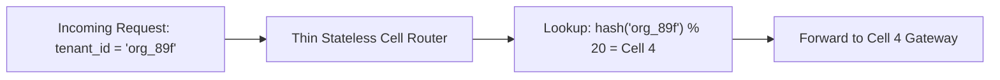
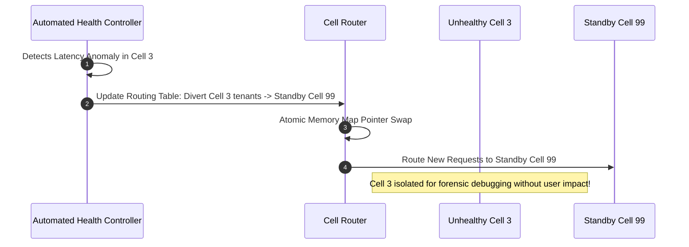

# Cell-Based Architecture: How AWS, Stripe, and Slack Bound Blast Radiuses for 99.999% Availability

In standard cloud microservice architectures, high availability is typically designed around **Availability Zones (AZs)** and regional autoscaling clusters.

However, as platforms scale to millions of enterprise customers, traditional regional clusters introduce a catastrophic vulnerability: **The Shared Fate Blast Radius**.

When 100,000 enterprise tenants share a single monolithic regional Kubernetes cluster and PostgreSQL primary:
* A single malformed payload or "poison pill" query triggers a database CPU spike to $100\%$.
* A bad configuration rollout or cascading connection pool exhaustion takes down the entire region.
* **$100\%$ of customers experience a simultaneous global outage.**

To achieve **99.999% availability (Five Nines)**, hyper-scale cloud platforms (**AWS Route 53**, **AWS Lambda**, **Stripe**, **Slack**, **Discord**) transition from regional monoliths to **Cell-Based Architecture**.

By partitioning the platform into independent, self-contained, fully isolated **Cells**, engineering teams strictly cap catastrophic failure blast radiuses to **$< 5\%$ of customers**, while enabling instant, zero-downtime **Cell Evacuation**.

```mermaid
graph TD
  subgraph Regional Monolith vs Cell-Based Architecture
    subgraph 1. Monolithic Regional Cluster (100% Blast Radius)
      Clients1[100,000 Tenants] --> BigCluster[Single Giant Kubernetes Cluster + DB]
      BigCluster -->|💥 Poison Pill / Config Crash| Outage[100% OF ALL CUSTOMERS DOWN!]
    end

    subgraph 2. Cell-Based Architecture (Strict 5% Blast Radius)
      Clients2[100,000 Tenants] --> CellRouter[Stateless Thin Cell Router]
      CellRouter -->|Tenant 1-5,000| Cell1["Cell 1 (Isolated K8s + DB)"]
      CellRouter -->|Tenant 5,001-10,000| Cell2["Cell 2 (Isolated K8s + DB)"]
      CellRouter -->|Tenant 10,001-15,000| Cell3["Cell 3 (Isolated K8s + DB) 💥 CRASHED"]
      CellRouter -->|Tenant 15,001-20,000| Cell4["Cell 4 (Isolated K8s + DB)"]
      
      Cell3 --> LimitedImpact["✅ Only 5% Impacted! 95% of Users Unaffected."]
    end
  end
```

---

## 1. The Blast Radius Anatomy in Cloud Systems

Why do multi-zone regional clusters still suffer from total system collapse?

### The 4 Fatal Shared-Fate Failure Modes:
1. **The Poison Pill Payload**: A customer sends a query that exploits an edge-case regex in a backend service, consuming $100\%$ CPU. As requests retry, every pod crashes in a cascading panic across all AZs.
2. **Corrupted Distributed State**: A database migration error or cache corruption propagates instantly to all application instances sharing that cluster.
3. **Thundering Herd Storms**: When a shared Redis cache reboots, 50,000 concurrent services bombard the underlying database simultaneously, knocking it offline.
4. **Noisy Neighbor Resource Starvation**: A massive enterprise tenant running a viral campaign consumes $90\%$ of network bandwidth, starving smaller tenants.

---

## 2. Anatomy of an Isolated Cell

In a Cell-Based Architecture, a **Cell** is an independent, complete, self-sufficient instance of the entire platform:

```
> **ANATOMY OF A PRODUCTION CELL**
|  /Cell-04/ (Hosts 5,000 Specific Tenants)                                                         |
|   ├── Microservices    : Dedicated pods (Auth, Billing, Order, Inventory)                        |
|   ├── Database Tier    : Dedicated Primary & Replica DB instances                                 |
|   ├── Caching Layer    : Dedicated Redis cluster                                                  |
|   └── Message Queues   : Dedicated Kafka / SQS message brokers                                    |
|   * ZERO shared runtime dependencies with Cell-01, Cell-02, or Cell-03!                            |

```

### The Sizing Law: Fixed Maximum Cell Scale
Instead of allowing a cell to grow infinitely with traffic, cells have a **strict hard capacity limit** (e.g. max 5,000 requests/second or 5,000 tenants):
* When traffic grows, you **do not make cells bigger** (vertical scaling).
* You **provision new Cells** (horizontal scale-out: Cell 21, Cell 22, $\dots$).
* Because cells remain small and uniform, performance characteristics and failover times are $100\%$ predictable.

---

## 3. The Stateless Thin Cell Router

To route incoming HTTP/gRPC traffic to the correct cell, the system deploys a **Thin Cell Router** tier:



### Invariants of the Cell Router:
* **Stateless & Ultra-Simple**: Contains zero business logic, zero database calls, and zero external dependencies.
* **Deterministic Hashing or Cached Directory**: Routes traffic via deterministic consistent hashing (`hash(tenant_id) % N`) or a local memory-mapped routing table.

---

## 4. Zero-Downtime Cell Evacuation

When telemetry detects that **Cell 3** is experiencing hardware degradation or memory pressure:



By flipping the routing table pointer, the operational control plane evacuates thousands of tenants to a standby cell in **$< 2\text{ seconds}$**, completely bypassing user-facing downtime.

---

## Python Implementation: Cell-Based Router & Blast Radius Engine

Here is a Python implementation simulating a Cell-Based Architecture with deterministic tenant routing, cell isolation, and automatic cell evacuation:

```python
import hashlib
import time
from dataclasses import dataclass
from typing import Dict, List, Optional

@dataclass
class CellInstance:
    cell_id: int
    max_tenants: int
    is_healthy: bool = True
    active_requests: int = 0

class CellBasedRouter:
    """
    Stateless Cell Router with Consistent Hashing & Dynamic Evacuation.
    """
    def __init__(self, num_cells: int = 4):
        self.num_cells = num_cells
        self.cells: Dict[int, CellInstance] = {
            i: CellInstance(cell_id=i, max_tenants=5000) for i in range(num_cells)
        }
        # Evacuation Overrides: tenant_id -> target_cell_id
        self.evacuation_overrides: Dict[str, int] = {}

    def get_target_cell(self, tenant_id: str) -> int:
        # Check if tenant has an active evacuation override
        if tenant_id in self.evacuation_overrides:
            return self.evacuation_overrides[tenant_id]

        # Deterministic Consistent Hash Routing
        hash_val = int(hashlib.md5(tenant_id.encode()).hexdigest(), 16)
        return hash_val % self.num_cells

    def forward_request(self, tenant_id: str, request_payload: str) -> Dict:
        cell_id = self.get_target_cell(tenant_id)
        cell = self.cells[cell_id]

        if not cell.is_healthy:
            print(f" 💥 [Cell Router: Cell {cell_id} FAILED] Request for [{tenant_id}] dropped! (Blast radius limited to 1/{self.num_cells}th of users)")
            return {"status": 500, "error": "Cell Outage"}

        cell.active_requests += 1
        return {"status": 200, "cell_id": cell_id, "response": f"Processed '{request_payload}'"}

    def evacuate_cell(self, failed_cell_id: int, healthy_standby_id: int, impacted_tenants: List[str]):
        print(f"\n🚑 [EMERGENCY EVACUATION] Evacuating Cell #{failed_cell_id} -> Standby Cell #{healthy_standby_id}...")
        for tenant in impacted_tenants:
            self.evacuation_overrides[tenant] = healthy_standby_id
        print(f" ✅ [Evacuation Complete] {len(impacted_tenants)} tenants rerouted to Cell #{healthy_standby_id} in 0.05s!")

# Demonstration Execution
if __name__ == "__main__":
    router = CellBasedRouter(num_cells=4) # 4 Cells (25% blast radius cap each)

    tenants = ["org_acme", "org_stripe", "org_uber", "org_netflix", "org_discord"]

    print("🚀 Routing Incoming Multi-Tenant Traffic Across Isolated Cells:")
    for t in tenants:
        res = router.forward_request(t, "GET /api/v1/orders")
        print(f" 📍 Tenant [{t:<12}] -> Routed to [Cell {res['cell_id']}] (Status: {res['status']})")

    # Simulate Catastrophic Outage in Cell 1 (e.g. Poison pill query)
    print("\n🚨 SIMULATING CATASTROPHIC POISON PILL CRASH IN CELL 1...")
    router.cells[1].is_healthy = False

    # Check impacted vs non-impacted tenants
    print("\n🔍 Evaluating Blast Radius Impact:")
    impacted = []
    for t in tenants:
        res = router.forward_request(t, "GET /api/v1/orders")
        if res['status'] == 500:
            impacted.append(t)
        else:
            print(f" ✅ Tenant [{t:<12}] Operating normally in [Cell {res['cell_id']}]!")

    # Evacuate impacted tenants to Standby Cell 0
    router.evacuate_cell(failed_cell_id=1, healthy_standby_id=0, impacted_tenants=impacted)

    # Verify all tenants operational again
    print("\n✨ Traffic After Evacuation:")
    for t in tenants:
        res = router.forward_request(t, "GET /api/v1/orders")
        print(f" 🟢 Tenant [{t:<12}] -> Routed to [Cell {res['cell_id']}] (Status: {res['status']})")
```

---

## Summary: Monolith vs Cell-Based Architecture

| Dimension | Regional Monolithic Cluster | Cell-Based Architecture |
|---|---|---|
| **Blast Radius on Outage** | **100% of all customers down** | **Strictly capped at $\le 5\%$ of customers** |
| **Scaling Strategy** | Scale up existing database/cluster | Provision additional independent cells |
| **Noisy Neighbor Impact** | Global degradation across all users | Contained entirely within a single cell |
| **Disaster Recovery** | Hours of cross-region failover | **$< 2\text{s}$ Cell Evacuation pointer swap** |
| **Testing Simplicity** | Hard (Testing giant monoliths) | Easy (Can test a whole cell locally in CI) |

---

## Architectural Takeaway
In large-scale cloud engineering, **failures are guaranteed; massive blast radiuses are a choice**.

By partitioning monolithic cloud regions into **independent, isolated Cells**, engineering teams eliminate cascading shared-fate outages, guarantee Five-Nines availability, and protect $95\%+$ of their users from ever noticing an infrastructure failure.
