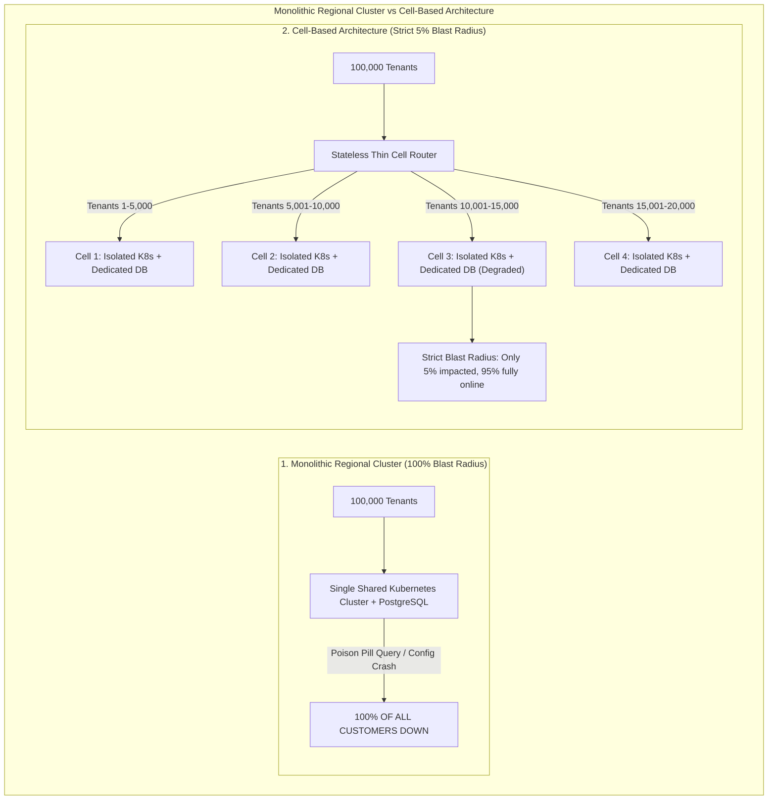
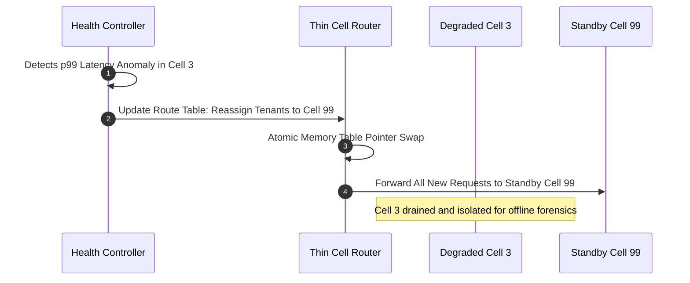

When naval architects design an ocean liner, their primary obsession is not preventing hull breaches. Icebergs, torpedoes, and submerged reefs are assumed to be inevitable. Their obsession is **compartmentalization**: dividing the hull with vertical steel bulkheads so that a catastrophic puncture in Compartment 3 cannot flood Compartments 4 through 12.

In modern cloud engineering, most systems are built like the *Titanic* before its maiden voyage: proud, massively scaled, redundant across multiple availability zones, but fundamentally sharing a single continuous bilge.

Consider a standard enterprise multi-tenant microservices architecture. One hundred thousand business customers share a regional Kubernetes cluster, an API gateway fleet, and a PostgreSQL primary. The marketing team celebrates having active-active deployment across three AWS Availability Zones.

Then a single client in Berlin triggers a malformed GraphQL query. The query hits an unindexed edge case in the ORM, locking table rows and spiking database CPU to 100%. Upstream microservices experience elevated latency and trigger aggressive retries. Connection pools exhaust within eight seconds. The ingress gateway runs out of ephemeral ports.

Within ninety seconds, the entire region is dark. The multi-AZ setup did not protect the platform because Availability Zones share state, share databases, and share network routing. **Every single customer experiences a simultaneous global outage.**

To break this shared-fate trap and deliver true **99.999% availability (Five Nines)**, hyper-scale cloud platforms—AWS Route 53, AWS Lambda, Stripe, and Slack—abandon monolithic regional clusters in favor of **Cell-Based Architecture**.



---

## 1. The Blast Radius Anatomy: Why Multi-AZ Is Not Fault Isolation

Why do multi-zone regional deployments routinely collapse into total outages?

In distributed systems, high availability is not a function of server count; it is a function of **failure independence**. Standard multi-AZ deployments share four critical failure vectors:

| Shared-Fate Failure Mode | Physical Mechanism | Blast Radius Impact |
|---|---|---|
| **Poison Pill Payloads** | Malformed input triggers unhandled runtime panics or regex backtracking loops across all worker nodes. | 100% cluster crash as retries propagate the payload across pods. |
| **Corrupted State Propagation** | Erroneous database migrations, bad index creations, or cache poisoning propagate instantly across all AZs. | Total data tier corruption within seconds. |
| **Thundering Herd Cascades** | When a shared Redis tier hiccups, thousands of app instances synchronously bombard the primary database. | Immediate connection pool exhaustion. |
| **Noisy Neighbor Starvation** | A single viral tenant consumes 90% of database IOPS or outbound network egress. | Severe degradation for all co-located tenants. |

If two components share a database connection string, an IAM role, or an internal DNS zone, they share fate. When failure occurs, your blast radius is the entire shared state boundary.

---

## 2. Anatomy of an Isolated Cell

In a Cell-Based Architecture, a **Cell** is an independent, complete, self-contained instance of the entire platform stack:

```
Cell-04 Topology (Dedicated 5,000-Tenant Blast Domain)
 ├── Microservices    : Dedicated application pods (Auth, Billing, Processing)
 ├── Database Tier    : Dedicated Primary and Replica database instances
 ├── Caching Layer    : Dedicated Redis cluster
 └── Message Queues   : Dedicated Kafka / SQS brokers
 * Invariant: ZERO shared runtime dependencies with Cell-01, Cell-02, or Cell-03
```

### The Sizing Invariant: Fixed Maximum Cell Scale
The foundational rule of cell design is: **Never make cells bigger; make more cells.**

Standard cloud platforms scale by continuously expanding their clusters—adding more nodes, increasing database instance sizes, tuning connection pool ceilings. This introduces nonlinear complexity: larger databases suffer longer vacuum times, cross-node gossip protocols saturate network switches, and failover latencies balloon.

In a cell-based architecture, every cell is hard-capped at a predictable scale (e.g., maximum 5,000 tenants or 10,000 requests per second). When platform traffic doubles, engineering does not re-architect existing cells; they provision ten new identical cells. Because cell geometry is uniform, performance characteristics and recovery times are 100% predictable.

---

## 3. The Stateless Thin Cell Router

To direct incoming client traffic to the appropriate cell without introducing a single point of failure, the architecture deploys an ultra-lean **Thin Cell Router** layer:


### Core Invariants of the Cell Router:
* **Zero Business Logic**: The router performs no authentication checks, no database lookups, and no request body parsing. It only inspects routing tokens (e.g., URL subdomains, HTTP headers, or API keys).
* **In-Memory Deterministic Routing**: Routing decisions are made via consistent hashing algorithms or memory-mapped routing tables cached directly in proxy memory (Envoy / OpenResty).
* **Failure Independence**: If the router process restarts, it recovers in milliseconds because it carries zero persistent state.

---

## 4. Zero-Downtime Cell Evacuation

When hardware degradations, network partitions, or memory leaks degrade a cell, operations teams do not attempt live in-place surgery. They trigger **Cell Evacuation**:



By swapping an in-memory routing pointer, the control plane diverts tenant traffic to a warm standby cell in **under two seconds**, eliminating user-facing downtime while isolating the degraded environment for offline forensic analysis.

---

## Python Implementation: Cell-Based Router with Dynamic Evacuation

The following Python script models a deterministic multi-tenant cell router with consistent hashing, tenant health isolation, and instant emergency cell evacuation:

```python
import hashlib
from dataclasses import dataclass
from typing import Dict, List, Optional

@dataclass
class Cell:
    cell_id: int
    capacity: int
    is_healthy: bool = True
    active_tenants: int = 0

class CellBasedArchitecture:
    """
    Simulates a high-availability Cell-Based Router with deterministic
    tenant placement and zero-downtime emergency evacuation.
    """
    def __init__(self, num_cells: int = 4, cell_capacity: int = 5000):
        self.cells: Dict[int, Cell] = {
            i: Cell(cell_id=i, capacity=cell_capacity) for i in range(num_cells)
        }
        self.evacuation_overrides: Dict[str, int] = {}

    def _hash_tenant(self, tenant_id: str) -> int:
        digest = hashlib.md5(tenant_id.encode("utf-8")).hexdigest()
        return int(digest, 16) % len(self.cells)

    def route_request(self, tenant_id: str) -> Optional[int]:
        # Check for operational evacuation override
        if tenant_id in self.evacuation_overrides:
            return self.evacuation_overrides[tenant_id]

        assigned_cell = self._hash_tenant(tenant_id)
        target = self.cells[assigned_cell]

        if not target.is_healthy:
            return None  # Rejection bounded strictly to this cell's tenants

        return assigned_cell

    def trigger_emergency_evacuation(self, degraded_cell_id: int, target_standby_cell_id: int, affected_tenants: List[str]) -> None:
        """
        Instantly diverts affected tenants from a failing cell to a standby cell.
        """
        self.cells[degraded_cell_id].is_healthy = False
        for tenant in affected_tenants:
            self.evacuation_overrides[tenant] = target_standby_cell_id

# Demonstration Run
if __name__ == "__main__":
    cluster = CellBasedArchitecture(num_cells=4, cell_capacity=5000)
    test_tenants = [f"tenant_corp_{i:04d}" for i in range(1, 21)]

    print("Initial Routing Distribution:")
    distribution = {0: [], 1: [], 2: [], 3: []}
    for t in test_tenants:
        cell = cluster.route_request(t)
        distribution[cell].append(t)

    for cell_id, tenants in distribution.items():
        print(f"  Cell {cell_id:02d}: {len(tenants)} active tenants")

    # Simulate catastrophic hardware failure in Cell 2
    failing_cell = 2
    standby_cell = 3
    print(f"\nALERT: Catastrophic failure in Cell {failing_cell}! Evacuating to Cell {standby_cell}...")
    cluster.trigger_emergency_evacuation(
        degraded_cell_id=failing_cell,
        target_standby_cell_id=standby_cell,
        affected_tenants=distribution[failing_cell]
    )

    print("\nPost-Evacuation Routing Verification:")
    for t in distribution[failing_cell]:
        routed = cluster.route_request(t)
        print(f"  Tenant {t} -> Routed safely to Cell {routed}")
```

---

## Architectural Comparison Matrix

| Dimension | Monolithic Multi-AZ Cluster | Cell-Based Architecture |
|---|---|---|
| **Blast Radius** | 100% of tenants on catastrophic failure | **Strictly bounded (< 5% of tenants per cell)** |
| **Database Scalability** | Vertical hardware ceilings & lock contention | Horizontally unbounded through uniform cells |
| **Operational Complexity** | Low initially, exponential at scale | Moderate initial investment in routing tier |
| **Disaster Recovery** | Hours of high-stress regional failover | **Sub-second tenant traffic redirection** |
| **Deployment Cadence** | High-risk global release windows | Progressive canary rollouts, one cell at a time |

---

## The Engineering Law of Blast Radiuses

Complex systems will always fail in ways their designers could not foresee. Software bugs, configuration mistakes, and hardware faults are statistical certainties.

The mark of mature cloud engineering is not the hubris of attempting to eliminate all errors; it is the wisdom of **bounding the blast radius**. By carving platforms into hermetic, self-sufficient cells, architects ensure that when the inevitable catastrophe strikes, ninety-five percent of their customers never even notice.
