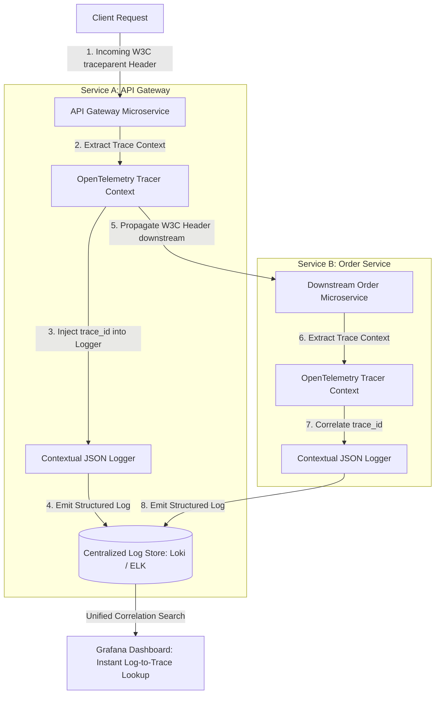

# Centralized Distributed Tracing & Dynamic Structured Logging

In distributed microservice networks, a single user interaction can trigger dozens of downstream HTTP and gRPC calls across isolated containers. When an error occurs or latencies spike, searching through unstructured, plain-text log files across individual server nodes is frustrating and inefficient.

To achieve complete system observability, software engineering teams combine **OpenTelemetry Distributed Tracing** with **Structured JSON Logging**.

By propagating W3C `traceparent` headers across microservice boundaries and injecting active `trace_id` and `span_id` metadata into every log message, developers can correlate logs directly with distributed trace spans in tools like **Grafana Tempo**, **Jaeger**, and **Elasticsearch (ELK)**.

This article details how to build a context-aware structured logging framework with dynamic log level control.

---

## Distributed Context Propagation Pipeline

Tracing incoming requests and correlating structured logs across microservices:



### Core Observability Principles
1. **W3C Trace Context Specification**: Standardizes header formats across language ecosystems. The `traceparent` header consists of 4 hyphen-separated fields: `00-4bf92f3577b34da6a3ce929d0e0e4736-00f067aa0ba902b7-01` (Version - Trace ID - Parent Span ID - Trace Flags).
2. **Log-to-Trace Correlation**: Every log statement emitted by an application must automatically capture the active `trace_id` and `span_id` from thread-local or async-local storage (`contextvars` in Python).
3. **Dynamic Log Level Control**: Under normal operation, services run at `INFO` log level to minimize log storage volume. When debugging production issues, administrators can dynamically lower log levels to `DEBUG` for specific logger components at runtime via API endpoints without restarting service instances.

---

## Python Implementation: Context-Aware JSON Logger & Dynamic Level Controller

Here is a production-grade Python implementation of a context-aware JSON logger that binds OpenTelemetry trace IDs and supports dynamic runtime log-level changes:

```python
import json
import logging
import time
from contextvars import ContextVar
from typing import Dict, Any, Optional

# Async-safe ContextVars to store active trace metadata
current_trace_id: ContextVar[Optional[str]] = ContextVar("current_trace_id", default=None)
current_span_id: ContextVar[Optional[str]] = ContextVar("current_span_id", default=None)

class JSONStructuredFormatter(logging.Formatter):
    """
    Formats log records into machine-readable JSON strings,
    automatically binding active OpenTelemetry trace and span IDs.
    """
    def format(self, record: logging.LogRecord) -> str:
        log_payload: Dict[str, Any] = {
            "timestamp": time.strftime("%Y-%m-%dT%H:%M:%SZ", time.gmtime(record.created)),
            "level": record.levelname,
            "logger": record.name,
            "message": record.getMessage(),
            "trace_id": current_trace_id.get() or "00000000000000000000000000000000",
            "span_id": current_span_id.get() or "0000000000000000",
            "module": record.module,
            "function": record.funcName,
            "line": record.lineno
        }

        # Append extra attributes passed in extra={...}
        if hasattr(record, "extra_data"):
            log_payload.update(record.extra_data)

        return json.dumps(log_payload)

class DynamicLoggerManager:
    """
    Manages structured logger instances and supports runtime log-level adjustments.
    """
    def __init__(self, service_name: str):
        self.service_name = service_name
        self.logger = logging.getLogger(service_name)
        self.logger.setLevel(logging.INFO)  # Default Level
        
        # Attach JSON Formatter to StreamHandler
        handler = logging.StreamHandler()
        handler.setFormatter(JSONStructuredFormatter())
        self.logger.addHandler(handler)

    def set_log_level(self, new_level_str: str):
        """Dynamically adjusts log level at runtime."""
        level = getattr(logging, new_level_str.upper(), None)
        if level is not None:
            self.logger.setLevel(level)
            print(f" ⚙️ [Dynamic Log Control] Adjusted '{self.service_name}' log level to {new_level_str.upper()}")
        else:
            raise ValueError(f"Invalid Log Level: {new_level_str}")

# Helper Context Manager to simulate incoming W3C traceparent headers
class TraceContext:
    def __init__(self, trace_id: str, span_id: str):
        self.token_trace = None
        self.token_span = None
        self.trace_id = trace_id
        self.span_id = span_id

    def __enter__(self):
        self.token_trace = current_trace_id.set(self.trace_id)
        self.token_span = current_span_id.set(self.span_id)

    def __exit__(self, exc_type, exc_val, exc_tb):
        current_trace_id.reset(self.token_trace)
        current_span_id.reset(self.token_span)

# Demonstration Execution
if __name__ == "__main__":
    app_logger = DynamicLoggerManager("order-microservice")

    print("🚀 Demonstrating Centralized Distributed Tracing & Structured Logging...")
    print("=" * 75)

    # 1. Log at default INFO level inside Trace Context
    w3c_trace_id = "4bf92f3577b34da6a3ce929d0e0e4736"
    w3c_span_id = "00f067aa0ba902b7"

    with TraceContext(w3c_trace_id, w3c_span_id):
        app_logger.logger.info("Processing order request")
        
        # DEBUG log will be ignored under INFO level
        app_logger.logger.debug("Detailed memory buffer inspection: 124KB allocated")

    # 2. Dynamically change Log Level to DEBUG at runtime
    print("\n⚡ Dynamically enabling DEBUG log level for troubleshooting...")
    app_logger.set_log_level("DEBUG")

    # 3. Log again inside another Trace Context
    with TraceContext("88a10b991c2f00998877665544332211", "1122334455667788"):
        app_logger.logger.debug("Detailed memory buffer inspection: 124KB allocated (Now Visible!)")
        app_logger.logger.error("Database connection timeout after 3 retries!")
```

---

## Observability Implementation Gotchas

When building logging and tracing infrastructure:

> [!IMPORTANT]
> **Avoid High-Cost String Interpolation at Logging Calls**: Do not write `logger.debug(f"Data: {expensive_function()}")`. In Python, the f-string evaluates immediately before the logger checks if `DEBUG` level is enabled, wasting CPU cycles. Instead, pass extra data lazily or check `logger.isEnabledFor(logging.DEBUG)`.

> [!CAUTION]
> **Sanitize Sensitive Data in Log Formatters**: Plain-text or JSON log records must be automatically scrubbed of sensitive PII (Personally Identifiable Information), such as passwords, credit card numbers, or authorization bearer tokens. Enforce regex scrubbing in your custom JSON Formatter.

---

## Real-World Enterprise Impact
Teams deploying correlated tracing and structured logging report:
* **70% Reduction in Troubleshooting Time**: Searching central log aggregators by `trace_id` instantly isolates all microservice logs associated with a single failed request.
* **Cost-Efficient Log Storage**: Running production services at `INFO` level saves terabytes of storage, while dynamic log-level toggling enables instant deep debugging when needed.
