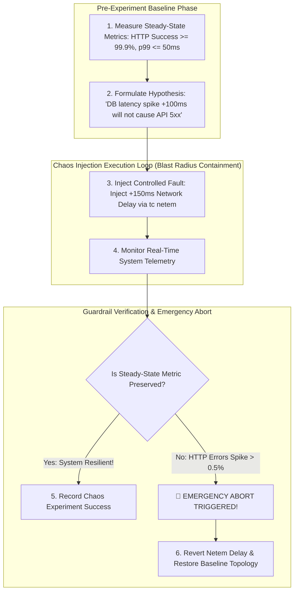

# Chaos Engineering Principles: Automated Failure Injection & Steady-State Verification

In large-scale cloud-native architectures (running across thousands of Kubernetes pods, cloud virtual machines, and microservices), hardware failures, network cable cuts, and memory leaks are not rare anomalies—they are **statistically guaranteed daily events**.

Waiting for a production outage to discover how your system behaves under network degradation is a recipe for catastrophic downtime.

To build resilient infrastructure, engineering teams practice **Chaos Engineering**.

Pioneered by Netflix with **Chaos Monkey** and formalized by tools like **Chaos Mesh**, **LitmusChaos**, and **Gremlin**, Chaos Engineering is the discipline of experimenting on a system to build confidence in its capability to withstand turbulent conditions in production.

This article details steady-state hypothesis definition, blast radius containment, failure injection mechanics, and automated emergency abort triggers.

---

## Chaos Experimentation & Emergency Abort Architecture

How automated Chaos Engineering frameworks run experiments while safeguarding production SLAs:



### Core Principles of Chaos Engineering
1. **Define 'Steady State' Metrics**: Before injecting any failure, establish a quantitative baseline of normal system behavior using high-level business metrics (e.g. successful checkout transactions per second, p99 API latency $\le 50\text{ms}$).
2. **Formulate Hypotheses**: State an explicit, testable prediction: *"Hypothesis: If we terminate $50\%$ of the Payment Microservice pods simultaneously, the API Gateway will reroute traffic to surviving pods within $2$ seconds with zero customer errors."*
3. **Minimize Blast Radius**: Always start chaos experiments in staging or low-traffic canary environments, gradually expanding blast radius to production only after building statistical confidence.
4. **Automated Emergency Abort Guardrails**: Chaos automation engines constantly evaluate steady-state metrics against safety thresholds. If steady-state metrics breach safety guardrails, the framework halts failure injection instantly and rolls back network changes.

---

## Python Implementation: Automated Chaos Experiment Engine

Here is a production-grade Python implementation of an Automated Chaos Experiment Framework featuring Network Latency Injection, Steady-State Metric Verification, and Emergency Abort Rollbacks:

```python
import time
import random
from typing import Dict, Any, Callable, List
from pydantic import BaseModel

class SystemMetrics(BaseModel):
    http_success_rate: float  # e.g., 0.999 = 99.9%
    p99_latency_ms: float

class ChaosExperimentConfig(BaseModel):
    experiment_name: str
    target_service: str
    injected_latency_ms: float
    duration_seconds: int = 5
    min_success_rate_threshold: float = 0.990
    max_p99_latency_threshold_ms: float = 200.0

class ChaosExperimentEngine:
    """
    Automated Chaos Engineering Experimentation Framework.
    """
    def __init__(self, config: ChaosExperimentConfig, telemetry_func: Callable[[], SystemMetrics]):
        self.config = config
        self.get_telemetry = telemetry_func
        self.is_fault_active = False

    def _inject_fault((self):
        self.is_fault_active = True
        print(f" 💣 [Fault Injection] Injected +{self.config.injected_latency_ms:.0f}ms network delay on service '{self.config.target_service}'.")

    def _rollback_fault(self):
        self.is_fault_active = False
        print(f" 🛡️ [Rollback] Restored normal network routing for service '{self.config.target_service}'.")

    def run_experiment(self) -> bool:
        print(f"\n🚀 Starting Chaos Experiment: '{self.config.experiment_name}'")
        print("=" * 75)

        # 1. Measure Baseline Steady State
        baseline = self.get_telemetry()
        print(f"📊 Baseline Steady-State -> Success Rate: {baseline.http_success_rate * 100:.2f}% | p99 Latency: {baseline.p99_latency_ms:.1f} ms")

        if baseline.http_success_rate < self.config.min_success_rate_threshold:
            print(" ❌ Experiment Aborted: Baseline system is not in a healthy steady state!")
            return False

        # 2. Inject Controlled Failure
        self._inject_fault()

        try:
            start_time = time.time()
            while time.time() - start_time < self.config.duration_seconds:
                time.sleep(1.0)
                current_metrics = self.get_telemetry()
                
                print(f" 👁️ [Telemetry Monitor] Success Rate: {current_metrics.http_success_rate * 100:.2f}% | p99 Latency: {current_metrics.p99_latency_ms:.1f} ms")

                # 3. Evaluate Guardrail Safety Rules
                if current_metrics.http_success_rate < self.config.min_success_rate_threshold or \
                   current_metrics.p99_latency_ms > self.config.max_p99_latency_threshold_ms:
                    print("\n 🚨 EMERGENCY ABORT TRIGGERED! System breached steady-state safety guardrails!")
                    self._rollback_fault()
                    return False

            print("\n ✅ Chaos Experiment PASSED! System successfully maintained steady state under fault injection.")
            self._rollback_fault()
            return True

        except Exception as e:
            self._rollback_fault()
            raise e

# Demonstration Execution
if __name__ == "__main__":
    # Mock Telemetry Generator
    is_chaos_running = False

    def mock_telemetry() -> SystemMetrics:
        if not is_chaos_running:
            return SystemMetrics(http_success_rate=0.999, p99_latency_ms=35.0)
        else:
            # Under chaos: simulate slight latency degradation, maintaining resilience
            return SystemMetrics(
                http_success_rate=random.choice([0.998, 0.997, 0.995]),
                p99_latency_ms=random.choice([110.0, 125.0, 140.0])
            )

    config = ChaosExperimentConfig(
        experiment_name="Payment Service Latency Spike Test",
        target_service="payment-api",
        injected_latency_ms=150.0,
        duration_seconds=3
    )

    runner = ChaosExperimentEngine(config, mock_telemetry)
    
    # Run test
    is_chaos_running = True
    runner.run_experiment()
```

---

## Chaos Engineering Gotchas & Best Practices

When running chaos experiments:

> [!IMPORTANT]
> **Notify Engineering Teams & On-Call Engineers**: Always broadcast upcoming chaos experiment schedules to engineering teams via automated Slack/Teams webhooks. Unannounced chaos experiments lead to wasted engineer triage during incident calls.

> [!CAUTION]
> **Do Not Run Chaos Experiments During Peak Traffic Windows**: Avoid scheduling failure injection during high-volume customer events (e.g. Cyber Monday or product launches) unless explicitly testing high-scale emergency failover readiness.

---

## Real-World Enterprise Impact
Organizations practicing automated Chaos Engineering (such as **Netflix**, **AWS**, and **Uber**) report:
* **Over 50% Reduction in Unplanned Outages**: Uncovering hidden configuration bugs and retry storms before they manifest as customer-facing incidents.
* **$10\times$ Faster Incident Recovery**: On-call engineers build confidence and familiarity with automated failover mechanics.
