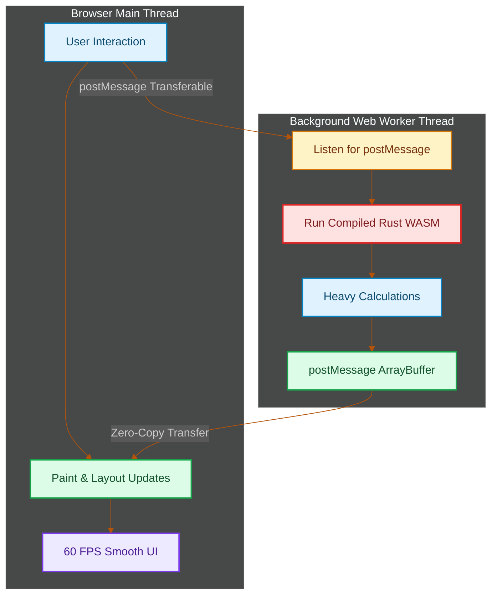

# Client-Side WebAssembly: Offloading Heavy Computations with Rust and Web Workers

> [!NOTE]
> **📖 Article Overview**
> Single-threaded JavaScript is excellent for building dynamic UIs, but it fails when tasked with heavy computations like real-time image processing, cryptography, or big data parsing. Running these tasks on the main thread causes dropped frames, layout freezes, and poor responsiveness. This article shows you how to bypass this bottleneck by compiling a high-performance **Rust module to WebAssembly (Wasm)**, spawning it inside a background **Web Worker**, and using **Transferable objects** to transfer large data buffers with zero-copy overhead.

---

## The Threading Bottleneck: Why the UI Freezes

The browser's main thread handles JavaScript execution, HTML parsing, CSS style calculation, and page layout updates [1]. If a script executes for more than 50 milliseconds (a "Long Task"), the browser delays rendering, causing noticeable lag.

To solve this, we offload intensive work using a two-pronged solution:
1. **Web Workers**: Background threads running parallel to the main thread, isolating execution.
2. **WebAssembly (Wasm)**: A binary format that compiles native languages (Rust/C++) into near-native execution speed.



---

## 1. Writing the Heavy Compute Module in Rust

First, we write a high-performance Rust library. In this example, we build a pixel-inversion filter (greyscale/invert) for raw image buffer manipulation using the `wasm-bindgen` crate.

```rust
// src/lib.rs
use wasm_bindgen::prelude::*;

#[wasm_bindgen]
pub fn invert_image_colors(mut pixels: Vec<u8>) -> Vec<u8> {
    // A raw RGBA image buffer has 4 channels per pixel: R, G, B, A
    let len = pixels.len();
    let mut i = 0;
    
    while i < len {
        pixels[i] = 255 - pixels[i];       // Invert Red
        pixels[i + 1] = 255 - pixels[i + 1]; // Invert Green
        pixels[i + 2] = 255 - pixels[i + 2]; // Invert Blue
        // pixels[i + 3] remains untouched (Alpha)
        i += 4;
    }
    
    pixels
}
```

We compile this module to WebAssembly using `wasm-pack`:
```bash
wasm-pack build --target no-modules
```

---

## 2. Running Wasm inside the Web Worker

Next, we write the Web Worker script (`image.worker.js`). By instantiating our Wasm module in a background worker, the main thread remains free to handle clicks, animations, and renders.

```javascript
// image.worker.js
importScripts('./pkg/rust_wasm_processor.js');

// 1. Initialise the Wasm module inside the Worker thread
const { invert_image_colors } = wasm_bindgen;

wasm_bindgen('./pkg/rust_wasm_processor_bg.wasm').then(() => {
  self.onmessage = (event) => {
    const { dataBuffer } = event.data;
    
    // Convert the incoming Transferable ArrayBuffer to a TypedArray
    const pixelArray = new Uint8Array(dataBuffer);
    
    // 2. Call the compiled Rust function
    const processedArray = invert_image_colors(pixelArray);
    
    // 3. Return the processed ArrayBuffer back to the main thread
    // We transfer the buffer to avoid cloning overhead
    self.postMessage(
      { processedBuffer: processedArray.buffer }, 
      [processedArray.buffer]
    );
  };
});
```

---

## 3. Main Thread Orchestration: Zero-Copy Transfer

When sending large datasets (like a 4K image buffer or millions of numeric records) to a Web Worker, standard serialization clones the data. This cloning blocks the main thread.

We solve this using **Transferable Objects** (like `ArrayBuffer`). Transferring data passes the memory reference, instantly making it unavailable on the sender's thread.

```javascript
// main.js
const worker = new Worker('image.worker.js');

// 1. Listen for results from the worker
worker.onmessage = (event) => {
  const { processedBuffer } = event.data;
  const processedPixels = new Uint8ClampedArray(processedBuffer);
  
  // Render the processed pixels back to a canvas element
  const imgData = new ImageData(processedPixels, width, height);
  canvasContext.putImageData(imgData, 0, 0);
};

function processLargeImage(rawImageBuffer) {
  // rawImageBuffer is an ArrayBuffer from a canvas or file
  
  // 2. Send the buffer as a Transferable
  // The second argument specifies the list of objects to transfer
  worker.postMessage(
    { dataBuffer: rawImageBuffer }, 
    [rawImageBuffer]
  );
  
  // At this point, rawImageBuffer.byteLength is now 0 on the main thread.
  // It has been cleanly moved to the Worker's memory space.
}
```

---

## Conclusion & Takeaways

To build high-performance client-side web platforms:
* [ ] **Never run computations on the main thread**: If it takes more than 16ms (1 frame at 60Hz) or 50ms (long task threshold), run it in a Web Worker.
* [ ] **Compile hot paths to Wasm**: Use Rust for tasks that require strict memory layouts or heavy mathematical operations.
* [ ] **Transfer, don't copy**: Always pass `ArrayBuffer` elements inside the second argument list of `postMessage` to avoid serialization delays.
* [ ] **Initialise Wasm lazily**: Do not load Wasm binaries on page boot; wait until the user triggers a compute-heavy feature to save network bandwidth. [2]

## References & Further Reading

1. **Axboe, J. (2019)**. *Efficient IO with io_uring*. kernel.dk. [https://kernel.dk/io_uring.pdf](https://kernel.dk/io_uring.pdf)
2. **Linux Kernel Community (2024)**. *BPF Documentation*. kernel.org. [https://docs.kernel.org/bpf/](https://docs.kernel.org/bpf/)
3. **Høiland-Jørgensen, T., et al. (2018)**. *The eXpress Data Path: Fast Programmable Packet Processing in the Operating System Kernel*. CoNEXT. [https://dl.acm.org/doi/10.1145/3281411.3281443](https://dl.acm.org/doi/10.1145/3281411.3281443)
4. **W3C WebAssembly Working Group (2024)**. *WebAssembly Core Specification*. W3C. [https://www.w3.org/TR/wasm-core-2/](https://www.w3.org/TR/wasm-core-2/)
5. **Lattner, C., & Adve, V. (2004)**. *LLVM: A Compilation Framework for Lifelong Program Analysis & Transformation*. CGO. [https://llvm.org/pubs/2004-01-30-CGO-LLVM.pdf](https://llvm.org/pubs/2004-01-30-CGO-LLVM.pdf)
6. **Cytron, R., et al. (1991)**. *Efficiently Computing Static Single Assignment Form and the Control Dependence Graph*. ACM TOPLAS. [https://doi.org/10.1145/115372.115320](https://doi.org/10.1145/115372.115320)
