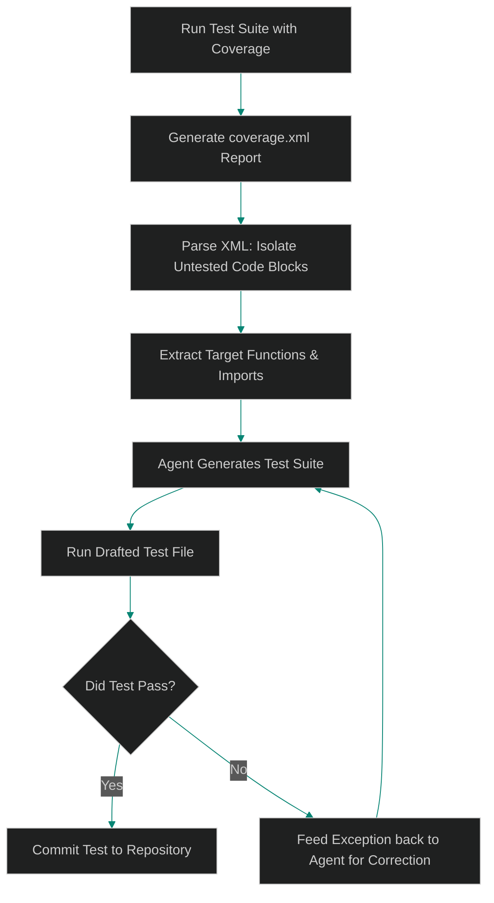

# Automated Integration Test Gen: Mapping Coverage Gaps to Agentic Test Builders

> [!NOTE]
> **📖 Article Overview**
> Writing tests is often neglected in fast-paced software development. However, high test coverage is the foundation of a reliable codebase. What if you didn't have to write them? In a self-evolving codebase, we build **Automated Test Builders**: agents that read test coverage reports, isolate untested code branches, generate mock assertions, and execute them to verify stability. In this article, we map testing gaps and implement a coverage-driven test generator in Python.

---

## Closing the Coverage Gap Autonomously

Manual unit test creation is repetitive: identifying class inputs, setting up mocks, checking output values, and verifying exceptions. 

An autonomous test generation pipeline automates this loop:
1. **Run Coverage Reports**: The pipeline executes existing tests and outputs a coverage report (such as `coverage.xml`).
2. **Parse Missing Lines**: The coverage parser scans the XML report, isolating files and line ranges that skipped execution.
3. **Draft Contextual Tests**: The agent takes the target file code block, reviews the untested logic, and writes mock unit assertions.
4. **Execute and Validate**: The generated test is run inside a test harness. If it passes without exceptions, it is committed to the repository.



---

## 1. Under the Hood: Isolating Gaps in `coverage.xml`

A typical `coverage.xml` generated by coverage tools structures report data hierarchically:
* **Packages**: Folders containing codebase structures.
* **Classes**: Specific Python files.
* **Methods & Lines**: Lists of code lines indicating whether they were executed (`hits="1"`) or missed (`hits="0"`).

By parsing this XML tree, we can programmatically isolate line ranges where `hits="0"`.

---

## 2. Assembling Contextual Prompt Payloads

To draft a correct unit test, the agent needs more than just the missed code lines. It needs the surrounding **context**:
* **Imports**: Standard library imports required by the target function.
* **Class Definitions**: The structural class containing the function.
* **Mock Requirements**: If the code interfaces with an external database or network client, the agent must write mock mock-assertions.

---

## Code Demo: Coverage-Driven Test Generator

Below is a Python script modeling a coverage parser. It reads simulated XML coverage data, identifies skipped lines, extracts the code context, and drafts a mock unit test code structure.

```python
import xml.etree.ElementTree as ET
from typing import Dict, Any, List, Tuple

# Mock coverage.xml content representing an untested function in billing.py
MOCK_COVERAGE_XML = """<?xml version="1.0" ?>
<coverage version="7.0">
    <packages>
        <package name="core">
            <classes>
                <class name="billing.py" filename="core/billing.py">
                    <methods/>
                    <lines>
                        <line number="1" hits="1"/>
                        <line number="2" hits="1"/>
                        <line number="3" hits="1"/>
                        <line number="4" hits="0"/>
                        <line number="5" hits="0"/>
                    </lines>
                </class>
            </classes>
        </package>
    </packages>
</coverage>
"""

# Mock content of core/billing.py
MOCK_BILLING_CODE = """def apply_discount(price: float, discount_code: str) -> float:
    if discount_code == "SUPER_DEAL":
        return price * 0.5
    return price
"""

class CoverageParser:
    @staticmethod
    def parse_missed_lines(xml_content: str) -> List[int]:
        missed_lines = []
        root = ET.fromstring(xml_content)
        
        # Traverse XML to find lines with hits="0"
        for line in root.findall(".//line"):
            if line.attrib.get("hits") == "0":
                missed_lines.append(int(line.attrib.get("number")))
        return missed_lines

class AgentTestBuilder:
    def __init__(self, code: str):
        self.lines = code.strip().split("\n")

    def extract_context(self, line_numbers: List[int]) -> str:
        # Extract the line blocks from the file using 1-indexed line bounds
        extracted_lines = []
        for line_num in line_numbers:
            if 1 <= line_num <= len(self.lines):
                extracted_lines.append(f"{line_num}: {self.lines[line_num - 1]}")
        return "\n".join(extracted_lines)

    def draft_test_structure(self, file_path: str, context_code: str) -> str:
        # Generate the test assertion file template
        test_code = f"""import pytest
from {file_path.replace('.py', '').replace('/', '.')} import apply_discount

def test_apply_discount_logic():
    # Automated test verifying missed branch coverage
    # Original Context:
    # {context_code.replace(chr(10), chr(10) + '# ')}
    
    assert apply_discount(100.0, "SUPER_DEAL") == 50.0
    assert apply_discount(100.0, "INVALID") == 100.0
"""
        return test_code

if __name__ == "__main__":
    # 1. Parse coverage XML
    missed = CoverageParser.parse_missed_lines(MOCK_COVERAGE_XML)
    print(f"🔍 [Coverage Gateway] Identified missed line numbers: {missed}")

    # 2. Extract code context
    builder = AgentTestBuilder(MOCK_BILLING_CODE)
    context = builder.extract_context(missed)
    print("\n--- Extracted Missed Code Context ---")
    print(context)

    # 3. Draft test suite
    test_file_content = builder.draft_test_structure("core/billing.py", context)
    print("\n--- Drafted Test Suite code ---")
    print(test_file_content)
```

---

## Architectural Guidelines for Team Leads

* **Integrate with CI/CD**: Run coverage parsers directly inside pull requests. If a developer's branch drops coverage below the target threshold, trigger the agent to write the missing tests automatically.
* **Isolate Test Execution**: Execute generated tests in secure, isolated Docker sandboxes to prevent test loops from executing dangerous OS modifications.
* **Mock External Network Calls**: Configure standard mock handlers for database adapters or HTTP libraries to prevent tests from executing real database writes.
