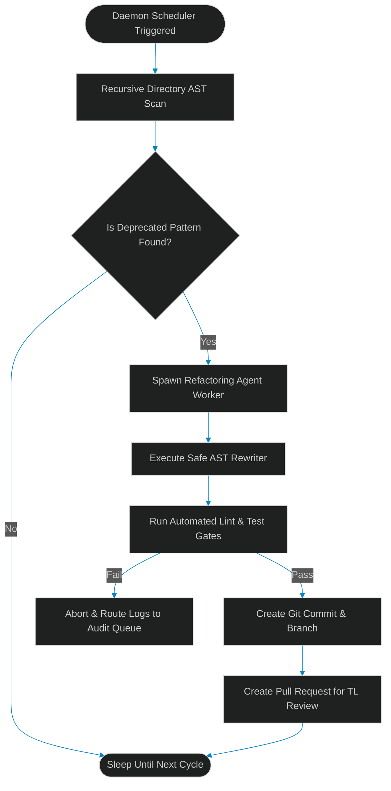

# Continuous Repository Modernization: Designing Daemon Agents for Ongoing Refactoring

> [!NOTE]
> **📖 Article Overview**
> In traditional engineering, codebases rot gradually. Outdated API libraries, deprecated syntax patterns, and obsolete import styles pile up as technical debt because developers are focused on shipping new features. Transitioning to a **Self-Evolving Codebase** solves this by utilizing **Daemon Agents**: autonomous background processes that continuously audit directories, locate code smells using AST checks, rewrite files safely, and submit structured refactoring pull requests. In this article, we design a continuous modernization pipeline and implement an AST refactoring daemon in Python.

---

## The Silent Creep of Code Rot

Every time a library releases a new version, or a team updates its style guide, the repository accumulates technical debt. Manual refactoring is expensive, and developers rarely prioritize updating legacy files.

Instead of running agents on-demand (which requires developer context switches), we can deploy a **Continuous Modernization Daemon**. The daemon runs in the background of your VCS (Version Control System), scanning code structures, upgrading imports, and cleaning codebase paths incrementally.



---

## 1. Under the Hood: AST-Based Detection vs. Regular Expressions

Many developers use regex for codebase-wide search and replace (e.g. `sed`). This is highly fragile under varying spacing, comments, or multi-line function declarations.
* **Abstract Syntax Tree (AST) Parsing**: We use Python's built-in `ast` module to parse files into structural node trees. This allows us to locate specific class targets, function calls, or imports, regardless of how they are formatted.
* **Isolated Refactoring**: Once the target AST nodes are isolated, the rewriter agent updates the code context, reconstructs the file, and runs standard formatting checks (like `black` or `yapf`) to ensure styling consistency.

---

## 2. Setting up Non-Interfering Background Daemons

Running daemons in production requires strict resource constraints:
1. **Low-CPU Scheduling**: Running scans inside low-priority system threads to prevent background jobs from resource-starving human developer workspaces or build nodes.
2. **Paced Commits**: Restricting the daemon to submit at most one PR per module per day to prevent flooding human peer reviewers.
3. **Strict Sandboxing**: Writing refactored file changes inside isolated environments to prevent execution loops from modifying critical system modules.

---

## Code Demo: Continuous AST Refactoring Daemon

Below is a Python implementation of a background rewriter daemon. It scans a directory, parses files into AST structures, identifies outdated log function usage, refactors the code to use a modern log configuration, and verifies compilation.

```python
import os
import ast
import sys
from typing import List, Dict, Any

class DeprecatedLoggerVisitor(ast.NodeVisitor):
    """
    AST Visitor to scan files for occurrences of deprecated 'old_logger.log_info()' calls.
    """
    def __init__(self):
        self.found_deprecation = False

    def visit_Call(self, node: ast.Call):
        # We look for a call to old_logger.log_info(...)
        if isinstance(node.func, ast.Attribute):
            if isinstance(node.func.value, ast.Name) and node.func.value.id == "old_logger":
                if node.func.attr == "log_info":
                    self.found_deprecation = True
        self.generic_visit(node)

class ASTLoggerRefactorer:
    @staticmethod
    def refactor_code(content: str) -> str:
        # In a production agentic system, an LLM would execute code transformations
        # on isolated AST contexts. Here we model the direct structural replacement.
        transformed = content.replace("import old_logger", "import logging")
        transformed = transformed.replace("old_logger.log_info", "logging.info")
        return transformed

class ModernizationDaemon:
    def __init__(self, target_dir: str):
        self.target_dir = target_dir
        self.refactorer = ASTLoggerRefactorer()

    def run_modernization_cycle(self) -> List[Dict[str, Any]]:
        print(f"📁 [Daemon] Initiating directory scan: {self.target_dir}")
        reports = []

        for root, _, files in os.walk(self.target_dir):
            for file in files:
                if file.endswith(".py"):
                    filepath = os.path.join(root, file)
                    report = self.process_file(filepath)
                    reports.append(report)
        return reports

    def process_file(self, filepath: str) -> Dict[str, Any]:
        with open(filepath, "r", encoding="utf-8") as f:
            content = f.read()

        # Parse file into AST
        try:
            tree = ast.parse(content)
        except SyntaxError as e:
            return {"file": filepath, "status": "COMPILATION_ERROR", "detail": str(e)}

        # Check for deprecations
        visitor = DeprecatedLoggerVisitor()
        visitor.visit(tree)

        if not visitor.found_deprecation:
            return {"file": filepath, "status": "CLEAN", "detail": "No deprecated logging patterns found."}

        print(f"⚙️ [Daemon] Found deprecated logger in {os.path.basename(filepath)}. Executing refactoring...")
        
        # Execute structural rewrite
        modified_content = self.refactorer.refactor_code(content)

        # Validate compilation of rewritten code
        try:
            ast.parse(modified_content)
            # Write changes back
            with open(filepath, "w", encoding="utf-8") as f:
                f.write(modified_content)
            return {"file": filepath, "status": "REFACTORED", "detail": "Successfully migrated old_logger to standard logging."}
        except SyntaxError as e:
            return {"file": filepath, "status": "FAILED_VERIFICATION", "detail": str(e)}

if __name__ == "__main__":
    # Create mock legacy directory
    temp_dir = "./legacy_mock_repo"
    os.makedirs(temp_dir, exist_ok=True)
    
    test_file = os.path.join(temp_dir, "app.py")
    with open(test_file, "w") as f:
        f.write("""import old_logger

def initialize_system():
    old_logger.log_info("System initialization started.")
    return True
""")

    # Run Daemon modernization run
    daemon = ModernizationDaemon(temp_dir)
    reports = daemon.run_modernization_cycle()

    print("\n--- Daemon Modernization Cycle Report ---")
    for r in reports:
        print(f"File: {os.path.basename(r['file'])} | Status: **{r['status']}**")
        print(f"   Detail: {r['detail']}")

    # Clean up test directories
    if os.path.exists(test_file):
        os.remove(test_file)
    if os.path.exists(temp_dir):
        os.rmdir(temp_dir)
```

---

## Architectural Guidelines

* **AST Verification Over Regex**: Never use string replacements or regex scripts to perform codebase-wide refactoring. Enforce structural AST parsing to avoid syntax failures.
* **Decouple Daemon Scheduling**: Run modernization runs in background worker cron tasks during off-peak traffic hours to minimize build pipeline congestion.
* **Enforce Strict Linters**: Hook up formatting checks (`black`, `ruff`) directly after code modification to ensure agent edits match the team's coding standard.
