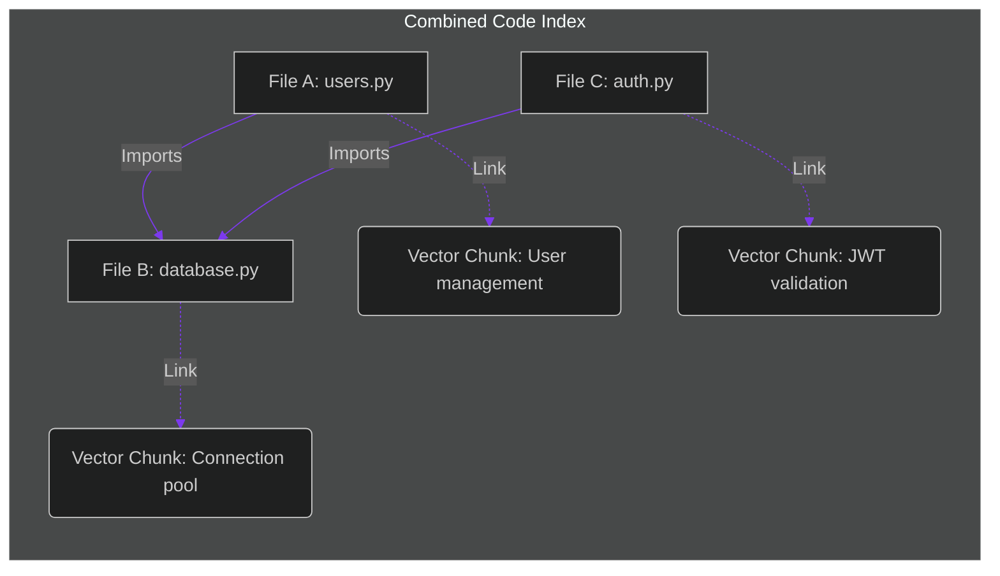

# Semantic Graph Indexing: Mapping Code Dependencies for Large-Scale Agent Refactoring

> [!NOTE]
> **📖 Article Overview**
> Traditional Retrieval-Augmented Generation (RAG) splits text documents into isolated chunks and retrieves them using vector database search. When applied to codebase refactoring, this naive approach fails: changing a class signature in File A might silently break imports in File B and File C which are not semantically similar to the query. In this article, we analyze the limitations of vector search for code, design a **Semantic Graph Indexing** system that merges embeddings with AST dependency graphs, and implement a dependency query parser in Python.

---

## Why Vector Search Fails for Codebases

Vector embeddings capture semantic similarity (e.g. mapping "charge customer" to "process invoice"). However, software systems are governed by strict **structural relationships** (imports, inheritances, dependency trees):

* **The Cascading Signature Bug**: If an agent refactors a billing class method in `billing.py`, it must locate every file that imports and invokes that class. If those files describe other business logic (e.g. `report_generator.py`), vector search will miss them due to low semantic similarity.
* **Context Fragmentation**: Splitting code files into arbitrary character chunks strips out scope lines, import blocks, and decorator wrappers, leaving the model with unparseable fragments.
* **The Solution**: **Semantic Graph Indexing**. We index code chunks in a vector database for semantic search, and map their relationships (e.g. `FileA -> imports -> FileB`) in a Graph Database or adjacency list using AST parsing.



By traversing the dependency graph, a refactoring agent can identify every file that imports a modified module, ensuring zero compilation errors across the codebase.

---

## 1. Extracting Dependencies Natively via AST

Using standard regex to track imports (e.g., `import X`) fails when imports are aliased, nested inside functions, or spread across multi-line blocks.
* **Abstract Syntax Tree parsing**: We parse Python files using the `ast` module, scanning specifically for `ast.Import` and `ast.ImportFrom` nodes. This guarantees exact detection of dependency mappings.

---

## 2. Querying the Code Graph

When an agent plans a refactoring modification:
1. **Semantic Search**: The agent queries the vector store to locate the class or module to refactor.
2. **Graph Traversal**: The gateway queries the dependency graph to retrieve the list of files that import the target class.
3. **Context Assembly**: The gateway injects the target file *plus* its parent dependency files into the agent's context window, allowing the agent to refactor the entire import chain in a single pass.

---

## Code Demo: AST-Driven Codebase Dependency Parser

Below is a Python implementation of a dependency graph indexer. It parses Python file structures using AST, maps import connections, formats an adjacency graph, and provides a utility to retrieve all dependent files.

```python
import ast
import sys
from typing import Dict, List, Set, Any

class CodeDependencyGraph:
    def __init__(self):
        # Adjacency list: {file_path: set(imported_modules)}
        self.dependencies: Dict[str, Set[str]] = {}

    def add_file(self, file_path: str, content: str):
        self.dependencies[file_path] = set()
        try:
            tree = ast.parse(content)
            for node in ast.walk(tree):
                # Match standard 'import x' statements
                if isinstance(node, ast.Import):
                    for alias in node.names:
                        self.dependencies[file_path].add(alias.name)
                # Match 'from x import y' statements
                elif isinstance(node, ast.ImportFrom) and node.module:
                    self.dependencies[file_path].add(node.module)
        except SyntaxError as e:
            print(f"❌ Syntax error parsing {file_path}: {e}")

    def find_dependent_files(self, module_name: str) -> List[str]:
        # Locate all files that import the target module
        dependents = []
        for file_path, imports in self.dependencies.items():
            if module_name in imports:
                dependents.append(file_path)
        return dependents

if __name__ == "__main__":
    graph = CodeDependencyGraph()

    # Define mock file structure
    files = {
        "core/database.py": """
def get_connection():
    return "DB_CONNECTION_OK"
""",
        "core/billing.py": """
import core.database
def process_invoice():
    db = core.database.get_connection()
    return "PROCESSED"
""",
        "api/endpoints.py": """
from core import database
def get_status():
    return database.get_connection()
"""
    }

    # Populate dependency graph
    print("🕸️ Indexing codebase dependency graph...")
    for path, code in files.items():
        graph.add_file(path, code)
        print(f"   Indexed: {path}")

    # Query: If we refactor core/database.py, which files might break?
    target_module = "core.database"
    breaking_risks_1 = graph.find_dependent_files(target_module)
    print(f"\n🔍 Query: Which files import '{target_module}'?")
    print(f"👉 Files to Audit: {breaking_risks_1}")

    target_module_2 = "core"
    breaking_risks_2 = graph.find_dependent_files(target_module_2)
    print(f"\n🔍 Query: Which files import '{target_module_2}'?")
    print(f"👉 Files to Audit: {breaking_risks_2}")
```

---

## Architectural Guidelines

* **Combine Graph & Vector Indices**: Never rely on vector search alone to locate codebase contexts. Maintain a graph index of imports alongside your vector metadata.
* **Keep the Graph Up-to-Date**: Run AST parsers in git hooks (pre-commit or pre-merge) to update your codebase dependency graphs automatically as files are created or deleted.
* **Use Graph DBs at Scale**: For large monorepos exceeding 10,000 files, load your AST dependency nodes into Neo4j or pgrouting tables to enable sub-millisecond query execution.
