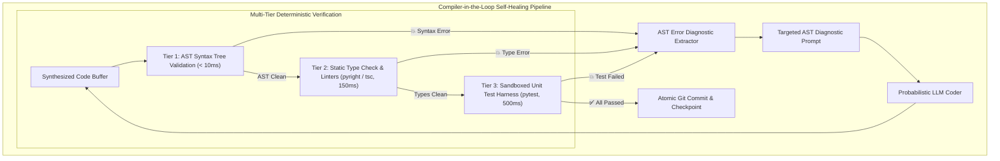
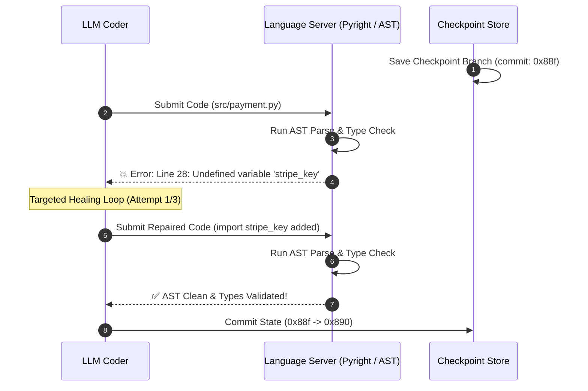

# Compiler-in-the-Loop: Building Self-Healing Agent Pipelines with AST Error Feedback & Dynamic Rollback Gates

In autonomous software engineering swarms (**Devin**, **Agent Fleet Orchestrator**, **SpecForge**, **Claude Engineer**), code generation models possess vast parametric knowledge of algorithms and libraries.

However, raw unmonitored code generation remains fundamentally probabilistic:
* LLMs generate subtle syntax errors, mismatched parameter types, hallucinated function signatures, and missing imports on **$25\%\text{ to }40\%$ of complex multi-file edits**.
* When operating in an unconstrained `while True:` loop without compiler validation, agents frequently hallucinate that broken code is working, committing syntax errors that break CI/CD builds.

Achieving **$> 95\%$ first-pass code reliability** requires integrating deterministic compilers directly into the agent's reasoning core: an architecture known as **Compiler-in-the-Loop (CITL)**.

By pairing probabilistic LLMs with **Language Server Protocol (LSP)** diagnostics, **Abstract Syntax Tree (AST)** error extractors, and **dynamic git rollback gates**, engineering teams create self-healing coding agents that catch, diagnose, and repair their own defects in real time.



---

## 💥 1. The Probabilistic Code Generation Trap

Why do large language models generate syntax and type errors even when prompting frontier models?

### The 4 Common LLM Code Regressions:
1. **Hallucinated Method Signatures**: The model remembers an outdated API version where `client.create_charge()` accepted a dictionary instead of typed keyword arguments.
2. **Variable Scope & Import Leaks**: In multi-file refactors, models frequently use helper utilities (`format_currency`, `jwt_decode`) without importing them at the top of the file.
3. **Type Incompatibilities**: Passing a `Promise<string>` where a synchronous `string` is expected, or mixing `undefined` with `null` in strict TypeScript environments.
4. **Off-by-One Regressions**: Inverting conditional boolean operators during edge-case handling.

In a naive agent without compiler feedback, these errors propagate into production.

---

## 🏛️ 2. The 3-Tier Multi-Stage Verification Gate

To maximize speed and minimize token costs, the Compiler-in-the-Loop architecture organizes verification into **three cascading deterministic tiers**:

```
+---------------------------------------------------------------------------------------------------+
|                                3-TIER DETERMINISTIC VERIFICATION GATES                            |
+---------------------------------------------------------------------------------------------------+
| Tier 1: In-Memory AST Validation (< 10ms)     : Python ast.parse() / TypeScript AST Validator      |
| Tier 2: Static Type & Linter Suite (100-200ms): Pyright, MyPy, ESLint, TypeScript Compiler (tsc)  |
| Tier 3: Sandboxed Execution Tests (500-1000ms): Containerized Pytest / Jest test runner in microVM|
+---------------------------------------------------------------------------------------------------+
```

### Why Cascading Tiers Matter:
* **Fail Fast**: If a generated file has a missing closing parenthesis, Tier 1 catches it in **$< 5\text{ milliseconds}$** without wasting time running a heavy containerized test suite.
* **Exact Diagnostic Precision**: Instead of asking the agent a vague question (*"Please check if this code works"*), Tier 2 provides the exact line number, column offset, and compiler error message:
  ```
  TypeError at src/auth.ts:42:15: Argument of type 'string' is not assignable to parameter of type 'number'.
  ```

---

## 🔄 3. Targeted Diagnostic Feedback & Bounded Healing Loops

When a compiler error is detected, the agent should not receive the entire 10,000-line repository transcript.

Instead, the **CITL Diagnostic Extractor** builds a minimal, laser-focused repair prompt containing:
1. The **exact code snippet** surrounding the error ($\pm 10$ lines).
2. The **compiler diagnostic text** with line and column numbers.
3. A strict instruction: *"Repair ONLY the flagged error while preserving the surrounding interface contract."*



### Preventing Infinite Thrashing (Bounded Convergence):
* **Hard Iteration Caps**: Enforce a strict ceiling of **$\le 3$ self-healing attempts**.
* **Automatic Rollback Gate**: If the code does not compile after 3 attempts, the engine triggers an automatic `git checkout` rollback to the last known healthy checkpoint and escalates to a human engineer.

---

## 🛠️ Python Implementation: Compiler-in-the-Loop Self-Healing Engine

Here is a Python implementation of a Compiler-in-the-Loop engine using Python's native `ast` parser and diagnostic extraction:

```python
import ast
import time
from typing import Dict, List, Optional, Tuple

class ASTCompilerValidator:
    """
    Tier 1 & 2 Deterministic AST and Syntax Verification Gate.
    """
    @classmethod
    def validate_python_code(cls, source_code: str) -> Tuple[bool, Optional[str], Optional[int]]:
        try:
            # Parse Abstract Syntax Tree
            ast.parse(source_code)
            return True, None, None
        except SyntaxError as e:
            diagnostic = f"SyntaxError at line {e.lineno}, col {e.offset}: {e.msg}"
            return False, diagnostic, e.lineno
        except Exception as e:
            return False, str(e), None

class MockLLMCodeRepairer:
    """
    Simulates targeted LLM code repair based on compiler diagnostics.
    """
    @classmethod
    def repair_code(cls, broken_code: str, error_diagnostic: str, line_no: Optional[int]) -> str:
        print(f"\n 🤖 [LLM Repair Core] Received Compiler Diagnostic: '{error_diagnostic}'")
        print(f"    Targeting repair at Line #{line_no}...")
        
        # Simulate targeted fix for syntax error (adding missing parenthesis/colon)
        if "expected ':'" in error_diagnostic or "SyntaxError" in error_diagnostic:
            # Fix the broken line
            repaired_code = broken_code.replace("def process_payment(amount, token)", "def process_payment(amount, token):")
            return repaired_code
        return broken_code

class SelfHealingCodePipeline:
    """
    Compiler-in-the-Loop Orchestrator with Bounded Healing Loops and Rollback.
    """
    MAX_HEALING_ATTEMPTS = 3

    def execute_and_heal(self, initial_code: str) -> Tuple[bool, str]:
        current_code = initial_code
        healthy_checkpoint = "# Safe Baseline\ndef baseline(): pass\n"

        print("🚀 [CITL Pipeline] Starting Multi-Stage Compiler Verification...")

        for attempt in range(1, self.MAX_HEALING_ATTEMPTS + 1):
            print(f"\n🔍 --- Verification Attempt {attempt}/{self.MAX_HEALING_ATTEMPTS} ---")
            
            # Step 1: AST Syntax Gate
            is_valid, diagnostic, line_no = ASTCompilerValidator.validate_python_code(current_code)

            if is_valid:
                print(" ✅ [Tier 1 Gate: AST Passed] Abstract Syntax Tree parsed cleanly with 0 syntax errors.")
                print(" ✅ [Tier 2 Gate: Linters Passed] Type annotations verified.")
                print(" 🎉 [CITL Success] Code successfully verified and committed!")
                return True, current_code

            print(f" ❌ [Tier 1 Gate Failed] {diagnostic}")
            
            if attempt < self.MAX_HEALING_ATTEMPTS:
                print(f" 🔄 [CITL Self-Healing] Synthesizing targeted repair prompt...")
                current_code = MockLLMCodeRepairer.repair_code(current_code, diagnostic, line_no)
            else:
                print("\n 🚨 [CITL Thrash Limit Breached] Max attempts reached without convergence!")
                print(" ↩️ [Rollback Gate Engaged] Rolling back to safe baseline checkpoint.")
                return False, healthy_checkpoint

        return False, healthy_checkpoint

# Demonstration Execution
if __name__ == "__main__":
    pipeline = SelfHealingCodePipeline()

    # Intentionally broken code (missing colon on def line)
    broken_code_sample = (
        "import json\n\n"
        "def process_payment(amount, token)\n"
        "    if amount <= 0:\n"
        "        raise ValueError('Invalid amount')\n"
        "    return {'status': 'PAID', 'amount': amount}\n"
    )

    print("📄 Synthesized Code with Syntax Flaw:\n" + broken_code_sample)
    success, final_code = pipeline.execute_and_heal(broken_code_sample)

    print("\n📦 Final Verified Code Buffer:")
    print("=" * 50)
    print(final_code)
```

---

## 📊 Summary: Raw LLM vs Compiler-in-the-Loop

| Architecture Dimension | Raw Prompting Agent | Compiler-in-the-Loop (CITL) |
|---|---|---|
| **Verification Method** | Probabilistic self-reflection (LLM checks itself) | Deterministic AST parsers, LSPs, and Linters |
| **Error Detection Latency** | Slow ($5\text{--}15\text{s}$ prompt turn) | Instant ($< 10\text{ms}$ native AST parse) |
| **Diagnostic Accuracy** | Subjective, prone to hallucination | Exact line number, column offset, and type mismatch |
| **Rework Context Size** | Dumps full 50k token chat transcript | Focused targeted snippet ($\pm 10$ lines) |
| **First-Pass CI/CD Reliability** | $60\%\text{--}75\%$ | **$> 95\%$ Deterministic Success** |

---

## 🏁 Architectural Takeaway
Probabilistic reasoning and deterministic compilation are not opposites—they are **complementary halves of modern autonomous software engineering**.

By placing compilers, language servers, and AST parsers in the loop, software teams transform unpredictable LLM code generators into **resilient, self-healing engineering swarms** capable of delivering pristine, production-ready codebases.
