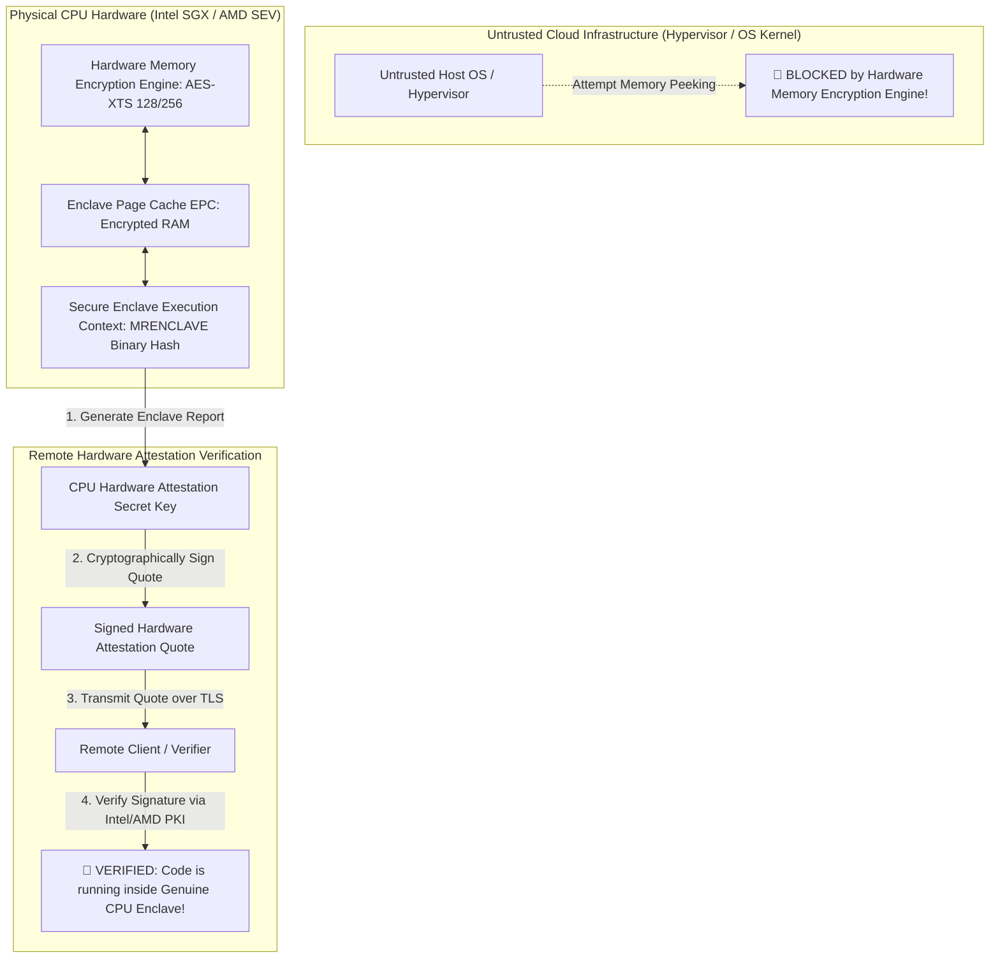

# Confidential Computing & Secure Enclaves: Intel SGX, AMD SEV & Hardware Attestation

In multi-tenant public cloud environments (AWS, Azure, Google Cloud), organizations deploy sensitive workloads (financial analytics, healthcare records, proprietary AI models).

Standard security protocols encrypt **Data-at-Rest** (disk encryption) and **Data-in-Transit** (TLS encryption).

However, during active execution, **Data-in-Use** remains exposed in plaintext RAM. A compromised host operating system, a rogue hypervisor administrator, or a malicious cloud tenant can inspect host memory buffers to extract secret cryptographic keys and customer data.

To protect Data-in-Use from untrusted cloud infrastructure, modern hardware platforms employ **Confidential Computing**.

Pioneered by **Intel SGX (Software Guard Extensions)** and **AMD SEV-SNP (Secure Encrypted Virtualization)**, Confidential Computing creates hardware-isolated **Secure Enclaves** where memory is transparently encrypted at hardware speeds by the CPU controller.

This article details Enclave Page Cache (EPC) encryption, AMD SEV-SNP memory isolation, and Remote Hardware Attestation.

---

## Confidential Computing & Remote Attestation Architecture

How Secure Enclaves isolate memory and provide cryptographic Remote Attestation quotes to verify binary integrity:



### Core Confidential Computing Principles
1. **Hardware Memory Encryption Engine (MEE)**: The CPU contains a dedicated hardware encryption engine positioned between the L3 cache and external DRAM controllers. All memory reads and writes crossing the CPU die boundary are dynamically encrypted and decrypted using hardware AES-XTS keys, rendering physical RAM sniffing useless.
2. **Intel SGX (Application-Level Enclaves)**: Isolates specific user-space code and data into **Enclaves** inside dedicated Enclave Page Cache (EPC) memory. Even if the host OS kernel (`root`) is fully compromised, it cannot read or write to EPC memory pages.
3. **AMD SEV-SNP (VM-Level Encryption)**: Encrypts the entire virtual machine (VM) memory space using unique per-VM hardware keys. SEV-SNP (Secure Nested Paging) adds hardware memory integrity protection, preventing the hypervisor from replaying or corrupting VM memory pages.
4. **Remote Hardware Attestation**: How does a remote client trust that its sensitive code is actually running inside a secure enclave on a remote server?
   * The enclave generates a report containing a cryptographic hash of its binary code layout (`MRENCLAVE`).
   * The physical CPU signs this report using its burnt-in hardware **Attestation Key (AK)**.
   * The client verifies the signature against Intel/AMD Root Certificate Authorities (CAs). If valid, the client proves that the binary is un-tampered and running inside a genuine hardware enclave before sending secret decryption keys!

---

## Python Implementation: Hardware Attestation & Enclave Encryption Engine

Here is a production-grade Python implementation of a Confidential Computing Enclave Memory Encryption Engine and Remote Hardware Attestation Simulator:

```python
import hmac
import hashlib
import json
from typing import Dict, Optional
from pydantic import BaseModel

class EnclaveReport(BaseModel):
    mrenclave_hash: str     # Cryptographic hash of enclave binary code
    user_data_hash: str     # Hash of client challenge / public key
    cpu_serial: str

class SignedAttestationQuote(BaseModel):
    report: EnclaveReport
    signature: str          # Hardware CPU Attestation Key signature

class ConfidentialEnclaveEngine:
    """
    Simulates Intel SGX / AMD SEV Secure Enclave Memory Isolation & Hardware Attestation.
    """
    def __init__(self, enclave_binary_code: bytes, cpu_attestation_key: bytes = b"INTEL_SGX_CPU_KEY_99"):
        self.cpu_attestation_key = cpu_attestation_key
        # MRENCLAVE: Calculate binary hash measurement
        self.mrenclave = hashlib.sha256(enclave_binary_code).hexdigest()
        self.epc_encrypted_memory: Dict[str, str] = {}  # Encrypted RAM storage

    def write_enclave_memory(self, key: str, plaintext: str):
        """Simulates Hardware Memory Encryption Engine (MEE) AES Write."""
        # AES-XTS Encryption Simulation
        cipher_bytes = hashlib.sha256(plaintext.encode() + b"_EPC_SECRET_KEY").hexdigest()
        self.epc_encrypted_memory[key] = cipher_bytes
        print(f" 🔒 [Hardware MEE] Encrypted Plaintext '{plaintext}' -> EPC RAM Cipher: {cipher_bytes[:16]}...")

    def generate_attestation_quote(self, client_challenge: str) -> SignedAttestationQuote:
        """
        Generates a Signed Hardware Attestation Quote for Remote Verification.
        """
        challenge_hash = hashlib.sha256(client_challenge.encode()).hexdigest()
        report = EnclaveReport(
            mrenclave_hash=self.mrenclave,
            user_data_hash=challenge_hash,
            cpu_serial="INTEL-XEON-SGX-8400"
        )
        
        # CPU Hardware Signs Report with Internal Attestation Key
        report_bytes = json.dumps(report.model_dump(), sort_keys=True).encode()
        signature = hmac.new(self.cpu_attestation_key, report_bytes, hashlib.sha256).hexdigest()

        print(f" 📜 [Enclave Attestation] Generated Hardware Quote (MRENCLAVE: {self.mrenclave[:12]}...)")
        return SignedAttestationQuote(report=report, signature=signature)

class RemoteAttestationVerifier:
    """
    Simulates Remote Client verifying Hardware Attestation Quotes.
    """
    def __init__(self, trusted_cpu_key: bytes = b"INTEL_SGX_CPU_KEY_99"):
        self.trusted_cpu_key = trusted_cpu_key

    def verify_quote(self, quote: SignedAttestationQuote, expected_mrenclave: str, original_challenge: str) -> bool:
        print("\n🔍 [Remote Verifier] Validating Hardware Attestation Quote...")
        
        # 1. Verify CPU Hardware Signature
        report_bytes = json.dumps(quote.report.model_dump(), sort_keys=True).encode()
        expected_sig = hmac.new(self.trusted_cpu_key, report_bytes, hashlib.sha256).hexdigest()

        if quote.signature != expected_sig:
            print(" ❌ Verification FAILED: Invalid CPU Hardware Signature!")
            return False

        # 2. Verify Binary Measurement (MRENCLAVE)
        if quote.report.mrenclave_hash != expected_mrenclave:
            print(f" ❌ Verification FAILED: Code Hash Mismatch! Got {quote.report.mrenclave_hash[:12]}, Expected {expected_mrenclave[:12]}")
            return False

        # 3. Verify Challenge Freshness
        expected_challenge_hash = hashlib.sha256(original_challenge.encode()).hexdigest()
        if quote.report.user_data_hash != expected_challenge_hash:
            print(" ❌ Verification FAILED: Challenge Hash Mismatch (Replay Attack Detected)!")
            return False

        print(" 🎉 [Attestation SUCCESS] Code is 100% genuine and running inside hardware-isolated Enclave!")
        return True

# Demonstration Execution
if __name__ == "__main__":
    enclave_code = b"def process_patient_records(): return decrypt_ssn()"
    enclave = ConfidentialEnclaveEngine(enclave_binary_code=enclave_code)
    verifier = RemoteAttestationVerifier()

    print("🚀 Demonstrating Confidential Computing & Remote Hardware Attestation...")
    print("=" * 75)

    # 1. Enclave Stores Secret in Memory (Hardware Encrypted)
    enclave.write_enclave_memory("patient_101_ssn", "999-00-1234")

    # 2. Remote Client sends Challenge for Attestation
    challenge = "random_nonce_98765"
    quote = enclave.generate_attestation_quote(client_challenge=challenge)

    # 3. Client Verifies Attestation Quote
    expected_mrenclave = hashlib.sha256(enclave_code).hexdigest()
    is_valid = verifier.verify_quote(quote, expected_mrenclave=expected_mrenclave, original_challenge=challenge)
```

---

## Confidential Computing Gotchas & Best Practices

When building enclave applications:

> [!IMPORTANT]
> **Mitigate Side-Channel Cache Attacks (Controlled-Channel Attacks)**: Untrusted host operating systems control enclave page tables and interrupts. If an enclave accesses memory in secret-dependent patterns, the host kernel can infer secret keys by observing page faults or L3 cache misses (**Use Constant-Time Enclave Algorithms**).

> [!CAUTION]
> **Minimize Enclave Trusted Computing Base (TCB)**: Do not link entire monolithic web frameworks inside an SGX enclave. The larger the binary code base inside the enclave, the higher the likelihood of introducing memory vulnerabilities that compromise the enclave boundary.

---

## Real-World Enterprise Impact
Confidential Computing deployments (such as **Azure Confidential VMs**, **AWS Nitro Enclaves**, and **Google Cloud Confidential Space**) report:
* **Zero-Trust Cloud Processing**: Processing sensitive healthcare and financial data in public clouds without trusting the cloud provider's infrastructure or personnel.
* **Multiparty Privacy-Preserving AI**: Multiple competing financial institutions training joint machine learning models on combined private data without exposing raw data to any party.
