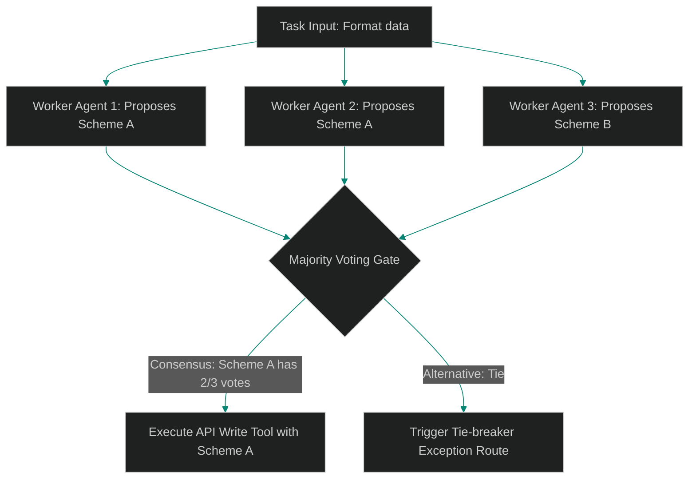

# Majority Voting Gates: Aggregating Structured Tool Outputs

> [!NOTE]
> **📖 Article Overview**
> Running multiple agent nodes in parallel is a common pattern to increase throughput and verify accuracy. However, when multiple parallel agents invoke external APIs or execute code commands, they often produce conflicting output payloads. For example, if three code-generating agents write a function, two might use the correct naming convention while the third introduces a syntax error. To resolve inconsistencies, swarm architects implement **Majority Voting Gates**. By parsing structured JSON outputs, we establish consensus and execute the majority choice. In this article, we build a majority voting gate middleware in Python.

---

## The Challenge of Swarm Divergence

When scaling parallel agent runs:
* **The Variance Risk**: LLM generation is inherently probabilistic. Running the same task across parallel workers yields slightly different parameter outputs.
* **Deterministic Requirements**: External tool integrations (such as committing schema changes to databases) require a single, validated action payload.
* **The Solution**: **Majority Voting Gates**. We buffer parallel execution responses, count occurrences of critical variables, and only execute the tool payload if a majority consensus is reached.



---

## 1. Structuring Voting Payloads

To enable consensus aggregation:
* **Define Key Signatures**: Isolate the specific JSON variables that must match (e.g. `action_name`, `target_id`, `sql_statement`).
* **Enforce Schema Parsing**: Ensure all parallel worker agents validate their outputs against a strict Pydantic JSON schema before voting.

---

## 2. Setting Consensus Thresholds

The voting coordinator manages approval logic:
1. **Calculate Thresholds**: Define the minimum agreement required to proceed (e.g., more than 50% of the active voter pool).
2. **Handle Inconclusive Votes**: Flag a tie-breaker alert if no single proposal meets the consensus threshold.

---

## Code Demo: Majority Voting Engine

Below is a Python implementation of a majority voting gate. It processes parallel JSON tool outputs, aggregates variables, evaluates thresholds, and handles ties.

```python
import json
from collections import Counter
from typing import List, Dict, Any, Tuple

class MajorityVotingGate:
    def __init__(self, consensus_ratio: float = 0.5):
        # The minimum ratio of identical votes required to proceed (e.g. >50%)
        self.consensus_ratio = consensus_ratio

    def evaluate_consensus(self, agent_outputs: List[Dict[str, Any]], signature_key: str) -> Tuple[bool, Dict[str, Any]]:
        if not agent_outputs:
            return False, {}

        # 1. Extract signature values to count votes
        signatures = [out.get(signature_key) for out in agent_outputs if signature_key in out]
        
        if not signatures:
            return False, {"error": "Signature key not found in outputs."}

        # 2. Count occurrences of each signature
        vote_counts = Counter(signatures)
        most_common_signature, votes = vote_counts.most_common(1)[0]
        
        # Calculate matching ratio
        total_voters = len(agent_outputs)
        agreement_ratio = votes / total_voters
        print(f"📊 [Voting Gate] Most common: '{most_common_signature}' | Votes: {votes}/{total_voters} ({agreement_ratio*100:.1f}%)")

        # 3. Evaluate against threshold limits
        if agreement_ratio > self.consensus_ratio:
            # Retrieve the full matching output dictionary
            for out in agent_outputs:
                if out.get(signature_key) == most_common_signature:
                    return True, out
        
        return False, {"error": "Consensus threshold not met. Tie or split vote."}

if __name__ == "__main__":
    voting_gate = MajorityVotingGate(consensus_ratio=0.5)

    # Simulated outputs from 3 parallel SQL generator agents
    mock_agent_votes = [
        {"agent_name": "agent_alpha", "sql_statement": "CREATE INDEX idx_user_id ON users(id);", "action": "create_index"},
        {"agent_name": "agent_beta", "sql_statement": "CREATE INDEX idx_user_id ON users(id);", "action": "create_index"},
        {"agent_name": "agent_gamma", "sql_statement": "CREATE INDEX user_id_index ON users(id);", "action": "create_index"}
    ]

    print("🛡️ Evaluating Swarm Tool Call Consensus...")
    print("------------------------------------------")

    success, payload = voting_gate.evaluate_consensus(
        agent_outputs=mock_agent_votes,
        signature_key="sql_statement"
    )

    print("\n📈 --- Voting Decision Outcome ---")
    if success:
        print(f"✅ Approved Statement: {payload['sql_statement']}")
        print(f"   Executing Tool: {payload['action']}")
    else:
        print(f"🚨 Halted: {payload['error']}")
```

---

## Voting Gate Takeaways

* **Standardize Output Formats**: Require all voting agents to conform to identical JSON schemas.
* **Define Consensus Thresholds**: Require at least a 50% majority (or higher for critical operations) before executing tool payloads.
* **Isolate Key Variables**: Run matching operations on specific execution variables rather than entire raw string outputs.
