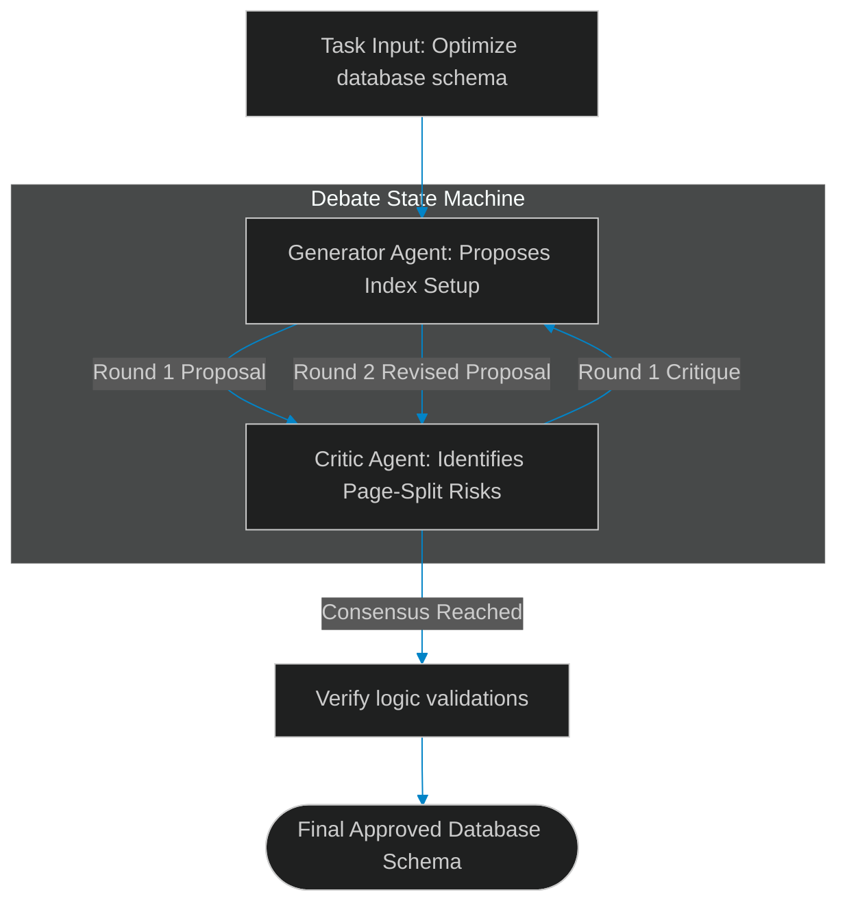

# Structured Debates: Resolving Reasoning Inconsistencies via Discussion

> [!NOTE]
> **📖 Article Overview**
> Single LLM instances are highly susceptible to reasoning biases and confirmation loops. If a model generates a bug-ridden planning script, it will often overlook the issue during self-reflection because it relies on the same internal weights that introduced the bug. To break confirmation bias, advanced system architects deploy **Multi-Agent Debate Protocols**. By setting up structured, multi-turn discussions between opposing agent nodes (e.g. a Generator and a Critic), we force the models to defend their design choices and find logic flaws. In this article, we implement a multi-turn agent debate state machine in Python.

---

## Breaking Confirmation Bias with Debates

In basic agent operations:
* **The Reflection Loop Hole**: A single agent reviewing its own code struggles to see logical flaws (e.g., missing API error handlers).
* **Authority Biases**: Downstream workers often execute flawed instructions received from primary planner nodes without checking them.
* **The Solution**: **Structured Multi-Agent Debates**. We instantiate two models with opposing personas: a Generator that compiles solutions, and a Critic that identifies failure modes. They debate over multiple turns until they reach a consensus.



---

## 1. Structuring the Debate Loop

The debate coordinator manages state transitions:
* **Round Boundaries**: Limit discussions to a maximum of 3 rounds to control token consumption.
* **Consensus Metrics**: Implement text matching filters to detect when the Critic signs off on a proposal (e.g. matching tags like `[APPROVED]`).

---

## 2. Personas and Context Isolation

For debates to be effective:
1. **Assign Personas**: Instruct the Generator to maximize efficiency, and the Critic to enforce strict safety boundaries.
2. **Track History**: Maintain a shared conversation history log so both models can build upon prior responses.

---

## Code Demo: Multi-Agent Debate Engine

Below is a Python implementation of a structured agent debate engine. It drives discussions between proposing and auditing agents, resolving consensus outputs.

```python
import time
from typing import Dict, Any, List, Tuple

class AgentDebateEngine:
    def __init__(self, max_rounds: int = 3):
        self.max_rounds = max_rounds
        self.conversation_history: List[str] = []

    def simulate_generator_turn(self, round_num: int, critique: str) -> str:
        # Simulate generator agent proposing and modifying a plan
        if round_num == 1:
            proposal = "Proposal: Use a global table lock during migrations to ensure consistency."
        else:
            proposal = f"Generator Revision (Round {round_num}): Use schema version partitions instead of global table locks, resolving: '{critique}'."
        
        self.conversation_history.append(f"Generator: {proposal}")
        return proposal

    def simulate_critic_turn(self, round_num: int, proposal: str) -> Tuple[bool, str]:
        # Simulate critic agent identifying flaws or approving revisions
        if "global table lock" in proposal.lower():
            response = "Critique: Global table locks cause transactional timeouts in production under high loads."
            approved = False
        else:
            response = "[APPROVED] Schema partitioning is safe and does not block reads."
            approved = True

        self.conversation_history.append(f"Critic: {response}")
        return approved, response

    def run_debate(self, goal: str) -> Tuple[str, bool]:
        print(f"🌲 [Debate] Initiating Debate for Goal: '{goal}'")
        print("-------------------------------------------------------------")

        critique = "Initial start"
        consensus_reached = False
        
        for round_idx in range(1, self.max_rounds + 1):
            print(f"\n--- Round {round_idx} ---")
            
            # 1. Proposer step
            proposal = self.simulate_generator_turn(round_idx, critique)
            print(f"   [Generator]: {proposal}")
            
            # 2. Critic audit step
            consensus_reached, critique = self.simulate_critic_turn(round_idx, proposal)
            print(f"   [Critic]: {critique}")
            
            if consensus_reached:
                print(f"\n🎉 Consensus achieved in Round {round_idx}!")
                break

        return self.conversation_history[-2], consensus_reached

if __name__ == "__main__":
    debate_engine = AgentDebateEngine()

    final_proposal, success = debate_engine.run_debate(
        goal="Design a zero-downtime database migration path"
    )

    print("\n📈 --- Final Approved Outcome ---")
    print(final_proposal)
    print(f"Status: {'Approved' if success else 'Halted without consensus'}")
```

---

## Debate Topology Takeaways

* **Establish personified roles**: Set up generator and critic personas to prevent consensus bias.
* **Enforce round limits**: Constrain debates to a maximum of 3 turns to control token budgets.
* **Implement approval tags**: Use structured tags like `[APPROVED]` to automate state machine transitions.
