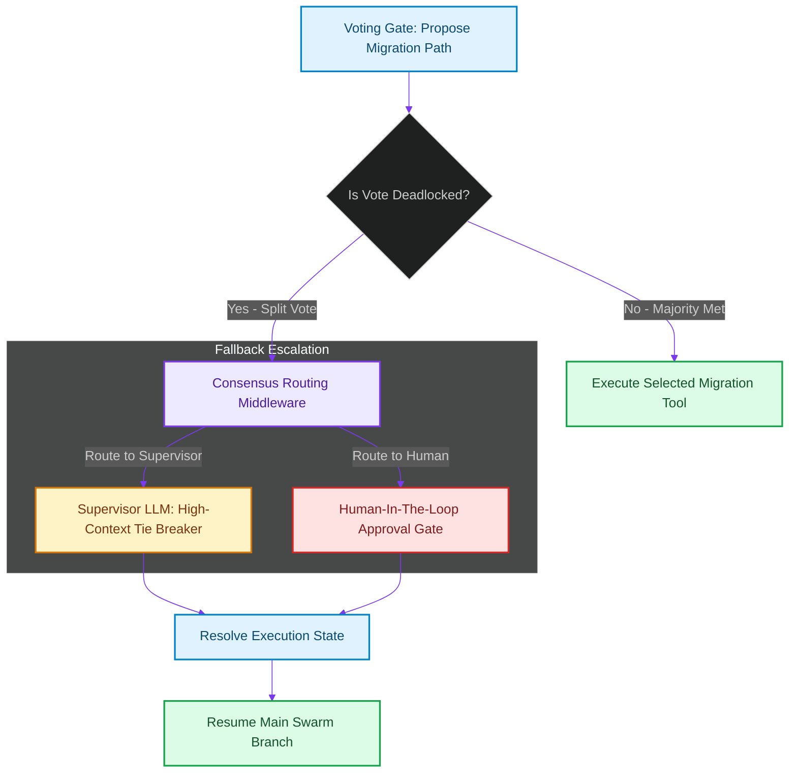

# Consensus Routers: Resolving Deadlocks in Swarm Debates

> [!NOTE]
> **📖 Article Overview**
> When multi-agent systems rely on debates or voting gates to establish consensus, they run into a critical exception case: **Deadlocks**. If four parallel agents split their votes equally between two competing database migration designs (2 vs 2), the execution flow halts indefinitely. Without an automated tie-breaker system, production agents freeze, wasting computing power. To build robust swarms, developers must implement **Consensus Routers**. By monitoring agreement metrics and dynamically re-routing tie votes to supervisor nodes or human-in-the-loop gates, we ensure execution continuity. In this article, we implement a consensus router engine in Python.

---

## The Threat of Swarm Deadlocks

In consensus-driven agent configurations:
* **The Execution Block**: Standard voting gates require a clear majority [1]. A tie vote leaves the state machine without a next step path.
* **Token Drain**: If agents attempt to break ties by simply debating again without changing context parameters, they repeat arguments and exhaust token budgets.
* **The Solution**: **Consensus Routers**. We insert a routing middleware that intercepts the output of voting gates. If a deadlock is identified, the router dynamically modifies the execution path, routing the task to a supervisor agent or escalating it to a human approval gate.



---

## 1. Detecting Split Votes

To identify deadlocks:
* **Evaluate Score Distributions**: Track vote distributions across all options. If the top two options share identical scores, trigger the deadlock state.
* **Enforce Latency Deadlines**: Set execution time limits so the router handles deadlocks immediately without waiting for timeouts.

---

## 2. Setting up Fallback Paths

The consensus router coordinates recovery routing:
1. **Save Execution Context**: Serialize the entire swarm session variables (including individual agent votes and critiques).
2. **Re-route Dynamic Graph**: Modify the downstream execution path by inserting a supervisor resolution node.

---

## Code Demo: Consensus Routing Engine

Below is a Python implementation of a consensus routing engine. It evaluates vote arrays, detects deadlocks, and routes execution to fallback supervisor or human gates.

```python
import json
from collections import Counter
from typing import List, Dict, Any, Tuple

class ConsensusRouter:
    def __init__(self, supervisor_endpoint: str = "supervisor_llm"):
        self.supervisor_endpoint = supervisor_endpoint

    def resolve_voting_results(self, votes: List[str], context_data: Dict[str, Any]) -> Tuple[str, str]:
        print(f"🌲 [Consensus Router] Analyzing vote array: {votes}")

        # 1. Count occurrences of each vote choice
        vote_counts = Counter(votes)
        top_matches = vote_counts.most_common(2)

        if not top_matches:
            return "escalate_to_human", "No votes recorded. Escalating immediately."

        # 2. Check for deadlocks (if the top 2 options share identical vote counts)
        if len(top_matches) > 1 and top_matches[0][1] == top_matches[1][1]:
            tie_option_1 = top_matches[0][0]
            tie_option_2 = top_matches[1][0]
            vote_count = top_matches[0][1]
            
            print(f"🚨 [Deadlock] Tie detected between '{tie_option_1}' and '{tie_option_2}' ({vote_count} votes each)!")
            
            # Decide fallback route based on critical context markers
            if context_data.get("is_critical_production", False):
                return "escalate_to_human", f"Critical tie: '{tie_option_1}' vs '{tie_option_2}'. Human audit required."
            else:
                return "route_to_supervisor", f"Standard tie: '{tie_option_1}' vs '{tie_option_2}'. Routing to Supervisor LLM."

        # 3. Clear majority achieved
        majority_winner = top_matches[0][0]
        return "execute_majority", majority_winner

if __name__ == "__main__":
    router = ConsensusRouter()

    # Scenario 1: Standard tie vote in local development env
    dev_context = {"env": "development", "is_critical_production": False}
    dev_votes = ["Option_A", "Option_B", "Option_A", "Option_B"] # 2 vs 2 Tie

    print("🛡️ Processing Scenario 1: Development Environment...")
    print("-----------------------------------------------------")
    route_1, detail_1 = router.resolve_voting_results(dev_votes, dev_context)
    print(f"👉 Resolution: Route to '{route_1}' | Detail: {detail_1}\n")

    # Scenario 2: Tie vote in production deployment pipeline
    prod_context = {"env": "production", "is_critical_production": True}
    prod_votes = ["Option_A", "Option_B", "Option_A", "Option_B"] # 2 vs 2 Tie

    print("🛡️ Processing Scenario 2: Production Environment...")
    print("-----------------------------------------------------")
    route_2, detail_2 = router.resolve_voting_results(prod_votes, prod_context)
    print(f"👉 Resolution: Route to '{route_2}' | Detail: {detail_2}\n")
```

---

## Consensus Routing Takeaways

* **Identify Tie States Early**: Monitor vote distributions in voting gates to catch deadlocks instantly.
* **Determine Environment Safety**: Route development ties to supervisor models, but escalate production deadlocks to humans.
* **Maintain Execution Trace**: Attach agent voting details to the fallback routing payload to provide supervisors with the necessary context. [2]

## References & Further Reading

1. **Ongaro, D., & Ousterhout, J. (2014)**. *In Search of an Understandable Consensus Algorithm*. USENIX ATC. [https://raft.github.io/raft.pdf](https://raft.github.io/raft.pdf)
2. **Lamport, L. (2001)**. *Paxos Made Simple*. ACM SIGACT News. [https://lamport.azurewebsites.net/pubs/paxos-simple.pdf](https://lamport.azurewebsites.net/pubs/paxos-simple.pdf)
3. **Burrows, M. (2006)**. *The Chubby Lock Service for Loosely-Coupled Distributed Systems*. OSDI. [https://research.google/pubs/pub27897/](https://research.google/pubs/pub27897/)
4. **LangChain (2024)**. *LangGraph Documentation*. langchain.com. [https://langchain-ai.github.io/langgraph/](https://langchain-ai.github.io/langgraph/)
5. **Anthropic (2025)**. *Model Context Protocol Specification*. MCP Docs. [https://modelcontextprotocol.io/specification](https://modelcontextprotocol.io/specification)
6. **OpenTelemetry Authors (2024)**. *OpenTelemetry Specification*. CNCF. [https://opentelemetry.io/docs/specs/otel/](https://opentelemetry.io/docs/specs/otel/)
