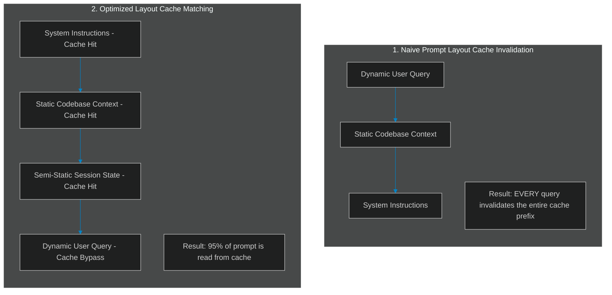

# Context Cache Architecture: Maximizing Prompt Caching Hits in Gemini 2.0 & Claude 3.5

> [!NOTE]
> **📖 Article Overview**
> Prompt Caching has emerged as one of the most significant cost and latency optimization features in modern LLM API services (like Anthropic Claude and Google Gemini). By storing static prefixes of prompts in GPU memory, providers can speed up time-to-first-token (TTFT) by up to 90% and cut token read costs. However, poor prompt assembly easily invalidates these caches. In this article, we analyze cache invalidation boundaries and implement a cache-aware prompt assembly engine in Python.

---

## The Economics of Prompt Caching

In complex agentic systems, prompts are often extremely large. System prompts containing codebases, API specifications, and extensive reasoning instructions can easily reach 50,000 to 100,000 tokens. 

Reading this context on every single turn of a multi-turn conversation is both slow and expensive. Prompt caching addresses this by caching the processed token state of the prompt prefix.



---

## 1. Under the Hood: Cache Invalidation Boundaries

Prompt caching operates on a **strict prefix-matching** mechanism. The model provider hashes the prompt tokens from left to right. 

* **The Left-to-Right Constraint**: If even a single character changes at token position `N`, the entire cache from position `N` to the end of the prompt is invalidated.
* **Minimum Token Limits**: Most providers enforce a minimum token count to trigger caching (e.g., Anthropic Claude requires at least 1,024 tokens; Google Gemini has specific block sizes).
* **Caching Triggers**: For Anthropic, you must explicitly mark blocks with `"cache_control": {"type": "ephemeral"}`. For Gemini, caches are created automatically for prefixes that match exact historical structures.

To prevent cache invalidation, prompts must be organized in order of **increasing volatility** (most static elements on the far left, most dynamic elements on the far right).

---

## 2. Designing the Optimal Prompt Pipeline

An optimal agent prompt layout must follow this exact order:

1. **System Instructions** (100% static across all users).
2. **Global Reference Context** (API specs, database schemas, codebase structures - static across sessions).
3. **User Profile & State** (Semi-static: changes only at session boundaries).
4. **Historical Messages** (Sliding window of chat history - changes incrementally).
5. **New User Query & Temporary Tool Logs** (Highly dynamic - invalidates on every turn).

---

## Code Demo: Cache-Aware Prompt Assembly

Below is a Python implementation of a prompt assembler that groups prompts into distinct cache blocks, validates token requirements, and structures payloads to maximize prefix match hits.

```python
import json
from typing import List, Dict, Any, Tuple

class PromptBlock:
    def __init__(self, name: str, content: str, is_static: bool):
        self.name = name
        self.content = content
        self.is_static = is_static
        # Mock token count (approx. 4 characters per token)
        self.tokens = len(content) // 4

class PromptCacheOptimizer:
    def __init__(self, min_cache_threshold: int = 1024):
        self.min_cache_threshold = min_cache_threshold
        self.blocks: List[PromptBlock] = []

    def add_block(self, name: str, content: str, is_static: bool):
        self.blocks.append(PromptBlock(name, content, is_static))

    def compile_prompt(self) -> Tuple[List[Dict[str, Any]], Dict[str, Any]]:
        # Sort blocks to ensure static blocks are strictly at the beginning (left)
        # Static blocks first, then dynamic blocks
        sorted_blocks = sorted(self.blocks, key=lambda b: 0 if b.is_static else 1)
        
        formatted_messages = []
        cache_metadata = {
            "total_tokens": 0,
            "cached_tokens": 0,
            "cache_blocks_active": []
        }

        running_tokens = 0
        
        for block in sorted_blocks:
            running_tokens += block.tokens
            message_node = {
                "role": "system" if block.is_static else "user",
                "content": block.content
            }
            
            # If the block is static and the accumulated tokens exceed the threshold,
            # we explicitly inject the provider cache control headers
            if block.is_static and running_tokens >= self.min_cache_threshold:
                message_node["cache_control"] = {"type": "ephemeral"}
                cache_metadata["cached_tokens"] = running_tokens
                cache_metadata["cache_blocks_active"].append(block.name)
            
            formatted_messages.append(message_node)
            
        cache_metadata["total_tokens"] = running_tokens
        return formatted_messages, cache_metadata

if __name__ == "__main__":
    optimizer = PromptCacheOptimizer(min_cache_threshold=1000)

    # 1. System Prompt (Static)
    system_prompt = "You are a senior systems engineer. Always write code with type annotations." * 30  # ~300 tokens
    optimizer.add_block("system_instructions", system_prompt, is_static=True)

    # 2. Database Schema Reference (Static)
    db_schema = "TABLE users (id INT, email VARCHAR, active BOOLEAN); " * 60  # ~800 tokens
    optimizer.add_block("db_schema_specs", db_schema, is_static=True)

    # 3. Current User Query (Dynamic)
    user_query = "Write a query to find all active users."
    optimizer.add_block("user_query", user_query, is_static=False)

    # Compile prompt
    messages, meta = optimizer.compile_prompt()

    print("--- Compiled Cache-Aware Messages Payload ---")
    print(json.dumps(messages[:2], indent=2))  # Displaying first two blocks
    
    print("\n--- Cache Analysis Report ---")
    print(f"Total Prompt Tokens: {meta['total_tokens']}")
    print(f"Cached Prefix Tokens: {meta['cached_tokens']}")
    print(f"Active Cache Blocks: {meta['cache_blocks_active']}")
    print(f"Cache Coverage Ratio: {meta['cached_tokens'] / meta['total_tokens']:.2%}")
```

---

## Architectural Checklist

* **Order of Volatility**: Verify your prompt templates assemble blocks from most static (System instructions) to most dynamic (User input). Never place variable items at the top of the prompt.
* **Keep Cache Limits in Mind**: Do not apply cache tags to small prompts. Standardize caching for payloads exceeding 1,024 tokens.
* **Monitor API Invalidation**: Implement observability tracking to calculate cache hit metrics (e.g. tracking `cached_creation_input_tokens` and `cached_read_input_tokens` headers from API response objects).
