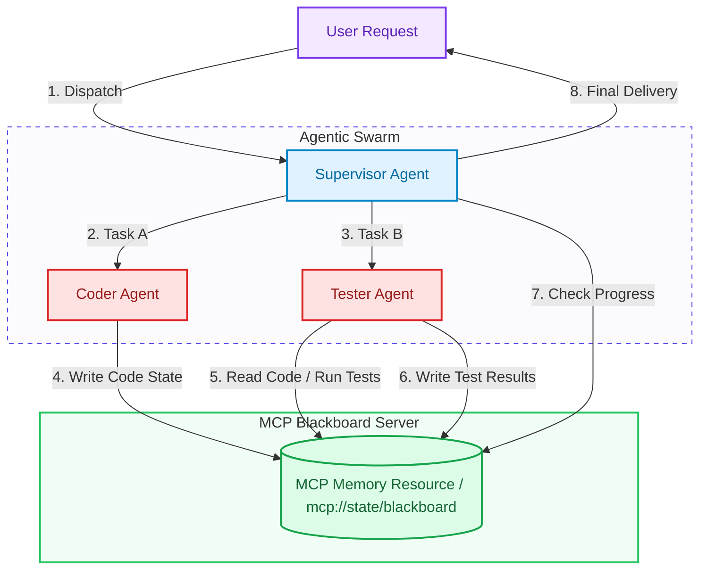

# Advanced Context Engineering: Cross-Agent Memory Synchronization via MCP Resources

> ### 📖 Article Overview
> * **What this article is about:** An engineering guide on how to design a shared "blackboard" memory architecture using Model Context Protocol (MCP) Resources, enabling a swarm of specialized agents to synchronize state dynamically without inflating prompt contexts.
> * **Why it matters:** In complex workflows, passing complete transaction histories and state logs between multiple agents (e.g., orchestrator, validator, coder) quickly leads to context exhaustion and model confusion. A centralized memory resource server keeps agent prompts clean and focused.
> * **What we synthesized:** We evaluated the architectural trade-offs of blackboard memory systems versus message-passing chains, illustrating the pattern with a Python implementation of an MCP Resource server integrated into a LangGraph workflow, linking to your monorepo [agentic-apps-portfolio](https://github.com/akmalkhaniub/agentic-apps-portfolio).

---

In our previous articles, we secured agent actions with [Ephemeral Sandbox Containment](post.html?post=context-engineering-ephemeral-sandboxing) and optimized resource limits using [Semantic Prompt Caching](post.html?post=context-engineering-prompt-caching). 

However, when scaling from a single assistant to a collaborative swarm of multiple agents—such as the workflows deployed in the [agentic-apps-portfolio](https://github.com/akmalkhaniub/agentic-apps-portfolio)—we run into a coordination barrier. If Agent A (e.g., a software architect) writes a complex design spec, Agent B (the programmer) writes the implementation, and Agent C (the validator) audits the code, how do they stay in sync?

If we pass the full history of every agent's thoughts and outputs to all other agents in a linear thread, context windows will inflate exponentially. Agents will become distracted by irrelevant details, and token costs will skyrocket.

To solve this, we implement a **Blackboard Memory Architecture** using **MCP Resources**—centralized, read/write state nodes that agents can query and update on-demand, rather than passing state through message histories.

---

## The Blackboard Memory Sync Lifecycle

Below is the architecture of a multi-agent system coordinating through a central MCP memory resource. The Supervisor routes work while specialized agents read from and write to the shared blackboard.



---

## Synthesis: What's Good & What's Not

### 1. Centralized Blackboard Memory
A centralized repository where agents post their inputs, intermediate results, and output structures. Agents query the blackboard on-demand via URI schemas.

*   **What's Good (The Pros)**:
    *   *Prompt Simplification*: Instead of carrying the entire multi-agent dialogue in their system prompts, each agent receives only the core task description and queries specific blackboard variables when needed.
    *   *Parallel Execution*: Multiple agents can read from the same state simultaneously, enabling concurrent processing without race conditions or thread pollution.
    *   *Decoupled Design*: Agents do not need to know the specific schemas or history of other agents; they only need to understand the centralized data structure of the blackboard.
*   **What's Not (The Cons)**:
    *   *State Drift*: If the blackboard state is updated out-of-order, agents might read outdated parameters, leading to execution logic drift.
    *   *Single Point of Failure*: If the blackboard server crashes or encounters a locking error, the entire swarm's coordination fails.

---

### 2. Message-Passing Chains
Agents communicate directly with each other by appending their results directly to the conversation log.

*   **What's Good (The Pros)**:
    *   *Simplicity*: Easy to implement using basic chain-of-thought routing without setting up a secondary state database.
*   **What's Not (The Cons)**:
    *   *Token Bloat*: Chat threads accumulate duplicate prompts, logs, and files, causing VRAM exhaustion and higher API bills.

---

## Implementing an MCP Memory Resource Server in Python

Here is a Python implementation of an MCP server that exposes a shared blackboard using the `FastMCP` framework. This server exposes a dynamic MCP resource (`mcp://state/blackboard`) that multi-agent frameworks like LangGraph can query, along with write tools to update variables. This architecture mimics the multi-service synchronization patterns of [agentic-apps-portfolio](https://github.com/akmalkhaniub/agentic-apps-portfolio).

```python
# blackboard_server.py
from mcp.server.fastmcp import FastMCP
import json
import threading

# Initialize FastMCP Server
mcp = FastMCP("Blackboard State Server")

# Thread-safe in-memory state storage
state_lock = threading.Lock()
shared_blackboard = {
    "project_meta": {
        "status": "initialized",
        "current_step": "architecture_review"
    },
    "artifacts": {},
    "logs": []
}

@mcp.resource("state://blackboard")
def get_blackboard_state() -> str:
    """
    Exposes the active blackboard state as a JSON resource.
    Agents query this resource to read the shared workspace variables.
    """
    with state_lock:
        return json.dumps(shared_blackboard, indent=2)

@mcp.tool()
def update_blackboard_variable(key: str, value_json: str) -> str:
    """
    Update a variable on the shared blackboard state.
    Use this to share code blocks, documentation, or test outputs.
    """
    global shared_blackboard
    try:
        parsed_value = json.loads(value_json)
        with state_lock:
            shared_blackboard["artifacts"][key] = parsed_value
            shared_blackboard["logs"].append(f"Updated variable: {key}")
        return f"Successfully updated variable '{key}' on the blackboard."
    except json.JSONDecodeError:
        # Fall back to string storage if not valid JSON
        with state_lock:
            shared_blackboard["artifacts"][key] = value_json
            shared_blackboard["logs"].append(f"Updated variable: {key}")
        return f"Stored variable '{key}' as raw string."

@mcp.tool()
def append_blackboard_log(log_entry: str) -> str:
    """
    Append an execution log to the blackboard log list.
    Use this to keep the swarm updated on process steps.
    """
    with state_lock:
        shared_blackboard["logs"].append(log_entry)
    return "Log entry appended."
```

### Integrating the Memory Resource into LangGraph

Here is how a LangGraph agent retrieves the blackboard state dynamically before processing a node:

```python
# agent_node.py
from langgraph.graph import StateGraph
from mcp import ClientSession
import httpx

# Helper function to query the blackboard resource from MCP
def fetch_blackboard_context() -> dict:
    try:
        # Query the blackboard resource directly
        with httpx.Client() as client:
            response = client.get("http://localhost:8000/resources/state/blackboard")
            return response.json()
    except Exception:
        return {}

def coder_node(state):
    # Retrieve current blackboard state rather than parsing message history
    blackboard = fetch_blackboard_context()
    spec = blackboard.get("artifacts", {}).get("design_spec", "No spec provided.")
    
    # Process code based on design spec
    generated_code = f"# Implement spec:\n# {spec}\ndef process_data(): pass"
    
    # Update blackboard asynchronously via tool call
    with httpx.Client() as client:
        client.post("http://localhost:8000/tools/update_blackboard_variable", json={
            "key": "source_code",
            "value_json": json.dumps(generated_code)
        })
        
    return {"messages": [f"Coder: Generated code for spec: {spec[:30]}..."]}
```

---

## Swarm State Management Checklist

* [ ] **Strict Locking Mechanisms**: Ensure all blackboard write operations are thread-safe (`threading.Lock` or Redis transaction locks) to prevent race conditions during parallel execution.
* [ ] **State Compaction**: Keep state manageable by archiving completed logs or truncating old variable versions to prevent blackboard resource files from growing indefinitely.
* [ ] **Dynamic Event Triggers**: Combine the pull-based blackboard model with push notifications (webhooks or SSE) so agents know exactly when a variable they depend on is updated.

---

## Conclusion & Key Takeaways

Cross-agent memory synchronization keeps multi-agent networks lightweight and accurate:
1. **Blackboard Isolation:** Do not pass massive code files or logs directly in message lists. Place them in a central, structured blackboard space instead.
2. **On-Demand Context:** Let agents query variables when they are executing specific tasks, keeping their prompt sizes small and focused.
3. **Decouple Agent Knowledge:** Enable plug-and-play agent modules by letting them interface with standard blackboard state formats rather than parsing other agents' complex chat messages.

*Takeaway:* A tidy context makes a smart agent. Keep agent histories clean by offloading shared state to dedicated MCP resources.

---

## References & Further Reading

* **LangGraph State Management**: LangChain Blog. *Agent Coordination Patterns with StateGraph*. [LangGraph Docs](https://langchain-ai.github.io/langgraph/).
* **Model Context Protocol Resources**: Model Context Protocol Specifications. *Exposing Context Files, Logs, and Data via Resources*. [MCP Specification](https://modelcontextprotocol.io).

*To see full agent orchestration loops, visual pipelines, and multi-agent service templates, visit the [agentic-apps-portfolio](https://github.com/akmalkhaniub/agentic-apps-portfolio) repository.*
