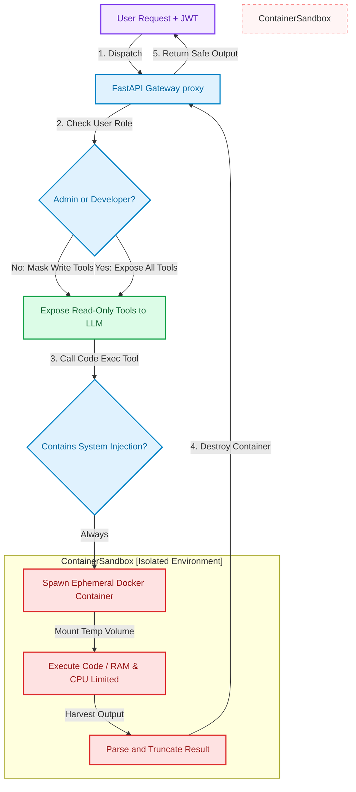

# Advanced Context Engineering: Ephemeral Sandbox Containment & Dynamic Tool Masking

> ### 📖 Article Overview
> * **What this article is about:** An engineering guide on how to contain untrusted LLM-generated code execution inside ephemeral Docker sandboxes and dynamically filter model tools using FastAPI middleware.
> * **Why it matters:** Giving LLMs direct access to shell environments or database writes introduces severe prompt injection and privilege escalation risks. Securing AI agents requires strict virtualization and authorization boundaries.
> * **What we synthesized:** We evaluated the trade-offs of runtime containment and role-based tool masking, presenting a FastAPI policy gateway proxy that isolates code execution, linking to your [healthcare-audit-vault](https://github.com/akmalkhaniub/healthcare-audit-vault) project.

---

In our foundational article, [Context Engineering: Building Secure LLM Tool Gates with Model Context Protocol (MCP)](post.html?post=context-engineering-mcp), we explored how to sanitize inputs and restrict LLM arguments using static regex constraints and schema types. 

However, when building advanced developer agents or database write co-pilots, input sanitization alone is insufficient. If a model must write and execute custom scripts to parse data, compile code, or audit spreadsheets, a single prompt injection can bypass sanitization rules, allowing adversarial instructions to run shell commands (like `rm -rf` or environment file extraction) directly on your host machine.

To protect host environments, we must implement **advanced containment strategies**: running all untrusted code executions inside transient, resource-constrained **ephemeral sandboxes**, and using **dynamic tool masking** to hide sensitive tools from the model based on the user's active session permissions.

This article reviews these containment architectures, drawing from security patterns implemented in the secure document processor [healthcare-audit-vault](https://github.com/akmalkhaniub/healthcare-audit-vault) and tool manager [ops-mcp-suite](https://github.com/akmalkhaniub/ops-mcp-suite).

---

## The Sandboxed Gating Lifecycle

To prevent prompt injection from reaching host resources, we establish a secure boundary where the agent gateway validates user authorization (JWT roles), filters tool availability, and executes commands inside a locked Docker sandbox.



---

## Synthesis: What's Good & What's Not

### 1. Ephemeral Sandboxing (Docker Containment)
Isolating execution processes within short-lived, resource-constrained container layers.

*   **What's Good (The Pros)**:
    *   *Absolute Host Isolation*: Even if an LLM is hijacked via prompt injection and generates a malicious command (e.g. `rm -rf /` or env scrapers), it only executes within a temporary scratch container with no access to host credentials, files, or sibling containers.
    *   *Resource Limits*: Docker allows hard limits on CPU (e.g., max 0.5 cores) and memory (e.g., max 128MB), preventing infinite loops or memory-leak scripts from freezing the host server.
*   **What's Not (The Cons)**:
    *   *Latency Penalty*: Spawning a new Docker container on every code execution tool call adds **400ms to 900ms** of overhead, which can accumulate in multi-step agent loops.
    *   *State Persistence Complexity*: Because containers are destroyed immediately after execution, passing state (like file changes or database sessions) between consecutive agent steps requires mounting complex temporary volumes or maintaining session databases.

---

### 2. Dynamic Tool Masking
Filtering the JSON-RPC tool schemas sent to the LLM during the initial system prompt based on user JWT roles.

*   **What's Good (The Pros)**:
    *   *Bypasses LLM Logic*: Instead of relying on the LLM to obey instructions like *"Do not run write operations if the user is not an administrator,"* the write tools are completely omitted from the model's tool dictionary. The model is literally unaware that write capabilities exist.
    *   *Token Savings*: Hiding irrelevant tools reduces the prompt context size, lowering token bills and saving attention cycles.
*   **What's Not (The Cons)**:
    *   *Middleware Synchronization*: Requires a stateful middleware layer that maps tool definitions to authentication schemas, making agent routes more complex than traditional direct endpoints.

---

## Implementing a Secure Sandboxing tool in Python

Here is a Python implementation of an MCP tool that executes arbitrary Python scripts safely inside a temporary, resource-bounded Docker sandbox. This code uses the official Docker SDK for Python, modeled on the file isolation mechanisms in [healthcare-audit-vault](https://github.com/akmalkhaniub/healthcare-audit-vault).

```python
# sandbox_tool.py
from mcp.server.fastmcp import FastMCP
import docker
import os
import uuid

mcp = FastMCP("Secure Sandbox Server")
docker_client = docker.from_env()

# Maximum execution constraints
MAX_MEM_LIMIT = "128m"  # 128 Megabytes RAM
MAX_CPU_PERIOD = 100000
MAX_CPU_QUOTA = 50000   # 50% CPU allocation

@mcp.tool()
def execute_python_in_sandbox(script_content: str) -> str:
    """
    Execute a raw Python script inside a secure, ephemeral Docker container.
    Use this for running data parsing scripts, mathematical calculations, or audits.
    """
    # Create a unique temporary file to hold the script
    temp_filename = f"script_{uuid.uuid4().hex}.py"
    temp_path = os.path.join("/tmp", temp_filename)
    
    with open(temp_path, "w", encoding="utf-8") as f:
        f.write(script_content)

    container = None
    try:
        # Spawn container with strict constraints and mount the temp script
        container = docker_client.containers.run(
            image="python:3.11-slim",
            command=f"python /app/{temp_filename}",
            volumes={
                "/tmp": {"bind": "/app", "mode": "ro"} # Read-only mount
            },
            mem_limit=MAX_MEM_LIMIT,
            cpu_period=MAX_CPU_PERIOD,
            cpu_quota=MAX_CPU_QUOTA,
            network_disabled=True,                  # Disable internet access
            detach=True,
            read_only=True                          # Read-only container rootfs
        )
        
        # Bounded wait for container to complete (max 5 seconds timeout)
        result = container.wait(timeout=5)
        logs = container.logs(stdout=True, stderr=True).decode('utf-8')
        
        return logs if logs else "Script executed successfully with no output."
        
    except docker.errors.ContainerError as exc:
        return f"Execution Error: {exc.stderr.decode('utf-8')}"
    except docker.errors.ImageNotFound:
        return "System Error: Python sandbox base image not found."
    except Exception as exc:
        return f"Timeout or System Failure: {str(exc)}"
    finally:
        # Clean up: stop, remove container, and delete the temp script file
        if container:
            try:
                container.stop(timeout=1)
                container.remove()
            except Exception:
                pass
        if os.path.exists(temp_path):
            os.remove(temp_path)
```

---

## Security Containment Checklist

* [ ] **Network Isolation**: Always set `network_disabled=True` on script execution containers to prevent dynamic scripts from querying internal VPC database nodes.
* [ ] **Read-Only Volumes**: Mount files inside containers as read-only (`mode="ro"`) to prevent the LLM from corrupting original dataset records.
* [ ] **Strict Memory Limits**: Hard-limit memory settings (`mem_limit="128m"`) to prevent memory-inflation prompt injections from exhausting host system RAM.

---

## Conclusion & Key Takeaways

Secure Context Engineering mandates that we separate natural language planning from system execution:
1. **Container Containment:** Sanitization is never sufficient for code execution. Any dynamic code execution tool must run inside ephemeral, resource-constrained sandboxes.
2. **Authorization-Based Tooling:** Hide tools at the gateway layer using user authentication (JWT) before the LLM receives the system prompt. Never rely on the model to self-police permissions.
3. **Hardware Boundaries:** Hard-limit container memory, CPU quotas, and networking gates to prevent adversarial scripts from causing host performance degradation.

*Takeaway:* Do not teach your models how to obey security boundaries; engineer the system architecture so the model physically cannot cross them.

---

## References & Further Reading

* **Docker Containment for Agents**: Docker Security Guidelines. *Best Practices for Containerizing Sandbox Runtimes*. [Docker Security](https://docs.docker.com/security/).
* **FastMCP Specification**: Model Context Protocol. *Defining Schemas and Schematized Tools with FastMCP*. [MCP Portal](https://github.com/modelcontextprotocol).

*To inspect secure document vaults and file containment architectures, review the source code of the [healthcare-audit-vault](https://github.com/akmalkhaniub/healthcare-audit-vault) repository.*
