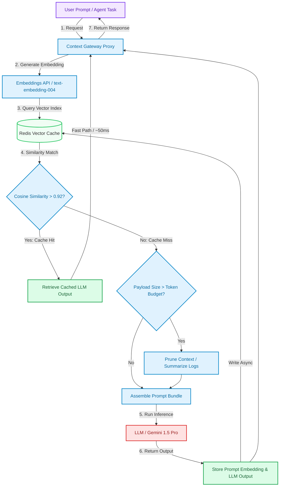

# Advanced Context Engineering: Semantic Prompt Caching & Token Optimization

> ### 📖 Article Overview
> * **What this article is about:** An engineering guide on how to design and build an intelligent Model Context Protocol (MCP) gateway that tracks token usage, prunes redundant context, and implements a semantic vector cache in Redis to reduce inference costs and latency.
> * **Why it matters:** While modern LLM context windows span millions of tokens, submitting large codebase folders, logs, or databases on every single turn is highly inefficient, expensive, and slow. Token optimization and semantic caching are essential to making agentic applications production-viable.
> * **What we synthesized:** We analyzed the performance trade-offs of exact matching vs. semantic matching, token budget limits, and context pruning, illustrating the approach with a Node.js/TypeScript middleware implementation that queries Redis vectors, linking to your asynchronous payroll system [django-payroll-engine](https://github.com/akmalkhaniub/django-payroll-engine).

---

In our previous post, [Advanced Context Engineering: Ephemeral Sandbox Containment & Dynamic Tool Masking](post.html?post=context-engineering-ephemeral-sandboxing), we discussed how to isolate untrusted agent tools within temporary sandboxes to safeguard host machines. 

But execution security is only half the battle when building production-grade agents. The other critical challenge is **resource management**. If your agent queries an MCP resource containing a massive payroll database or codebase repository, sending those thousands of lines of code back and forth to the LLM on every agent cycle will quickly consume your token budget, hit API rate limits, and slow down user response times to a crawl.

To build responsive, cost-effective agents, we need to optimize our context window using two powerful techniques: **Semantic Prompt Caching** to skip model calls for redundant queries, and **Dynamic Context Pruning** to keep our prompt payloads lean.

---

## The Semantic Cache & Context Optimization Lifecycle

Below is the execution flow of an optimized MCP gateway that intercepts incoming prompt frames, computes semantic embeddings, runs similarity searches against a Redis cache, and dynamically prunes prompt components before executing LLM requests.



---

## Synthesis: What's Good & What's Not

### 1. Semantic Prompt Caching
Instead of checking for exact string matches (which fails if a user changes a single character or punctuation mark), we generate vector embeddings of incoming prompts and search for highly similar vectors (using cosine similarity) in a vector database.

*   **What's Good (The Pros)**:
    *   *Dramatic Latency Reduction*: A cache hit resolves in **50ms to 100ms** compared to the **1,500ms to 5,000ms** required for a full LLM generation.
    *   *Substantial Cost Savings*: Vector database lookups cost a fraction of a cent, whereas processing large contexts with LLM APIs incurs high input and output token fees.
    *   *Resilience to Minor Edits*: Matches queries with equivalent semantic intent (e.g., *"How do I compute payroll deductions?"* vs. *"Explain payroll deduction calculations"*).
*   **What's Not (The Cons)**:
    *   *Risk of Stale Answers*: If the underlying context or source data changes (such as payroll updates in [django-payroll-engine](https://github.com/akmalkhaniub/django-payroll-engine)), the cache might serve an outdated answer until it is explicitly invalidated.
    *   *Embeddings Overhead*: Generates an additional network hop to the embeddings model for every query, adding 50–150ms to cache misses.

---

### 2. Context Pruning & Dynamic Truncation
Analyzing the prompt payload size before dispatching it, and using summarization or token-importance ranking to remove irrelevant lines.

*   **What's Good (The Pros)**:
    *   *Rate Limit Protection*: Prevents agents from hitting API rate limits or crashing on excessively large token requests.
    *   *Attention Focus*: Models attention performs better on shorter, highly relevant contexts (combating the "lost in the middle" phenomenon).
*   **What's Not (The Cons)**:
    *   *Information Loss*: Aggressive truncation may accidentally throw away vital code blocks or edge-case log lines needed by the agent.

---

## Implementing a Semantic Redis Cache in TypeScript

Here is a TypeScript implementation of an MCP context gateway middleware that uses Redis Vector Search to cache and retrieve agent prompts based on cosine similarity. This design follows the modular data structures seen in the asynchronous calculations of [django-payroll-engine](https://github.com/akmalkhaniub/django-payroll-engine).

```typescript
// semantic_cache.ts
import { Redis } from 'ioredis';
import { GoogleGenAI } from '@google/generative-ai';

interface CacheResult {
  hit: boolean;
  content: string;
}

export class SemanticCacheManager {
  private redis: Redis;
  private ai: GoogleGenAI;
  private indexName = 'idx:prompt_cache';
  private similarityThreshold = 0.92; // Cosine similarity limit

  constructor(redisUrl: string, apiKey: string) {
    this.redis = new Redis(redisUrl);
    this.ai = new GoogleGenAI({ apiKey });
  }

  /**
   * Generates a 768-dimension vector embedding using Gemini's text-embedding model.
   */
  private async getEmbedding(text: string): Promise<number[]> {
    const model = this.ai.getGenerativeModel({ model: 'text-embedding-004' });
    const result = await model.embedContent(text);
    return result.embedding.values;
  }

  /**
   * Helper to convert a float array to a Buffer for Redis vector ingestion.
   */
  private float32Buffer(vector: number[]): Buffer {
    return Buffer.from(new Float32Array(vector).buffer);
  }

  /**
   * Check if a semantically similar prompt exists in the cache.
   */
  public async checkCache(prompt: string): Promise<CacheResult> {
    try {
      const embedding = await this.getEmbedding(prompt);
      const vectorBuffer = this.float32Buffer(embedding);

      // Perform RediSearch KNN (K-Nearest Neighbors) vector search
      // FT.SEARCH idx:prompt_cache "*=>[KNN 1 @prompt_vector $vec_param AS score]" 
      // PARAMS 2 vec_param <vector> DIALECT 2
      const query = `*=>[KNN 1 @prompt_vector $vec_param AS score]`;
      const searchResult = await this.redis.call(
        'FT.SEARCH',
        this.indexName,
        query,
        'PARAMS', '2', 'vec_param', vectorBuffer,
        'SORTBY', 'score', 'ASC',
        'RETURN', '2', 'response_text', 'score',
        'DIALECT', '2'
      ) as any[];

      // RediSearch response format: [total_results, document_id_1, [field_1, val_1, ...]]
      if (!searchResult || searchResult[0] === 0) {
        return { hit: false, content: '' };
      }

      const fields = searchResult[2];
      let responseText = '';
      let distance = 1.0;

      for (let i = 0; i < fields.length; i += 2) {
        if (fields[i] === 'response_text') responseText = fields[i + 1];
        if (fields[i] === 'score') distance = parseFloat(fields[i + 1]);
      }

      // Convert distance to cosine similarity (Redis Flat/COSINE distance is 1 - similarity)
      const similarity = 1 - distance;
      if (similarity >= this.similarityThreshold) {
        return { hit: true, content: responseText };
      }
    } catch (error) {
      console.error('Semantic cache lookup failed:', error);
    }
    
    return { hit: false, content: '' };
  }

  /**
   * Save a newly generated prompt and response into the semantic vector cache.
   */
  public async setCache(prompt: string, response: string): Promise<void> {
    try {
      const embedding = await this.getEmbedding(prompt);
      const vectorBuffer = this.float32Buffer(embedding);
      const docId = `cache:${Date.now()}`;

      // Store embedding vector and actual text response
      await this.redis.hset(
        docId,
        'prompt_text', prompt,
        'response_text', response,
        'prompt_vector', vectorBuffer
      );
    } catch (error) {
      console.error('Failed to write to semantic cache:', error);
    }
  }
}
```

---

## Context Budget Optimization Checklist

* [ ] **Cache Invalidation on Write**: Ensure your cache keys are linked to data version hashes. If a resource changes (e.g., code modifications or payroll runs), purge the corresponding cache entries.
* [ ] **Local Embeddings for Speed**: Consider running a lightweight local embeddings model (like `all-MiniLM-L6-v2`) in your gateway to eliminate the network latency of external embeddings APIs.
* [ ] **Tiered Caching**: Combine exact matching (fast MD5 string hashes in Redis, ~1ms) with semantic matching (vector search, ~50ms) to bypass embedding generation for identical queries.

---

## Conclusion & Key Takeaways

Optimal context engineering ensures that agent systems scale sustainably:
1. **Reduce Before Requesting:** Do not treat the context window as a dumping ground. Always check token size constraints and summarize histories where possible.
2. **Vectors as Gatekeepers:** Use semantic vector caches (e.g. using Redis or pgvector) to intercept similar queries, saving money and achieving near-instant response times.
3. **Keep State Versioned:** Prevent stale cache delivery by mapping vector keys to content version hashes so that data writes invalidate outdated prompts.

*Takeaway:* The fastest and cheapest LLM call is the one that you never have to make.

---

## References & Further Reading

* **Redis Vector Library**: Redis Developer Documentation. *Vector Similarity Search (VSS) with RediSearch*. [Redis Vector Search](https://redis.io/docs/latest/develop/interact/search-and-query/vector-search/).
* **LLM Context Limits**: Anthropic Research. *Designing Prompts for Large Context Windows*. [Anthropic Blog](https://www.anthropic.com/research).

*For examples of high-concurrency computation pipelines and transaction synchronization, examine the codebase of the [django-payroll-engine](https://github.com/akmalkhaniub/django-payroll-engine) repository.*
