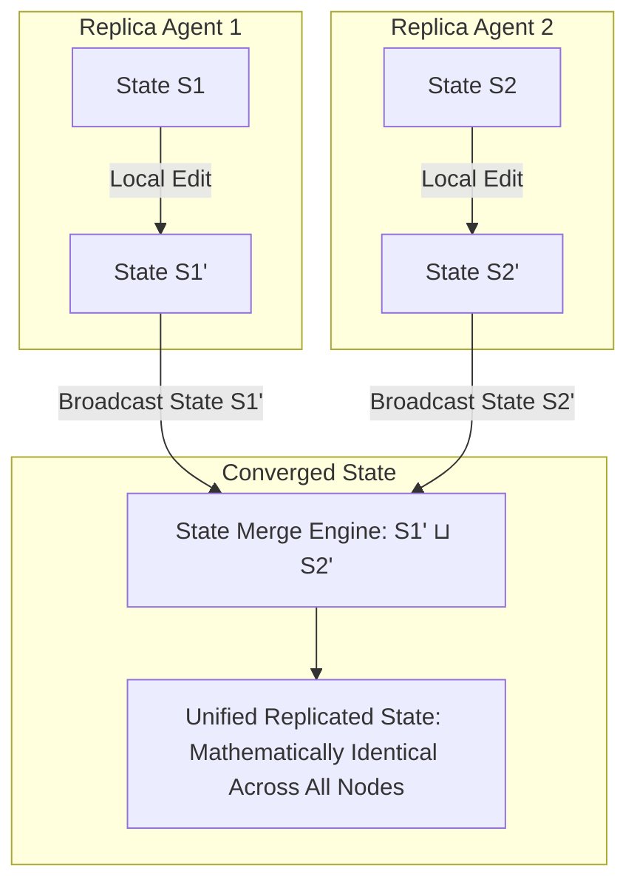

# Conflict-Free Replicated Data Types (CRDTs) for Collaborative Agent Editors

When multiple AI agents work concurrently on a shared codebase or memory document (for example, a **Code Generator Agent**, a **Security Auditor Agent**, and a **Documentation Agent** editing different parts of a project simultaneously), coordinating updates through centralized database locks creates severe throughput bottlenecks.

If agents must wait for central write locks before appending changes, task execution degrades into slow sequential steps.

To enable non-blocking, concurrent state modifications across decentralized agent replicas, software engineers deploy **Conflict-Free Replicated Data Types (CRDTs)**.

CRDTs mathematically guarantee that regardless of network latency, packet reordering, or concurrent edits, any two agent replicas that have received the same set of updates will converge to an identical state without central coordination.

This article details how to implement CRDT state synchronization engines for multi-agent workflows.

---

## State-Based CRDT (CvRDT) Semi-Lattice Architecture

Mathematical properties of State-Based CRDT merge operations ($\sqcup$):



### Mathematical Invariants of CRDT Merges
For a state-based CRDT, the merge function ($\sqcup$) must form a **Bounded Semi-Lattice**, satisfying three core algebraic properties:
1. **Commutativity**: $A \sqcup B = B \sqcup A$ (Order of receiving updates does not affect the final result).
2. **Associativity**: $(A \sqcup B) \sqcup C = A \sqcup (B \sqcup C)$ (Grouping of batch updates does not alter the output).
3. **Idempotency**: $A \sqcup A = A$ (Receiving duplicate state messages will never corrupt or duplicate entries).

---

## Python Implementation: LWW-Element-Set CRDT for Agent Editors

Here is a production-grade Python implementation of a **Last-Write-Wins Element-Set (LWW-Element-Set) CRDT**. It tracks additions and removals of code functions across independent agent replicas, allowing non-blocking concurrent edits and deterministic conflict resolution:

```python
import time
from typing import Dict, Set, Tuple, Any
from pydantic import BaseModel, Field

class ElementRecord(BaseModel):
    element_id: str
    content: str
    timestamp: float  # Hybrid logical/physical timestamp

class LWWElementSetCRDT(BaseModel):
    """
    State-based (CvRDT) Last-Write-Wins Element-Set implementation.
    Tracks addition (add_set) and deletion (remove_set) operations.
    """
    add_set: Dict[str, ElementRecord] = Field(default_factory=dict)
    remove_set: Dict[str, ElementRecord] = Field(default_factory=dict)

    def add(self, element_id: str, content: str, ts: float = None):
        """Adds or updates an element with timestamp."""
        timestamp = ts or time.time()
        record = ElementRecord(element_id=element_id, content=content, timestamp=timestamp)
        
        # Keep latest timestamp in add_set
        if element_id not in self.add_set or self.add_set[element_id].timestamp < timestamp:
            self.add_set[element_id] = record

    def remove(self, element_id: str, ts: float = None):
        """Removes an element with timestamp."""
        timestamp = ts or time.time()
        record = ElementRecord(element_id=element_id, content="", timestamp=timestamp)
        
        # Keep latest timestamp in remove_set
        if element_id not in self.remove_set or self.remove_set[element_id].timestamp < timestamp:
            self.remove_set[element_id] = record

    def merge(self, other: 'LWWElementSetCRDT') -> 'LWWElementSetCRDT':
        """
        Merges another CRDT state into self using semi-lattice join (⊔).
        Commutative, Associative, and Idempotent.
        """
        merged_add = dict(self.add_set)
        for elem_id, record in other.add_set.items():
            if elem_id not in merged_add or merged_add[elem_id].timestamp < record.timestamp:
                merged_add[elem_id] = record

        merged_remove = dict(self.remove_set)
        for elem_id, record in other.remove_set.items():
            if elem_id not in merged_remove or merged_remove[elem_id].timestamp < record.timestamp:
                merged_remove[elem_id] = record

        return LWWElementSetCRDT(add_set=merged_add, remove_set=merged_remove)

    def read_state(self) -> Dict[str, str]:
        """
        Evaluates active state elements. An element exists if it is in add_set
        AND (not in remove_set OR add_set.ts > remove_set.ts).
        """
        active_elements = {}
        for elem_id, add_record in self.add_set.items():
            if elem_id not in self.remove_set:
                active_elements[elem_id] = add_record.content
            else:
                remove_record = self.remove_set[elem_id]
                # Last-Write-Wins rule
                if add_record.timestamp > remove_record.timestamp:
                    active_elements[elem_id] = add_record.content
        return active_elements

# Demonstration Execution
if __name__ == "__main__":
    # 1. Initialize two independent agent editor replicas
    agent_1_replica = LWWElementSetCRDT()
    agent_2_replica = LWWElementSetCRDT()

    print("🚀 Demonstrating CRDT State Convergence Across Agent Replicas...")
    print("=" * 75)

    base_time = time.time()

    # Agent 1 adds function 'def process_data()'
    agent_1_replica.add("fn_process", "def process_data(): return True", ts=base_time + 1.0)
    print(f" 📝 [Agent 1] Local State: {agent_1_replica.read_state()}")

    # Agent 2 concurrently adds function 'def validate_user()' AND deletes 'fn_process'
    agent_2_replica.add("fn_validate", "def validate_user(): return True", ts=base_time + 2.0)
    agent_2_replica.remove("fn_process", ts=base_time + 3.0)  # Deletes fn_process at ts+3.0
    print(f" 📝 [Agent 2] Local State: {agent_2_replica.read_state()}")

    # Perform Cross-Replica Sync (Merge Agent 2 state into Agent 1, and vice versa)
    merged_on_agent_1 = agent_1_replica.merge(agent_2_replica)
    merged_on_agent_2 = agent_2_replica.merge(agent_1_replica)

    print("\n🔄 [Cross-Replica Sync Completed]")
    print(f" 🎯 Agent 1 Converged State: {merged_on_agent_1.read_state()}")
    print(f" 🎯 Agent 2 Converged State: {merged_on_agent_2.read_state()}")
    
    assert merged_on_agent_1.read_state() == merged_on_agent_2.read_state()
    print("\n✨ Verified mathematically identical state convergence without central locking!")
```

---

## CRDT Implementation Gotchas

When deploying CRDTs in agent environments:

> [!IMPORTANT]
> **Use Hybrid Logical Clocks (HLC) for Timestamps**: Pure physical clock timestamps can cause Last-Write-Wins CRDTs to drop valid updates if an agent node's physical clock drifts into the future. Combine physical time with logical counters (Hybrid Logical Clocks) to guarantee strictly monotonic timestamping.

> [!CAUTION]
> **Manage Tombstone Memory Garbage Collection**: In State-based CRDTs, deletion operations leave behind "tombstone" records in `remove_set` to prevent old additions from resurfacing. Over long execution periods, tombstones consume memory. Implement garbage collection thresholds after all replicas have acknowledged state sync.

---

## Real-World Enterprise Impact
Teams deploying CRDT agent state synchronization report:
* **Zero Locking Overhead**: Autonomous agents edit shared codebases concurrently with zero lock contention.
* **Guaranteed State Convergence**: Replicas operating over unstable network connections automatically converge to identical final states as soon as network connectivity is restored.
