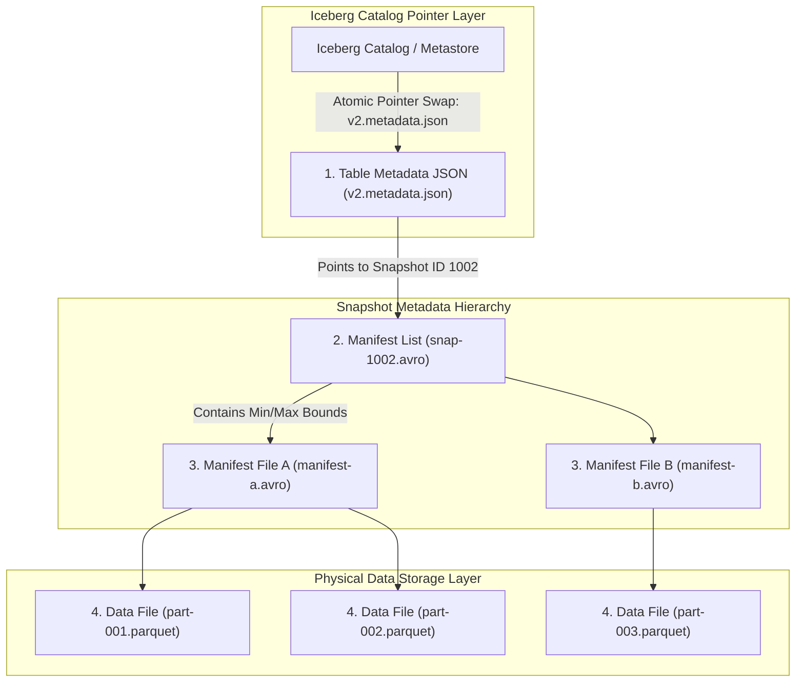

# Modern Data Lakehouse File Formats: Apache Iceberg, Delta Lake & ACID Table Metadata Transactions

In modern cloud data architecture, the **Data Lakehouse** (**Apache Iceberg**, **Delta Lake**, **Apache Hudi**) combines the low-cost scalability of cloud object storage (AWS S3, Google Cloud Storage) with the strict **ACID Transaction Guarantees** of traditional relational databases.

Legacy data lakes (such as **Apache Hive**) defined tables as directory paths on S3 (`s3://bucket/table/year=2026/`).

Because Hive relied on filesystem directory listings (`LIST` API calls) to discover partitions, it suffered from severe performance degradation and **zero ACID isolation**:
* Concurrent writes corrupted table reads (dirty reads).
* Renaming or deleting partitions required mutating millions of S3 objects, risking partial failure states.

To solve this, modern Lakehouse formats redefine a table as a **Tree of Immutable Metadata Snapshot Files**.

Led by **Apache Iceberg** and **Delta Lake**, this metadata-centric architecture brings **ACID Transactions**, **Optimistic Concurrency Control (OCC)**, **Schema Evolution**, and **Time-Travel Queries** to object storage.

This article details the Apache Iceberg metadata tree, Optimistic Concurrency Control, min/max statistics partition pruning, and time-travel query execution.

---

## 📖 Apache Iceberg Metadata Tree & OCC Transaction Architecture

How Apache Iceberg organizes table metadata into an immutable tree hierarchy to deliver atomic transactions on object storage:



### Core Data Lakehouse Formats Mechanics
1. **Decoupling Table Definition from File Paths**:
   * An Iceberg or Delta table is *not* defined by a folder path on disk.
   * A table is defined as the exact set of Parquet data files listed inside the **current active Metadata Snapshot Tree**.
2. **The Apache Iceberg 4-Level Metadata Tree**:
   * **Level 1: Iceberg Catalog**: Stores a single atomic pointer (in DynamoDB, PostgreSQL, or Nessie) pointing to the current `Table Metadata JSON` file.
   * **Level 2: Table Metadata JSON (`vN.metadata.json`)**: Stores table schema definition, partition spec, snapshot log, and pointer to the current `Manifest List`.
   * **Level 3: Manifest List (`snap-ID.avro`)**: Lists all `Manifest Files` comprising a specific snapshot. Stores partition-level min/max statistics for rapid partition pruning.
   * **Level 4: Manifest File (`manifest-A.avro`)**: Lists individual `Data Files` (`.parquet`) along with detailed column-level min/max value ranges for file-level data skipping.
3. **ACID Transactions via Optimistic Concurrency Control (OCC)**:
   * When Writer A inserts new data:
     1. Writer A reads current snapshot $S_1$.
     2. Writer A writes new Parquet data files and generates new Manifest List $S_2$.
     3. Writer A attempts an **Atomic Pointer Swap** in the Iceberg Catalog (`v1.metadata.json -> v2.metadata.json`).
     4. If Writer B committed $S_2$ first, Writer A's swap fails. Writer A re-reads $S_2$, checks for data conflicts (OCC conflict resolution), and retries the commit.
4. **Time-Travel Queries & Zero-Copy Table Branching**:
   * Because metadata files and Parquet data files are immutable and never overwritten in-place, querying historical states (`SELECT * FROM table FOR SYSTEM_TIME AS OF '2026-08-18'`) simply reads the Manifest List associated with that historical Snapshot ID!

---

## 🛠️ Python Implementation: Apache Iceberg Metadata Tree & OCC Commit Engine

Here is a production-grade Python implementation of an Apache Iceberg Metadata Tree and an Optimistic Concurrency Control (OCC) ACID Transaction Commit Engine:

```python
import time
from typing import Dict, List, Optional
from pydantic import BaseModel

class DataFile(BaseModel):
    file_path: str
    record_count: int
    min_value: int
    max_value: int

class ManifestFile(BaseModel):
    manifest_id: str
    data_files: List[DataFile]

class ManifestList(BaseModel):
    snapshot_id: int
    manifest_files: List[ManifestFile]

class TableMetadataJSON(BaseModel):
    table_name: str
    version: int
    current_snapshot_id: int
    snapshots: Dict[int, ManifestList]

class ApacheIcebergEngine:
    """
    Simulates Apache Iceberg Metadata Tree & OCC Transaction Commit Engine.
    """
    def __init__(self, table_name: str):
        self.table_name = table_name
        # Atomic Catalog Pointer (Simulates DynamoDB / Postgres Metastore)
        self.catalog_pointer_version: int = 1
        
        # Metadata Tree Storage
        initial_snapshot = ManifestList(snapshot_id=1001, manifest_files=[])
        self.metadata_versions: Dict[int, TableMetadataJSON] = {
            1: TableMetadataJSON(
                table_name=table_name, version=1, current_snapshot_id=1001, snapshots={1001: initial_snapshot}
            )
        }

    def get_current_metadata(self) -> TableMetadataJSON:
        return self.metadata_versions[self.catalog_pointer_version]

    def commit_transaction_occ(self, new_data_files: List[DataFile], expected_version: int) -> bool:
        """
        Executes ACID Transaction Commit via Optimistic Concurrency Control (OCC).
        """
        print(f"\n🔄 [OCC Transaction Commit] Attempting commit on expected version v{expected_version}...")

        # Check for OCC collision
        if expected_version != self.catalog_pointer_version:
            print(f" 💥 [OCC Collision Failure!] Catalog pointer moved to v{self.catalog_pointer_version}. Retrying transaction...")
            return False

        current_meta = self.get_current_metadata()
        new_version = current_meta.version + 1
        new_snapshot_id = current_meta.current_snapshot_id + 1

        # Create new Manifest File & Manifest List
        new_manifest = ManifestFile(manifest_id=f"manifest-{new_snapshot_id}.avro", data_files=new_data_files)
        new_manifest_list = ManifestList(snapshot_id=new_snapshot_id, manifest_files=[new_manifest])

        # Copy previous snapshots & append new snapshot
        updated_snapshots = dict(current_meta.snapshots)
        updated_snapshots[new_snapshot_id] = new_manifest_list

        new_meta = TableMetadataJSON(
            table_name=self.table_name, version=new_version, current_snapshot_id=new_snapshot_id, snapshots=updated_snapshots
        )

        # ATOMIC POINTER SWAP in Catalog
        self.metadata_versions[new_version] = new_meta
        self.catalog_pointer_version = new_version

        print(f" 🎉 [ACID Commit Success!] Updated Catalog Pointer -> v{new_version}.metadata.json (Snapshot ID: {new_snapshot_id})")
        return True

    def time_travel_query(self, snapshot_id: int) -> List[DataFile]:
        """Queries historical table snapshot using metadata tree pointers."""
        print(f"\n⏳ [Time-Travel Query] Fetching Table Data for Snapshot ID #{snapshot_id}...")
        meta = self.get_current_metadata()
        
        if snapshot_id not in meta.snapshots:
            print(f" ❌ Snapshot ID #{snapshot_id} not found!")
            return []

        manifest_list = meta.snapshots[snapshot_id]
        result_files: List[DataFile] = []
        for mf in manifest_list.manifest_files:
            result_files.extend(mf.data_files)

        print(f" 🎯 Found {len(result_files)} active Parquet data files in Snapshot #{snapshot_id}:")
        for f in result_files:
            print(f"   • {f.file_path} (Records: {f.record_count} | Range: [{f.min_value}..{f.max_value}])")
        return result_files

# Demonstration Execution
if __name__ == "__main__":
    iceberg = ApacheIcebergEngine(table_name="prod_db.user_purchases")

    print("🚀 Demonstrating Apache Iceberg Metadata Tree & OCC Transactions...")
    print("=" * 75)

    # 1. First Transaction: Append 2 Data Files
    files_tx1 = [
        DataFile(file_path="s3://lake/purchases/part1.parquet", record_count=5000, min_value=1, max_value=100),
        DataFile(file_path="s3://lake/purchases/part2.parquet", record_count=3000, min_value=101, max_value=200)
    ]
    iceberg.commit_transaction_occ(new_data_files=files_tx1, expected_version=1)

    # 2. Second Transaction: Append 1 Data File
    files_tx2 = [
        DataFile(file_path="s3://lake/purchases/part3.parquet", record_count=7000, min_value=201, max_value=300)
    ]
    iceberg.commit_transaction_occ(new_data_files=files_tx2, expected_version=2)

    # 3. Execute Time-Travel Query back to initial Snapshot #1002
    iceberg.time_travel_query(snapshot_id=1002)
```

---

## 🚨 Data Lakehouse Gotchas & Best Practices

When operating Apache Iceberg or Delta Lake tables:

> [!IMPORTANT]
> **Schedule Periodic Metadata & Data Compaction Jobs**: Iceberg tables accumulate thousands of small manifest files and deleted data files over time. Run `expire_snapshots()` and `rewrite_data_files()` compaction routines weekly to merge small Parquet files and purge stale metadata logs.

> [!CAUTION]
> **Beware of Continuous OCC Commit Conflicts in High-Writer Workloads**: If 50 streaming jobs attempt to commit to the same Iceberg table simultaneously, OCC pointer swap collisions will cause high retry latency. Use batch append proxies to group writes before committing.

---

## 📈 Real-World Enterprise Impact
Modern Data Lakehouse table formats (such as **Apache Iceberg**, **Delta Lake**, and **Apache Hudi**) report:
* **100% ACID Concurrency Safety**: Eliminates dirty reads and corrupted table states on AWS S3 / Google Cloud Storage.
* **$100\times$ Faster Metadata Queries**: Column-level min/max statistics in manifest files prune unneeded Parquet files without making expensive cloud S3 LIST calls.
