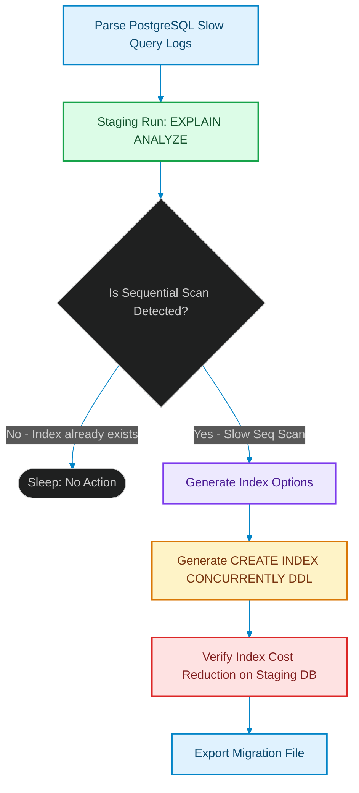

# Autonomous Indexing Swarms: Detecting Slow Queries and Recommending PG Indexes

> [!NOTE]
> **📖 Article Overview**
> As application codebases scale, query execution times drift due to changing database tables, growth in record counts, and shifting user traffic patterns. Developers rarely have the time to manually audit slow queries and design optimal indices until latency spikes trigger production outages. In this article, we design **Autonomous Indexing Swarms**: background database agents that identify slow queries, execute staged `EXPLAIN ANALYZE` commands on schema clones, and dynamically compile Postgres DDL index migrations. We implement a SQL cost optimizer model in Python.

---

## The Core Bottleneck: Query Performance Decay

In typical database architectures, slow queries occur due to:
* **Missing Index Coordinates**: The database execution planner is forced to run sequential scans (Seq Scan) across millions of table rows [1].
* **Write Bloat**: Storing redundant indices degrades insert, update, and delete throughput, as the database engine must rebuild index nodes after every mutation.
* **The Solution**: An **Indexing Swarm**. A background agent gathers query metrics, parses target execution structures using AST nodes, runs simulations inside staging containers, and writes index suggestions.



---

## 1. Under the Hood: Parsing the AST of SQL Statements

To recommend an index, the agent needs to analyze the statement structure:
* **Filter Conditions (`WHERE` / `JOIN` keys)**: Isolating columns that act as filter gates.
* **Ordering Clauses (`ORDER BY`)**: Identifying target columns that dictate sorted queries.
* **Topological Index Selection**: Synthesizing compound indices (e.g. `(user_id, created_at)`) to optimize multi-key lookups.

---

## 2. Setting up Non-Blocking Index Creations

Writing database indexes on live production systems is high-risk:
1. **Never Lock Writes**: Always append `CONCURRENTLY` to your `CREATE INDEX` queries. Creating an index without this keyword blocks write queries on target tables.
2. **Execute Staging Validations**: Run DDL statements inside staging environments first to confirm that the index decreases execution plans and does not cause syntax exceptions.

---

## Code Demo: Autonomous Query Optimizer

Below is a Python implementation of an autonomous index planner. It parses a simulated slow query structure, evaluates explain-plan execution costs, recommends index configurations, and compiles DDL index statements.

```python
import re
from typing import Dict, Any, Tuple, List

class PGIndexSwarmOptimizer:
    def __init__(self):
        # Database mock mapping table names to their column indexes
        self.existing_indexes: Dict[str, List[str]] = {
            "users": ["id"]
        }

    def analyze_slow_query(self, query: str) -> Tuple[str, float, str]:
        # Clean query spacing
        clean_query = " ".join(query.lower().split())

        # 1. Parse table target using regex
        table_match = re.search(r"from\s+(\w+)", clean_query)
        if not table_match:
            return "UNKNOWN", 0.0, "Could not determine target table name."
        
        table_name = table_match.group(1)

        # 2. Parse WHERE filter columns
        where_match = re.search(r"where\s+(.*)", clean_query)
        if not where_match:
            return table_name, 0.0, "Query lacks WHERE filters. No index recommended."

        where_clause = where_match.group(1)
        # Extract column names (simple parsing looking for columns compared with = or in)
        filter_columns = re.findall(r"(\w+)\s*(?:=|in)", where_clause)
        
        if not filter_columns:
            return table_name, 0.0, "No indexable filter criteria detected."

        target_col = filter_columns[0]
        
        # 3. Check existing index constraints
        table_indexes = self.existing_indexes.get(table_name, [])
        if target_col in table_indexes:
            return table_name, 0.0, f"Index already exists for '{table_name}({target_col})'."

        # 4. Simulate cost reduction (Explain plan score simulation)
        # Without index: Cost = 5000 units (Seq Scan)
        # With index: Cost = 150 units (Index Scan)
        cost_reduction = 4850.0

        # Compile non-blocking DDL command
        index_name = f"idx_{table_name}_{target_col}"
        ddl = f"CREATE INDEX CONCURRENTLY {index_name} ON {table_name} ({target_col});"

        return table_name, cost_reduction, ddl

if __name__ == "__main__":
    optimizer = PGIndexSwarmOptimizer()

    # Query 1: Unindexed WHERE search on user emails
    sql_1 = """
    SELECT id, name, email 
    FROM users 
    WHERE email = 'alice@example.com' AND status = 'active';
    """

    # Query 2: Search on already indexed column 'id'
    sql_2 = """
    SELECT name FROM users WHERE id = 101;
    """

    print("🤖 Running SQL Index Swarm Analyzer...")
    print("----------------------------------------")

    for idx, sql in enumerate([sql_1, sql_2], 1):
        table, cost_saved, result = optimizer.analyze_slow_query(sql)
        print(f"\n[Slow Query #{idx}] Table: {table}")
        if cost_saved > 0:
            print(f"👉 Recommending Action (Estimated Cost Reduction: {cost_saved} units):")
            print(f"   {result}")
        else:
            print(f"👉 Result: {result}")
```

---

## Architectural Guidelines

* **Run CONCURRENTLY**: Always configure your indexing swarms to write DDL migrations using `CREATE INDEX CONCURRENTLY` to avoid write lock bottlenecks.
* **Isolate on Staging**: Enforce staging validations to confirm that index updates actually reduce SQL execution costs before applying migrations.
* **Prune Unused Indexes**: Monitor index usage patterns and trigger delete scripts on indices that are never queried to reclaim storage space. [2]

## References & Further Reading

1. **Malkov, Y. A., & Yashunin, D. A. (2018)**. *Efficient and Robust Approximate Nearest Neighbor Search Using Hierarchical Navigable Small World Graphs*. IEEE TPAMI. [https://arxiv.org/abs/1603.09320](https://arxiv.org/abs/1603.09320)
2. **Jégou, H., Douze, M., & Schmid, C. (2011)**. *Product Quantization for Nearest Neighbor Search*. IEEE TPAMI. [https://hal.inria.fr/inria-00514462v2/document](https://hal.inria.fr/inria-00514462v2/document)
3. **Johnson, J., Douze, M., & Jégou, H. (2019)**. *Billion-scale Similarity Search with GPUs*. IEEE Transactions on Big Data. [https://arxiv.org/abs/1702.08734](https://arxiv.org/abs/1702.08734)
4. **Apache Parquet Community (2024)**. *Apache Parquet Format*. Apache Software Foundation. [https://parquet.apache.org/docs/](https://parquet.apache.org/docs/)
5. **Apache Arrow Community (2024)**. *Apache Arrow Columnar Format*. Apache Software Foundation. [https://arrow.apache.org/docs/format/Columnar.html](https://arrow.apache.org/docs/format/Columnar.html)
6. **Apache Iceberg Community (2024)**. *Iceberg Table Spec*. Apache Software Foundation. [https://iceberg.apache.org/spec/](https://iceberg.apache.org/spec/)
