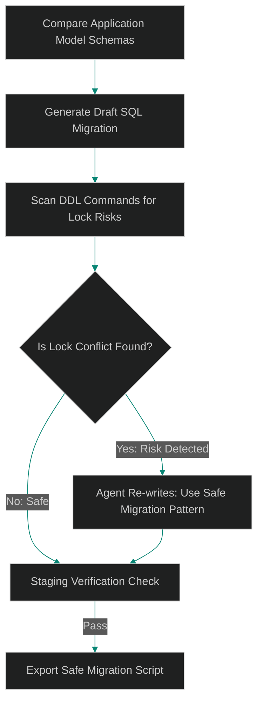

# Self-Healing Schema Migrations: Safe Dynamic Migration Generators

> [!NOTE]
> **📖 Article Overview**
> In modern continuous delivery, application schemas evolve rapidly. When database models change, we need schema migrations to run seamlessly without causing outages. While tools like Alembic or TypeORM generate migrations, they do not verify if DDL commands will lock production tables (such as adding a column with a default value without using online migration patterns). In this article, we design **Self-Healing Schema Migrations**, construct lock-risk validation gates, and implement a migration checker script in Python.

---

## The Migration Lock Trap

A simple schema update can take down a high-write production system:
* **Table Locks (`AccessExclusiveLock`)**: Adding a column or modifying a data type acquires an exclusive lock on the table. If a long-running read query is active, the migration waits behind it, and all subsequent read/write requests queue up, exhausting connection pools.
* **Default Values**: In older databases, adding a column with a default value (e.g. `DEFAULT 'active'`) forces the engine to rewrite every table row, blocking access for minutes.
* **The Solution**: An **Agent Migration Gate**. The agent compares application model diffs, generates SQL migration scripts, and parses each command against lock conflict checkers to ensure safe execution patterns.



---

## 1. Safe Schema Migration Strategies

To prevent migration outages, the agent rewriter enforces:
* **Add Column, Then Set Default**: Instead of adding a column with a default value directly, add the column as nullable first, then add the default constraint, and backfill existing rows in batches.
* **Index Concurrently**: Separate index creation from table updates, ensuring indices are built concurrently.
* **Short Lock Timeouts**: Wrap DDL migrations in transactions with strict lock timeouts so that they abort immediately if blocked, rather than queuing traffic.

---

## 2. Setting up DDL Analyzers

The DDL analyzer scans statements for risk indicators:
1. **Forbidden Operations**: Rejecting direct data type conversions (e.g. `ALTER TABLE ALTER COLUMN TYPE`) on large tables.
2. **Missing Timeouts**: Confirming that all migration blocks set `lock_timeout` boundaries.

---

## Code Demo: Safe Migration SQL Analyzer

Below is a Python implementation of a migration lock-risk analyzer. It evaluates SQL statements, identifies blocking operations, recommends safe alternatives, and outputs migration scripts.

```python
from typing import Dict, Any, Tuple, List

class SQLMigrationAnalyzer:
    def __init__(self):
        # List of regex-like patterns that trigger high-risk lock alerts
        self.blocking_operations = [
            ("add column default", "Adding a column with a DEFAULT value locks the table. Add as nullable, then set default."),
            ("alter table alter column type", "Altering column types requires a full table rewrite. Use migration backfill strategy."),
            ("create index", "Creating an index locks writes. Use CREATE INDEX CONCURRENTLY instead.")
        ]

    def analyze_migration_sql(self, sql_script: str) -> Tuple[bool, List[str], str]:
        warnings = []
        is_safe = True
        
        # Normalize sql
        normalized_sql = " ".join(sql_script.lower().split())

        # 1. Check for missing lock_timeout
        if "set lock_timeout" not in normalized_sql:
            warnings.append("Security Warning: Missing 'SET lock_timeout'. Migration might block connections.")
            is_safe = False

        # 2. Check for blocking DDL patterns
        for pattern, warning in self.blocking_operations:
            if pattern in normalized_sql:
                # Except if index is concurrently created
                if pattern == "create index" and "create index concurrently" in normalized_sql:
                    continue
                warnings.append(f"Risk Detected: {warning}")
                is_safe = False

        # 3. Recommend safe rewrite if unsafe
        safe_rewrite = sql_script
        if not is_safe:
            # Simple simulation of agentic rewrite
            safe_rewrite = "SET lock_timeout = '2s';\n" + sql_script
            if "create index" in normalized_sql and "concurrently" not in normalized_sql:
                safe_rewrite = safe_rewrite.replace("CREATE INDEX", "CREATE INDEX CONCURRENTLY")

        return is_safe, warnings, safe_rewrite

if __name__ == "__main__":
    analyzer = SQLMigrationAnalyzer()

    # Unsafe DDL: Direct index creation without timeout or concurrently keyword
    unsafe_ddl = """
    CREATE INDEX idx_users_email ON users (email);
    """

    print("🛡️ Running Schema Migration Lock Analyzer...")
    print("---------------------------------------------")

    is_ok, issues, rewrite = analyzer.analyze_migration_sql(unsafe_ddl)
    print(f"Original SQL:\n{unsafe_ddl.strip()}")
    print(f"\nAnalysis Result - Safe: **{is_ok}**")
    
    if not is_ok:
        print("\nIssues Identified:")
        for issue in issues:
            print(f" ❌ {issue}")
        print(f"\n👉 Suggested Safe Rewrite:\n{rewrite.strip()}")
```

---

## Architectural Guidelines

* **Enforce Lock Timeouts**: Always prepend `SET lock_timeout = '2s'` to all migration files to prevent blocking production database connection pools.
* **Audit Columns with Defaults**: Never add columns with default constraints directly on active tables. Add the column as nullable first, then set the default.
* **Isolate Index Creations**: Run index builds asynchronously using concurrent configurations, and separate them from general table structure updates.
