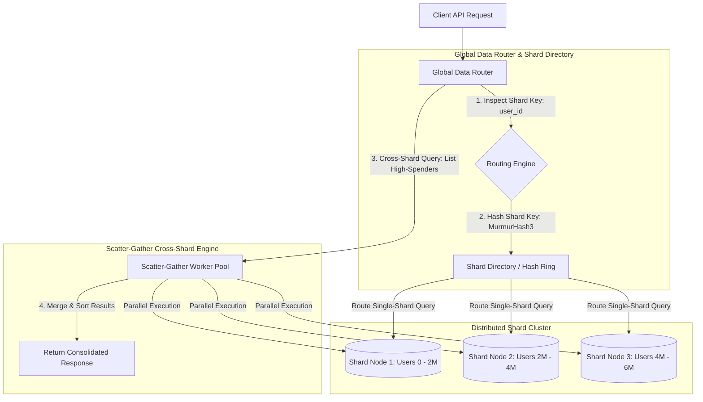

# Database Sharding, Horizontal Partitioning & Global Data Routing

When a web application scales from thousands to tens of millions of active users, a single monolithic database instance—no matter how large the underlying cloud hardware—inevitably hits physical scaling limits. Read replicas can offload query volume, but all write transactions must still pass through a single primary database node, creating write bottleneck saturation.

To achieve virtually unlimited database scale, software architects implement **Database Sharding** (Horizontal Partitioning).

Sharding splits a massive database table across multiple independent physical database instances (**shards**). A **Global Data Router** inspects incoming queries and routes transactions to the exact shard instance hosting the target record.

This article details how to design and build a sharded database router with scatter-gather query capabilities.

---

## Sharded Database Data Routing Architecture

How the Global Data Router intercepts application queries and routes transactions across isolated shard nodes:



### Core Sharding Mechanics
1. **Sharding Key Selection**: The most critical architectural choice in database sharding. Selecting a high-cardinality key (such as `user_id` or `tenant_id`) ensures uniform data distribution and avoids hotspot shards.
2. **Scatter-Gather Queries**: While single-row lookups (`WHERE user_id = 'usr_102'`) route cleanly to a single shard, queries lacking a sharding key (`WHERE created_at > '2026-08-01'`) must be executed in parallel across *all* shard nodes (**scatter**), and their results merged and sorted in memory (**gather**).
3. **Global Reference Tables**: Small, rarely updated lookup tables (such as country codes or currency conversion rates) are replicated asynchronously to every shard instance so that local SQL `JOIN` operations can complete within a single shard without cross-network joins.

---

## Python Implementation: Global Data Router & Scatter-Gather Engine

Here is a production-grade Python implementation of a Global Data Router featuring Hash-based sharding and a parallel Scatter-Gather execution pool:

```python
import hashlib
import concurrent.futures
from typing import Dict, List, Any, Optional
from pydantic import BaseModel

class UserRecord(BaseModel):
    user_id: str
    tenant_id: str
    name: str
    account_balance: float

class DatabaseShardNode:
    """Simulates an isolated physical database shard node."""
    def __init__(self, shard_id: str):
        self.shard_id = shard_id
        self.storage: Dict[str, UserRecord] = {}

    def insert(self, record: UserRecord):
        self.storage[record.user_id] = record

    def get_by_id(self, user_id: str) -> Optional[UserRecord]:
        return self.storage.get(user_id)

    def scan_balances_above(self, min_balance: float) -> List[UserRecord]:
        """Simulates local shard scan query."""
        return [rec for rec in self.storage.values() if rec.account_balance >= min_balance]

class GlobalDataRouter:
    """
    Routes single-shard queries using MurmurHash3 sharding keys
    and executes parallel Scatter-Gather queries across all shards.
    """
    def __init__(self, shard_count: int = 4):
        self.shard_count = shard_count
        self.shards: List[DatabaseShardNode] = [
            DatabaseShardNode(shard_id=f"shard-node-{i}") for i in range(shard_count)
        ]

    def _get_shard_index(self, shard_key: str) -> int:
        """Computes deterministic hash shard index: hash(key) % N."""
        digest = hashlib.md5(shard_key.encode('utf-8')).hexdigest()
        hash_int = int(digest[:8], 16)
        return hash_int % self.shard_count

    def insert_user(self, record: UserRecord):
        shard_idx = self._get_shard_index(record.user_id)
        target_shard = self.shards[shard_idx]
        target_shard.insert(record)
        print(f" 📥 [Data Router] Inserted User '{record.user_id}' into {target_shard.shard_id}")

    def fetch_user(self, user_id: str) -> Optional[UserRecord]:
        """Direct Single-Shard Lookup (Fast O(1) Routing)."""
        shard_idx = self._get_shard_index(user_id)
        target_shard = self.shards[shard_idx]
        print(f" 🎯 [Data Router] Routing Query for User '{user_id}' directly to {target_shard.shard_id}")
        return target_shard.get_by_id(user_id)

    def scatter_gather_high_balances(self, min_balance: float) -> List[UserRecord]:
        """
        Executes query in parallel across ALL shards and gathers merged results.
        """
        print(f"\n⚡ [Scatter-Gather] Executing parallel query across all {self.shard_count} shards...")
        all_results: List[UserRecord] = []

        with concurrent.futures.ThreadPoolExecutor(max_workers=self.shard_count) as executor:
            # Scatter queries to all shard nodes concurrently
            future_to_shard = {
                executor.submit(shard.scan_balances_above, min_balance): shard
                for shard in self.shards
            }
            for future in concurrent.futures.as_completed(future_to_shard):
                shard = future_to_shard[future]
                try:
                    shard_results = future.result()
                    print(f"   ↳ [Scatter-Gather] {shard.shard_id} returned {len(shard_results)} matching records.")
                    all_results.extend(shard_results)
                except Exception as err:
                    print(f" 🚨 [Scatter-Gather Error] {shard.shard_id} failed: {err}")

        # Gather & Sort merged results descending by balance
        all_results.sort(key=lambda x: x.account_balance, reverse=True)
        return all_results

# Demonstration Execution
if __name__ == "__main__":
    router = GlobalDataRouter(shard_count=4)

    print("🚀 Demonstrating Database Sharding & Scatter-Gather Engine...")
    print("=" * 75)

    # 1. Populate Users across Shards
    users_data = [
        UserRecord(user_id="usr-101", tenant_id="tenant-A", name="Alice", account_balance=1500.0),
        UserRecord(user_id="usr-102", tenant_id="tenant-B", name="Bob", account_balance=450.0),
        UserRecord(user_id="usr-103", tenant_id="tenant-A", name="Charlie", account_balance=9800.0),
        UserRecord(user_id="usr-104", tenant_id="tenant-C", name="David", account_balance=3200.0),
        UserRecord(user_id="usr-105", tenant_id="tenant-B", name="Eve", account_balance=12500.0),
    ]

    for u in users_data:
        router.insert_user(u)

    # 2. Single-Shard Point Lookup
    print("\n1. Single-Shard Lookup...")
    user = router.fetch_user("usr-103")
    print(f"   Result: {user}")

    # 3. Cross-Shard Scatter-Gather Query
    print("\n2. Cross-Shard Scatter-Gather Query (Balances >= $3,000)...")
    vip_users = router.scatter_gather_high_balances(min_balance=3000.0)
    print(f"\n📊 Scatter-Gather Consolidated VIP Users List ({len(vip_users)} total):")
    for vip in vip_users:
        print(f"   • {vip.name} ({vip.user_id}) -> ${vip.account_balance:,.2f}")
```

---

## Sharding Gotchas & Guardrails

When architecture sharded database systems:

> [!IMPORTANT]
> **Avoid Multi-Shard Distributed Transactions**: Executing 2-Phase Commit (2PC) transactions across multiple database shards creates extreme lock contention and latency. Design application schemas so that transactions execute within the scope of a single sharding key (`user_id` or `tenant_id`).

> [!CAUTION]
> **Plan for Dynamic Resharding Early**: As key volume grows, an individual shard node will eventually fill its disk capacity. Utilize Consistent Hashing rings or logical-to-physical shard mapping tables so that new physical database instances can be added without full cluster resharding.

---

## Real-World Enterprise Impact
Teams implementing database sharding report:
* **Linear Scale-Out Capability**: Adding physical database shards increases write throughput linearly without hitting single-node hardware ceilings.
* **Blast Radius Isolation**: If a physical database shard crashes, only a fraction ($1/N$) of users are impacted, keeping the remaining system operational.
