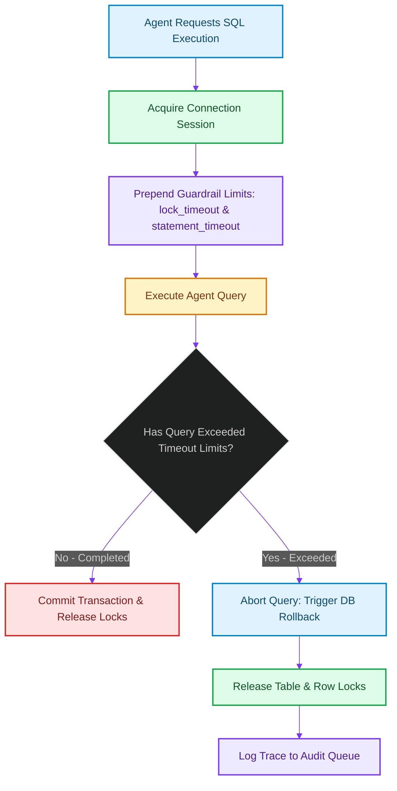

# Transaction Locking Guardrails: Preventing Deadlocks during Agent-Driven SQL Operations

> [!NOTE]
> **📖 Article Overview**
> Letting autonomous agents run raw SQL commands or execute database migrations creates structural risks. A poorly formulated SQL command can lock key tables, exhausting connection pools and causing cascading system outages. To protect production systems, leads must implement **Transaction Locking Guardrails**. By wrapping agent-driven connection pools in strict lock and statement timeout boundaries, we abort dangerous queries before they block database operations. In this article, we map deadlock vectors and implement a guardrail connection pool manager in Python.

---

## The Risk of Agent-Driven SQL Mutations

When an agent writes code or executes migrations:
* **The Infinite Scan Lock**: A missing index query on a massive table locks database rows while scanning, blocking updates [1].
* **Deadlock Escalation**: Two asynchronous agents updating database rows in reverse order can block each other indefinitely, exhausting connection pools.
* **The Solution**: **Timeout Guardrails**. We wrap all agent database connection sessions in strict timeouts. If a query holds locks beyond the threshold (e.g. `2 seconds`), the transaction aborts automatically, releasing locks.



---

## 1. Under the Hood: Statement and Lock Timeouts

To safeguard databases, we configure session variables:
* **`statement_timeout`**: Restricts the maximum time a query can execute. If a query runs longer than the threshold, it is terminated.
* **`lock_timeout`**: Limits the time a transaction will wait to acquire a table or row lock. This prevents queries from waiting behind long-running operations.

---

## 2. Setting up Connection Boundaries

A robust database gateway pool enforces:
1. **Low-Priority Privileges**: Running agent queries using separate database users with restricted access, blocking structural updates.
2. **Explicit Rollbacks**: Ensuring any aborted transaction runs a full rollback command to clean up connection states.

---

## Code Demo: Resilient Database Connection Wrapper

Below is a Python implementation of a database connection wrapper. It intercepts query submissions, prepends safety timeouts, and executes rollbacks if limits are exceeded.

```python
import time
from typing import Dict, Any, Tuple

class DatabaseExecutionTimeout(Exception):
    pass

class GuardrailConnection:
    def __init__(self, lock_timeout_ms: int, statement_timeout_ms: int):
        self.lock_timeout_ms = lock_timeout_ms
        self.statement_timeout_ms = statement_timeout_ms
        self.active_transaction = False

    def execute_transaction(self, query: str, simulate_delay: float = 0.0) -> Tuple[bool, str]:
        print(f"\n📂 [Session] Beginning transaction for query: '{query.strip()}'")
        self.active_transaction = True

        # 1. Prepend guardrail timeout settings (Simulated PostgreSQL command)
        print(f"   ⚙️ SET lock_timeout = {self.lock_timeout_ms}ms;")
        print(f"   ⚙️ SET statement_timeout = {self.statement_timeout_ms}ms;")

        # 2. Execute query
        start_time = time.time()
        
        # Simulate query latency
        if simulate_delay * 1000 > self.statement_timeout_ms:
            # Transaction Rollback
            self.active_transaction = False
            print("   ❌ [Error] Statement timeout exceeded! Aborting query...")
            return False, "Transaction Rolled Back: statement_timeout exceeded."

        # 3. Commit Transaction
        self.active_transaction = False
        print("   ✅ Transaction Committed successfully.")
        return True, "Success."

if __name__ == "__main__":
    # Configure safety limits: 1s statement timeout, 500ms lock timeout
    conn = GuardrailConnection(lock_timeout_ms=500, statement_timeout_ms=1000)

    # Query 1: Fast query within safety boundaries
    success, msg = conn.execute_transaction(
        "SELECT name FROM users WHERE id = 101;",
        simulate_delay=0.1 # 100ms
    )
    print(f"Result: {msg}")

    # Query 2: Unindexed query that runs too long
    success, msg = conn.execute_transaction(
        "SELECT COUNT(*) FROM logs WHERE message LIKE '%error%';",
        simulate_delay=1.5 # 1500ms (Exceeds statement timeout of 1000ms)
    )
    print(f"Result: {msg}")
```

---

## Architectural Guidelines

* **Enforce Connection Timeouts**: Set `statement_timeout` and `lock_timeout` limits on all database sessions accessed by agent workflows.
* **Isolate Privileges**: Run agent transactions using dedicated database roles with read-only permissions on sensitive schemas.
* **Wrap in Transactions**: Ensure all queries run inside transaction blocks, guaranteeing automated rollbacks on timeouts. [2]

## References & Further Reading

1. **Mohan, C., et al. (1992)**. *ARIES: A Transaction Recovery Method Supporting Fine-Granularity Locking and Partial Rollbacks*. ACM TODS. [https://doi.org/10.1145/128765.128770](https://doi.org/10.1145/128765.128770)
2. **O'Neil, P., Cheng, E., Gawlick, D., & O'Neil, E. (1996)**. *The Log-Structured Merge-Tree (LSM-Tree)*. Acta Informatica. [https://www.cs.umb.edu/~poneil/lsmtree.pdf](https://www.cs.umb.edu/~poneil/lsmtree.pdf)
3. **PostgreSQL Global Development Group (2024)**. *PostgreSQL Documentation*. postgresql.org. [https://www.postgresql.org/docs/current/](https://www.postgresql.org/docs/current/)
4. **Malkov, Y. A., & Yashunin, D. A. (2018)**. *Efficient and Robust Approximate Nearest Neighbor Search Using Hierarchical Navigable Small World Graphs*. IEEE TPAMI. [https://arxiv.org/abs/1603.09320](https://arxiv.org/abs/1603.09320)
5. **Jégou, H., Douze, M., & Schmid, C. (2011)**. *Product Quantization for Nearest Neighbor Search*. IEEE TPAMI. [https://hal.inria.fr/inria-00514462v2/document](https://hal.inria.fr/inria-00514462v2/document)
6. **Johnson, J., Douze, M., & Jégou, H. (2019)**. *Billion-scale Similarity Search with GPUs*. IEEE Transactions on Big Data. [https://arxiv.org/abs/1702.08734](https://arxiv.org/abs/1702.08734)
