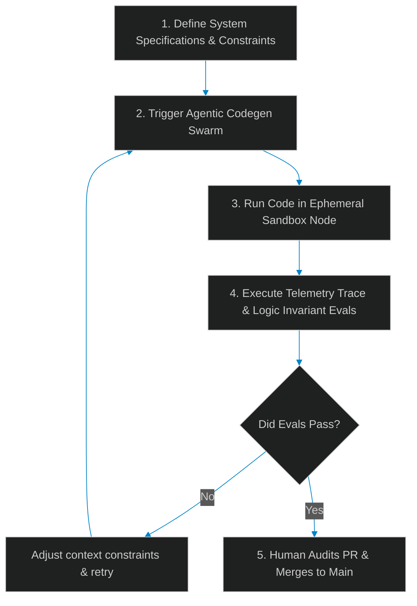

# A Day in the Life of an AI Software Engineer in 2026

> [!NOTE]
> **📖 Article Overview**
> The landscape of software engineering has shifted rapidly. A few years ago, developers spent most of their time writing syntax, manually testing loops, and resolving package version dependencies. Today, in 2026, the job looks fundamentally different. We are no longer syntax writers; we are **Verification Architects** and **Context Engineers**. In this article, we take an insider look at a typical day in the life of a modern software engineer, explore the pros and cons of this new era, and implement a telemetry log auditor in Python.

---

## The Paradigm Shift: From Syntax to Context

In the traditional software era, the bottleneck was typing speed and syntax recall. Today, code generation is a solved problem. The new bottleneck is **verification, context management, and boundaries**:
* **Context Engineering**: Organizing repository structures, MCP tools, and schemas so that agents can navigate code safely.
* **Verification Gates**: Writing strict validation rules, AST parsers, and evaluation metrics (LLM-as-a-judge) to verify agent-generated solutions.
* **Telemetry Tracing**: Auditing execution trajectories to ensure background code daemons don't get stuck in recursive validation loops.



---

## A Day in the Life: Chronology of the Modern Developer

### 09:00 AM — Trajectory Auditing
Your morning begins by reviewing the logs of agent runs executed overnight. A background refactoring daemon was tasked with migrating a legacy repository. You open your trace dashboard to analyze any steps where the agent hit logic loops or context window limits.

### 11:00 AM — Context & MCP Engineering
You spend your mid-morning configuring the Model Context Protocol (MCP) server endpoints. If the agent needs to access database schemas, you write semantic tools that safely mask sensitive table structures, ensuring the LLM doesn't view customer data during analysis.

### 02:00 PM — Writing Non-Deterministic Evals
You build evaluation test suites using packages like DeepEval. These tests aren't simple assertions. Instead, they check semantic qualities: "Does the generated code match architectural guidelines?" or "Is the output API response payload safe from injection vectors?"

---

## Then vs. Now: The Great Evolution

| Feature | Traditional Era (Pre-2024) | AI-Native Era (2026) |
| :--- | :--- | :--- |
| **Daily Input** | Typing code lines manually in IDE | Defining system specifications and test constraints |
| **Test Methods** | Hardcoded unit test assertions | LLM-as-a-judge semantic evaluations & AST validation |
| **Error Debugging**| Step-through stack traces and print logs | Analyzing agent trace trajectory logs and prompt inputs |
| **Development Cycle**| Sprints (weeks/months) | Swarms (minutes/hours for generation; days for audit) |

---

## The Pros & Cons of 2026 Software Engineering

### The Pros
* **Supercharged Leverage**: A single developer can manage multiple agent teams, refactoring large modules in hours instead of weeks.
* **Focus on Architecture**: Your cognitive energy is reserved for system design, database schemas, security configurations, and user experience.
* **Dynamic Prototyping**: Building functional prototypes is instantaneous, enabling developers to test ideas rapidly.

### The Cons
* **Non-Deterministic Bug Tracking**: Debugging a system that fails due to soft prompt drift rather than hard syntax errors is complex.
* **Cost & Token Economics**: Engineers must monitor API query costs, design semantic caching, and manage KV-cache budgets.
* **Skills Drift**: Relying on automation can cause developers to lose familiarity with low-level details, making deep debugging harder.

---

## Code Demo: Agent Telemetry Trace Auditor

To identify when an autonomous agent is wasting tokens in a repetitive loop, engineers use trace log auditors. Below is a Python script that parses agent execution histories, detects repetitive tool-calling patterns, and outputs context-optimization warnings.

```python
import json
from typing import Dict, List, Tuple

class AgentTraceAuditor:
    def __init__(self, loop_threshold: int = 3):
        self.loop_threshold = loop_threshold

    def audit_trace(self, logs: List[Dict[str, str]]) -> Tuple[bool, str]:
        tool_call_counts = {}
        consecutive_repeats = 1
        previous_tool = None

        for step in logs:
            action = step.get("action", "")
            if not action.startswith("tool_call:"):
                continue

            tool_name = action.split(":")[1]
            tool_call_counts[tool_name] = tool_call_counts.get(tool_name, 0) + 1

            # Detect consecutive identical tool calls (indicates loop)
            if tool_name == previous_tool:
                consecutive_repeats += 1
                if consecutive_repeats >= self.loop_threshold:
                    return False, f"🚨 Loop Detected: Tool '{tool_name}' was called {consecutive_repeats} times consecutively."
            else:
                consecutive_repeats = 1

            previous_tool = tool_name

        return True, "Passed: No consecutive tool-calling loops detected."

if __name__ == "__main__":
    auditor = AgentTraceAuditor(loop_threshold=3)

    # Log 1: Clean trace
    clean_logs = [
        {"step": "1", "action": "planning"},
        {"step": "2", "action": "tool_call:fetch_schema"},
        {"step": "3", "action": "tool_call:run_query"},
        {"step": "4", "action": "final_answer"}
    ]

    # Log 2: Agent stuck in a loop trying to compile failing code
    looping_logs = [
        {"step": "1", "action": "planning"},
        {"step": "2", "action": "tool_call:compile_code"},
        {"step": "3", "action": "tool_call:compile_code"},
        {"step": "4", "action": "tool_call:compile_code"}
    ]

    print("🛰️ Running Telemetry Trace Auditor...")
    print("--------------------------------------")

    for idx, log in enumerate([clean_logs, looping_logs], 1):
        success, message = auditor.audit_trace(log)
        print(f"\n[Audit Run #{idx}] Result:")
        print(f"👉 Status: {'Passed' if success else 'Failed'}")
        print(f"   Details: {message}")
```

---

## Conclusion: The Path Forward

The transition to AI-native software engineering in 2026 does not diminish the need for deep technical expertise. In fact, it raises the bar: engineers must understand system architecture, security, and verification patterns at a higher level than ever before. We are no longer the builders laying bricks—we are the architects directing the construction swarms.
