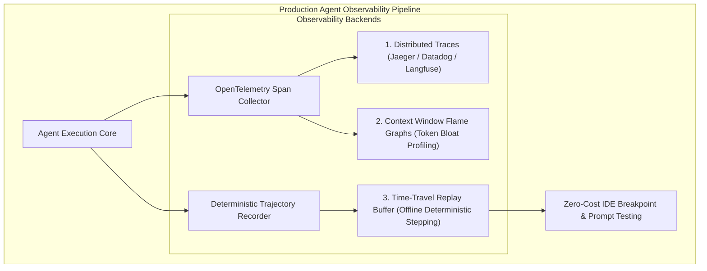
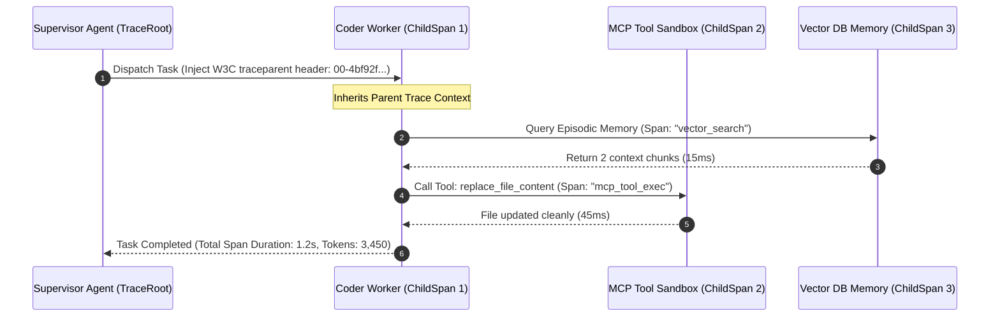

# Debugging the Black Box: How to Trace, Profile, and Replay Broken Agent Runs with OpenTelemetry & Time-Travel Debugging

In traditional software engineering, debugging a crash is straightforward: you reproduce the issue with deterministic inputs, set a breakpoint in your IDE, inspect the stack frame, and step through the code line by line.

In autonomous multi-agent engineering (**Agent Fleet Orchestrator**, **LangGraph**, **Devin**, **Claude Engineer**), traditional debugging breaks down completely:
* An agent runs for 18 steps across 5 tools over 12 minutes, then silently fails on Step 15 by corrupting a configuration file.
* You re-run the exact same prompt with the exact same inputs → due to LLM stochasticity, the agent takes an entirely different 8-step path, never hitting the bug, while burning **$\$10.00$ in API credits**.
* You are left with zero visibility into why the model made a catastrophic reasoning leap on Step 15.

Debugging production AI agent swarms requires treating agent trajectories as **distributed, stateful, event-sourced distributed systems**.

By combining **OpenTelemetry distributed tracing**, **Context Window Flame Graphs**, and **Time-Travel Trajectory Replay**, engineering teams can inspect, profile, and replay complex multi-agent failures deterministically without spending a single cent on redundant LLM API calls.



---

## 1. The Stochastic Debugging Crisis

Why is debugging an autonomous agent fundamentally harder than debugging traditional distributed microservices?

### The 3 Core Failure Modes of Agent Debugging:
1. **The Quantum Observer Dilemma (Non-Reproducibility)**: Re-running a failed agent prompt with temperature $> 0$ generates a different branching tree. You cannot reliably reproduce a stochastic hallucination on demand.
2. **Context Bloat & Token Amnesia**: A tool output on Step 4 (e.g. dumping a $10,000\text{-line}$ database JSON dump) silently crowds out the original system prompt instructions by Step 12, causing attention collapse.
3. **Async Span Breakage**: In multi-agent swarms, when a Supervisor dispatches asynchronous tasks to Coder and QA worker threads, distributed trace context (`traceparent`) is frequently dropped, severing parent-child causality graphs.

---

## 2. Distributed Tracing for Agent Swarms with OpenTelemetry

To gain end-to-end visibility, every agent decision, tool execution, and memory retrieval must be instrumented as an **OpenTelemetry (OTel) Span**:



### Standardized OpenTelemetry Span Attributes for AI Agents:
* `gen_ai.system`: e.g. `anthropic`, `openai`, `gemini`
* `gen_ai.request.model`: e.g. `claude-3-5-sonnet-20241022`
* `gen_ai.usage.prompt_tokens`: Count of input tokens
* `gen_ai.usage.completion_tokens`: Count of generated tokens
* `agent.step_index`: Discrete integer ($1, 2, \dots, N$)
* `agent.tool.name` & `agent.tool.arguments`: Exact tool payload

---

## 3. Time-Travel Trajectory Replay: Zero-Cost Deterministic Debugging

The most powerful technique for taming agent failures is **Event-Sourced Time-Travel Replay**.

### How Time-Travel Debugging Works:
1. **Record Phase**: During live execution, the agent engine serializes every turn into an immutable JSON Lines (`.jsonl`) trajectory file:
   * The exact system prompt and assembled context.
   * The raw LLM completion string.
   * The exact tool name, inputs, and physical stdout/stderr returned by the environment.
2. **Replay Phase (Offline)**: When a bug occurs at Step 15:
   * The developer launches the **Time-Travel Replay Runner**.
   * Steps 1 through 14 are replayed from disk in milliseconds with **zero LLM API calls and zero network latency**.
   * The developer inspects the exact working memory state at Step 15, modifies the prompt or tool schema, and tests the fix instantly.

```
Recorded Trajectory (200KB JSON):
[ Step 1 (DB Query) ] -> [ Step 2 (Edit Auth) ] -> ... -> [ Step 15 (💥 Error) ]
                                                                 |
                                              Time-Travel Rewind |
                                                                 v
[ Step 15 Offline Sandbox: Tweak prompt -> Re-run single step for $0.001! ]
```

---

## 4. Context Window Flame Graphs: Profiling Token Bloat

Just as CPU flame graphs identify functions consuming excessive processor cycles, **Context Flame Graphs** visualize which execution turns are consuming the context window:

```
> **CONTEXT WINDOW FLAME GRAPH (32k Tokens Max)**
| [System Persona: 1.5k tokens (5%)]                                                                |
| [Step 1-3 Dialogue History: 3.2k tokens (10%)]                                                     |
| [Step 4 Unfiltered PostgreSQL Dump: 22.8k tokens (71%)]  <-- 🚨 BOTTLENECK: ATTENTION COLLAPSE!   |
| [Step 5-14 Active Scratchpad: 4.5k tokens (14%)]                                                  |

```

By profiling the flame graph, developers immediately spot that Step 4’s raw database dump consumed $71\%$ of the context, allowing them to introduce an automated summarization filter before Step 5.

---

## Python Implementation: Time-Travel Agent Replay Engine with OTel Spans

Here is a Python implementation of an agent execution recorder and deterministic time-travel replay engine:

```python
import json
import time
from dataclasses import asdict, dataclass
from typing import Any, Dict, List, Optional

@dataclass
class AgentStepRecord:
    step_index: int
    timestamp: float
    prompt_tokens: int
    completion_tokens: int
    llm_thought: str
    tool_name: Optional[str]
    tool_args: Optional[Dict[str, Any]]
    tool_output: Optional[str]

class TimeTravelAgentDebugger:
    """
    Records agent execution steps and enables deterministic, zero-cost offline replay.
    """
    def __init__(self, trace_id: str):
        self.trace_id = trace_id
        self.trajectory_log: List[AgentStepRecord] = []

    # --- 1. RECORDING PHASE (LIVE RUN) ---
    def record_step(self, step: AgentStepRecord):
        print(f" 📼 [Trace: {self.trace_id}] Recorded Step #{step.step_index} | Tool: {step.tool_name} | Tokens: {step.prompt_tokens + step.completion_tokens}")
        self.trajectory_log.append(step)

    def export_trajectory_json(self) -> str:
        return json.dumps([asdict(s) for s in self.trajectory_log], indent=2)

    # --- 2. TIME-TRAVEL REPLAY PHASE (OFFLINE DEBUGGING) ---
    def replay_to_step(self, target_step_index: int):
        print(f"\n⏳ [Time-Travel Replay] Rewinding agent state to Step #{target_step_index} (Offline / Zero API Cost)...")
        
        cumulative_tokens = 0
        for step in self.trajectory_log:
            if step.step_index > target_step_index:
                break
            
            cumulative_tokens += (step.prompt_tokens + step.completion_tokens)
            print(f"\n 📍 [Replaying Step {step.step_index}]")
            print(f"    Thought    : '{step.llm_thought}'")
            if step.tool_name:
                print(f"    Tool Call  : {step.tool_name}({step.tool_args})")
                print(f"    Tool Result: {step.tool_output}")

        print(f"\n🎯 [Paused at Step {target_step_index}] Total Context Tokens: {cumulative_tokens}")
        print(" 💡 Ready for interactive prompt tweaking and localized patch evaluation.")

# Demonstration Execution
if __name__ == "__main__":
    debugger = TimeTravelAgentDebugger(trace_id="trace-agent-9921")

    # 1. Simulate Live Recording of a 3-Step Agent Run
    t0 = time.time()
    debugger.record_step(AgentStepRecord(
        step_index=1,
        timestamp=t0,
        prompt_tokens=1200,
        completion_tokens=150,
        llm_thought="Need to inspect repository structure to find payment module.",
        tool_name="list_dir",
        tool_args={"dir": "src/services"},
        tool_output="['auth.ts', 'billing.ts', 'user.ts']"
    ))

    debugger.record_step(AgentStepRecord(
        step_index=2,
        timestamp=t0 + 1.2,
        prompt_tokens=1500,
        completion_tokens=220,
        llm_thought="Reading billing.ts to verify Stripe charge handler.",
        tool_name="view_file",
        tool_args={"file": "src/services/billing.ts"},
        tool_output="export const charge = async () => { ... }"
    ))

    debugger.record_step(AgentStepRecord(
        step_index=3,
        timestamp=t0 + 2.5,
        prompt_tokens=2100,
        completion_tokens=80,
        llm_thought="💥 Bug encountered: Missing API key in environment config.",
        tool_name="exec_test",
        tool_args={"cmd": "npm test"},
        tool_output="FAIL: STRIPE_API_KEY is undefined"
    ))

    # 2. Time-Travel Replay to Step 2 to inspect pre-failure state
    debugger.replay_to_step(target_step_index=2)
```

---

## Summary: Traditional Debugging vs Agent Time-Travel Debugging

| Dimension | Traditional Software Debugging | Agent Time-Travel Debugging |
|---|---|---|
| **Reproducibility** | $100\%$ Deterministic stack traces | Non-deterministic without trajectory recordings |
| **API Cost to Debug** | Free ($0.00$) | Free via offline replay buffer (vs $\$10.00$ live re-runs) |
| **Trace Visibility** | Monolithic logs or APM traces | OpenTelemetry spans with W3C baggage propagation |
| **Context Analysis** | Memory profilers (Valgrind / Heap dumps) | Context Window Flame Graphs for token bloat |
| **Root Cause Resolution** | Code patch | Prompt anchor, Skill constraint, or AST filter patch |

---

## Architectural Takeaway
You cannot optimize or debug what you cannot observe.

By instrumenting agent swarms with **OpenTelemetry spans**, **Context Flame Graphs**, and **Event-Sourced Time-Travel Replay**, engineering teams illuminate the AI black box—turning chaotic, unpredictable agent runs into transparent, reproducible, and verifiable distributed systems.
