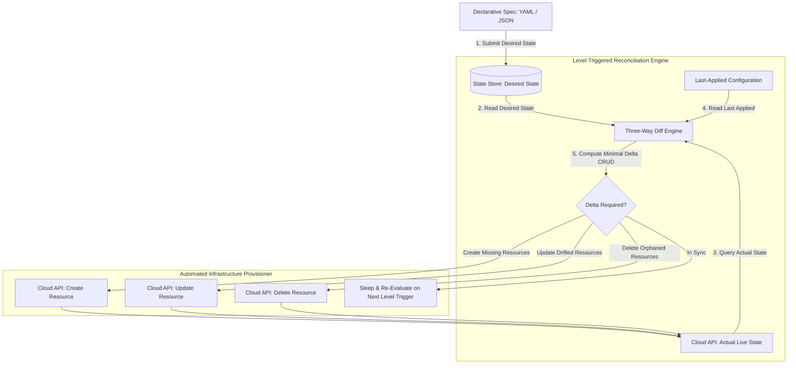

# Declarative State Synchronization: Building Custom Infrastructure Reconcilers

Traditional infrastructure automation relied on **Imperative Scripting** (such as Bash scripts or step-by-step Ansible playbooks). Imperative automation tells the system *how* to execute actions (`create VM`, `attach volume`, `open port 80`). If a script fails midway due to a transient network error, re-running the script often causes duplicate resource errors or partial, broken states.

Modern Cloud-Native Control Planes adopt **Declarative State Synchronization**.

Under the Declarative paradigm, platform engineers declare *what* the desired end state should look like in a structured schema. A dedicated **Infrastructure Reconciler Engine** continuously compares the desired state against the actual live environment, generating minimal CRUD actions to converge the two.

This article details how to build custom declarative reconcilers using Level-Triggered reconciliation and Three-Way State Diffing.

---

## Declarative State Reconciliation Architecture

How a Declarative Reconciler evaluates Level-Triggered state diffs and drives infrastructure convergence:



### Core Declarative Principles
1. **Imperative vs Declarative**: Imperative scripts execute sequence steps ($A → B → C$) and are not idempotent. Declarative engines define target state ($S_{\text{target}}$) and compute state transition operations ($\Delta = S_{\text{target}} - S_{\text{actual}}$).
2. **Level-Triggered vs Edge-Triggered**:
   * *Edge-Triggered*: Reconciler runs only when an event notification fires (e.g. "File Created"). If the notification message is lost, the system remains out of sync.
   * *Level-Triggered*: Reconciler checks the *current state level* periodically regardless of events. Even if individual event messages are dropped, level-triggered loops guarantee eventual state convergence.
3. **Three-Way Merge Diffing**: Comparing `desired_state`, `actual_live_state`, and `last_applied_state`. This allows the reconciler to distinguish between a field added to desired state versus a field deleted out-of-band in the live environment.

---

## Python Implementation: Custom Declarative Infrastructure Reconciler

Here is a production-grade Python implementation of a Declarative Infrastructure Reconciler featuring Three-Way State Diffing and Level-Triggered execution:

```python
import time
from typing import Dict, Any, List, Set, Tuple
from pydantic import BaseModel

class InfrastructureResource(BaseModel):
    resource_id: str
    resource_type: str  # VM, LOAD_BALANCER, DATABASE
    properties: Dict[str, Any]

class DesiredManifest(BaseModel):
    manifest_id: str
    resources: List[InfrastructureResource]

class DeclarativeReconcilerEngine:
    """
    Computes Three-Way state diffs and drives live cloud infrastructure
    to match desired declarative manifests.
    """
    def __init__(self):
        # Live Cloud API Infrastructure Storage: resource_id -> InfrastructureResource
        self.live_cloud_api: Dict[str, InfrastructureResource] = {}
        self.last_applied_state: Dict[str, InfrastructureResource] = {}

    def reconcile(self, manifest: DesiredManifest):
        print(f"\n🔄 [Declarative Reconciler] Starting Level-Triggered Reconciliation for Manifest '{manifest.manifest_id}'...")
        desired_map: Dict[str, InfrastructureResource] = {res.resource_id: res for res in manifest.resources}

        desired_ids: Set[str] = set(desired_map.keys())
        live_ids: Set[str] = set(self.live_cloud_api.keys())

        # 1. Identify Resources to CREATE (in Desired but missing in Live)
        to_create = desired_ids - live_ids
        for res_id in to_create:
            res = desired_map[res_id]
            self.live_cloud_api[res_id] = res.model_copy(deep=True)
            self.last_applied_state[res_id] = res.model_copy(deep=True)
            print(f" ➕ [Cloud API CREATE] Provisioned '{res.resource_type}' (ID: {res_id}) with props: {res.properties}")

        # 2. Identify Resources to DELETE (in Live but removed from Desired)
        to_delete = live_ids - desired_ids
        for res_id in to_delete:
            del self.live_cloud_api[res_id]
            if res_id in self.last_applied_state:
                del self.last_applied_state[res_id]
            print(f" 🗑️ [Cloud API DELETE] Purged Orphaned Resource (ID: {res_id})")

        # 3. Identify Resources to UPDATE (in both, but properties drifted)
        to_check = desired_ids.intersection(live_ids)
        for res_id in to_check:
            desired_res = desired_map[res_id]
            live_res = self.live_cloud_api[res_id]

            if desired_res.properties != live_res.properties:
                print(f" ✏️ [Cloud API UPDATE] Drift Detected on '{res_id}'!")
                print(f"    Expected: {desired_res.properties}")
                print(f"    Actual:   {live_res.properties}")
                
                # Apply update to live environment
                self.live_cloud_api[res_id] = desired_res.model_copy(deep=True)
                self.last_applied_state[res_id] = desired_res.model_copy(deep=True)
                print(f"    ✅ Reconciled '{res_id}' properties to match Desired Manifest.")

        print(f" ✅ Reconciliation Complete. Active Live Infrastructure Resources: {len(self.live_cloud_api)}")

# Demonstration Execution
if __name__ == "__main__":
    reconciler = DeclarativeReconcilerEngine()

    print("🚀 Demonstrating Declarative Infrastructure Reconciler Engine...")
    print("=" * 75)

    # 1. Initial Manifest Application
    initial_manifest = DesiredManifest(
        manifest_id="v1.0.0",
        resources=[
            InfrastructureResource(resource_id="web-vm-1", resource_type="VM", properties={"cpu": 2, "ram_gb": 4}),
            InfrastructureResource(resource_id="web-vm-2", resource_type="VM", properties={"cpu": 2, "ram_gb": 4}),
            InfrastructureResource(resource_id="lb-main", resource_type="LOAD_BALANCER", properties={"algorithm": "ROUND_ROBIN"}),
        ]
    )

    # Run Reconciliation 1 (Provisions 3 resources)
    reconciler.reconcile(initial_manifest)

    # 2. Out-of-Band State Drift (Manual Console Modification)
    print("\n🚨 Out-of-Band Event: Engineer manually changes web-vm-1 RAM in Cloud Console...")
    reconciler.live_cloud_api["web-vm-1"].properties["ram_gb"] = 16  # Unintended Drift!

    # Run Reconciliation 2 (Detects drift and overwrites back to Desired 4GB)
    reconciler.reconcile(initial_manifest)

    # 3. Apply New Manifest (Scale Up & Remove Load Balancer)
    print("\n⚡ Applying Updated Manifest v2.0.0 (Remove Load Balancer, Add web-vm-3)...")
    v2_manifest = DesiredManifest(
        manifest_id="v2.0.0",
        resources=[
            InfrastructureResource(resource_id="web-vm-1", resource_type="VM", properties={"cpu": 2, "ram_gb": 4}),
            InfrastructureResource(resource_id="web-vm-2", resource_type="VM", properties={"cpu": 2, "ram_gb": 4}),
            InfrastructureResource(resource_id="web-vm-3", resource_type="VM", properties={"cpu": 4, "ram_gb": 8}),
        ]
    )

    # Run Reconciliation 3 (Deletes lb-main, Creates web-vm-3)
    reconciler.reconcile(v2_manifest)
```

---

## Declarative Reconciliation Gotchas

When engineering declarative state sync engines:

> [!IMPORTANT]
> **Always Implement Level-Triggered Polling**: Do not rely exclusively on webhooks or event streams. Always schedule a periodic background poll (e.g., every 5 minutes) to enforce level-triggered reconciliation and heal out-of-band infrastructure drift automatically.

> [!CAUTION]
> **Safeguard Against Destructive Mass Deletions**: If a network glitch causes the live cloud API to return an empty list of resources, an un-guarded reconciler might interpret this as "all resources were deleted" and attempt to purge everything. Enforce maximum deletion thresholds per reconciliation cycle.

---

## Real-World Enterprise Impact
Teams deploying declarative state synchronization report:
* **Zero Configuration Drift**: Continuous level-triggered reconciliation automatically resets unauthorized manual changes back to verified code specifications.
* **100% Idempotent Provisioning**: Reconcilers can be executed thousands of times safely without duplicate resource creation or infrastructure corruption.
