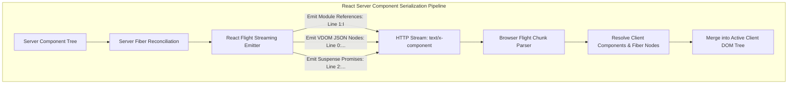

Open the Network tab in your browser while inspecting a modern Next.js App Router application during a client-side route transition.

Filter by Fetch/XHR. Click on a navigation link. You will not see a traditional JSON payload like you would from a REST API or tRPC. Nor will you see raw server-rendered HTML like you would from WordPress, Rails, or PHP.

Instead, you will see a strange, streaming response with the header `Content-Type: text/x-component`. The payload arrives in numbered, line-delimited text chunks that look like an alien serialization format:

```
1:I["(app-pages-browser)/./src/components/badge.tsx",["app/layout","static/chunks/app/layout.js"],"Badge"]
0:{"name":"Modern Architecture","badge":"$1"}
2:D{"defer":true}
3:H["layout.css"]
```

This is the **React Flight protocol**—the wire format that powers React Server Components (RSC).

Despite being the most consequential architectural shift in React's twelve-year history, the Flight protocol is rarely discussed at the byte level. Keynotes and documentation speak of Server Components as an abstract mental model: *"components that run on the server and never ship to the client."*

But in production systems engineering, abstractions are leaks waiting to spring. When does the Flight protocol outperform JSON? When does it secretly bloat your wire payload by 400%? And what happens when an engineer accidentally serializes an entire database ORM model across the server-client boundary?

Here is the complete wire-level breakdown of the React Flight protocol.



---

## 1. Why This Feature? The Double-Data Problem of Traditional SSR

To understand why React invented Flight, you must examine the historical flaw of traditional Single Page App Server-Side Rendering (SSR): **The Double-Data Penalty**.

In classic SSR (Next.js Pages Router, Nuxt 2, Remix v1):
1. The server fetches data from a database (`{ user: "Alice", orders: [...] }`).
2. The server renders HTML strings containing the data and sends them to the browser for immediate painting.
3. To make the page interactive, the browser must **hydrate** the Virtual DOM. But to hydrate, React needs the exact same data that generated the HTML!
4. Therefore, the server serializes the entire JSON dataset a second time into a `<script id="__NEXT_DATA__">` tag embedded in the HTML.

### The Double-Data Tax:
* Every byte of data is sent **twice**: once as static HTML, and once as raw JSON payload.
* The browser cannot interact with the page until it downloads, parses, and executes hundreds of kilobytes of client-side JavaScript that merely reconstructs UI the server already built.

React Server Components solve this by splitting components into two fundamental categories:
* **Server Components**: Run exclusively on the server, have direct access to backend resources, and **ship zero JavaScript to the client bundle**.
* **Client Components**: Interactive nodes that hydrate and respond to user events.

The Flight protocol is the bridge: a compact streaming wire representation that tells the client's React runtime exactly how to assemble the UI without shipping the server component source code.

---

## 2. Anatomy of the Wire: Deconstructing Flight Chunks

When a browser requests a Server Component route, the server flushes a stream of line-delimited records. Each line begins with an identifier, a tag, and a payload:

```
[Chunk ID]:[Type Tag][JSON Payload]
```

### 1. Module Reference Record (`I` = Import)
When the server encounters a `'use client'` directive, it cannot execute that component on the server. Instead, it emits a Client Reference record:

```
1:I["(app-pages-browser)/./src/components/cart-button.tsx",["static/chunks/app/cart.js"],"CartButton"]
```
* `1`: Unique chunk identifier.
* `I`: Indicates a Client Component import reference.
* First argument: File path and module bundle location.
* Second argument: Array of JavaScript chunks the browser must asynchronously fetch to render this component.
* Third argument: The export name (`CartButton`).

### 2. VDOM Tree Record (Model Output)
Next, the server emits the Virtual DOM structure of the server components, with placeholders pointing to the client references:

```
0:{"title":"Shopping Cart","total":99.50,"button":"$1"}
```
* `0`: Root model identifier.
* `"button": "$1"`: Notice the `$1` pointer! It tells the client: *"Place the Client Component registered at Chunk ID 1 into this exact VDOM slot."*

### 3. Suspense and Async Promise Chunks (`$` and `L`)
If a Server Component is wrapped in `<Suspense fallback={<Skeleton />}>`, the server immediately flushes the fallback UI in the initial burst:

```
2:{"status":"pending","fallback":"$Sreact.suspense"}
```

When the asynchronous database query resolves 300ms later, the server sends a resolution record across the exact same open HTTP connection:

```
2:{"status":"resolved","data":[{"id":1,"name":"Widget"}]}
```

The browser receives the chunk, matches it to Chunk ID 2, and seamlessly replaces the skeleton with the real UI without triggering a page reload or route re-fetch.

---

## 3. The Forensic Hazard: Payload Bloat and ORM Model Leakage

While the Flight protocol is mathematically elegant, it introduces a dangerous architectural trap in enterprise systems: **Over-Serialization**.

In a traditional REST API, backend engineers write DTOs (Data Transfer Objects) or serialize data through explicit schemas (Pydantic, Zod, Serializers). In full-stack React, the boundary between database query and UI prop is completely invisible.

### The Catastrophic Example:
```tsx
// app/dashboard/page.tsx (Server Component)
import prisma from '@/lib/db';
import UserProfileCard from '@/components/user-card'; // 'use client'

export default async function DashboardPage() {
  // Fetching the user from PostgreSQL
  const user = await prisma.user.findUnique({
    where: { id: 'usr_402' },
    include: { billing: true, sessions: true }
  });

  // Passing the entire Prisma model across the client boundary!
  return <UserProfileCard user={user} />;
}
```

### What Happens on the Wire:
Because `UserProfileCard` is a Client Component, React must serialize every single property of the `user` object into the Flight stream so the browser can hydrate it.

Even if `UserProfileCard` only displays `user.name`, the Flight wire payload will include:
* `user.password_hash`
* `user.stripe_customer_id`
* `user.internal_notes`
* `user.sessions` (historical session tokens and IP addresses)

### The Production Impact:
1. **Critical Security Vulnerability**: Private backend data and internal foreign keys are broadcast in plain text across the wire to any user inspecting the Network tab.
2. **Bandwidth Explosion**: A query that intended to display a 20-byte username transfers 45 kilobytes of JSON metadata per card. In a paginated table of 50 users, the Flight payload balloons to 2.2 megabytes.

### The Architectural Invariant:
**Never pass raw ORM entities across the `'use client'` boundary.** Always project database queries into strict view-model DTOs:

```tsx
const safeUser = {
  name: user.name,
  avatarUrl: user.avatarUrl
};

return <UserProfileCard user={safeUser} />;
```

---

## 4. Flight Protocol vs. Alternative Framework Wire Formats

| Framework | Wire Protocol | Serialization Unit | Hydration Cost on Client |
|---|---|---|---|
| **React Server Components** | **React Flight** (`text/x-component`) | Line-delimited VDOM tree + Client refs | Medium (Hydrates only `'use client'` subtrees) |
| **Astro** | Standard HTML + Script tags | HTML markup + Island script boundaries | **Zero for static parts; minimal on islands** |
| **Qwik** | HTML attributes with QRLs (`q:key`, `q:obj`) | Serialized signal graphs & event pointers | **Zero hydration (Instant resumability)** |
| **Remix / React Router 7** | Standard JSON / Turbo-Stream | Route loader JSON + full client VDOM | High (Hydrates full client component tree) |
| **tRPC / REST** | Standard JSON or MessagePack | Pure application data | High (Client templates render everything) |

---

## 5. Python Reference: Parsing the Flight Protocol

To understand how the browser runtime decodes the Flight stream, here is a functional Python decoder that parses a simulated React Flight chunk stream into an assembled UI tree:

```python
import json
import re
from typing import Any, Dict, List

class ReactFlightParser:
    """
    Decodes line-delimited React Flight protocol streams into an assembled VDOM model.
    """
    def __init__(self):
        self.client_modules: Dict[str, Dict[str, str]] = {}
        self.models: Dict[str, Any] = {}

    def parse_chunk(self, line: str) -> None:
        line = line.strip()
        if not line:
            return

        # Format: [id]:[TypeTag][Payload]
        match = re.match(r"^([0-9a-fA-F]+):([A-Z])?(.*)$", line)
        if not match:
            return

        chunk_id, tag, raw_payload = match.groups()

        # Tag 'I': Client Component Import Reference
        if tag == "I":
            payload = json.loads(raw_payload)
            self.client_modules[chunk_id] = {
                "bundle": payload[0],
                "chunks": payload[1],
                "export_name": payload[2]
            }
        else:
            # Standard model JSON
            self.models[chunk_id] = json.loads(raw_payload)

    def resolve_tree(self, root_id: str = "0") -> Any:
        """
        Recursively resolves pointers ($1, $2) into client component descriptors.
        """
        def _resolve(node: Any) -> Any:
            if isinstance(node, str) and node.startswith("$"):
                target_id = node[1:]
                if target_id in self.client_modules:
                    mod = self.client_modules[target_id]
                    return f"<ClientComponent: {mod['export_name']} from {mod['bundle']} />"
                elif target_id in self.models:
                    return _resolve(self.models[target_id])
            elif isinstance(node, dict):
                return {k: _resolve(v) for k, v in node.items()}
            elif isinstance(node, list):
                return [_resolve(item) for item in node]
            return node

        return _resolve(self.models.get(root_id, {}))

# Verification Execution
if __name__ == "__main__":
    sample_flight_stream = [
        '1:I["/static/chunks/cart-btn.js",["app/cart.js"],"CartButton"]',
        '0:{"pageTitle":"Product Catalog","items":[{"id":101,"name":"Mechanical Keyboard"}],"actionBtn":"$1"}'
    ]

    parser = ReactFlightParser()
    for chunk in sample_flight_stream:
        parser.parse_chunk(chunk)

    assembled_vdom = parser.resolve_tree("0")
    print("Assembled Client VDOM Tree:")
    print(json.dumps(assembled_vdom, indent=2))
```

---

## 6. Systems Architectural Summary

The React Flight protocol is not merely an incremental feature; it is **a custom distributed computing serialization format for UI component trees**.

By serializing Virtual DOM structures on the server and resolving client dependencies through progressive streams, Flight eliminates the double-data penalty of classic SSR. But it places a strict responsibility on developers: understanding the wire protocol is the only way to protect enterprise applications from silent payload bloat and database security leaks.
