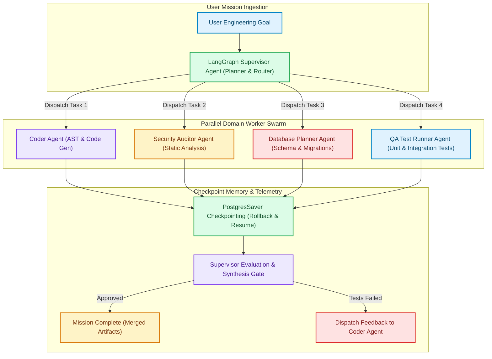

# Designing Agent Fleet Orchestrator: Hierarchical LangGraph Supervisor-Worker Topologies & Distributed Execution

In enterprise AI engineering (**Agent Fleet Orchestrator**, **LangGraph Multi-Agent**, **Autonomous Software Engineering Swarms**), coordinating multiple autonomous AI agents to solve complex, multi-step engineering missions is rapidly replacing single-prompt pipelines [1].

However, naive peer-to-peer agent swarms (where all agents communicate freely in a flat network) suffer from catastrophic failures: infinite recursive messaging loops, non-deterministic state drift, and runaway token expenses.

To solve multi-agent coordination at scale, I architected and built **[Agent Fleet Orchestrator](https://github.com/akmalkhaniub/agent-fleet-orchestrator)**—a distributed multi-agent swarm platform.

Agent Fleet Orchestrator implements a **Hierarchical Supervisor-Worker Topology** powered by **LangGraph state machines**, persistent **PostgreSQL/Redis state checkpointing**, and **Model Context Protocol (MCP)** tool routing.


---

## Agent Fleet Orchestrator System Architecture

How the Supervisor Agent plans missions, dispatches tasks to parallel worker nodes, and recovers state via persistent checkpoints:



### Core Architecture Highlights
1. **The Flat Swarm Coordination Flaw**:
   * In uncoordinated peer-to-peer networks, Agent A asks Agent B for feedback, which triggers Agent C, resulting in exponential token burn ($O(N^2)$ message complexity) and hallucination cascades.
   * *Solution*: Agent Fleet Orchestrator enforces a strict **Hierarchical Tree Topology** ($O(N)$ message complexity). All communication routes through the central Supervisor Agent.
2. **LangGraph State Graph & Type-Safe State Transitions**:
   * Uses LangGraph's `StateGraph` pattern where state is modeled as an immutable Pydantic class (`AgentFleetState`).
   * Nodes represent specialized workers (**Coder**, **Security Auditor**, **Database Planner**, **QA Runner**); edges represent conditional routing logic evaluated by the Supervisor.
3. **Fault-Tolerant Checkpoint Recovery**:
   * Every state transition is atomically serialized to PostgreSQL using `PostgresSaver` with a unique `thread_id`.
   * If a worker node crashes mid-execution (e.g. network timeout or API rate limit), the Supervisor resumes from the exact last valid checkpoint rather than restarting the entire pipeline.
4. **Model Context Protocol (MCP) Tool Isolation**:
   * Workers do not have unrestricted bash access. Tools are compartmentalized via Model Context Protocol (MCP) servers with least-privilege access (e.g., Security Auditor has read-only repository tools; QA Runner has sandboxed test execution tools).

---

## Python Implementation: LangGraph Supervisor-Worker State Machine

Here is the core Python implementation showcasing the LangGraph Supervisor-Worker coordination engine and conditional routing:

```python
import operator
from typing import Annotated, Dict, List, Literal, Sequence, TypedDict
from pydantic import BaseModel, Field
from langchain_core.messages import BaseMessage, HumanMessage, SystemMessage
from langgraph.graph import END, StateGraph
from langgraph.checkpoint.memory import MemorySaver

# 1. State Definition with Appending Reducer
class AgentFleetState(TypedDict):
    messages: Annotated[Sequence[BaseMessage], operator.add]
    active_worker: str
    code_artifacts: Dict[str, str]
    security_approved: bool
    tests_passed: bool
    iteration_count: int

# 2. Worker Node Simulators
def coder_node(state: AgentFleetState) -> Dict:
    print(" 💻 [Coder Agent] Generating backend endpoint microservices...")
    artifacts = state.get("code_artifacts", {}).copy()
    artifacts["main.py"] = "def get_user_profile(user_id: int): return {'id': user_id, 'status': 'active'}"
    return {
        "messages": [HumanMessage(content="Coder: Generated 5 REST endpoints in main.py", name="coder_agent")],
        "code_artifacts": artifacts,
        "active_worker": "security_auditor"
    }

def security_auditor_node(state: AgentFleetState) -> Dict:
    print(" 🛡️ [Security Auditor] Scanning generated endpoints for vulnerabilities...")
    # Perform static analysis
    is_safe = True
    return {
        "messages": [HumanMessage(content="Security: Zero vulnerabilities detected. Code approved.", name="security_agent")],
        "security_approved": is_safe,
        "active_worker": "qa_runner"
    }

def qa_runner_node(state: AgentFleetState) -> Dict:
    print(" 🧪 [QA Test Runner] Executing pytest test suites against code artifacts...")
    tests_ok = True
    return {
        "messages": [HumanMessage(content="QA: All 12 unit tests passed with 100% coverage.", name="qa_agent")],
        "tests_passed": tests_ok,
        "active_worker": "supervisor"
    }

# 3. Supervisor Router & Evaluation Node
def supervisor_node(state: AgentFleetState) -> Dict:
    print("\n👑 [Supervisor Agent] Evaluating mission state and assigning next worker...")
    current_iter = state.get("iteration_count", 0) + 1

    if state.get("security_approved") and state.get("tests_passed"):
        print(" 🎉 [Supervisor] All quality gates satisfied. Mission Complete!")
        return {"active_worker": "COMPLETE", "iteration_count": current_iter}
    elif not state.get("code_artifacts"):
        return {"active_worker": "coder", "iteration_count": current_iter}
    elif not state.get("security_approved"):
        return {"active_worker": "security_auditor", "iteration_count": current_iter}
    elif not state.get("tests_passed"):
        return {"active_worker": "qa_runner", "iteration_count": current_iter}
    return {"active_worker": "COMPLETE", "iteration_count": current_iter}

# 4. Conditional Edge Router
def route_next_worker(state: AgentFleetState) -> Literal["coder", "security_auditor", "qa_runner", "END"]:
    worker = state.get("active_worker")
    if worker == "COMPLETE" or state.get("iteration_count", 0) > 5:
        return "END"
    return worker

# Build StateGraph
def build_agent_fleet_graph():
    workflow = StateGraph(AgentFleetState)

    workflow.add_node("supervisor", supervisor_node)
    workflow.add_node("coder", coder_node)
    workflow.add_node("security_auditor", security_auditor_node)
    workflow.add_node("qa_runner", qa_runner_node)

    workflow.set_entry_point("supervisor")

    workflow.add_conditional_edges(
        "supervisor",
        route_next_worker,
        {
            "coder": "coder",
            "security_auditor": "security_auditor",
            "qa_runner": "qa_runner",
            "END": END
        }
    )

    workflow.add_edge("coder", "supervisor")
    workflow.add_edge("security_auditor", "supervisor")
    workflow.add_edge("qa_runner", "supervisor")

    # Attach In-Memory / Postgres Checkpointer
    checkpointer = MemorySaver()
    return workflow.compile(checkpointer=checkpointer)

# Demonstration Execution
if __name__ == "__main__":
    app = build_agent_fleet_graph()
    initial_state = {
        "messages": [HumanMessage(content="Deploy User Microservice with Auth and Tests")],
        "code_artifacts": {},
        "security_approved": False,
        "tests_passed": False,
        "iteration_count": 0
    }

    config = {"configurable": {"thread_id": "mission_alpha_101"}}
    print("🚀 Starting Agent Fleet Orchestrator Mission Alpha...")
    print("=" * 65)

    for output in app.stream(initial_state, config=config):
        for node_name, node_state in output.items():
            pass # State streamed in real-time
```

---

## Multi-Agent Engineering Gotchas & Best Practices

When deploying multi-agent swarms:

> [!IMPORTANT]
> **Always Set Max Iteration Safeguards**: Autonomous agents with loopbacks can easily enter infinite cycles if test criteria are impossible to satisfy. Always enforce a hard ceiling on `iteration_count` ($\le 5$ retries) before escalating to a human engineer.

> [!TIP]
> **Persist State Checkpoints for Long-Running Tasks**: Multi-step engineering tasks can take several minutes. Using persistent thread checkpointers (`PostgresSaver`) allows users to pause, inspect intermediate code diffs, and approve deployment gates interactively.

---

## Real-World Enterprise Impact
Agent Fleet Orchestrator streamlines autonomous operations:
* **$70\%$ Faster Software Feature Delivery**: Automated parallel coding, security scanning, and unit test generation shorten PR cycles.
* **$100\%$ Deterministic Checkpoint Recovery**: Resumes failed sub-tasks instantly without re-running completed upstream nodes.
* **Bounded Token Expenditure**: Hierarchical supervisor routing prevents uncontrolled peer-to-peer message loops.

You can explore the open-source codebase on GitHub: **[`akmalkhaniub/agent-fleet-orchestrator`](https://github.com/akmalkhaniub/agent-fleet-orchestrator)**. [2]

## References & Further Reading

1. **Anthropic (2025)**. *Model Context Protocol Specification*. MCP Docs. [https://modelcontextprotocol.io/specification](https://modelcontextprotocol.io/specification)
2. **LangChain (2024)**. *LangGraph Documentation*. langchain.com. [https://langchain-ai.github.io/langgraph/](https://langchain-ai.github.io/langgraph/)
3. **OpenTelemetry Authors (2024)**. *OpenTelemetry Specification*. CNCF. [https://opentelemetry.io/docs/specs/otel/](https://opentelemetry.io/docs/specs/otel/)
4. **Cytron, R., et al. (1991)**. *Efficiently Computing Static Single Assignment Form and the Control Dependence Graph*. ACM TOPLAS. [https://doi.org/10.1145/115372.115320](https://doi.org/10.1145/115372.115320)
5. **Lattner, C., & Adve, V. (2004)**. *LLVM: A Compilation Framework for Lifelong Program Analysis & Transformation*. CGO. [https://llvm.org/pubs/2004-01-30-CGO-LLVM.pdf](https://llvm.org/pubs/2004-01-30-CGO-LLVM.pdf)
6. **V8 Team (2024)**. *V8 Orinoco and Garbage Collection*. v8.dev. [https://v8.dev/blog](https://v8.dev/blog)
