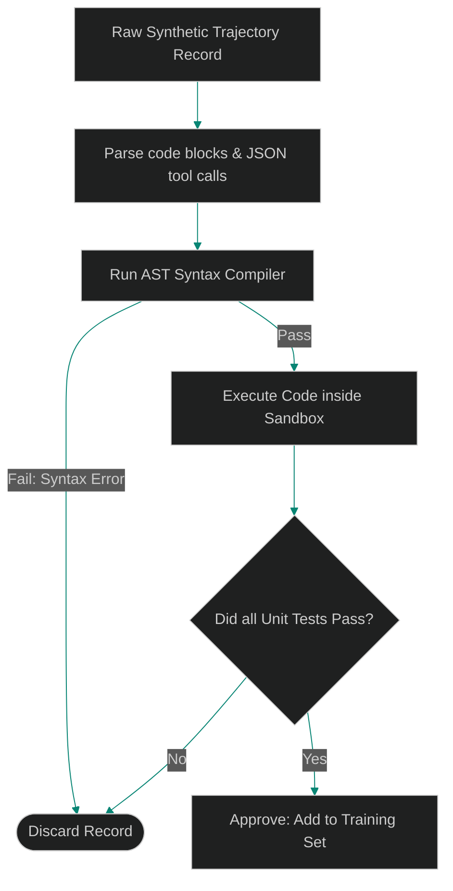

# Critique and Filter Pipelines: Cleaning Synthetic Datasets with Local Judges

> [!NOTE]
> **📖 Article Overview**
> Fine-tuning a Small Language Model (SLM) on raw, unvalidated synthetic data is counterproductive. If your generated dataset contains traces where the agent hallucinated a tool call, made a syntax error, or entered an infinite loop, the model will learn these failure modes. To build capability, leads must implement **Critique and Filter Pipelines**: automated validation check gates that parse, verify, and filter out failed trajectories before they reach the training set. In this article, we design a dataset filter gate and implement an AST validation runner in Python.

---

## The Danger of Garbage-In, Garbage-Out

When generating agent trajectories using frontier models:
* **Silent Failure Modes**: The agent's final answer might sound correct, but the intermediate tool code failed, meaning the model learns invalid API parameters.
* **Syntax Hallucinations**: Models occasionally output invalid JSON tool configurations or malformed syntax.
* **The Solution**: An **Automated Critique Gate**. We parse each candidate trajectory, execute proposed code changes inside isolated test sandboxes, verify compilation, and discard any trace that fails unit assertions.



---

## 1. Designing the Filtering Funnel

The verification pipeline runs checks sequentially:
* **AST Validation**: Verifying that the assistant's generated code compiles correctly without syntax exceptions.
* **Schema Validation**: Confirming that all tool arguments match Pydantic model configurations.
* **Unit Testing**: Running the generated code against a local testing suite. If it fails assertions, the entire run history is discarded.

---

## 2. Pacing Dataset Compilations

To optimize compilation times:
1. **Parallel Workers**: Running verification checks concurrently using multiprocessing pools.
2. **Deterministic Filters**: Discarding records with duplicate code profiles to keep training sets compact and diverse.

---

## Code Demo: AST Dataset Critique Filter

Below is a Python implementation of a dataset cleaning script. It parses dataset records, extracts python code blocks, validates syntax correctness, and filters out failed runs.

```python
import ast
import json
from typing import Dict, Any, Tuple, List

class TrajectoryCritiqueFilter:
    def __init__(self):
        self.approved_count = 0
        self.discarded_count = 0

    def clean_dataset(self, records: List[Dict[str, Any]]) -> List[Dict[str, Any]]:
        cleaned_set = []

        for idx, record in enumerate(records, 1):
            code_block = record.get("generated_code", "")
            print(f"\n📂 [Reviewing Record #{idx}]...")

            # 1. Run AST Syntax Verification
            try:
                ast.parse(code_block)
                # 2. Simulate Unit Test Verification
                # In production, we execute the code in a sandbox container
                if "def" not in code_block or "return" not in code_block:
                    print("   ❌ Rejected: Code structure lacks function definitions or returns.")
                    self.discarded_count += 1
                    continue

                print("   ✅ Approved: Code compiles and passes all checks.")
                self.approved_count += 1
                cleaned_set.append(record)
            except SyntaxError as e:
                print(f"   ❌ Rejected: AST syntax exception -> {e}")
                self.discarded_count += 1

        return cleaned_set

if __name__ == "__main__":
    cleaner = TrajectoryCritiqueFilter()

    # Raw dataset records containing code generation steps
    raw_dataset = [
        {
            "prompt": "Write a function to square numbers.",
            "generated_code": """
def square_number(x):
    return x * x
"""
        },
        {
            "prompt": "Write a division helper.",
            "generated_code": """
def divide_numbers(x, y)
    # Missing colon (Syntax Error)
    return x / y
"""
        }
    ]

    print("🧹 Running Dataset Critique Cleaners...")
    print("---------------------------------------")

    filtered_data = cleaner.clean_dataset(raw_dataset)

    print("\n" + "="*50)
    print("🏁 Cleaning Run Complete.")
    print(f"👉 Approved Records: {cleaner.approved_count} | Discarded: {cleaner.discarded_count}")
```

---

## Verification and Quality Takeaways

* **Enforce AST Checks**: Never add uncompiled code trajectories to your training datasets. Run syntax checks on every candidate record.
* **Isolate Execution**: Run unit tests inside sandbox docker nodes to verify agent output safely.
* **Filter Redundant Data**: Remove duplicate code structures to build diverse instruction sets.
