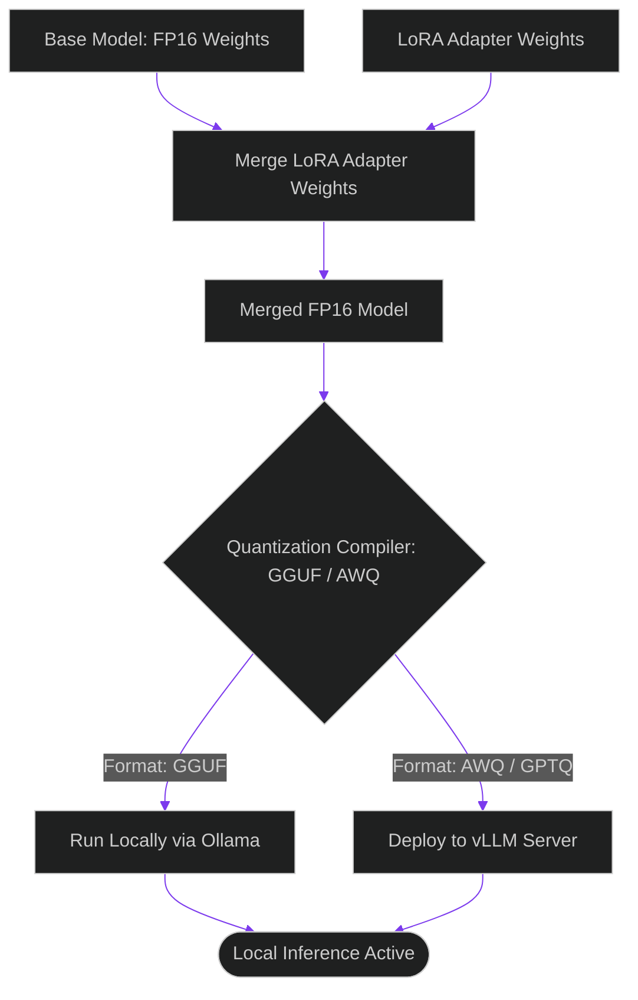

# Fine-Tuning Runtimes: Quantizing and Exporting Distilled Edge Agents

> [!NOTE]
> **📖 Article Overview**
> Once you have compiled a clean, validated instruction dataset and executed your fine-tuning run (e.g. using LLaMA-Factory or Unsloth), you have a set of LoRA adapters or a merged base model. To deploy this model locally on resource-constrained edge servers, you must quantize it to reduce VRAM memory footprints. In this article, we map the model compilation pipeline, compare quantization standards, and implement a **vLLM Inference Config Compiler** in Python.

---

## Merging LoRA Weights and Exporting Parameters

Fine-tuning often yields a set of **LoRA (Low-Rank Adaptation) adapter weights** stored separately from the base model. To prepare the model for high-throughput serving:
1. **Model Merging**: Merge the LoRA adapter weights back into the base model (e.g. `Llama-3-8B`) to create a single, unified set of parameter tensors.
2. **Precision Reduction (Quantization)**: Compress 16-bit floating-point weights (FP16) to 4-bit or 8-bit integer formats to fit the model within small GPU VRAM footprints.



---

## 1. Comparing Quantization Standards: AWQ vs. GGUF

Choosing the correct format depends on your target deployment runtime:
* **GGUF (GPT-Generated Unified Format)**: Optimized for CPU and mixed CPU/GPU serving. It is the standard format for Ollama, llama.cpp, and local desktop integrations.
* **AWQ (Activation-aware Weight Quantization)**: Designed for high-performance GPU serving. It keeps Capable capability on task benchmarks and integrates with `vLLM` runtimes.

---

## 2. Setting up High-Throughput Serving Parameters

To optimize serving performance on vLLM engines:
1. **Configure PagedAttention**: Allocate GPU memory block sizes (e.g. `block_size = 16`) to prevent memory fragmentation.
2. **Limit Max Model Length**: Keep the maximum token sequence context bounded (e.g., `max_model_len = 8192`) to control KV-cache size.

---

## Code Demo: vLLM Inference Config Compiler

Below is a Python implementation of a vLLM serving config compiler. It evaluates hardware VRAM resources, checks model formats, and compiles optimized serving configuration JSON files.

```python
import json
from typing import Dict, Any, Tuple

class VLLMConfigCompiler:
    def __init__(self, available_vram_gb: float):
        self.vram = available_vram_gb

    def compile_serving_config(self, model_name: str, model_format: str, size_gb: float) -> Tuple[bool, Dict[str, Any], str]:
        # Initialize base config parameters
        config = {
            "model": model_name,
            "quantization": None,
            "gpu_memory_utilization": 0.90,
            "max_model_len": 4096,
            "block_size": 16
        }

        # 1. Determine optimal quantization format based on size and VRAM
        if model_format == "FP16":
            if size_gb > self.vram:
                # If model is too large, recommend AWQ quantization
                config["quantization"] = "awq"
                compressed_size = size_gb * 0.25 # 4-bit compression
                if compressed_size > self.vram:
                    return False, {}, "Model is too large even with 4-bit AWQ quantization."
                print(f"⚠️ [Config Compiler] Merged FP16 size ({size_gb} GB) exceeds VRAM ({self.vram} GB). Compressing to 4-bit AWQ...")
            else:
                config["quantization"] = None

        elif model_format in ["AWQ", "GPTQ"]:
            config["quantization"] = model_format.lower()

        # 2. Adjust GPU memory utilization safety margins
        # Leaving 10% VRAM headroom for KV-cache and system overheads
        config["gpu_memory_utilization"] = 0.90

        return True, config, "Successfully compiled vLLM serving configuration."

if __name__ == "__main__":
    # Simulate a local edge workstation GPU with 8 GB of VRAM
    compiler = VLLMConfigCompiler(available_vram_gb=8.0)

    # Model Case 1: Large merged FP16 model (16 GB)
    model_name_1 = "qwen-7b-instruct-merged"
    success_1, cfg_1, msg_1 = compiler.compile_serving_config(model_name_1, "FP16", size_gb=14.0)
    
    print("🚀 Running vLLM Serving Configuration Compiler...")
    print("-------------------------------------------------")
    
    print(f"\n[Case 1] Model: {model_name_1}")
    print(f"Status: **{success_1}** | Message: {msg_1}")
    if success_1:
        print(json.dumps(cfg_1, indent=2))

    # Model Case 2: Lightweight AWQ quantized model
    model_name_2 = "llama-3-8b-awq"
    success_2, cfg_2, msg_2 = compiler.compile_serving_config(model_name_2, "AWQ", size_gb=4.5)
    print(f"\n[Case 2] Model: {model_name_2}")
    print(f"Status: **{success_2}** | Message: {msg_2}")
    if success_2:
        print(json.dumps(cfg_2, indent=2))
```

---

## Deployment Takeaways

* **Quantize for GPU serving**: Use AWQ or GPTQ quantization formats when deploying models to vLLM servers to maximize throughput.
* **Configure Memory Headroom**: Keep `gpu_memory_utilization` around `0.90` (90%) to leave VRAM space for the KV-cache.
* **Decouple Base and Adapter Weights**: During development, keep LoRA weights separate from base models to compile and test modifications rapidly.
