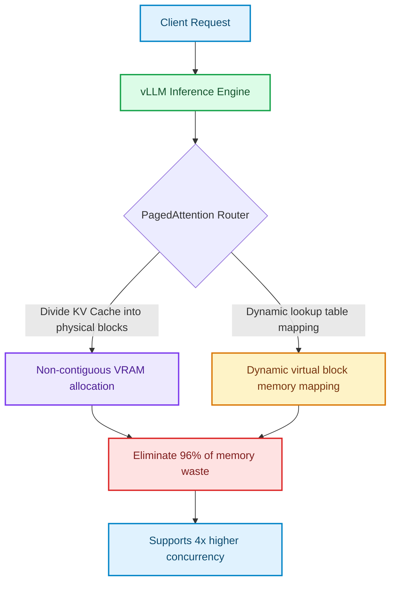

# Distilled SLM Serving: Quantization, PagedAttention, and Production Latency Tuning

After validating and fine-tuning your Small Language Model (SLM) on agent execution datasets, the final challenge is deploying the model into production [1]. Unlike large-scale API endpoints that run on massive server clusters, SLMs are typically hosted on single-GPU instances or edge servers.

To support high-throughput agent loops under 50ms per token, we must optimize serving latency. This article covers **quantization formats (AWQ, GPTQ, GGUF)**, **PagedAttention memory management**, and production configuration tuning inside high-performance inference engines like **vLLM**.

---

## The Production Bottleneck: KV Cache Allocation

In autoregressive generation, the model predicts tokens one-by-one. To speed up calculations, the key-value (KV) states of all previous tokens are cached in VRAM (the **KV Cache**).

In traditional serving frameworks (like Hugging Face Transformers), VRAM is allocated statically and contiguously for each request. This causes two massive inefficiencies:
1. **Internal Fragmentation**: If a request allocates space for 2048 tokens but only uses 100, the remaining space lies wasted.
2. **External Fragmentation**: Virtual memory slots cannot be shared across concurrent requests.



**vLLM** solves this by introducing **PagedAttention**, which partitions the KV cache into logical blocks mapped to non-contiguous physical pages in VRAM, mimicking virtual memory paging in operating systems. This reduces VRAM waste to near zero, enabling 2–4× higher batch sizes and concurrency.

---

## Production-Grade vLLM Serving Configuration

Here is a Python script to initialize a high-throughput vLLM engine instance for a quantized 4-bit AWQ model, configuring PagedAttention parameters and KV cache limits for production.

```python
from vllm import LLM, SamplingParams
import os

# Define model paths and configurations
MODEL_PATH = "Qwen/Qwen2.5-7B-Instruct-AWQ"  # Load pre-quantized 4-bit AWQ model
MAX_MODEL_LEN = 4096                           # Max sequence context boundary

print(f"Initializing vLLM Engine for quantized model: {MODEL_PATH}")

# Initialize the vLLM engine with PagedAttention tuning
llm = LLM(
    model=MODEL_PATH,
    quantization="awq",                        # Explicitly define AWQ loader
    max_model_len=MAX_MODEL_LEN,
    
    # PagedAttention & VRAM tuning parameters
    gpu_memory_utilization=0.90,               # Allocate 90% of GPU VRAM for the engine
    max_num_seqs=256,                          # Max concurrent requests in a single batch
    
    # KV Cache Configuration
    max_num_batched_tokens=4096,
    trust_remote_code=True,
    
    # Block size optimization (typically 16 or 32 for optimal memory paging)
    block_size=16
)

# Define sampling configurations optimized for deterministic agent tool calls
sampling_params = SamplingParams(
    temperature=0.0,                           # Zero temperature enforces strict determinism
    max_tokens=512,                            # Maximum response length per call
    stop=["<|im_end|>", "<|endoftext|>"],      # Stop tokens to prevent runtime runaways
    presence_penalty=0.0,
    frequency_penalty=0.0
)

def execute_agent_prompt(user_query: str) -> str:
    """
    Submit task query to the local vLLM server engine.
    """
    formatted_prompt = f"<|im_start|>user\n{user_query}<|im_end|>\n<|im_start|>assistant\n"
    
    print(f"Submitting query to inference engine...")
    outputs = llm.generate([formatted_prompt], sampling_params)
    
    # Extract generated output
    generated_text = outputs[0].outputs[0].text
    return generated_text

if __name__ == "__main__":
    test_query = "Read telemetry logs and locate connection timeouts."
    response = execute_agent_prompt(test_query)
    print(f"Engine response:\n{response}")
```

---

## Quantization Trade-offs (AWQ vs. GGUF vs. GPTQ)

When selecting a serving model, developers must choose the appropriate format:

1. **AWQ (Activation-aware Weight Quantization)**:
   * *Strengths*: Highly optimized for GPUs. Protects the top 1% most important weights from accuracy loss during 4-bit compression.
   * *Best For*: High-throughput server deployments running on NVIDIA A10/A100/H100 cards.
2. **GPTQ (Generalized Post-Training Quantization)**:
   * *Strengths*: Solid compression, fast execution speeds.
   * *Best For*: Standard GPU serving environments with fixed batch allocations.
3. **GGUF (GPT-Generated Unified Format)**:
   * *Strengths*: Highly optimized for CPU-only and Apple Silicon execution via llama.cpp.
   * *Best For*: Local development workstations and edge systems lacking dedicated GPUs.

---

## Important Pitfalls in Model Serving

Keep these constraints in mind to prevent service interruptions:

> [!IMPORTANT]
> **VRAM Allocation Conflicts**: By default, vLLM attempts to occupy 90% of GPU memory for its KV cache allocator. If you attempt to run database engines, Python workers, or web gateways on the same GPU, the process will crash with an out-of-memory error. Adjust `gpu_memory_utilization` downward (e.g., 0.50–0.60) if sharing resources.

> [!CAUTION]
> **Context Window Flooding**: If an agent outputs massive execution loops, it will flood the KV cache. Implement strict token counters on input prompt lengths to avoid hitting the context limit and dropping requests. [2]

## References & Further Reading

1. **Dao, T., et al. (2022)**. *FlashAttention: Fast and Memory-Efficient Exact Attention with IO-Awareness*. NeurIPS. [https://arxiv.org/abs/2205.14135](https://arxiv.org/abs/2205.14135)
2. **Vaswani, A., et al. (2017)**. *Attention Is All You Need*. NeurIPS. [https://arxiv.org/abs/1706.03762](https://arxiv.org/abs/1706.03762)
3. **Kwon, W., et al. (2023)**. *Efficient Memory Management for Large Language Model Serving with PagedAttention*. SOSP. [https://arxiv.org/abs/2309.06180](https://arxiv.org/abs/2309.06180)
4. **Leviathan, Y., Kalman, M., & Matias, Y. (2023)**. *Fast Inference from Transformers via Speculative Decoding*. ICML. [https://arxiv.org/abs/2211.17192](https://arxiv.org/abs/2211.17192)
5. **Hu, E. J., et al. (2021)**. *LoRA: Low-Rank Adaptation of Large Language Models*. ICLR. [https://arxiv.org/abs/2106.09685](https://arxiv.org/abs/2106.09685)
6. **Dettmers, T., et al. (2023)**. *QLoRA: Efficient Finetuning of Quantized LLMs*. NeurIPS. [https://arxiv.org/abs/2305.14314](https://arxiv.org/abs/2305.14314)
7. **Lin, J., et al. (2024)**. *AWQ: Activation-aware Weight Quantization for LLM Compression and Acceleration*. MLSys. [https://arxiv.org/abs/2306.00978](https://arxiv.org/abs/2306.00978)
