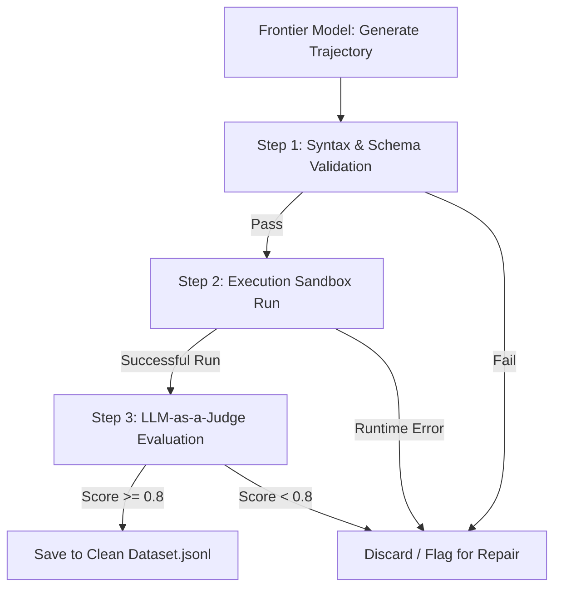

# Synthetic Curation: Generating and Filtering Agent Trajectories for SLM Distillation

To build small, highly efficient, domain-specific models (Small Language Models, or SLMs) that can run locally on edge devices or inside private subnets, developers rely on **Knowledge Distillation**. Instead of training a model from scratch, we teach the SLM by fine-tuning it on execution outputs—specifically, step-by-step reasoning runs and tool execution trajectories—generated by larger, highly capable frontier models (like GPT-4o, Claude 3.5 Sonnet, or Gemini 1.5/2.0 Pro).

However, raw synthetic trajectories generated by frontier models are often full of flaws, such as invalid tool schemas, repetitive loops, or hallucinated logic. Fine-tuning an SLM on uncurated data results in poor model performance.

This article details how to build a programmatic **Synthetic Trajectory Curation Pipeline** to generate, evaluate, and filter execution datasets for SLM distillation.

---

## The Curation Pipeline Architecture

Rather than relying on human review to verify thousands of multi-step logs, we implement a automated, programmatic verification funnel:



1. **Generation**: The frontier model is prompted to solve a complex task, outputting its thinking process and tool executions as a structured JSON tree.
2. **Schema Verification**: We verify that the tool payloads match target JSON schemas using libraries like Pydantic.
3. **Sandbox Validation**: We execute the tool calls inside a sandboxed runtime environment (Docker/micro-VM) to verify that the code compiles and functions correctly.
4. **LLM-as-a-Judge Evaluation**: A separate frontier model reviews the trajectory to grade its reasoning quality.

---

## Implementing a Trajectory Curation Pipeline

Here is a production-ready Python script that parses agent execution trajectories, verifies their JSON schemas, executes the tool outputs inside a validation sandbox, and outputs a sanitized training dataset.

```python
import json
import uuid
from typing import Dict, Any, List, Optional
from pydantic import BaseModel, ValidationError, Field

# Define target tool execution schema
class ToolCall(BaseModel):
    tool_name: str = Field(..., min_length=1)
    arguments: Dict[str, Any]
    expected_output_type: str

class TrajectoryStep(BaseModel):
    step_id: str
    rationale: str
    tool_calls: List[ToolCall]

class AgentTrajectory(BaseModel):
    trajectory_id: str
    user_query: str
    steps: List[TrajectoryStep]
    final_response: str

class TrajectoryFilter:
    """
    Programmatic filter to sanitize and validate synthetic agent trajectories
    before adding them to the fine-tuning dataset.
    """
    def __init__(self, schema_validator: BaseModel):
        self.validator = schema_validator

    def validate_schema(self, raw_data: Dict[str, Any]) -> Optional[BaseModel]:
        try:
            # Enforce validation rules
            validated = self.validator.model_validate(raw_data)
            return validated
        except ValidationError as err:
            print(f"[Schema Failure] Invalid trajectory format: {err}")
            return None

    def check_infinite_loops(self, trajectory: AgentTrajectory) -> bool:
        """
        Detects repetitive tool execution loops in the agent's run.
        """
        seen_calls = set()
        for step in trajectory.steps:
            for call in step.tool_calls:
                call_fingerprint = f"{call.tool_name}:{sorted(call.arguments.items())}"
                if call_fingerprint in seen_calls:
                    # Duplicate execution detected (infinite loop)
                    return True
                seen_calls.add(call_fingerprint)
        return False

    def process_and_sanitize(self, raw_dataset: List[Dict[str, Any]]) -> List[Dict[str, Any]]:
        clean_dataset = []
        for index, item in enumerate(raw_dataset):
            trajectory = self.validate_schema(item)
            if not trajectory:
                continue
            
            # Filter out trajectories stuck in infinite loops
            if self.check_infinite_loops(trajectory):
                print(f"[Filter Event] Excluded trajectory {item.get('trajectory_id')}: Loop detected.")
                continue

            # Format the output into standard instruction-response pairs for SLMs
            clean_dataset.append({
                "instruction": trajectory.user_query,
                "response": self._format_trajectory_output(trajectory)
            })
        return clean_dataset

    def _format_trajectory_output(self, trajectory: AgentTrajectory) -> str:
        """
        Formats structured steps into a unified string representing the optimal reasoning path.
        """
        output = ""
        for step in trajectory.steps:
            output += f"Thought: {step.rationale}\n"
            for call in step.tool_calls:
                output += f"Tool: {call.tool_name} with args: {json.dumps(call.arguments)}\n"
        output += f"Final Answer: {trajectory.final_response}"
        return output

# Demonstration usage
if __name__ == "__main__":
    raw_sample = {
        "trajectory_id": str(uuid.uuid4()),
        "user_query": "Calculate employee salary payouts for Department 12",
        "steps": [
            {
                "step_id": "step-1",
                "rationale": "Fetch list of active staff in department 12.",
                "tool_calls": [
                    {"tool_name": "get_department_staff", "arguments": {"dept_id": 12}, "expected_output_type": "json"}
                ]
            }
        ],
        "final_response": "Staff salary calculations completed."
    }

    filter_engine = TrajectoryFilter(AgentTrajectory)
    result = filter_engine.process_and_sanitize([raw_sample])
    print(f"Sanitized outputs generated: {len(result)}")
```

---

## Important Pitfalls in Data Synthesis

When curating synthetic datasets, developers must establish strict filtering bounds:

> [!IMPORTANT]
> **Format Drift**: Frontier models can occasionally output markdown wrap identifiers (e.g. ` ```json ` blocks) inside dynamic API payload strings. Always run a regex sanitizer pass to extract pure string inputs before running JSON parser modules.

> [!CAUTION]
> **Data Contamination**: Ensure that the synthetic datasets do not contain test questions or benchmark targets. Run deduplication passes against your validation test suites to prevent inflated benchmark scores during model training.

---

## Real-World Production Adoption
Enterprise development teams rely on trajectory curation to build domain-specific models:
* **Private Finance Dashboards**: Distill small models to orchestrate banking databases locally, filtering training logs to ensure no private client data leaks into the training pipeline.
* **Embedded Robotics Systems**: Compile lightweight models that parse sensory inputs, utilizing synthetic loops to teach the model how to recovery from network call errors without crashing.
