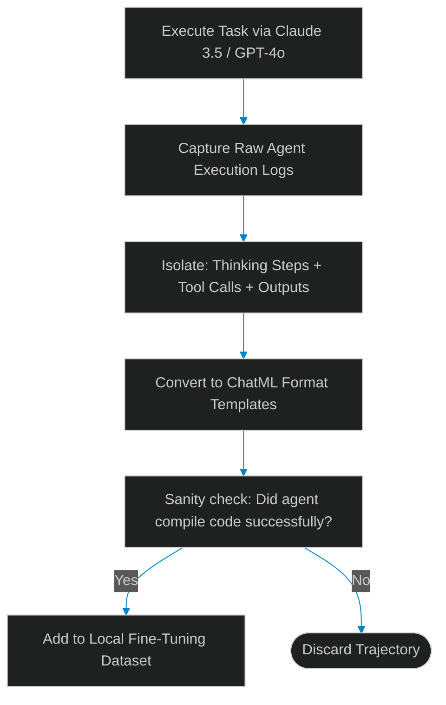

# Synthetic Trajectory Generation: Compiling Frontier Agent Traces for Distillation

> [!NOTE]
> **📖 Article Overview**
> Running frontier models (like Claude 3.5 Sonnet or GPT-4o) across large agent swarms is economically unsustainable. To reduce operational token costs while keeping system capability high, architects must fine-tune local Small Language Models (SLMs) to mimic frontier capabilities. The foundation of this process is **Synthetic Trajectory Generation**: capturing thinking logs, tool selections, and terminal outputs from frontier models and structuring them into instruction datasets. In this article, we map the distillation pipeline and implement a ChatML dataset parser in Python.

---

## The Path to Local Agent Independence

Enterprise agent workflows require Capable and Fast reasoning.
If we rely entirely on cloud APIs, we experience:
* **High Token Costs**: Multi-agent loops consume millions of tokens daily, causing large API bills.
* **Network Dependency**: Outages or API latency degrade agent responsiveness.
* **The Solution**: **Model Distillation**. We use frontier models to generate thousands of clean execution traces (trajectories), compile them into structured ChatML (Chat Markup Language) templates, and use them to fine-tune local models (like Qwen-Coder-7B or Llama-3-8B).



---

## 1. Structuring Trajectories in ChatML format

To fine-tune a model for tool calling, the dataset must follow a strict ChatML syntax:
* **System Prompt**: Defining the agent's target role and tool schemas.
* **Assistant Thinking (`<think>`)**: Exposing the internal reasoning steps leading to tool choices.
* **Tool Invocations**: Structured JSON commands executing specific tools.
* **Tool Returns**: Input payloads representing tool outputs.

---

## 2. Compiling Training Sets

When compiling datasets:
1. **Deduplicate Traces**: Filter out redundant or highly similar trajectories to prevent model overfitting.
2. **Standardize Prompts**: Ensure all system instructions use consistent tool format contracts.

---

## Code Demo: Agent Trajectory Compiler

Below is a Python implementation of a dataset compiler. It takes a raw execution trace showing reasoning steps, tool calls, and returns, and parses the log into clean ChatML dataset rows.

```python
import json
from typing import Dict, List, Any

class AgentTrajectoryCompiler:
    def __init__(self, system_instruction: str):
        self.system_instruction = system_instruction

    def compile_trace_to_chatml(self, raw_trace: Dict[str, Any]) -> str:
        messages = [
            {"role": "system", "content": self.system_instruction},
            {"role": "user", "content": raw_trace.get("user_goal", "")}
        ]

        # Extract reasoning and tool calls
        thinking = raw_trace.get("thinking_log", "")
        tool_call = raw_trace.get("tool_call", {})
        
        assistant_content = f"<think>\n{thinking}\n</think>\n"
        if tool_call:
            assistant_content += f"```json\n{json.dumps(tool_call, indent=2)}\n```"

        messages.append({"role": "assistant", "content": assistant_content})

        # Append tool output
        tool_response = raw_trace.get("tool_response", "")
        if tool_response:
            messages.append({"role": "tool", "name": tool_call.get("name", "tool"), "content": tool_response})

        # Append final resolution
        final_answer = raw_trace.get("final_answer", "")
        if final_answer:
            messages.append({"role": "assistant", "content": final_answer})

        # Format as training-ready JSON Lines (JSONL)
        return json.dumps({"messages": messages}, ensure_ascii=False)

if __name__ == "__main__":
    system_prompt = "You are a database agent. Use tools to query schemas."
    compiler = AgentTrajectoryCompiler(system_prompt)

    # Simulated execution trace from Claude 3.5
    raw_agent_log = {
        "user_goal": "Get active users count.",
        "thinking_log": "Querying users table. Filter where status = active.",
        "tool_call": {
            "name": "run_sql",
            "arguments": {"query": "SELECT COUNT(*) FROM users WHERE status = 'active';"}
        },
        "tool_response": "{\"count\": 150}",
        "final_answer": "There are currently 150 active users."
    }

    print("📝 Compiling Agent Trajectory to ChatML dataset...")
    print("-------------------------------------------------")
    
    chatml_output = compiler.compile_trace_to_chatml(raw_agent_log)
    
    # Pretty print the JSONL output
    parsed_json = json.loads(chatml_output)
    print(json.dumps(parsed_json, indent=2))
```

---

## Architectural Guidelines

* **Capture Chain-of-Thought (CoT)**: Always include intermediate reasoning tags (`<think>`) in training datasets to help local models learn structured planning.
* **Deduplicate Prompt Contexts**: Filter out duplicate query patterns to build balanced training datasets.
* **Standardize Formats**: Format datasets using ChatML standards to ensure compatibility with fine-tuning libraries like Unsloth or Axolotl.
