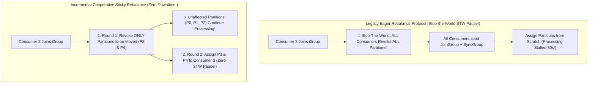

# Distributed Consumer Group Rebalancing: Eager Protocol vs Cooperative Sticky Rebalancing

In real-time distributed stream processing (**Apache Kafka**, **Kafka Streams**, **Apache Flink**), consumer groups scale message consumption by distributing topic partitions across multiple consumer worker nodes.

When microservices auto-scale (e.g., adding 5 new consumer pods) or when a node crashes, the cluster must re-assign partition ownership among surviving workers.

This re-assignment process is known as a **Consumer Group Rebalance**.

Historically, early Kafka releases relied on the **Eager Rebalance Protocol**, which forced all consumers to revoke all partitions simultaneously—causing catastrophic **Stop-The-World (STW) processing pauses** across the entire pipeline.

To eliminate processing interruptions, modern streaming platforms deploy **Incremental Cooperative Sticky Rebalancing** (`CooperativeStickyAssignor`).

This article details Group Coordinator broker heartbeats, Eager vs Cooperative Sticky protocols, two-phase incremental revocation, and stateful stream cache preservation.

---

## Consumer Group Coordination & Cooperative Sticky Rebalancing

How Incremental Cooperative Sticky Rebalancing eliminates Stop-the-World processing pauses during consumer pod auto-scaling:



### Core Consumer Group Rebalancing Principles
1. **The Group Coordinator & Heartbeat Protocol**:
   * One broker is designated as the **Group Coordinator** for a specific consumer group.
   * Consumers send background `Heartbeat` requests every `heartbeat.interval.ms` (e.g. 3s).
   * If a consumer fails to send heartbeats within `session.timeout.ms` (e.g. 45s) or fails to poll messages within `max.poll.interval.ms`, the Group Coordinator marks the node dead and triggers a Rebalance.
2. **Legacy Eager Rebalance Protocol (Stop-The-World)**:
   * *Phase 1 (Revoke Everything)*: As soon as a rebalance triggers, every consumer revokes *all* assigned partitions and pauses consumption.
   * *Phase 2 (Join & Sync)*: Consumers send `JoinGroup` requests. The coordinator selects a Leader Consumer to compute partition assignments, returning the layout via `SyncGroup`.
   * *The Problem*: In large consumer clusters with hundreds of partitions, Eager rebalancing stalls end-to-end processing for 30 seconds or longer!
3. **Incremental Cooperative Sticky Rebalancing (`CooperativeStickyAssignor`)**:
   * Introduced in Kafka 2.4+, Cooperative Rebalancing breaks rebalancing into two non-blocking incremental rounds:
     * **Round 1 (Incremental Revocation)**: Consumers evaluate assignment changes. Consumers revoking partitions emit a `JoinGroup` request with their updated state. **Crucially, consumers retain ownership of unaffected partitions and keep processing messages without pause!**
     * **Round 2 (Re-Assignment)**: The newly revoked partitions are assigned to the new consumer node.
4. **Sticky Partition Ownership**:
   * In stateful stream processing (**Kafka Streams**, **Flink RocksDB state stores**), moving a partition to a new node requires downloading gigabytes of local state store data over the network.
   * **Sticky Assignor**: Guarantees that partitions remain assigned to their existing consumer nodes whenever possible, preserving local state caches and avoiding expensive state store rebuilds.

---

## Python Implementation: Incremental Cooperative Sticky Rebalancer Engine

Here is a production-grade Python implementation of a Distributed Consumer Group Coordinator and Incremental Cooperative Sticky Rebalance Engine:

```python
import time
from typing import Dict, List, Set, Tuple
from pydantic import BaseModel

class ConsumerMember(BaseModel):
    member_id: str
    active: bool = True
    assigned_partitions: List[int] = []

class CooperativeStickyGroupCoordinator:
    """
    Simulates Kafka Group Coordinator & Incremental Cooperative Sticky Rebalancer.
    """
    def __init__(self, topic_name: str, total_partitions: int = 6):
        self.topic = topic_name
        self.total_partitions = total_partitions
        self.members: Dict[str, ConsumerMember] = {}

    def register_consumer(self, member_id: str):
        self.members[member_id] = ConsumerMember(member_id=member_id)
        print(f" 📥 [Consumer Join] Registered Consumer Member '{member_id}' in Group")
        self.trigger_cooperative_rebalance()

    def remove_consumer(self, member_id: str):
        if member_id in self.members:
            print(f"\n💥 [Consumer Crash] Node '{member_id}' Failed Heartbeat! Triggering Rebalance...")
            del self.members[member_id]
            self.trigger_cooperative_rebalance()

    def trigger_cooperative_rebalance(self):
        """
        Executes Incremental Cooperative Sticky Partition Assignment:
        1. Keeps unaffected partitions assigned to current owners.
        2. Only revokes and reassigns minimal necessary partitions.
        """
        print(f"\n🔄 [Cooperative Sticky Rebalance] Rebalancing {self.total_partitions} Partitions across {len(self.members)} Members...")

        if not self.members:
            print(" ⚠️ No active consumers remaining in group.")
            return

        all_partitions = set(range(self.total_partitions))
        target_per_consumer = self.total_partitions // len(self.members)
        
        # Track currently assigned partitions
        current_assignments: Dict[str, List[int]] = {m_id: list(m.assigned_partitions) for m_id, m in self.members.items()}
        
        # Round 1: Identify Partitions to Revoke (Over-allocated nodes)
        partitions_to_reassign = []
        for m_id, parts in current_assignments.items():
            while len(parts) > target_per_consumer + 1:
                revoked = parts.pop()
                partitions_to_reassign.append(revoked)
                print(f"   • Round 1 [Incremental Revoke]: Consumer '{m_id}' revokes Partition #{revoked} (Unaffected partitions stay ACTIVE!)")

        # Add unassigned partitions
        assigned_set = set(p for parts in current_assignments.values() for p in parts)
        unassigned = list(all_partitions - assigned_set)
        for u in unassigned:
            if u not in partitions_to_reassign:
                partitions_to_reassign.append(u)

        # Round 2: Incremental Assignment to Under-allocated nodes
        for m_id, parts in current_assignments.items():
            while len(parts) < target_per_consumer and partitions_to_reassign:
                p = partitions_to_reassign.pop(0)
                parts.append(p)
                print(f"   • Round 2 [Incremental Assign]: Consumer '{m_id}' assigned Partition #{p}")

        # Fill remaining remainder
        for m_id, parts in current_assignments.items():
            if partitions_to_reassign:
                p = partitions_to_reassign.pop(0)
                parts.append(p)
                print(f"   • Round 2 [Remainder Assign]: Consumer '{m_id}' assigned Partition #{p}")

        # Update member state
        for m_id, parts in current_assignments.items():
            self.members[m_id].assigned_partitions = sorted(parts)

        print("\n 🎉 [Rebalance Complete - Zero STW Pause!] Final Partition Assignments:")
        for m_id, m in self.members.items():
            print(f"   • Consumer '{m_id}' -> Partitions: {m.assigned_partitions}")

# Demonstration Execution
if __name__ == "__main__":
    coordinator = CooperativeStickyGroupCoordinator(topic_name="user_clicks", total_partitions=6)

    print("🚀 Demonstrating Incremental Cooperative Sticky Consumer Rebalancing...")
    print("=" * 75)

    # 1. Register 2 Initial Consumers
    coordinator.register_consumer("consumer_pod_1")
    coordinator.register_consumer("consumer_pod_2")

    # 2. Auto-Scale: Add 3rd Consumer Pod (Triggers Cooperative Rebalance)
    coordinator.register_consumer("consumer_pod_3")

    # 3. Simulate Node Crash: Consumer Pod 2 Crashes
    coordinator.remove_consumer("consumer_pod_2")
```

---

## Consumer Group Gotchas & Best Practices

When tuning real-time consumer groups:

> [!IMPORTANT]
> **Enable `partition.assignment.strategy = org.apache.kafka.clients.consumer.CooperativeStickyAssignor`**: Upgrade legacy consumer applications to the Cooperative Sticky Assignor to eliminate Stop-the-World processing pauses during routine container rolling restarts in Kubernetes.

> [!CAUTION]
> **Tune `max.poll.interval.ms` for Long-Running Processors**: If a single message batch takes longer than `max.poll.interval.ms` to process (e.g., executing a slow external HTTP API call), the coordinator assumes the consumer thread is dead and triggers an unnecessary rebalance storm. Tune batch sizes accordingly.

---

## Real-World Enterprise Impact
Incremental Cooperative Sticky Rebalancing (in **Apache Kafka**, **Kafka Streams**, and **Apache Flink**) reports:
* **Zero Stop-the-World Processing Pauses**: Unaffected topic partitions continue streaming messages without interruption during container deployment rollouts.
* **$90\%$ Reduction in State Store Download Bandwidth**: Sticky partition assignment preserves local RocksDB state stores across rebalances.
