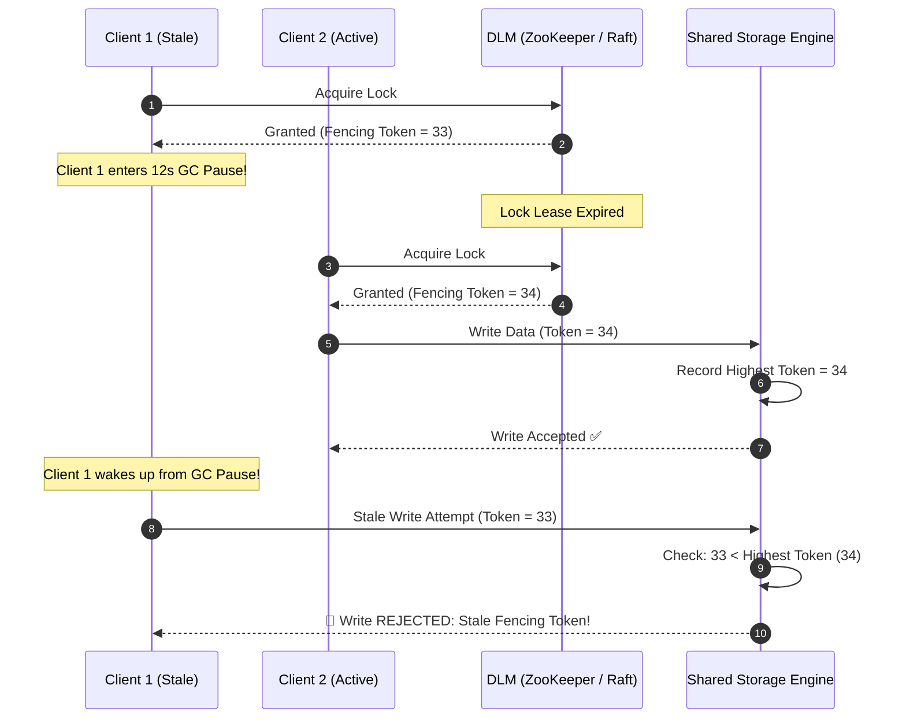

# Distributed Lock Managers at Scale: The Redlock Controversy, Fencing Tokens, & Postgres Advisory Locks

In distributed systems engineering (**E-Commerce Inventory**, **Financial Ledger Processing**, **Billing Engines**, **Cluster Master Election**), coordinating exclusive access to a shared resource across multiple machines is a frequent requirement:
* Ensuring only one worker charges a customer's credit card.
* Ensuring only one batch job generates the daily ledger report.
* Preventing concurrent double-allocation of a limited flight seat.

To prevent race conditions, software architects frequently implement **Distributed Lock Managers (DLMs)** using **Redis (Redlock)**, **Apache ZooKeeper**, **Google Chubby**, or **PostgreSQL Advisory Locks**.

In 2016, a legendary computer science debate erupted between **Martin Kleppmann** (Cambridge distributed systems researcher) and **Salvatore Sanfilippo (Antirez)** (creator of Redis).

Kleppmann mathematically demonstrated that in asynchronous distributed networks subject to **unpredictable network delays**, **process GC pauses**, and **clock drift**, standard distributed locks—including Redis Redlock—**cannot guarantee safety without Monotonically Increasing Fencing Tokens**.

```mermaid
graph TD
  subgraph The Distributed Lock GC Pause Hazard (Split-Brain Write)
    Client1["Client 1: Acquires Lock (Lease: 10s)"] --> Pause["🚨 12-Second GC / VM Pause (Lock Expires!)"]
    
    subgraph Lock Server (Redis / DLM)
      LeaseExpire["Lock Expires at t=10s"] --> GrantClient2["Grant Lock to Client 2 at t=11s"]
    end
    
    GrantClient2 --> Client2["Client 2: Writes Data Safely"]
    Pause --> Wakeup["Client 1 Wakes Up at t=12s (Believes it still holds lock!)"]
    Wakeup --> Corrupt["Client 1 Overwrites Client 2's Data (💥 CORRUPTION!)"]
  end
```

---

## 🛑 1. Why Distributed Locking is Fundamentally Hard

Why can a distributed lock not be implemented simply by setting a key in Redis with a TTL (`SET lock_key uuid NX PX 10000`)?

### The 3 Asynchronous Network Realities:
1. **Unbounded Process Pauses**: A client running in Python, Java, or Node.js can pause for 15 seconds due to a Stop-the-World Garbage Collection (GC) cycle, page fault thrashing, or OS context switching.
2. **Unbounded Network Delays**: A TCP packet can be delayed in a router buffer for seconds without being dropped.
3. **Physical Clock Drift**: Modern cloud servers synchronized via NTP experience clock jumps or drift, causing a 10-second lease to expire prematurely on the lock server while the client believes it has 4 seconds remaining.

When Client 1 pauses past its lease expiration, the lock manager grants the lock to Client 2. When Client 1 resumes, **two processes believe they hold exclusive access simultaneously (Split-Brain Dual Write)**.

---

## ⚔️ 2. The Redlock Algorithm & The Kleppmann-Antirez Debate

```
+---------------------------------------------------------------------------------------------------+
|                                 THE 2 PURPOSES OF DISTRIBUTED LOCKS                               |
+---------------------------------------------------------------------------------------------------+
| Purpose 1: For Efficiency (Optimization) | Purpose 2: For Correctness (Safety)                   |
| If the lock fails, you waste compute     | If the lock fails, you corrupt financial data or bank |
| (e.g. 2 workers render the same video).  | balances (e.g. Double spending a customer wallet).    |
| Redis / Redlock is sufficient!           | Redlock FAILS without Fencing Tokens!                 |
+---------------------------------------------------------------------------------------------------+
```

### The Redlock Algorithm (Antirez)
To eliminate single-point-of-failure in a single Redis node, Redlock deploys $N=5$ independent Redis instances:
1. The client acquires the lock by issuing `SET NX PX` sequentially across all 5 nodes.
2. The client considers the lock acquired if it obtains a majority ($Q = 3/5$) within a timeout budget.

### Martin Kleppmann's Critique:
Kleppmann proved that Redlock relies on an unspoken synchronous network assumption: that the physical clocks across all 5 nodes drift predictably. Under NTP clock jumps or asymmetric network partitions, Redlock can grant the lock to two clients for overlapping validity windows.

---

## 🛡️ 3. The Fencing Token Invariant (The Kleppmann Solution)

To make distributed locking provably safe for mission-critical financial systems, the lock manager and storage layer must implement **Monotonically Increasing Fencing Tokens**:



**The Fencing Rule**: Every time a lock is granted, the DLM increments a monotonic integer token ($33, 34, 35$). The underlying database rejects any write carrying a token lower than the highest token it has already processed.

---

## 🐘 4. PostgreSQL Advisory Locks: The Pragmatic Alternative

If your application already uses a PostgreSQL database, you often do not need to operate a separate ZooKeeper or Redis cluster.

PostgreSQL provides native **Advisory Locks**:

```sql
-- Acquire an application-level exclusive lock on Resource ID 42
SELECT pg_advisory_lock(42);

-- Perform critical financial transaction
UPDATE accounts SET balance = balance - 100 WHERE id = 101;

-- Release lock (or automatically released when DB connection closes!)
SELECT pg_advisory_unlock(42);
```

* **Session-Level Locks**: Automatically released when the client disconnects or crashes (Zero orphan lock leaks!).
* **Transaction-Level Locks (`pg_advisory_xact_lock`)**: Automatically released when the SQL transaction commits or rolls back.

---

## 🛠️ Python Implementation: Distributed Lock Manager with Fencing Tokens

Here is a Python implementation simulating a Distributed Lock Manager with Monotonic Fencing Tokens and a Protected Storage Engine:

```python
import time
from dataclasses import dataclass
from typing import Dict, Optional, Tuple

@dataclass
class LockLease:
    resource_name: str
    owner_id: str
    fencing_token: int
    expires_at: float

class FencedDistributedLockManager:
    """
    DLM that issues Monotonically Increasing Fencing Tokens.
    """
    def __init__(self):
        self.current_token_counter = 100
        self.active_locks: Dict[str, LockLease] = {}

    def acquire_lock(self, resource_name: str, client_id: str, lease_duration_sec: float = 2.0) -> Optional[LockLease]:
        now = time.time()
        # Check if currently held and unexpired
        if resource_name in self.active_locks:
            lease = self.active_locks[resource_name]
            if now < lease.expires_at:
                print(f" ❌ [DLM] Client [{client_id}] rejected: Lock held by [{lease.owner_id}] until t={lease.expires_at:.2f}")
                return None

        # Issue new monotonic fencing token
        self.current_token_counter += 1
        new_lease = LockLease(
            resource_name=resource_name,
            owner_id=client_id,
            fencing_token=self.current_token_counter,
            expires_at=now + lease_duration_sec
        )
        self.active_locks[resource_name] = new_lease
        print(f" 🔑 [DLM] Lock granted to [{client_id}] for '{resource_name}' (Fencing Token: {new_lease.fencing_token}, Expires in {lease_duration_sec}s)")
        return new_lease

class FencedStorageEngine:
    """
    Storage Engine protected against stale writes via Fencing Tokens.
    """
    def __init__(self):
        self.storage: Dict[str, str] = {}
        self.highest_fencing_token: int = 0

    def write(self, client_id: str, key: str, value: str, fencing_token: int) -> bool:
        print(f"\n💾 [Storage Write Attempt] Client [{client_id}] writing '{key}'='{value}' with Token #{fencing_token}...")
        
        # Fencing Token Invariant Check
        if fencing_token < self.highest_fencing_token:
            print(f" 🛑 [Storage Stale Write Rejected!] Token #{fencing_token} < Current Highest Token #{self.highest_fencing_token} (Dual-write prevented!)")
            return False

        self.highest_fencing_token = fencing_token
        self.storage[key] = value
        print(f" ✅ [Storage Write Succeeded] '{key}' updated to '{value}'. (New Highest Token: #{fencing_token})")
        return True

# Demonstration Execution
if __name__ == "__main__":
    dlm = FencedDistributedLockManager()
    storage = FencedStorageEngine()

    # 1. Client 1 acquires lock (Token 101) with 1.0s lease
    lease1 = dlm.acquire_lock("bank_account_42", client_id="Client-1", lease_duration_sec=1.0)

    # 2. Client 1 experiences a 1.5s Garbage Collection Pause!
    print("\n⏳ [Client 1 Pauses] Entering 1.5s JVM Stop-the-World GC Pause (Lease will expire!)...")
    time.sleep(1.2)

    # 3. Client 2 acquires lock while Client 1 is paused (Token 102)
    lease2 = dlm.acquire_lock("bank_account_42", client_id="Client-2", lease_duration_sec=2.0)
    # Client 2 writes successfully with Token 102
    storage.write("Client-2", "balance", "$10,000", lease2.fencing_token)

    # 4. Client 1 wakes up and attempts to write with stale Token 101
    print("\n⏰ [Client 1 Resumes] Wakes up and attempts to write with old lease...")
    storage.write("Client-1", "balance", "$500", lease1.fencing_token)

    print(f"\n📦 Final Database State: {storage.storage}")
```

---

## 📊 Summary: Distributed Lock Technology Matrix

| Lock Manager | Consistency Basis | Fencing Token Support | Best Used For |
|---|---|---|---|
| **Single Redis Node** | Single thread memory | ❌ No (Prone to GC pause split-brain) | Non-critical cache regeneration |
| **Redis Redlock** | Majority Quorum across $N$ nodes | ❌ No (Vulnerable to clock drift) | Efficiency locks (deduplication) |
| **ZooKeeper / Chubby** | Raft / Zab Paxos Consensus | **✅ Yes (Sequential Ephemeral Znodes)**| Distributed Master Election |
| **PostgreSQL Advisory** | Relational ACID Engine | **✅ Session / Transaction bounded** | Single-database enterprise apps |
| **Fencing Token DLM** | Monotonic Token Guard | **✅ 100% Mathematically Safe** | Financial balances & critical storage |

---

## 🏁 Architectural Takeaway
A distributed lock is only as safe as the storage system that enforces it.

For non-critical task deduplication, **Redis locks are fast and practical**.

However, for mission-critical financial balances and data integrity, **always enforce Monotonically Increasing Fencing Tokens** at the storage layer to mathematically prevent split-brain dual-write corruption.
