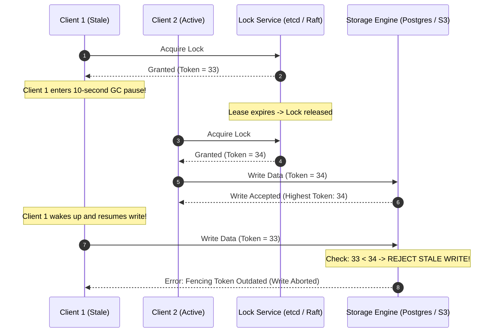

In February 2016, a debate broke out in the distributed systems community that should be required reading for every software engineer who has ever written code touching a shared database.

On one side was Salvatore Sanfilippo, known to the world as **Antirez**, the brilliant Italian creator of Redis. On the other was **Martin Kleppmann**, a distributed systems researcher at the University of Cambridge and author of *Designing Data-Intensive Applications*.

At issue was **Redlock**: an algorithm proposed by Antirez to provide fault-tolerant distributed locking across multiple Redis instances without requiring consensus protocols like Paxos or Raft.

Antirez argued that by acquiring a lock across a majority of independent Redis nodes with a time-to-live (TTL) expiration lease, engineers could safely coordinate distributed access to mission-critical resources.

Kleppmann replied with a surgical mathematical critique that dismantled the premise. In asynchronous networks subject to unbounded network latency, garbage collection pauses, and physical clock drift, **no lock based on wall-clock time can ever guarantee safety without monotonically increasing fencing tokens**.

```mermaid
graph TD
  subgraph The Distributed Lock GC Pause Hazard (Split-Brain Corruption)
    ClientA["Client 1: Acquires Lock Lease (10s)"] --> GC["🚨 12-Second GC / VM Pause (Lock Expires!)"]
    
    subgraph Central Lock Service (Redis / DLM)
      Expire["Lease expires at t=10s"] --> GrantB["Grant Lock to Client 2 at t=11s"]
    end
    
    GrantB --> ClientB["Client 2: Writes to Shared Storage"]
    GC --> Wakeup["Client 1 Wakes Up at t=12s (Believes lease is still valid!)"]
    Wakeup --> Overwrite["Client 1 Overwrites Storage (💥 DATA CORRUPTION)"]
  end
```

---

## 1. Why Distributed Locking Is Fundamentally Difficult

Why can a distributed lock not be implemented simply by setting a key in Redis with a TTL (`SET resource_id client_uuid NX PX 10000`)?

In a single operating system process, locks rely on shared physical hardware: atomic compare-and-swap (`CAS`) instructions, memory bus arbitration, and kernel thread schedulers. If a thread holds a mutex, the CPU hardware guarantees that no other thread can execute that critical section.

In a distributed network, there is no shared memory, no shared bus, and no shared clock. The physical universe introduces three unavoidable realities:

### 1. Unbounded Process Pauses
A client running on Java, Node.js, Python, or Go can pause execution at any line of code without warning. A Stop-the-World garbage collection cycle, an OS page-table fault, or virtualization hypervisor CPU-throttling can suspend a thread for twenty seconds.

### 2. Unbounded Network Delays
A TCP packet traversing switches, routers, and firewalls can be delayed for arbitrary durations. A client may believe its network request was dropped, while the packet is simply waiting in a congested top-of-rack buffer.

### 3. Physical Clock Drift and NTP Jumps
Physical quartz clocks on modern motherboards drift due to heat and manufacturing variances. Network Time Protocol (NTP) daemons synchronize clocks by stepping or slewing time. A lock server's clock may jump forward by two seconds, expiring a lease while the client’s local clock still shows three seconds of valid time.

When Client 1 pauses past its lease expiration, the lock server assumes it died and grants the lock to Client 2. When Client 1 wakes up, **two independent nodes believe they hold exclusive ownership simultaneously**.

---

## 2. The Two Purposes of Distributed Locks: Efficiency vs Correctness

Kleppmann began his analysis by drawing an essential distinction that architects routinely conflate:

| Lock Objective | Failure Consequence | Required Guarantee | Suitable Implementation |
|---|---|---|---|
| **Efficiency (Optimization)** | Redundant compute (e.g., two background workers render the same video or send duplicate reminder emails). | Best-effort mutual exclusion. Minor race conditions cause wasted CPU, but zero data loss. | Single-instance Redis (`SET NX PX`), Memcached, or Redlock. |
| **Correctness (Safety)** | Data corruption, financial double-spending, or inventory over-allocation. | **Strict linearizable safety invariants.** A split-brain write is catastrophic. | Consensus engines (ZooKeeper, etcd) paired with **Monotonically Increasing Fencing Tokens**. |

If you are locking for efficiency, simple Redis keys are fine. If you are locking for correctness, simple leases are a ticking time bomb.

---

## 3. The Fencing Token Invariant: Kleppmann's Solution

To make distributed locking provably safe in the presence of process pauses, the storage layer must participate in mutual exclusion using **Monotonically Increasing Fencing Tokens**:



### The Invariant
Every time the lock service grants a lock, it returns a monotonically increasing integer sequence number ($T = 1, 2, 3, \dots$).

When a client mutates the underlying storage system, it attaches its fencing token to the write payload. The storage system enforces an invariant: **reject any write with a token less than or equal to the highest token it has already processed**.

Even if Client 1 pauses for ten minutes, wakes up, and sends its write, the database rejects the payload because it has already accepted Token 34. Correctness is maintained at the data layer, where it belongs.

---

## 4. The Practical Alternative: PostgreSQL Advisory Locks

For teams that already run a relational database (PostgreSQL) and do not wish to maintain a separate ZooKeeper or etcd cluster, **Postgres Advisory Locks** provide an elegant, ACID-backed alternative:

```sql
-- Transaction-scoped exclusive advisory lock
BEGIN;
  -- Acquires lock on integer ID 402; blocks until acquired
  SELECT pg_advisory_xact_lock(402);

  -- Perform mission-critical ledger mutation safely
  UPDATE accounts SET balance = balance - 100 WHERE id = 10;
  INSERT INTO audit_log (account_id, delta) VALUES (10, -100);

-- Lock is automatically and atomically released when transaction commits or rolls back
COMMIT;
```

### Why Postgres Advisory Locks Guarantee Safety:
1. **Tied to Database Connection**: If the application worker crashes or enters an infinite GC pause, the PostgreSQL backend detects the broken TCP socket via keepalives and automatically aborts the transaction, releasing the lock.
2. **Atomic Serialization**: Lock acquisition and data updates execute within the same database engine, eliminating distributed two-phase commit overhead.

---

## Python Implementation: Fencing Token Storage Engine

The following Python script simulates a distributed locking engine that enforces monotonic fencing token validation to block stale, paused workers from corrupting storage:

```python
from dataclasses import dataclass
from typing import Optional, Tuple

@dataclass
class WritePayload:
    client_id: str
    fencing_token: int
    data: str

class StorageEngine:
    """
    Storage layer that enforces Monotonic Fencing Token safety invariants.
    """
    def __init__(self):
        self.committed_data: Optional[str] = None
        self.highest_fencing_token: int = 0

    def write(self, payload: WritePayload) -> bool:
        print(f"  -> Storage evaluating write from [{payload.client_id}] with Token={payload.fencing_token}...")
        
        # Enforce the Kleppmann Fencing Invariant
        if payload.fencing_token <= self.highest_fencing_token:
            print(f"     REJECTED: Stale Token ({payload.fencing_token} <= {self.highest_fencing_token}). Write blocked!")
            return False

        self.committed_data = payload.data
        self.highest_fencing_token = payload.fencing_token
        print(f"     ACCEPTED: Data committed successfully. New High Token: {self.highest_fencing_token}")
        return True

class LockManager:
    """
    Simulates a centralized DLM issuing monotonically increasing tokens.
    """
    def __init__(self):
        self._counter: int = 0
        self.current_holder: Optional[str] = None

    def acquire_lock(self, client_id: str) -> Tuple[bool, int]:
        self._counter += 1
        self.current_holder = client_id
        return True, self._counter

# Demonstration Run
if __name__ == "__main__":
    dlm = LockManager()
    storage = StorageEngine()

    # Step 1: Client 1 acquires lock and receives Token 1
    _, token_c1 = dlm.acquire_lock("Client_1")
    print(f"Client 1 acquired lock. Assigned Fencing Token: {token_c1}")

    # Step 2: Client 1 experiences an unexpected 15-second GC pause!
    print("ALERT: Client 1 enters an unexpected Garbage Collection pause...")

    # Step 3: Lock expires. Client 2 acquires lock and receives Token 2
    _, token_c2 = dlm.acquire_lock("Client_2")
    print(f"Client 2 acquired lock. Assigned Fencing Token: {token_c2}")

    # Step 4: Client 2 performs write successfully
    storage.write(WritePayload(client_id="Client_2", fencing_token=token_c2, data="ORDER_SETTLED_V2"))

    # Step 5: Client 1 wakes up and attempts to commit stale write!
    print("\nClient 1 wakes up from GC pause and attempts to complete its write:")
    storage.write(WritePayload(client_id="Client_1", fencing_token=token_c1, data="ORDER_STALE_OVERWRITE"))

    print(f"\nFinal Verified Storage State: '{storage.committed_data}'")
```

---

## Architectural Comparison Matrix

| Locking Strategy | Fault Tolerance | Split-Brain Immunity | Operational Footprint | Recommended Use Case |
|---|---|---|---|---|
| **Redis `SET NX PX`** | Low (Single instance) | None (Lease expiry hazard) | Very Low (Existing Redis) | Non-critical efficiency locks (cron deduplication) |
| **Redlock (5 Redis Nodes)** | Medium (Quorum over 5 nodes) | None without fencing tokens | Moderate | Distributed caching synchronization |
| **ZooKeeper / etcd** | High (Multi-node Paxos/Raft) | **Complete (with `zxid` / `raft_index`)** | High | Distributed cluster master election |
| **Postgres Advisory Locks** | High (Within DB instance) | **Complete (Connection lifecycle bound)** | Zero (Uses existing DB) | Financial transactions, ledger updates |

---

## The Distributed Systems Truth

A distributed lock cannot guarantee correctness in isolation. 

True safety in distributed architectures is an **end-to-end contract between the lock coordinator and the storage layer**. If your storage layer blindly accepts writes without validating version counters or fencing tokens, a single pause in a garbage collection thread will eventually corrupt your data.
