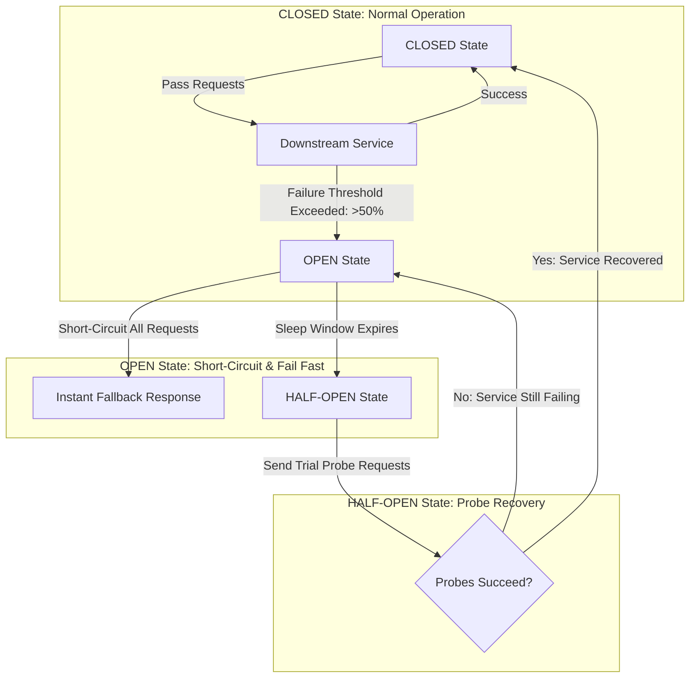

# Distributed Rate Limiting & Resilience Circuit Breakers

In high-concurrency microservice architectures, an un-throttled burst of traffic or a slow downstream database dependency can quickly cascade across an entire cluster. When a downstream microservice experiences latency spikes, upstream callers hold open connection sockets waiting for timeouts, leading to thread pool exhaustion and complete system blackouts.

To build fault-tolerant systems, software architects enforce two critical resilience patterns: **Distributed Rate Limiting** and **Circuit Breakers**.

Distributed rate limiting prevents malicious or runaway API clients from overwhelming services, while Circuit Breakers isolate failing downstream dependencies by failing fast and serving graceful fallbacks.

This article details how to construct rate limiters and finite state machine circuit breakers.

---

## Circuit Breaker Finite State Machine Architecture

The operational state transitions of a resilience Circuit Breaker:



### Core Resilience Mechanisms
1. **Sliding Window Rate Limiting**: Unlike Fixed Window counters (which suffer from boundary spike vulnerability at minute boundaries), Sliding Window counters calculate request rates across a continuous sliding time window (e.g. last 60 seconds) using atomic Redis Lua scripts.
2. **Circuit Breaker Finite State Machine**:
   * **CLOSED**: Requests flow to the downstream service. The circuit monitors error rates over a rolling window.
   * **OPEN**: When the failure rate exceeds a threshold (e.g. $>50\%$ of calls fail within 10 seconds), the circuit trips to OPEN. All subsequent requests fail fast instantly without attempting to call the downstream service.
   * **HALF-OPEN**: After a sleep timeout (e.g. 5 seconds), the circuit enters HALF-OPEN state, sending a limited number of trial probe requests. If the probes succeed, the circuit resets to CLOSED; if they fail, it trips back to OPEN.
3. **Bulkhead Isolation**: Isolating worker thread pools per downstream service so that a slow dependency cannot consume all global threads.

---

## Python Implementation: Rate Limiter & Circuit Breaker Engine

Here is a production-grade Python simulation of a Sliding Window Rate Limiter and a finite state machine Circuit Breaker with fallback:

```python
import time
from typing import Callable, Any, Dict, Optional

class SlidingWindowRateLimiter:
    """
    Simulates a Redis Sliding Window Rate Limiter using timestamps.
    """
    def __init__(self, max_requests: int, window_seconds: float):
        self.max_requests = max_requests
        self.window_seconds = window_seconds
        # client_id -> list of request timestamps
        self.client_windows: Dict[str, list] = {}

    def is_allowed(self, client_id: str) -> bool:
        now = time.time()
        if client_id not in self.client_windows:
            self.client_windows[client_id] = []

        # 1. Filter out timestamps older than window boundary
        cutoff = now - self.window_seconds
        self.client_windows[client_id] = [ts for ts in self.client_windows[client_id] if ts > cutoff]

        # 2. Check rate limit threshold
        if len(self.client_windows[client_id]) < self.max_requests:
            self.client_windows[client_id].append(now)
            return True
        return False

class CircuitBreakerOpenException(Exception):
    pass

class ResilienceCircuitBreaker:
    """
    Finite State Machine Circuit Breaker with CLOSED, OPEN, and HALF-OPEN states.
    """
    def __init__(self, failure_threshold: float = 0.5, recovery_timeout: float = 2.0, min_calls: int = 4):
        self.failure_threshold = failure_threshold
        self.recovery_timeout = recovery_timeout
        self.min_calls = min_calls

        self.state = "CLOSED"
        self.call_history: list = []  # True for success, False for failure
        self.last_state_change = time.time()

    def __call__(self, func: Callable, fallback: Callable, *args, **kwargs) -> Any:
        now = time.time()

        # 1. State Transition: Check if OPEN circuit should attempt HALF-OPEN recovery
        if self.state == "OPEN":
            if now - self.last_state_change > self.recovery_timeout:
                self.state = "HALF-OPEN"
                self.last_state_change = now
                print(f" ⏳ [Circuit Breaker] Sleep timeout expired. Transitioned to HALF-OPEN (Probing service...).")
            else:
                print(f" 🚫 [Circuit Breaker] OPEN! Short-circuiting call and executing Fallback.")
                return fallback(*args, **kwargs)

        # 2. Attempt Execution
        try:
            result = func(*args, **kwargs)
            self._record_result(success=True)
            return result
        except Exception as err:
            self._record_result(success=False)
            print(f" ❌ [Circuit Breaker] Downstream Call Failed: {err}")
            return fallback(*args, **kwargs)

    def _record_result(self, success: bool):
        self.call_history.append(success)
        if len(self.call_history) > 10:
            self.call_history.pop(0)

        # Evaluate Circuit Transitions
        if len(self.call_history) >= self.min_calls:
            failures = self.call_history.count(False)
            fail_rate = failures / len(self.call_history)

            if self.state == "CLOSED" and fail_rate >= self.failure_threshold:
                self.state = "OPEN"
                self.last_state_change = time.time()
                print(f" 🚨 [Circuit Breaker] Failure Rate {fail_rate:.0%} exceeded threshold! Tripped to OPEN.")

            elif self.state == "HALF-OPEN":
                if success:
                    self.state = "CLOSED"
                    self.call_history.clear()
                    self.last_state_change = time.time()
                    print(f" ✅ [Circuit Breaker] Probe Succeeded! Circuit Reset to CLOSED.")
                else:
                    self.state = "OPEN"
                    self.last_state_change = time.time()
                    print(f" 🚨 [Circuit Breaker] Probe Failed! Re-tripped to OPEN.")

# Demonstration Execution
if __name__ == "__main__":
    limiter = SlidingWindowRateLimiter(max_requests=3, window_seconds=1.0)
    circuit = ResilienceCircuitBreaker(failure_threshold=0.5, recovery_timeout=1.0, min_calls=4)

    def flaky_downstream_service(should_fail: bool = False):
        if should_fail:
            raise RuntimeError("Database connection timeout!")
        return "200 OK: Downstream Data"

    def fallback_service(*args, **kwargs):
        return "200 OK: Cached Fallback Data"

    print("🚀 Demonstrating Distributed Rate Limiting & Circuit Breaker...")
    print("=" * 75)

    # 1. Rate Limiter Test
    print("\n1. Testing Sliding Window Rate Limiter (Max 3 req/sec)...")
    for i in range(5):
        allowed = limiter.is_allowed("client-ip-102")
        status = "ALLOWED" if allowed else "BLOCKED (429 Too Many Requests)"
        print(f" Request #{i+1}: {status}")

    # 2. Circuit Breaker Test
    print("\n2. Testing Circuit Breaker Tripping & Recovery...")
    # Induce 4 failures to trip circuit
    for _ in range(4):
        res = circuit(flaky_downstream_service, fallback_service, should_fail=True)
        print(f"  Response: {res}")

    # Immediate call when OPEN
    print("\n3. Call while Circuit is OPEN (Should fail-fast instantly)...")
    res = circuit(flaky_downstream_service, fallback_service, should_fail=False)
    print(f"  Response: {res}")

    # Wait for recovery timeout
    print("\n4. Waiting 1.1s for recovery timeout...")
    time.sleep(1.1)
    res = circuit(flaky_downstream_service, fallback_service, should_fail=False)
    print(f"  Response: {res}")
```

---

## Resilience Implementation Gotchas & Guardrails

When configuring rate limiters and circuit breakers:

> [!IMPORTANT]
> **Use Redis Lua Scripts for Atomic Rate Limiting**: In multi-node deployments, checking a rate limit in Python and updating Redis in a second command creates race conditions. Always execute rate-limit logic inside atomic Redis Lua scripts (`redis.eval(...)`).

> [!CAUTION]
> **Always Provide Idempotent Fallbacks**: Fallback functions executed when a circuit is OPEN should be read-only (such as returning stale cached data or default values). Never execute modifying side-effects (like retrying write transactions) inside fallbacks.

---

## Real-World Enterprise Impact
Teams deploying resilience circuit breakers and rate limiters report:
* **Zero Cascading Outages**: Circuit breakers stop failing services from locking up upstream API gateways.
* **Stable p99 Latencies**: Failing fast on unresponsive dependencies preserves system memory and keeps API responses fast even during partial outages.
