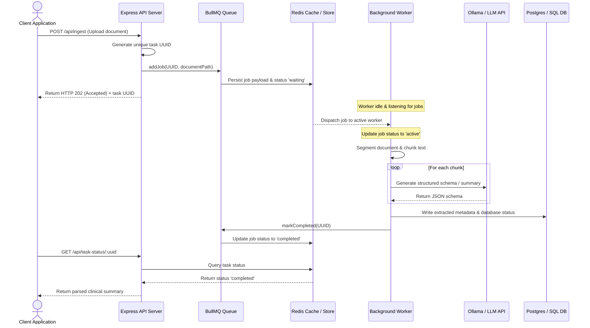

In production-grade AI platforms, synchronous request-response loops are an anti-pattern. If a user uploads a 50-page PDF document and you trigger a multi-agent analysis synchronously within an Express or Next.js API handler, the connection will time out, the client will fail, and you risk losing state if the server restarts.

Because Large Language Model (LLM) calls, vector embeddings, and web searching are high-latency, unpredictable operations, they must be decoupled from the client-facing HTTP thread.

To build an ingestion pipeline that handles high throughput, we implement a **Distributed Task Queue Architecture** using **Redis** and **BullMQ**. This ensures that jobs are processed asynchronously in the background, retry logic handles API rate-limits, and queue progress is tracked in real-time.

---

## 🛠️ The Decoupled Ingestion Pipeline

The architecture separates the frontend API endpoint (which only schedules jobs and returns a task token) from the dedicated worker processes that coordinate the agentic extraction steps.



1. **Immediate Acknowledgment**: When a document ingestion request is made, the API server saves the raw file, pushes a task description to BullMQ, and immediately returns a `202 Accepted` response with a unique job ID.
2. **Persistence**: Redis guarantees the task details are persistent. If a worker crashes mid-run, the task is not lost.
3. **Background Execution**: Background workers fetch jobs from the Redis-backed queue, parse files, execute LLM analysis steps, and update the final database table.
4. **Polling / Webhooks**: The client polls the status of the job ID, or the worker triggers a webhook callback upon completion.

---

## 💻 Building a BullMQ Worker in TypeScript

Here is a production-grade implementation of a queue processor designed to ingest unstructured files and run them through our extraction service, modeled on background pipelines found in my projects like [healthcare-audit-vault](https://github.com/akmalkhaniub/healthcare-audit-vault).

### 1. Defining the Queue and Scheduler
```typescript
import { Queue, QueueEvents } from 'bullmq';
import IORedis from 'ioredis';

const connection = new IORedis({
  host: process.env.REDIS_HOST || '127.0.0.1',
  port: parseInt(process.env.REDIS_PORT || '6379'),
  maxRetriesPerRequest: null,
});

export const documentQueue = new Queue('document-ingestion', {
  connection,
  defaultJobOptions: {
    attempts: 3, // Retry failed jobs up to 3 times
    backoff: {
      type: 'exponential',
      delay: 5000, // Wait 5s before first retry, then 10s, 20s
    },
    removeOnComplete: { count: 100 }, // Keep last 100 history
    removeOnFail: { count: 500 },
  },
});

export const queueEvents = new QueueEvents('document-ingestion', { connection });
```

### 2. Implementing the Worker
```typescript
import { Worker, Job } from 'bullmq';
import { extractClinicalData } from './agentService';
import { updateDatabaseRecord } from './dbService';

const documentWorker = new Worker(
  'document-ingestion',
  async (job: Job) => {
    const { documentId, filePath } = job.data;
    
    await job.updateProgress(10); // Notify progress tracking
    
    // Step 1: Parse the file
    const rawText = await parsePDF(filePath);
    await job.updateProgress(40);
    
    // Step 2: Call LLM API with structured extraction rules
    const extractedData = await extractClinicalData(rawText);
    await job.updateProgress(80);
    
    // Step 3: Write results to PostgreSQL database
    await updateDatabaseRecord(documentId, extractedData);
    await job.updateProgress(100);
    
    return { success: true, documentId };
  },
  {
    connection,
    concurrency: 2, // Process max 2 jobs concurrently per worker instance
    limiter: {
      max: 10, // Rate limit: max 10 LLM calls per 10 seconds
      duration: 10000,
    },
  }
);

documentWorker.on('completed', (job) => {
  console.log(`Job ${job.id} completed successfully`);
});

documentWorker.on('failed', (job, err) => {
  console.error(`Job ${job?.id} failed with error: ${err.message}`);
});
```

---

## 📈 Queue Optimization and Backoff Guardrails

* **Handling LLM Rate Limits**: LLM providers (Anthropic, OpenAI) enforce strict rate-limits (TPM and RPM). Using BullMQ’s built-in `limiter` option ensures workers slow down dynamically, staying under token budget caps.
* **Exponential Backoff**: When a 429 Too Many Requests error occurs, standard loops fail. Our BullMQ configuration uses `backoff: { type: 'exponential', delay: 5000 }` to wait and retry only when the rate limit cooling period expires.
* **Graceful Shutdowns**: Always listen to system termination signals (`SIGTERM`, `SIGINT`) to close BullMQ workers gracefully, allowing active jobs to finish or return to the queue.

---

## 📚 References & Further Reading

* **BullMQ Architecture**: [BullMQ Guides](https://docs.bullmq.io/). Comprehensive documentation on queues, sandboxed workers, and parent-child dependencies.
* **Queueing Theory and Backoffs**: *A Study of Backoff Algorithms in Wireless and Distributed Systems*. Explains the efficiency of exponential backoff. [arXiv:1707.02535](https://arxiv.org/abs/1707.02535)

*To explore how database ingestion models are mapped in our stack, browse the source code of our [healthcare-audit-vault](https://github.com/akmalkhaniub/healthcare-audit-vault) repository.*
