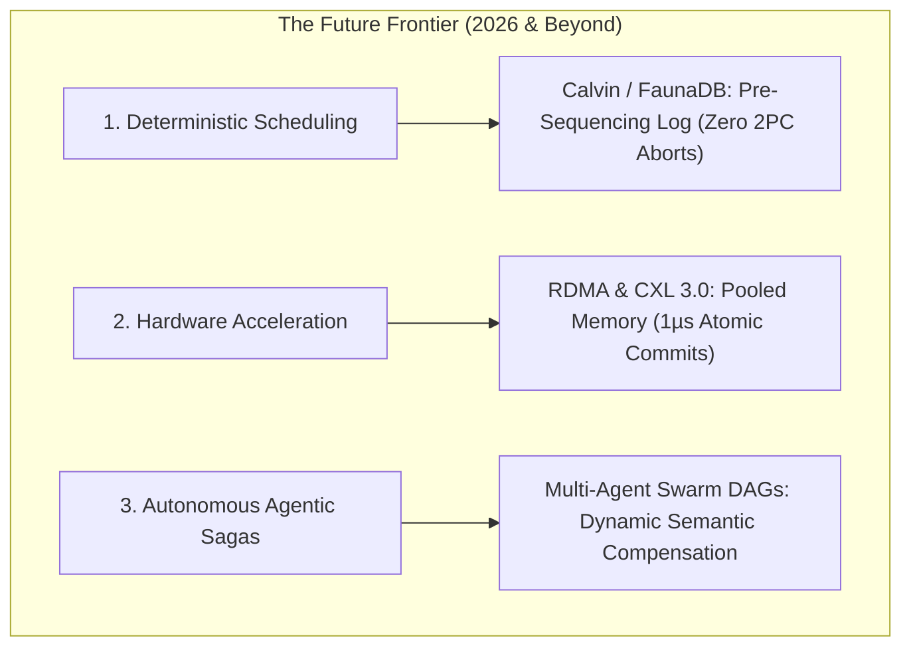
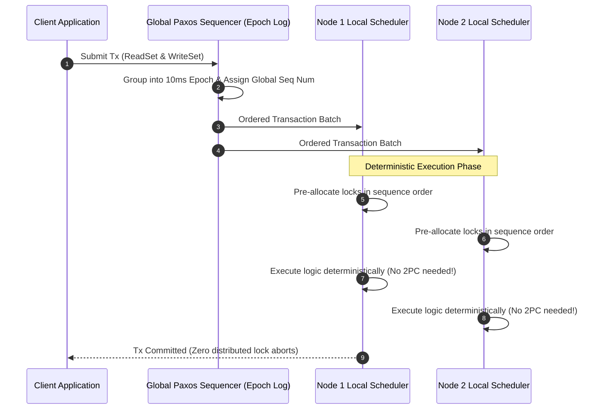
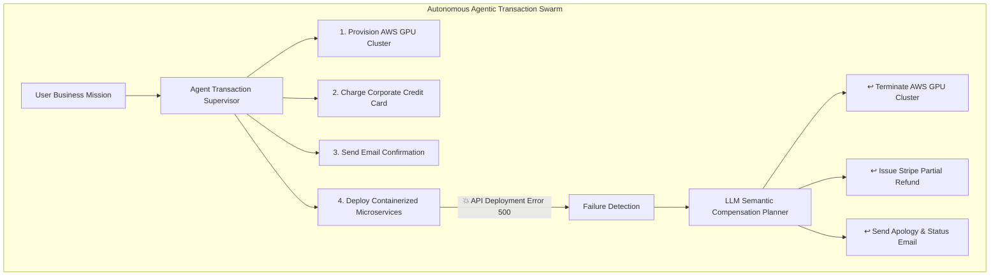

# The Evolution of Distributed Transactions Part 3: The Future — Deterministic Scheduling (Calvin), RDMA/CXL Disaggregated Memory & Autonomous Agentic Sagas

As distributed systems cross into the mid-2020s and beyond, the boundaries of transactional throughput and complexity are being redefined by three major technological shifts:

1. **Deterministic Transaction Scheduling (The Calvin Protocol & FaunaDB)**: Eliminating distributed Two-Phase Commit (2PC) and lock aborts by pre-ordering transactions in a Paxos consensus log *before* execution.
2. **Hardware-Accelerated In-Memory Transactions (RDMA & CXL 3.0 Fabrics)**: Using kernel-bypass Remote Direct Memory Access (RDMA) and Compute Express Link (CXL) pooled memory to achieve sub-microsecond cross-node atomic commits.
3. **Autonomous AI Agent Sagas & Dynamic Semantic Compensation (2026+)**: Managing multi-step autonomous AI agent workflows across heterogeneous enterprise APIs with non-reversible real-world side effects.

This article examines the cutting-edge architectural frontiers that define the future of distributed transactions.



---

## 1. Deterministic Transaction Scheduling: The Calvin Protocol

In 2012, researchers at Yale (Alexander Thomson, Daniel J. Abadi, et al.) published *Calvin: Fast Distributed Transactions for Partitioned Database Systems*, providing the architectural foundation for modern deterministic engines like **FaunaDB**.

### The Calvin Core Principle
In traditional NewSQL (Spanner, CockroachDB), nodes acquire distributed locks dynamically as transactions run, leading to lock contention, wait-for-graph deadlocks, and high abort rates under peak write spikes.

Calvin inverts this paradigm: **Transactions are globally ordered in an active Paxos replication log BEFORE any locks are acquired or code is executed.**



### Why Determinism Eliminates 2PC
Because every replica node receives the exact same sequenced transaction stream and executes the state transitions strictly in order:
* **No Distributed 2PC Coordinator**: Replicas reach the identical state deterministically without exchanging prepare/commit roundtrips.
* **Zero Distributed Deadlocks**: Locks are requested in strict global sequence order ($Tx_1 < Tx_2 < Tx_3$), making circular wait graphs mathematically impossible.
* **Zero Contention Aborts**: A transaction never aborts due to lock conflict.

### Handling Dynamic Transactions (OLLP)
For transactions where read values determine future write keys (e.g. `SELECT balance FROM accounts WHERE id = 1` → `UPDATE tier SET ...`), Calvin uses **Optimistic Lock Location Prediction (OLLP)**: an initial low-cost read phase guesses the Read/Write sets. If predictions match, it executes deterministically; if state changed, it re-sequences.

---

## 2. Hardware-Accelerated Transactions: RDMA & CXL 3.0 Pooled Memory

For decades, distributed transaction latency was constrained by the TCP/IP kernel networking stack ($100\mu\text{s}\text{--}5\text{ms}$). Today, modern datacenter hardware architectures bypass the operating system entirely.

```
> **TCP/IP vs RDMA Network Latency**
|  Standard TCP/IP Stack : [App] -> [OS Kernel] -> [NIC Driver] -> Wire (~100-500µs) |
|  One-Sided RDMA / RoCE : [App] --------------------------------> Wire (~1-2µs)   |

```

### Remote Direct Memory Access (RDMA & RoCE v2)
Systems like **Microsoft FaRM (Fast Remote Memory)** and **Stanford DrTM (Distributed Real-time Transaction Manager)** utilize one-sided RDMA operations:
* A compute node executes atomic `RDMA_READ` and `RDMA_CAS` (Compare-And-Swap) directly into the physical RAM of a remote server across InfiniBand/RoCE without interrupting the remote CPU.
* Transactions commit across shards in **$< 2\text{ microseconds}$**, achieving tens of millions of distributed ACID transactions per second per rack.

### Compute Express Link (CXL 3.0 / 3.1) Disaggregated Memory
CXL allows hundreds of server blades in a datacenter rack to share a multi-terabyte **disaggregated pooled memory pool** with hardware cache coherency.

In a CXL-backed database architecture:
* Distributed nodes read and write to the same coherent memory space using native CPU memory load/store instructions.
* The boundary between "local database RAM" and "distributed network storage" vanishes.

---

## 3. Autonomous AI Agent Sagas: Dynamic Semantic Compensation

With the rise of autonomous AI agent networks in 2026 (**Agent Fleet Orchestrator**, **Enterprise Workflow Swarms**), agents execute complex multi-step workflows across dozens of external APIs (Stripe, Twilio, Salesforce, AWS, Snowflake, Physical Robotics).

Unlike database rows that can simply be rolled back with `pg_wal`, real-world agent actions involve **non-reversible side effects**:
* *Cannot rollback an email already sent to a client.*
* *Cannot undo a physical robot dispatch.*
* *Cannot un-execute an external credit card charge without a fee and refund latency.*



### The Autonomous Dynamic Compensation Pattern
Modern agentic architectures address this via **Dynamic Semantic Compensation Graphs**:
1. **Escrow / Reservation Holds**: Before executing irreversible side effects, agents place reversible pre-authorization holds (e.g. AWS resource reservations, Stripe authorization holds).
2. **Dynamic Semantic Rollback DAGs**: If step $k$ fails in a non-deterministic environment, an autonomous LLM Supervisor synthesizes an exact compensating execution plan tailored to which side effects actually occurred.

---

## Python Implementation: Calvin-Style Deterministic Sequencer & Agentic Compensation Graph

Here is a Python implementation demonstrating a **Calvin-Style Deterministic Sequencer** with pre-ordered lock allocation and an **Agentic Semantic Compensation Graph**:

```python
import time
from typing import Callable, Dict, List, Set

# --- 1. DETERMINISTIC TRANSACTION (CALVIN MODEL) ---
class DeterministicTransaction:
    def __init__(self, tx_id: int, read_keys: List[str], write_keys: List[str], logic: Callable[[Dict[str, int]], Dict[str, int]]):
        self.tx_id = tx_id
        self.read_keys = read_keys
        self.write_keys = write_keys
        self.logic = logic

class CalvinDeterministicEngine:
    """
    Simulates Calvin Deterministic Transaction Scheduling:
    Pre-orders transactions globally and executes strictly without 2PC lock aborts.
    """
    def __init__(self):
        self.kv_store: Dict[str, int] = {}
        self.sequence_log: List[DeterministicTransaction] = []

    def sequence_transaction(self, tx: DeterministicTransaction):
        # Global Paxos Sequencing Phase
        self.sequence_log.append(tx)

    def execute_sequenced_batch(self):
        print("\n🚀 [Calvin Engine] Executing Sequenced Transaction Batch Deterministically...")
        for tx in self.sequence_log:
            # Deterministic lock acquisition in global sequence order
            print(f" 🔒 Tx {tx.tx_id} acquired locks for Writes: {tx.write_keys}, Reads: {tx.read_keys}")
            
            # Execute business logic (Zero distributed 2PC roundtrips)
            mutations = tx.logic(self.kv_store)
            for k, v in mutations.items():
                self.kv_store[k] = v
            print(f" ✅ Tx {tx.tx_id} committed deterministically. State: {self.kv_store}")
        self.sequence_log.clear()

# --- 2. AUTONOMOUS AGENTIC COMPENSATION GRAPH ---
class AgenticAction:
    def __init__(self, name: str, execute_fn: Callable[[], bool], compensate_fn: Callable[[], None]):
        self.name = name
        self.execute_fn = execute_fn
        self.compensate_fn = compensate_fn

class AgenticSagaSupervisor:
    """
    Manages autonomous AI agent workflows with real-world side-effect compensations.
    """
    def __init__(self):
        self.executed_history: List[AgenticAction] = []

    def execute_mission(self, plan: List[AgenticAction]) -> bool:
        print("\n🤖 [Agent Supervisor] Executing Autonomous Multi-Agent Mission...")
        for action in plan:
            print(f" ⏳ Agent executing: [{action.name}]...")
            success = action.execute_fn()
            if not success:
                print(f" 💥 Action [{action.name}] failed! Synthesizing dynamic compensation plan...")
                self._semantic_rollback()
                return False
            self.executed_history.append(action)
        print(" 🎉 [Mission Complete] All autonomous steps successfully finalized!")
        return True

    def _semantic_rollback(self):
        print(f" 🔄 [Semantic Rollback] Rolling back {len(self.executed_history)} completed real-world actions...")
        while self.executed_history:
            action = self.executed_history.pop()
            print(f"   ↩️ Compensating: [{action.name}]")
            action.compensate_fn()

# Demonstration Execution
if __name__ == "__main__":
    # 1. Deterministic Engine Test
    engine = CalvinDeterministicEngine()
    engine.kv_store = {"account_alice": 500, "account_bob": 200}

    def transfer_logic(store):
        return {"account_alice": store["account_alice"] - 100, "account_bob": store["account_bob"] + 100}

    tx1 = DeterministicTransaction(101, ["account_alice"], ["account_alice", "account_bob"], transfer_logic)
    engine.sequence_transaction(tx1)
    engine.execute_sequenced_batch()

    # 2. Agentic Saga Test
    supervisor = AgenticSagaSupervisor()
    mission_plan = [
        AgenticAction(
            "Provision AWS H100 GPU Cluster",
            lambda: (print("     ☁️ Provisioned 8x H100 GPUs (Instance: i-09942)"), True)[1],
            lambda: print("     🗑️ Terminated AWS GPU Instance i-09942")
        ),
        AgenticAction(
            "Stripe Enterprise Payment Hold",
            lambda: (print("     💳 Placed $1,250.00 pre-auth hold on Stripe"), True)[1],
            lambda: print("     💸 Released Stripe pre-auth hold $1,250.00")
        ),
        AgenticAction(
            "Deploy Production LLM Microservice",
            lambda: (print("     ❌ Kubernetes Deployment Error: ImagePullBackOff"), False)[1],
            lambda: print("     🚫 Deleted namespace and deployment manifests")
        )
    ]

    supervisor.execute_mission(mission_plan)
```

---

## Comparative Summary: The 50-Year Evolution

| Era | Core Paradigm | Coordination Mechanism | Latency / Throughput | Failure Vulnerability |
|---|---|---|---|---|
| **The Past (1970s–2000s)** | Classical ACID / XA | Synchronous 2PC / 3PC + 2PL Locks | $50\text{--}500\text{ ms}$ (Low throughput) | Coordinator crash blocking, split-brain in 3PC, deadlock timeouts |
| **The Present (2010s–2020s)** | NewSQL & Micro Sagas | TrueTime, Multi-Raft HLC, Temporal Sagas | $5\text{--}30\text{ ms}$ (High throughput) | High write-contention lock wait, async saga compensation latency |
| **The Future (2026+)** | Deterministic & Hardware-Accelerated | Calvin Sequencing, RDMA/CXL, Agentic DAGs | $< 10\mu\text{s}$ (Extreme scale) | Pre-execution read prediction misses, external API compensation failure |

---

## Conclusion
Distributed transactions have evolved from monolithic synchronous lock managers to planetary NewSQL consensus, and now toward **hardware-accelerated, deterministic, and self-healing agentic workflows**.

By understanding the historical failure modes of 2PC and the modern principles of deterministic sequencing, engineers can design distributed architectures that are fast, resilient, and mathematically sound.
