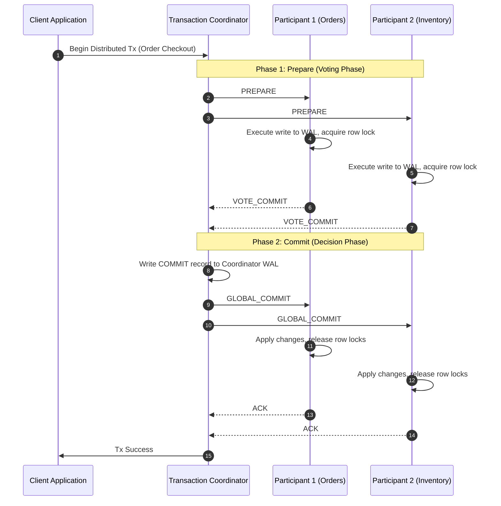
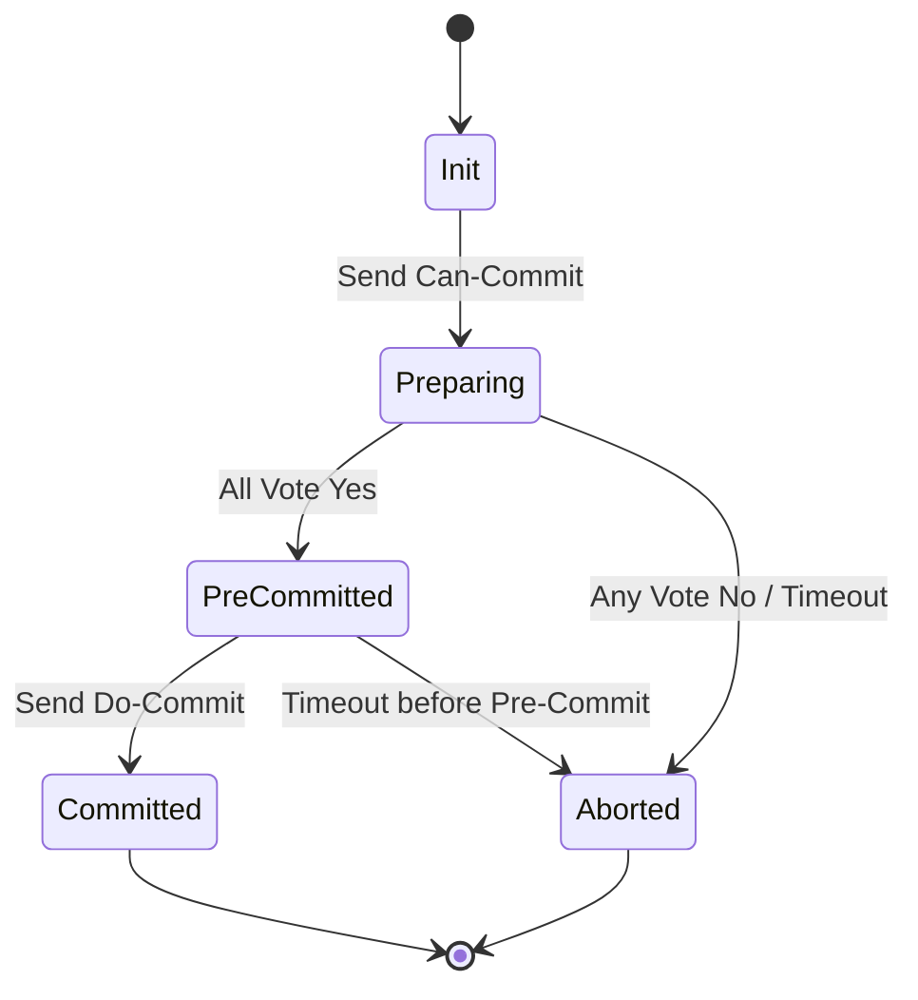
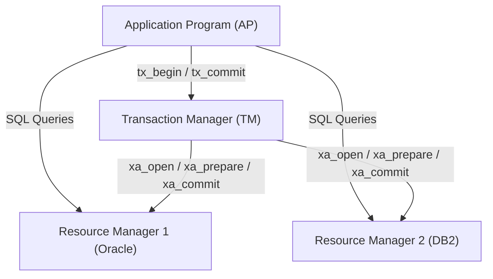
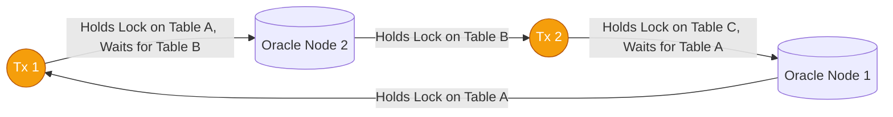

# The Evolution of Distributed Transactions Part 1: The Past — Classical 2PC/3PC, X/Open XA, Distributed 2PL & Why E-Commerce Abandoned Monolithic Coordination

In the early decades of distributed systems and enterprise software (**Amazon**, **eBay**, **Oracle**, **Tuxedo**, **Java JTA/XA**), maintaining transactional integrity across multiple physical databases was treated as an all-or-nothing requirement.

Engineers demanded the same strict **ACID** guarantees (Atomicity, Consistency, Isolation, Durability) across distributed networks that they enjoyed on a single mainframe.

However, as internet-scale e-commerce platforms scaled from thousands to millions of concurrent shoppers in the late 1990s and early 2000s, classical distributed transaction protocols—specifically **Two-Phase Commit (2PC)**, **Three-Phase Commit (3PC)**, and **X/Open XA Distributed Two-Phase Locking (2PL)**—collapsed under their own synchronization overhead.

This article examines the foundational mathematical protocols of distributed transactions, analyzes why the coordinator blocking vulnerability paralyzed early e-commerce architectures, and uncovers the real-world lessons that forced the industry to rethink data consistency.

```mermaid
graph TD
  subgraph The Classical Distributed Transaction Era (1970s - 2000s)
    App[Monolithic Application Server] --> TM[XA Transaction Manager / Coordinator]
    TM -->|1. PREPARE| DB1[(Database 1: Order DB)]
    TM -->|1. PREPARE| DB2[(Database 2: Inventory DB)]
    TM -->|1. PREPARE| DB3[(Database 3: Payment DB)]
    DB1 & DB2 & DB3 -->|Acquire Strict Exclusive Locks 2PL| Locks[Held Exclusive Row Locks]
    DB1 & DB2 & DB3 -->|2. VOTE COMMIT| TM
    TM -->|3. GLOBAL COMMIT| DB1 & DB2 & DB3
  end
  
  style Locks fill:#f43f5e,stroke:#881337,color:#ffffff
```

---

## 1. Jim Gray’s Atomic Commit & Two-Phase Commit (2PC)

In his seminal 1978 paper, *Notes on Data Base Operating Systems*, Turing Award winner **Jim Gray** formalized the fundamental challenge of distributed consensus:

> *How can multiple independent computing nodes, communicating over unreliable networks, agree to commit a transaction atomically if any single node can crash or vote to abort?*

### The Two-Phase Commit Protocol Mechanics

The 2PC protocol operates between a central **Coordinator** and multiple distributed **Participants** (Resource Managers):



### The Fatal Flaw: The Blocking Coordinator Vulnerability

The fundamental flaw of 2PC is that **it is a blocking protocol**.

Consider the **uncertainty window** ($[t_{\text{voted}}, t_{\text{commit}}]$):
1. A participant votes `VOTE_COMMIT`. At this exact instant, the participant surrenders autonomy. It cannot unilaterally abort (because the coordinator might decide to commit), and it cannot unilaterally commit (because another participant might have voted abort).
2. The participant must hold all exclusive row locks (`X-locks`) until it receives the `GLOBAL_COMMIT` decision from the coordinator.
3. If the **Coordinator crashes** after receiving all votes but before transmitting the `GLOBAL_COMMIT` message, all participants remain permanently blocked in the uncertain state:

$$\text{Lock Hold Duration } T_{\text{lock}} = \infty \quad (\text{until Coordinator recovery})$$

Any other concurrent transactions attempting to access those locked rows are queued indefinitely, leading to resource exhaustion, thread pool starvation, and total system outage.

---

## 2. Three-Phase Commit (3PC): Skeen's Non-Blocking Attempt

In 1981, **Dale Skeen** introduced the **Three-Phase Commit (3PC)** protocol (*Nonblocking Commit Protocols*). 3PC aimed to eliminate the blocking vulnerability by inserting a buffer state—the `Pre-Commit` phase—and establishing timeout-based transitions.



### The 3PC State Invariant
Skeen proved that an atomic commit protocol is non-blocking under node crashes if and only if:
1. No state transition allows a transition directly from a state where commit is possible to a state where abort is possible without passing through an intermediate state.
2. There exists no state where it is impossible to know whether the system has committed or aborted, and a timeout allows safe fallback.

In 3PC, the phases are:
1. **Phase 1 (Can-Commit)**: Coordinator asks if participants are ready. Participants vote `YES` or `NO`.
2. **Phase 2 (Pre-Commit)**: If all vote `YES`, coordinator sends `PRE_COMMIT`. Participants enter `Pre-Commit` state and ack. No locks are released, but participants know all peers voted `YES`.
3. **Phase 3 (Do-Commit)**: Coordinator sends `DO_COMMIT`. Participants apply writes and release locks.

### Why 3PC Failed in Practice: Network Partitions ($P$ in CAP)

While 3PC is non-blocking under **isolated fail-stop node crashes**, it **completely breaks down under network partitions**.

If a network partition splits the coordinator from a subset of participants:
* Partition $A$ (with the coordinator) times out waiting for acknowledgments and decides to `ABORT`.
* Partition $B$ (isolated) times out in the `Pre-Commit` state, assumes the coordinator sent a commit, and elects a surrogate coordinator that issues a `DO_COMMIT`.
* **Result**: Catastrophic split-brain consistency violation (part of the cluster committed, part aborted).

Because asynchronous networks (like the internet or multi-switch datacenters) cannot distinguish between a dead node and a slow network partition, **3PC was virtually never adopted in production databases**.

---

## 3. X/Open XA & Distributed Two-Phase Locking (2PL)

In 1991, the Open Group published the **X/Open Distributed Transaction Processing (DTP) XA Specification**.

XA standardized the interface between an AP (Application Program), a TM (Transaction Manager, like BEA Tuxedo or IBM CICS), and multiple RMs (Resource Managers, like Oracle, DB2, or Sybase).



### Distributed Two-Phase Locking (2PL) & Distributed Deadlocks

XA enforced serializability across databases using **Strict Distributed Two-Phase Locking (Strict 2PL)**:
* **Growing Phase**: Transactions acquire shared (`S`) or exclusive (`X`) locks on every database as operations execute.
* **Shrinking Phase**: Locks cannot be released until the global 2PC transaction either completely commits or aborts.

### The Distributed Deadlock Problem
In a single database, deadlocks are detected via an in-memory Wait-For-Graph (WFG) cycle detector. In distributed XA transactions across distinct database instances, deadlocks form **distributed cycles**:



Neither Oracle Node 1 nor Oracle Node 2 has the global graph in its local memory. Without expensive global deadlock detection algorithms (like Obermarck’s path-pushing algorithm or Chandy-Misra-Haas probe computation), systems were forced to rely on **lock wait timeouts**.

Under heavy e-commerce holiday traffic, lock wait timeouts triggered cascading abort storms, consuming CPU while completing zero useful work.

---

## 4. Why Large-Scale E-Commerce Abandoned Monolithic 2PC

During the late 1990s and early 2000s, pioneering internet platforms hit a hard architectural wall with classical 2PC and XA transactions:

### The Early Amazon "Gurupa" Bottleneck
In Amazon’s original monolithic architecture, the central Oracle database (internally named *"Gurupa"*) handled customer accounts, orders, inventory, and payment tracking.

When Amazon attempted to split Gurupa into distributed domain databases (Orders DB, Inventory DB, Payments DB) using XA/2PC, checkout latencies spiked exponentially during Black Friday events.

The math of 2PC latency explained why:

$$\text{Latency}_{\text{2PC}} = \sum_{i=1}^N 2 \cdot \text{RTT}_i + \max(\text{Disk Write Time}_{\text{WAL}})$$

If any single participant experienced a disk I/O stall or network packet drop, the entire checkout pipeline froze.

### eBay's Architectural Shift: Randy Shoup & Dan Pritchett
In 2008, eBay’s chief architect **Dan Pritchett** published *BASE: An Acid Alternative*, and **Randy Shoup** documented eBay’s complete banishment of XA transactions:

> *"At eBay scale, we realized that 2PC is an anti-availability pattern. If you link 5 databases with 2PC, each with 99.9% availability, your overall transactional availability drops to $(0.999)^5 = 99.5\%$. At millions of transactions per hour, 2PC turns isolated transient glitches into global outages."*

eBay replaced synchronous XA transactions with **Asynchronous Eventual Consistency (BASE)**:
1. Write order directly to local database.
2. Insert an event into a local transactional message table within the *same* database transaction (the birth of the **Transactional Outbox Pattern**).
3. Asynchronously deliver messages to Inventory and Payment services with idempotency checks and compensating refunds.

---

## Python Simulation: Distributed Deadlock Detection & 3PC State Machine

To understand how classical systems attempted to resolve 2PL lock cycles, here is a Python implementation of a distributed Wait-For Graph (WFG) deadlock cycle detector using Tarjan's Strongly Connected Components (SCC) algorithm:

```python
from typing import Dict, List, Set

class DistributedDeadlockDetector:
    """
    Constructs a Global Wait-For Graph (WFG) across distributed database nodes
    and detects deadlocks using Tarjan's Strongly Connected Components algorithm.
    """
    def __init__(self):
        # Directed graph: tx_waiting -> set(tx_holding_lock)
        self.wait_for_graph: Dict[str, Set[str]] = {}

    def add_wait_dependency(self, waiting_tx: str, holding_tx: str):
        if waiting_tx not in self.wait_for_graph:
            self.wait_for_graph[waiting_tx] = set()
        self.wait_for_graph[waiting_tx].add(holding_tx)

    def release_dependency(self, waiting_tx: str, holding_tx: str):
        if waiting_tx in self.wait_for_graph:
            self.wait_for_graph[waiting_tx].discard(holding_tx)

    def find_deadlocked_cycles(self) -> List[List[str]]:
        index = 0
        indices: Dict[str, int] = {}
        lowlink: Dict[str, int] = {}
        stack: List[str] = []
        on_stack: Set[str] = set()
        sccs: List[List[str]] = []

        def strongconnect(node: str):
            nonlocal index
            indices[node] = index
            lowlink[node] = index
            index += 1
            stack.append(node)
            on_stack.add(node)

            for neighbor in self.wait_for_graph.get(node, set()):
                if neighbor not in indices:
                    strongconnect(neighbor)
                    lowlink[node] = min(lowlink[node], lowlink[neighbor])
                elif neighbor in on_stack:
                    lowlink[node] = min(lowlink[node], indices[neighbor])

            # If node is root of SCC
            if lowlink[node] == indices[node]:
                scc = []
                while True:
                    w = stack.pop()
                    on_stack.remove(w)
                    scc.append(w)
                    if w == node:
                        break
                if len(scc) > 1:
                    sccs.append(scc)

        for node in list(self.wait_for_graph.keys()):
            if node not in indices:
                strongconnect(node)

        return sccs

# Demonstration Execution
if __name__ == "__main__":
    detector = DistributedDeadlockDetector()

    print("🔍 Simulating Distributed XA Deadlock across 3 Database Nodes...")
    # Tx 1 on Order DB holds lock A, waits for Tx 2 on Inventory DB holding lock B
    detector.add_wait_dependency("Tx_Order_101", "Tx_Inventory_202")

    # Tx 2 on Inventory DB holds lock B, waits for Tx 3 on Payment DB holding lock C
    detector.add_wait_dependency("Tx_Inventory_202", "Tx_Payment_303")

    # Tx 3 on Payment DB holds lock C, waits for Tx 1 on Order DB holding lock A
    detector.add_wait_dependency("Tx_Payment_303", "Tx_Order_101")

    deadlocks = detector.find_deadlocked_cycles()

    if deadlocks:
        print(f" ⚠️ [DEADLOCK DETECTED] Found {len(deadlocks)} distributed circular wait dependency:")
        for idx, cycle in enumerate(deadlocks, 1):
            print(f"    Cycle {idx}: {' -> '.join(cycle)} -> {cycle[0]}")
            print(f"    Action: Aborting victim transaction '{cycle[0]}' to release 2PL locks.")
    else:
        print(" ✅ No distributed deadlocks found.")
```

---

## Engineering Lessons from the Classical Era

> [!IMPORTANT]
> **Synchronous 2PC Locks are Fatal at Scale**: Holding database row locks across remote network roundtrips directly couples the throughput of your fastest service to the latency and failure rate of your slowest dependency.

> [!WARNING]
> **3PC Does Not Solve Network Partitions**: Skeen's 3PC eliminates blocking only in fail-stop crash scenarios. In realistic distributed networks where partitions occur, 3PC can silently cause split-brain data corruption.

> [!TIP]
> **The Availability Tax of ACID**: Monolithic distributed ACID forces availability down exponentially ($A_{\text{total}} = \prod A_i$). Scaling beyond a few databases requires embracing eventual consistency, asynchronous messaging, and compensating transactions.

---

## Next in the Series
In **Part 2**, we will explore **The Present (2010s–2020s)**: How Google solved distributed consistency at global scale with **Spanner and TrueTime**, how CockroachDB & YugabyteDB implement **Multi-Raft with Hybrid Logical Clocks**, and how **Uber & Netflix** revolutionized microservices using **Event-Driven Sagas (Cadence / Conductor)**.
