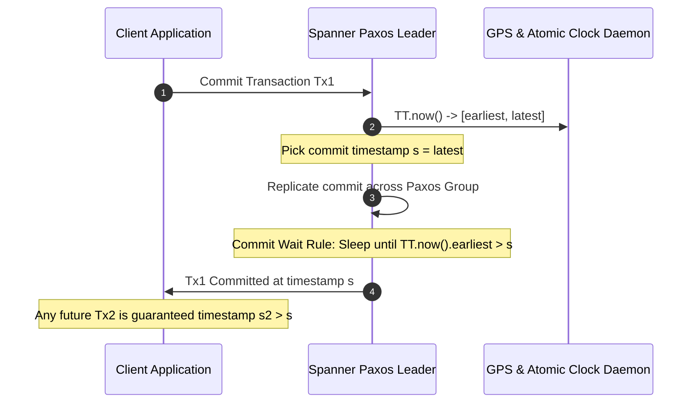
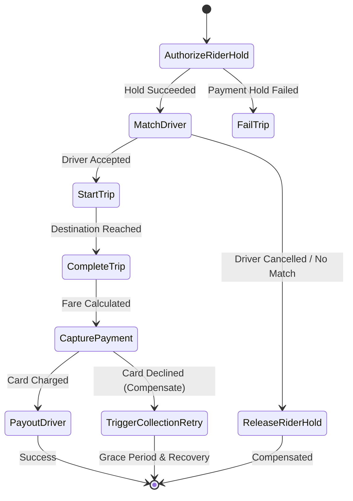
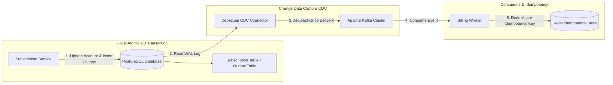

# The Evolution of Distributed Transactions Part 2: The Present — TrueTime, Hybrid Logical Clocks, Multi-Raft & Event-Driven Sagas at Google, Uber & Netflix

Following the collapse of monolithic synchronous Two-Phase Commit (2PC) at internet scale, the distributed systems industry bifurcated into two dominant modern paradigms:

1. **Global NewSQL Distributed Databases (Google Spanner, CockroachDB, YugabyteDB)**: Re-architecting distributed ACID transactions using **atomic clocks (TrueTime)**, **Hybrid Logical Clocks (HLC)**, and **Multi-Raft consensus**.
2. **Event-Driven Saga Orchestration in Microservices (Uber, Netflix, Shopify, DoorDash)**: Decoupling business workflows into asynchronous choreographies and orchestrations using **Transactional Outbox**, **Idempotency Keys**, and **Compensating Transactions**.

This article examines how Google, Uber, Netflix, and modern e-commerce engineering teams solved distributed consistency at planetary scale.

```mermaid
graph TD
  subgraph The Modern Distributed Transaction Landscape (2010s - 2020s)
    Direction[Two Modern Paradigms] --> NewSQL[Planetary NewSQL DBs]
    Direction --> MicroSagas[Event-Driven Microservice Sagas]
    
    NewSQL --> Spanner["Google Spanner: TrueTime & Commit-Wait Rule (2ε)"]
    NewSQL --> Cockroach["CockroachDB / YugabyteDB: Multi-Raft & HLC MVCC"]
    
    MicroSagas --> Uber["Uber Cadence / Temporal: Trip & Payout Sagas"]
    MicroSagas --> Netflix["Netflix Conductor: Outbox CDC & Billing Sagas"]
    MicroSagas --> Shopify["Shopify / DoorDash: Idempotency Keys & Capture"]
  end
```

---

## 1. Google Spanner: TrueTime & External Consistency

In 2012, Google published *Spanner: Google’s Globally-Distributed Database* (Corbett et al.), followed by *Spanner: Becoming a SQL System* (2017).

Spanner was the first system to achieve **External Consistency (Strict Serializability / Linearizability)** globally while supporting distributed multi-shard transactions.



### The TrueTime API & Bounded Clock Uncertainty
Standard server clocks drift unpredictably ($100\text{--}500\text{ ms}$). Spanner solved this by installing dedicated GPS receivers and atomic rubidium clocks in every Google datacenter:

$$\text{TrueTime API: } \text{TT.now}() → [t_{\text{earliest}}, t_{\text{latest}}] \quad \text{where } \epsilon = \frac{t_{\text{latest}} - t_{\text{earliest}}}{2}$$

The uncertainty parameter $\epsilon$ is bounded between **$1\text{ ms}$ and $7\text{ ms}$**.

### The Commit Wait Rule
To guarantee that if transaction $T_2$ begins after transaction $T_1$ commits ($T_1 < T_2$), then $T_1$'s timestamp $s_1 < s_2$:

1. The transaction leader assigns a commit timestamp $s = \text{TT.now}().\text{latest}$.
2. The leader executes the **Commit Wait Rule**: it holds locks and delays responding to the client until:

$$\text{TT.now}().\text{earliest} > s \quad (\text{Sleep duration } \approx 2 \cdot \epsilon)$$

This $2\epsilon$ pause guarantees that the commit timestamp $s$ has definitely passed in absolute real-world physical time everywhere on Earth before any subsequent transaction can start.

Google uses Spanner to power **Google Play Billing**, **Google Ads**, and **Google Cloud Spanner**, serving millions of ACID writes per second without distributed deadlocks.

---

## 2. CockroachDB & YugabyteDB: Hybrid Logical Clocks (HLC) & Multi-Raft

Because commodity cloud environments (AWS, GCP VMs, Azure) lack physical GPS atomic clocks, open-source NewSQL databases (**CockroachDB**, **YugabyteDB**) utilize **Hybrid Logical Clocks (HLC)** (Kulkarni et al., 2014) combined with **Multi-Raft**.

```

|                    Hybrid Logical Clock (HLC) Tuple                   |
|                        hlc = ( l.physical, c.logical )                |

|  l.physical : Highest physical wall-clock timestamp observed so far.  |
|  c.logical  : Logical sequence counter incremented on causal events. |

```

### Multi-Raft Range Splits & Distributed MVCC Write Intents
In CockroachDB and YugabyteDB:
1. The global keyspace is partitioned into small contiguous **$64\text{ MB}$ ranges**.
2. Each range is independently replicated across 3 or 5 nodes via a dedicated **Raft consensus group** (**Multi-Raft**).
3. A cross-range transaction writes provisional **Write Intent records** (inline transactional locks pointing to a central Transaction Record in Raft).
4. As soon as the Transaction Record status is committed via Raft quorum, the transaction is atomically committed; subsequent readers convert intents to permanent MVCC values asynchronously.

---

## 3. Uber Engineering: Trip Lifecycle Sagas with Cadence / Temporal

At **Uber**, a single trip lifecycle spans multiple distributed microservices: Rider Fare Quoting, Driver Matching, Trip In-Progress Tracking, Fraud Check, Rider Payment Capture, and Driver Payout.

Uber cannot use a single monolithic database lock for a 30-minute ride. Instead, Uber created **Cadence** (which evolved into **Temporal**) to orchestrate **Distributed Sagas**.



### Uber's Orchestrated Saga Principles:
1. **Forward Actions & Compensating Actions**: Every forward step has an explicit undo action:
   * *Forward*: `AuthorizeHold($35.00)` $\longleftrightarrow$ *Compensate*: `VoidAuthorization($35.00)`
   * *Forward*: `AssignDriver(driver_id)` $\longleftrightarrow$ *Compensate*: `UnassignAndNotify(driver_id)`
2. **State Machine Persistence**: Temporal logs every event to a durable event history table in Docstore/Cassandra. If the worker machine crashes, a new worker rehydrates the exact state and resumes execution without re-executing completed financial steps.

---

## 4. Netflix Engineering: Conductor & Transactional Outbox with Debezium

At **Netflix**, subscription renewals, video transcoding pipelines, and digital rights management (DRM) licensing are orchestrated by **Netflix Conductor**.

To eliminate the dual-write bug (writing to a database and publishing to Apache Kafka without 2PC), Netflix and large e-commerce platforms employ the **Transactional Outbox Pattern**:



### Key Guarantees:
* **Zero Dual-Write Inconsistencies**: The application only writes to its local database.
* **At-Least-Once Event Delivery**: Debezium streams WAL mutations directly into Kafka topics.
* **Idempotent Consumers**: Downstream consumers check unique `idempotency_key` hashes before processing payments, discarding duplicates caused by network retries.

---

## TypeScript Implementation: Orchestrated Trip Saga with State Compensations & Idempotency

Here is a production-grade TypeScript implementation of an Orchestrated Trip Lifecycle & Payment Saga with automated backward compensation:

```typescript
import { randomUUID } from 'crypto';

interface SagaContext {
  tripId: string;
  riderId: string;
  driverId?: string;
  fareAmount: number;
  paymentAuthId?: string;
  idempotencyKey: string;
}

interface SagaStep {
  name: string;
  execute: (ctx: SagaContext) => Promise<boolean>;
  compensate: (ctx: SagaContext) => Promise<void>;
}

export class UberTripSagaOrchestrator {
  private executedSteps: SagaStep[] = [];
  private idempotencyStore: Set<string> = new Set();

  async runSaga(ctx: SagaContext, steps: SagaStep[]): Promise<boolean> {
    console.log(`\n🚀 [Saga Orchestrator] Starting Trip Saga ${ctx.tripId} (Idempotency Key: ${ctx.idempotencyKey})`);

    // 1. Idempotency Check
    if (this.idempotencyStore.has(ctx.idempotencyKey)) {
      console.log(` ⚠️ [Duplicate Request] Idempotency key '${ctx.idempotencyKey}' already processed. Returning cached success.`);
      return true;
    }

    for (const step of steps) {
      console.log(` ⏳ Executing Step: [${step.name}]...`);
      try {
        const success = await step.execute(ctx);
        if (!success) {
          console.error(` ❌ Step [${step.name}] failed. Initiating backward compensation rollback!`);
          await this.rollback(ctx);
          return false;
        }
        this.executedSteps.push(step);
      } catch (err: any) {
        console.error(` 💥 Exception in [${step.name}]: ${err.message}. Rolling back!`);
        await this.rollback(ctx);
        return false;
      }
    }

    // Mark completed in idempotency store
    this.idempotencyStore.add(ctx.idempotencyKey);
    console.log(` 🎉 [Saga Complete] Trip ${ctx.tripId} successfully executed and committed!`);
    return true;
  }

  private async rollback(ctx: SagaContext): Promise<void> {
    console.log(`\n🔄 [ROLLBACK INITIATED] Reversing ${this.executedSteps.length} completed steps in LIFO order...`);
    while (this.executedSteps.length > 0) {
      const step = this.executedSteps.pop()!;
      try {
        console.log(`   ↩️ Compensating: [${step.name}]`);
        await step.compensate(ctx);
      } catch (compErr: any) {
        console.error(`   🚨 CRITICAL: Compensation failed on [${step.name}]: ${compErr.message}. Queuing for Manual Dead-Letter Queue (DLQ)!`);
      }
    }
  }
}

// --- DEFINE SAGA STEPS ---
const AuthorizePaymentStep: SagaStep = {
  name: "Authorize Payment Hold",
  execute: async (ctx) => {
    ctx.paymentAuthId = `AUTH_${randomUUID().substring(0, 8)}`;
    console.log(`     💳 Authorized $${ctx.fareAmount.toFixed(2)} hold on Rider card (${ctx.paymentAuthId})`);
    return true;
  },
  compensate: async (ctx) => {
    if (ctx.paymentAuthId) {
      console.log(`     💸 Voiding Payment Hold ${ctx.paymentAuthId} for $${ctx.fareAmount.toFixed(2)}`);
    }
  }
};

const AssignDriverStep: SagaStep = {
  name: "Assign Driver",
  execute: async (ctx) => {
    ctx.driverId = "DRIVER_8842";
    console.log(`     🚗 Matched Driver ${ctx.driverId} to Trip ${ctx.tripId}`);
    return true;
  },
  compensate: async (ctx) => {
    if (ctx.driverId) {
      console.log(`     🚫 Unassigning Driver ${ctx.driverId} and broadcasting match back to fleet`);
    }
  }
};

const CapturePaymentStep: SagaStep = {
  name: "Capture Final Payment",
  execute: async (ctx) => {
    // Simulate payment gateway failure scenario
    if (ctx.fareAmount > 100) {
      console.log(`     ❌ Bank Gateway Error: Insufficient funds for fare $${ctx.fareAmount}`);
      return false; // Triggers rollback
    }
    console.log(`     💰 Captured $${ctx.fareAmount.toFixed(2)} from Rider account.`);
    return true;
  },
  compensate: async (ctx) => {
    console.log(`     🔄 Issuing credit refund to Rider ${ctx.riderId}`);
  }
};

// Demonstration Execution
if (require.main === module) {
  const orchestrator = new UberTripSagaOrchestrator();

  const successContext: SagaContext = {
    tripId: "TRIP_101",
    riderId: "RIDER_99",
    fareAmount: 32.50,
    idempotencyKey: "REQ_IDEMPOTENCY_001"
  };

  const failureContext: SagaContext = {
    tripId: "TRIP_102",
    riderId: "RIDER_77",
    fareAmount: 145.00, // Trigger payment decline
    idempotencyKey: "REQ_IDEMPOTENCY_002"
  };

  (async () => {
    // 1. Run Successful Saga
    await orchestrator.runSaga(successContext, [AuthorizePaymentStep, AssignDriverStep, CapturePaymentStep]);

    // 2. Run Failing Saga with Compensations
    await orchestrator.runSaga(failureContext, [AuthorizePaymentStep, AssignDriverStep, CapturePaymentStep]);
  })();
}
```

---

## Modern Architecture Gotchas & Best Practices

> [!IMPORTANT]
> **Compensations Must Be Idempotent and Commutative**: In asynchronous saga failures, compensating actions can be executed multiple times due to retry storms. Ensure every compensating endpoint handles duplicate invocations safely.

> [!TIP]
> **Use NewSQL for Direct Relational Needs & Sagas for Distributed Workflows**: If your data models naturally fit inside a single cluster (e.g. user authentication or financial balances), use **CockroachDB / Spanner**. If your workflow spans multiple decoupled microservices with external APIs (Stripe, Twilio, Shipping), use **Temporal / Sagas**.

---

## Next in the Series
In **Part 3**, we will explore **The Future (2026 & Beyond)**: How **Deterministic Scheduling (Calvin & FaunaDB)** eliminates 2PC and lock aborts entirely, how hardware-accelerated **RDMA & CXL Pooled Memory** enable sub-microsecond atomic commits, and how **Autonomous AI Agent Swarms** execute self-healing multi-step transactional compensations.
