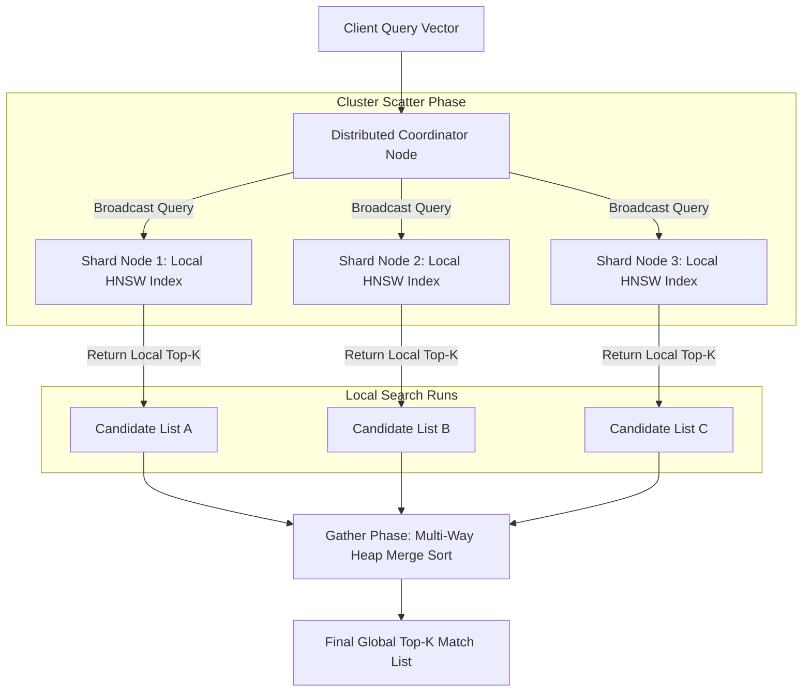

# Distributed Vector Routing: Sharding & Query Merging in Multi-Node Indexes

As vector datasets grow to billions of documents, a single server node can no longer fit the index in memory or handle the CPU query load. To scale, vector databases must partition the index across a cluster of multiple physical machines.

However, sharding vector spaces is fundamentally more complex than sharding relational databases. Relational tables shard easily on a primary key (e.g. `user_id`), allowing queries to target a single node. 

In contrast, vector search requires finding the global $k$-nearest neighbors ($k$-NN) of an arbitrary query vector. Because similar vectors could theoretically reside on any shard, databases must implement sophisticated **Distributed Vector Routing** pipelines.

This article details how to design partition schemes and execute scatter-gather query routing.

---

## Distributed Vector Search Pipeline

The query coordinator broadcasts queries to shards and resolves local lists into a global output:



### Partitioning Strategies
1. **Document-Based Partitioning (Scatter-Gather)**: Vectors are distributed uniformly across shards (e.g., using round-robin or document ID hashes). The query coordinator broadcasts the query vector to every shard in the cluster. Each shard returns its local top-$k$ results, and the coordinator merges them. This is robust but resource-intensive at scale.
2. **Cluster-Based Partitioning (Routing)**: The database runs global K-Means clustering to partition the vector space into topological regions. Each shard hosts a specific vector cluster. The coordinator inspects the query vector and only routes it to the closest matching shards, significantly reducing CPU cycles.

---

## Python Simulation: Distributed Scatter-Gather Coordinator

Here is a production-grade Python implementation of a distributed query coordinator. It simulates parallel shard index searches and performs a heap-based multi-way merge sort to resolve local candidate lists into the global top-$k$ results:

```python
import heapq
from typing import List, Dict, Any, Tuple
from pydantic import BaseModel

class VectorResult(BaseModel):
    doc_id: str
    distance: float  # Distance score (lower is closer in L2 distance)
    shard_id: int

class VirtualVectorShard:
    """
    Simulates a local vector database index shard returning sorted
    k-NN search matches.
    """
    def __init__(self, shard_id: int, mock_candidates: List[Tuple[str, float]]):
        self.shard_id = shard_id
        # Sort mock candidates by distance to simulate index search output
        self.index_data = sorted(
            [VectorResult(doc_id=d_id, distance=dist, shard_id=shard_id) for d_id, dist in mock_candidates],
            key=lambda x: x.distance
        )

    def search_local(self, k: int) -> List[VectorResult]:
        """Returns local top-k closest matches."""
        return self.index_data[:k]

class DistributedVectorCoordinator:
    """
    Coordinates multi-node scatter-gather search queries and executes
    multi-way merge sort over returned local candidate arrays.
    """
    def __init__(self, shards: List[VirtualVectorShard]):
        self.shards = shards

    def execute_scatter_gather(self, global_k: int) -> List[VectorResult]:
        # 1. Scatter Phase: Broadcast search query to all local shards
        local_runs: List[List[VectorResult]] = []
        for shard in self.shards:
            local_runs.append(shard.search_local(k=global_k))

        # 2. Gather Phase: Perform Multi-Way Merge Sort using Heap
        global_results: List[VectorResult] = []
        
        # Heap elements are tuples: (distance, index_in_run, run_list_reference)
        # Min-heap maintains the closest distance element at the root
        heap: List[Tuple[float, int, List[VectorResult]]] = []

        # Initialize heap with the first element of each non-empty shard run
        for run in local_runs:
            if run:
                heapq.heappush(heap, (run[0].distance, 0, run))

        while heap and len(global_results) < global_k:
            distance, idx, run = heapq.heappop(heap)
            # Add the closest element to global output
            global_results.append(run[idx])

            # If the run has more elements, push the next candidate to the heap
            if idx + 1 < len(run):
                heapq.heappush(heap, (run[idx + 1].distance, idx + 1, run))

        return global_results

# Demonstration Execution
if __name__ == "__main__":
    # Create 3 virtual vector database shards with mock search candidates
    # (lower distances represent better matches to the query vector)
    shard_a = VirtualVectorShard(shard_id=1, mock_candidates=[("doc-101", 0.12), ("doc-102", 0.45), ("doc-103", 0.88)])
    shard_b = VirtualVectorShard(shard_id=2, mock_candidates=[("doc-201", 0.08), ("doc-202", 0.22), ("doc-203", 0.65)])
    shard_c = VirtualVectorShard(shard_id=3, mock_candidates=[("doc-301", 0.15), ("doc-302", 0.19), ("doc-303", 0.95)])

    coordinator = DistributedVectorCoordinator([shard_a, shard_b, shard_c])

    # Search for global Top-4 closest matching documents
    print("🚀 Running Distributed Scatter-Gather Query...")
    print("=" * 75)
    top_matches = coordinator.execute_scatter_gather(global_k=4)

    print(f"{'Global Rank':<12} | {'Document ID':<15} | {'L2 Distance':<15} | {'Source Shard ID':<15}")
    print("-" * 75)
    for rank, item in enumerate(top_matches):
        print(f"Rank {rank + 1:<7} | {item.doc_id:<15} | {item.distance:<15.4f} | Shard {item.shard_id:<12}")
```

---

## Distributed Search Gotchas & Guardrails

When sharding vector indexes:

> [!IMPORTANT]
> **Enforce Strict Local-K Limits**: When running scatter-gather queries, each shard must return $K$ elements (where $K$ is the global search request size). Do not return fewer elements (e.g. $K/S$), or you will miss valid nearest neighbors that happen to cluster heavily on a single node, leading to degraded recall.

> [!CAUTION]
> **Mitigate Shard Fan-Out Outages**: Broadcasting every query to all nodes (scatter-gather) scales poorly as the cluster grows. Once your cluster exceeds 20 nodes, the network overhead of coordinating scatter-gather queries will dominate latencies. Implement cluster-based routing to target only a subset of shards per query.

---

## Real-World Enterprise Impact
Teams deploying distributed vector sharding report:
* **Horizontal Scalability**: Clusters easily scale to billions of vectors by adding more index shard instances.
* **Low Merge Overhead**: Using heap-based multi-way merge sort on the coordinator limits latency additions during the gather phase to under 2ms.
