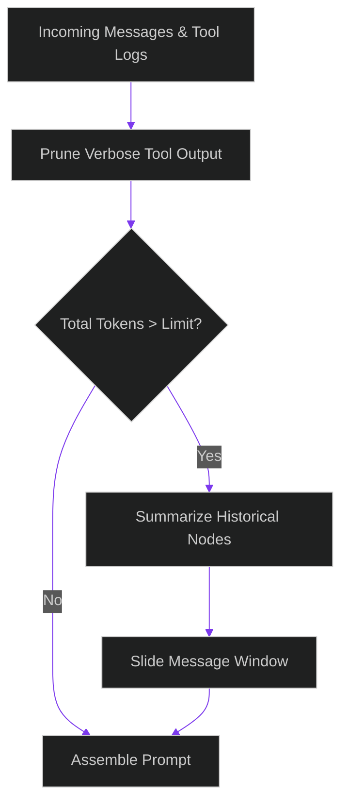

# Dynamic Context Pruning: Programmatic Token Budgeting for Long-Context Reasoning Chains

> [!NOTE]
> **📖 Article Overview**
> While modern LLMs support vast context windows (exceeding 1 million tokens), utilizing these full windows in production is a major anti-pattern. Large contexts drastically increase time-to-first-token latency, degrade reasoning accuracy (the "needle in a haystack" problem), and generate massive API bills. In this article, we explore **Dynamic Context Pruning** strategies: stripping tool outputs, implementing sliding windows, and executing recursive summarizations in Python.

---

## The Danger of Context Inflation

As an autonomous agent executes a multi-step workflow, its conversation log inflates rapidly. Every tool invocation, traceback error dump, and intermediate reasoning thought adds to the context window:

1. **Latency Scaling**: Attention calculations scale quadratically \(O(N^2)\) or linear-biases in newer architectures. In practice, feeding 100,000 tokens increases latency and slows down agentic response loops.
2. **Retrieval Degradation**: As prompts grow larger, models start missing constraints, ignoring system guidelines, or losing track of historical details.
3. **Financial Leakage**: Even with prompt caching, providers charge for reading the cache. In high-frequency loops, reading large caches repeatedly accumulates massive costs.



---

## 1. Stripping Tool Output Verbosity

Tool execution logs are the primary driver of context bloat. An agent might query a database and receive a 10MB raw JSON dump containing 5,000 rows, of which it only needs two values.
* **Semantic Summarization**: Tool gateways must intercept raw payloads, compile a high-level summary (e.g. *"SQL Query returned 500 rows. Keys of interest: id, email. Sample row: ..."*), and inject only the summary into the agent’s message history.

---

## 2. Sliding Windows and Recursive Compression

To maintain long-running conversations without hitting limits:
* **The System Anchor**: The system prompt (instructions, tools) must remain locked and never pruned.
* **Sliding Window**: Keep only the last `K` messages in their raw, high-fidelity format to preserve immediate conversational context.
* **Recursive Summarization**: Take messages older than the sliding window, feed them to a background summarizer model, and save the resulting summary in a single rolling history block (the "Memory State").

---

## Code Demo: Building a Token Budget Manager

Below is a Python implementation of a context optimizer that manages a token budget, compresses historical chat segments, and filters verbose payloads.

```python
from typing import List, Dict, Any

class MessageManager:
    def __init__(self, token_limit: int = 1500):
        self.token_limit = token_limit
        self.system_prompt: Dict[str, str] = {
            "role": "system", 
            "content": "You are a database administration assistant. Analyze query logs."
        }
        # Approximate tokens (4 chars = 1 token)
        self.system_tokens = len(self.system_prompt["content"]) // 4
        self.history: List[Dict[str, Any]] = []

    def add_message(self, role: str, content: str, is_tool_output: bool = False):
        tokens = len(content) // 4
        
        # If it is a tool output, apply initial structural pruning
        if is_tool_output and tokens > 400:
            print("✂️ [PRUNE] Truncating verbose tool log payload before ingestion.")
            content = content[:400] + "\n...[Truncated by Manager]..."
            tokens = len(content) // 4
            
        self.history.append({
            "role": role,
            "content": content,
            "tokens": tokens
        })
        self._enforce_token_budget()

    def get_context_payload(self) -> List[Dict[str, str]]:
        payload = [self.system_prompt]
        for msg in self.history:
            payload.append({"role": msg["role"], "content": msg["content"]})
        return payload

    def _enforce_token_budget(self):
        total_tokens = self.system_tokens + sum(msg["tokens"] for msg in self.history)
        
        while total_tokens > self.token_limit and len(self.history) > 2:
            print(f"⚠️ [BUDGET EXCEEDED] Current: {total_tokens} tokens. Executing compression...")
            
            # Collapse the oldest two user/assistant messages into a summary
            oldest_msg_1 = self.history.pop(0)
            oldest_msg_2 = self.history.pop(0)
            
            summary_content = f"[Historical Summary: User asked about {oldest_msg_1['content'][:40]} and Assistant responded.]"
            summary_tokens = len(summary_content) // 4
            
            # Insert the summary node at the beginning of the history
            self.history.insert(0, {
                "role": "system",
                "content": summary_content,
                "tokens": summary_tokens
            })
            
            # Re-evaluate
            total_tokens = self.system_tokens + sum(msg["tokens"] for msg in self.history)
            print(f"✅ [COMPRESSION DONE] New total: {total_tokens} tokens.")

if __name__ == "__main__":
    manager = MessageManager(token_limit=500)

    # 1. Add typical user query
    manager.add_message("user", "Check status of billing query database.")
    
    # 2. Add highly verbose tool output (simulating database query dump)
    db_dump = "DATABASE ROW DATA: " + "id=101, val=50; id=102, val=60; " * 50  # ~400 tokens
    manager.add_message("tool", db_dump, is_tool_output=True)
    
    # 3. Add assistant response
    manager.add_message("assistant", "Database logs look stable. All rows retrieved successfully.")

    # 4. Trigger budget limit by adding a new turn
    manager.add_message("user", "Can you calculate the average of those retrieved values?")

    # Fetch compiled payload
    compiled_messages = manager.get_context_payload()
    print("\n--- Compiled Context Sent to LLM ---")
    for msg in compiled_messages:
        print(f"[{msg['role'].upper()}]: {msg['content'][:100]}...")
```

---

## Architectural Best Practices

* **Always Compress Recursively**: Never delete historical user interactions completely. Instead, use small, fast SLMs (like Llama 3.2 3B or Gemini Flash) to generate paragraph summaries of expired blocks.
* **Filter Before Ingestion**: Build format-aware parsers at the tool gateway. If a tool outputs raw HTML or CSV, extract the critical keys first and discard the wrapper syntax.
* **Observability Monitoring**: Keep track of the average context length per session. If lengths grow continuously without stabilization, refine your window slice bounds.
