# Shared Memory on the Edge: Inter-Process Communication (IPC) for Local Agents

> [!NOTE]
> **📖 Article Overview**
> In cloud-native systems, micro-agents communicate over HTTP REST endpoints, gRPC calls, or distributed message brokers like RabbitMQ. While acceptable in external datacenters, this network overhead is highly inefficient for local edge execution. When agents running on the same workstation need to swap massive arrays of context or blackboard data, network serialization and loopback delay strangle performance. In this article, we analyze local **Inter-Process Communication (IPC)** patterns and implement a **Shared Memory Coordinator** utilizing Python's `mmap` module.

---

## The Network Loopback Penalty

When calling a tool locally, serialization and network round-trips add overhead:
* **HTTP Latency**: A local REST call takes 3 to 10 milliseconds of socket overhead, data serialization (JSON translation), and parsing.
* **Massive Payloads**: When Agent A passes a 100,000-token codebase context payload to Agent B, translating this block to JSON and piping it over TCP sockets degrades performance.
* **The Solution**: **Memory Mapping (mmap)**. We allocate a shared region of the workstation's physical RAM. Agent processes read and write to this memory segment directly at memory bus speeds, eliminating network serialization.

```mermaid
%%{init: {'theme': 'dark', 'themeVariables': { 'primaryColor': '#088574', 'primaryTextColor': '#f3f4f6', 'primaryBorderColor': '#0db49b', 'lineColor': '#088574', 'secondaryColor': '#111827', 'tertiaryColor': '#0b0f19'}}}%%
flowchart TD
    subgraph SG1_RamPhysicalRam ["RAM [Physical RAM Coordinate Space]"]
        SharedBlock[Shared Memory Block / mmap file]
    end

    AgentA[Agent Process A] -->|1. Direct Write JSON payload| SharedBlock
    AgentB[Agent Process B] -->|2. Read payload instantly| SharedBlock
    
    style SharedBlock fill:#111827,stroke:#0db49b,stroke-width:2px
```



By reading directly from memory, Agent B receives the context block with zero TCP socket overhead.

---

## 1. Under the Hood: Memory Mapping with Python `mmap`

Memory mapping maps a file descriptor directly into a process's virtual memory address space:
* **Zero-Copy Performance**: Once mapped, reading and writing to the memory segment does not invoke expensive system read/write system calls.
* **Inter-Process Synchronization**: Multiple python processes can open the same file descriptor and map it, allowing instant cross-process updates.
* **Concurrency Gates**: We use file-level locking mechanisms to prevent processes from writing to the memory block simultaneously, avoiding memory corruption.

---

## 2. Memory Formats: Protocol Buffers vs. Raw JSON

To maximize IPC speed:
1. **JSON Strings (Simple)**: Writing string-encoded JSON payloads to the memory block is easy but requires CPU cycles for string encoding/decoding.
2. **Protocol Buffers (Fast)**: Using binary serialization (like Protobuf or FlatBuffers) reduces payload size and parsing latency, keeping memory bus traffic low.

---

## Code Demo: Inter-Process Shared Memory Coordinator

Below is a Python implementation of a shared-memory coordinator. It writes structured JSON context states into a memory-mapped file, allowing independent processes to retrieve data with minimal latency.

```python
import os
import mmap
import json
from typing import Dict, Any

class SharedMemoryStateStore:
    def __init__(self, filepath: str, size_bytes: int = 1024):
        self.filepath = filepath
        self.size_bytes = size_bytes
        
        # Ensure the file exists and is of the target size
        if not os.path.exists(self.filepath):
            with open(self.filepath, "wb") as f:
                f.write(b"\x00" * self.size_bytes)
                
        # Open file descriptor
        self.file_obj = open(self.filepath, "r+b")
        # Map the file into memory
        self.mmap_obj = mmap.mmap(self.file_obj.fileno(), self.size_bytes)

    def write_state(self, state_data: Dict[str, Any]):
        # Encode state to binary JSON
        encoded = json.dumps(state_data).encode("utf-8")
        
        # Check size constraints
        if len(encoded) > self.size_bytes:
            raise ValueError(f"Payload size ({len(encoded)} bytes) exceeds shared memory limit ({self.size_bytes} bytes)!")

        # Rewind to starting offset
        self.mmap_obj.seek(0)
        # Write payload
        self.mmap_obj.write(encoded)
        # Pad remainder of segment with null bytes to clear stale data
        remainder = self.size_bytes - len(encoded)
        self.mmap_obj.write(b"\x00" * remainder)
        self.mmap_obj.flush()
        print(f"💾 [IPC Store] Wrote {len(encoded)} bytes to shared memory mapping.")

    def read_state(self) -> Dict[str, Any]:
        # Read the raw memory buffer
        self.mmap_obj.seek(0)
        raw_data = self.mmap_obj.read(self.size_bytes)
        
        # Strip trailing null bytes
        cleaned_data = raw_data.rstrip(b"\x00")
        
        if not cleaned_data:
            return {}

        return json.loads(cleaned_data.decode("utf-8"))

    def close(self):
        self.mmap_obj.close()
        self.file_obj.close()

if __name__ == "__main__":
    ipc_file = "./shared_agent_context.bin"
    
    # Initialize store (acts as Process A writing data)
    store_a = SharedMemoryStateStore(ipc_file, size_bytes=512)
    
    context_data = {
        "active_agent": "CodingAgent",
        "current_file": "core/auth.py",
        "tokens_limit_reached": False,
        "parameters": [10.5, 20.0, 30.5]
    }

    print("🚀 [Process A] Writing context payload...")
    store_a.write_state(context_data)

    # Initialize a separate store connection (simulating Process B reading data)
    print("\n🚀 [Process B] Initializing memory mapping and reading data...")
    store_b = SharedMemoryStateStore(ipc_file, size_bytes=512)
    retrieved_data = store_b.read_state()
    
    print("👉 Retrieved State:")
    print(json.dumps(retrieved_data, indent=2))

    # Clean up resources
    store_a.close()
    store_b.close()
    if os.path.exists(ipc_file):
        os.remove(ipc_file)
```

---

## Mentorship and Deployment Guidelines

* **Leverage WAL Mode**: If shared memory complexity grows, replace custom `mmap` files with a local SQLite database configured in Write-Ahead Logging (WAL) mode for concurrency-safe local state storage.
* **Isolate IPC Paths**: Restrict shared memory files to temporary mount directories (like `/dev/shm` on Linux) to run memory operations entirely in RAM, avoiding physical disk writes.
* **Implement Semaphores**: Protect shared memory regions using system-level mutexes to prevent processes from mutating shared context concurrently.
